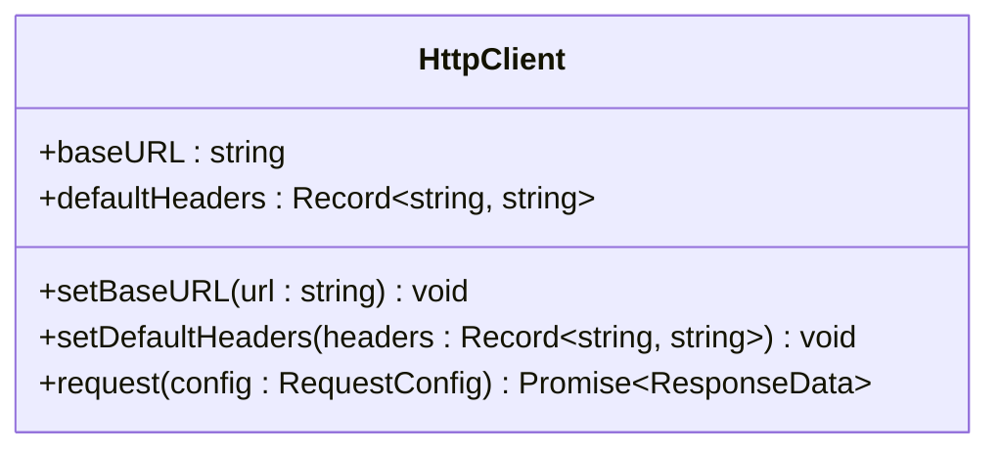
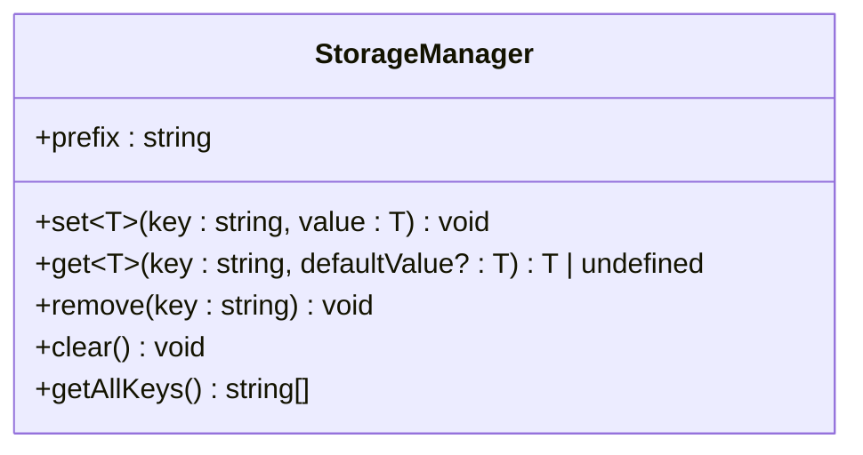
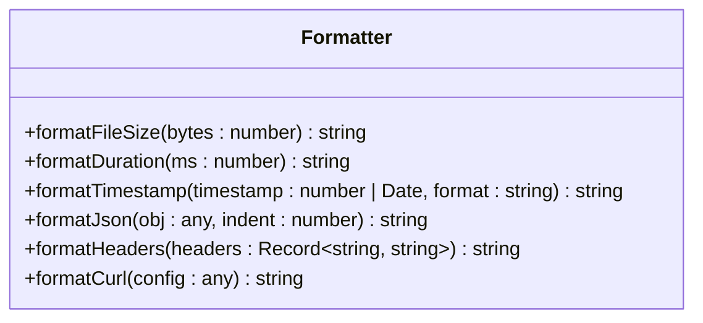
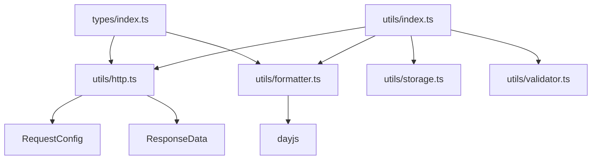

# API参考

<cite>
**本文档中引用的文件**  
- [types/index.ts](file://packages/shared/types/index.ts)
- [utils/http.ts](file://packages/shared/utils/http.ts)
- [utils/storage.ts](file://packages/shared/utils/storage.ts)
- [utils/formatter.ts](file://packages/shared/utils/formatter.ts)
- [utils/validator.ts](file://packages/shared/utils/validator.ts)
- [utils/index.ts](file://packages/shared/utils/index.ts)
</cite>

## 目录
1. [简介](#简介)
2. [共享类型定义](#共享类型定义)
3. [核心工具模块](#核心工具模块)
   - [HTTP工具（http.ts）](#http工具httpts)
   - [存储工具（storage.ts）](#存储工具storagets)
   - [格式化工具（formatter.ts）](#格式化工具formatterts)
   - [验证工具（validator.ts）](#验证工具validatorts)
4. [类型导出与Tree-shaking优化](#类型导出与tree-shaking优化)
5. [实际使用示例](#实际使用示例)
6. [附录：模块依赖关系](#附录模块依赖关系)

## 简介
本API参考文档旨在全面描述`shared`包中公开的类型定义与核心工具函数接口。文档覆盖`types/index.ts`中定义的数据模型，以及`utils`目录下的四大核心工具模块：`http`、`storage`、`formatter`、`validator`。每个接口均提供参数说明、返回类型、异常处理机制及典型使用场景，便于开发者快速检索和集成。

**本节内容为概述，未直接分析具体源码文件，因此不附加源码引用。**

## 共享类型定义

该部分定义了项目中跨模块共享的核心数据结构，位于`packages/shared/types/index.ts`。

### API集合（ApiCollection）
表示一组API请求的集合，包含文件夹、请求、变量等。

**Section sources**  
- [types/index.ts](file://packages/shared/types/index.ts#L100-L130)

### 环境（Environment）
定义运行时环境变量，如基础URL、认证信息等。

**Section sources**  
- [types/index.ts](file://packages/shared/types/index.ts#L180-L200)

### 历史记录（HistoryRecord）
存储用户请求的历史记录，包含请求配置、响应数据和时间戳。

**Section sources**  
- [types/index.ts](file://packages/shared/types/index.ts#L240-L260)

### 批量测试（BatchTest）
支持批量执行多个请求，可配置并行执行和失败停止策略。

**Section sources**  
- [types/index.ts](file://packages/shared/types/index.ts#L60-L90)

### 工作空间（Workspace）
组织集合、环境、成员等的顶层容器，支持权限管理。

**Section sources**  
- [types/index.ts](file://packages/shared/types/index.ts#L200-L240)

### 用户与权限（User, Permission）
企业级功能中的用户角色、权限控制及团队协作模型。

**Section sources**  
- [types/index.ts](file://packages/shared/types/index.ts#L260-L350)

### 测试套件与自动化（TestSuite, AutomationTest）
高级测试功能，支持定时调度、断言、通知等。

**Section sources**  
- [types/index.ts](file://packages/shared/types/index.ts#L350-L450)

### Mock服务与性能监控
定义Mock路由、响应、中间件及性能指标数据结构。

**Section sources**  
- [types/index.ts](file://packages/shared/types/index.ts#L450-L600)

## 核心工具模块

### HTTP工具（http.ts）

提供基于`fetch`的HTTP客户端封装，支持请求配置、默认头设置和响应解析。

#### HttpClient 类


**Diagram sources**  
- [http.ts](file://packages/shared/utils/http.ts#L5-L60)

**Section sources**  
- [http.ts](file://packages/shared/utils/http.ts#L5-L60)

#### 方法说明
- **setBaseURL**: 设置基础URL前缀
- **setDefaultHeaders**: 设置默认请求头
- **request**: 执行HTTP请求，返回标准化的`ResponseData`
- **异常处理**: 请求失败时抛出`Error`，包含失败原因

#### 使用示例
```typescript
httpClient.setBaseURL('https://api.example.com');
const response = await httpClient.request({
  url: '/users',
  method: 'GET'
});
```

### 存储工具（storage.ts）

封装`localStorage`操作，提供带前缀的键值存储，避免命名冲突。

#### StorageManager 类


**Diagram sources**  
- [storage.ts](file://packages/shared/utils/storage.ts#L5-L50)

**Section sources**  
- [storage.ts](file://packages/shared/utils/storage.ts#L5-L50)

#### 方法说明
- **set/get**: 序列化/反序列化JSON数据
- **remove/clear**: 删除单个或所有带前缀的键
- **getAllKeys**: 获取所有属于该实例的键名
- **异常处理**: 捕获序列化/反序列化错误并输出日志

#### 使用示例
```typescript
storage.set('user', { name: 'Alice' });
const user = storage.get<{ name: string }>('user');
```

### 格式化工具（formatter.ts）

提供多种数据格式化方法，如文件大小、时间、JSON美化、Curl命令生成等。

#### Formatter 类


**Diagram sources**  
- [formatter.ts](file://packages/shared/utils/formatter.ts#L5-L50)

**Section sources**  
- [formatter.ts](file://packages/shared/utils/formatter.ts#L5-L50)

#### 方法说明
- **formatFileSize**: 将字节数转换为可读的B/KB/MB/GB格式
- **formatDuration**: 将毫秒转换为ms/s/min
- **formatTimestamp**: 使用`dayjs`格式化时间戳
- **formatJson**: 美化JSON字符串，失败时回退为字符串
- **formatCurl**: 从请求配置生成Curl命令行

#### 使用示例
```typescript
Formatter.formatFileSize(1024); // "1.00 KB"
Formatter.formatCurl({ url: '/api', method: 'POST', data: { a: 1 } });
// "curl -X POST -H \"Content-Type: application/json\" -d '{\"a\":1}' \"/api\""
```

### 验证工具（validator.ts）

提供数据验证功能，包括URL、JSON、邮箱、HTTP方法等。

#### Validator 类
```mermaid
classDiagram
class Validator {
+isValidUrl(url : string) boolean
+isValidJson(str : string) boolean
+isValidEmail(email : string) boolean
+isValidHttpMethod(method : string) boolean
+validateRequestConfig(config : any) { valid : boolean; errors : string[] }
}
```

**Diagram sources**  
- [validator.ts](file://packages/shared/utils/validator.ts#L5-L50)

**Section sources**  
- [validator.ts](file://packages/shared/utils/validator.ts#L5-L50)

#### 方法说明
- **isValidUrl**: 使用`URL`构造函数验证URL格式
- **isValidJson**: 尝试解析JSON字符串
- **isValidEmail**: 使用正则表达式验证邮箱
- **validateRequestConfig**: 验证请求配置对象，返回验证结果和错误信息数组

#### 使用示例
```typescript
if (Validator.isValidUrl(input)) {
  // 处理有效URL
}
const { valid, errors } = Validator.validateRequestConfig(config);
```

## 类型导出与tree-shaking优化

`shared`包通过`index.ts`文件统一导出所有工具和类型，支持按需导入，便于tree-shaking优化。

### 导出机制
```typescript
// packages/shared/index.ts
export * from './types';
export * from './utils';
```

```typescript
// packages/shared/utils/index.ts
export * from './http';
export * from './storage';
export * from './validator';
export * from './formatter';
```

### Tree-shaking策略
- 使用ES模块语法（`import`/`export`）
- 工具类以独立函数或类形式导出，避免默认导出大对象
- 构建工具（如Vite）可静态分析并移除未使用的导出

**Section sources**  
- [utils/index.ts](file://packages/shared/utils/index.ts#L1-L4)
- [index.ts](file://packages/shared/index.ts)

## 实际使用示例

### 在组件中使用HttpClient
```typescript
// 在web-full/src/components/RequestPanel.vue中
import { httpClient } from '@shared/utils';

export default {
  async sendRequest(config) {
    try {
      const response = await httpClient.request(config);
      this.response = response;
    } catch (error) {
      console.error('请求失败:', error);
    }
  }
}
```

### 在Store中使用StorageManager
```typescript
// 在web-full/src/stores/collection.ts中
import { storage } from '@shared/utils';

export const useCollectionStore = defineStore('collection', {
  state: () => ({
    collections: storage.get<ApiCollection[]>('collections', [])
  }),
  actions: {
    saveCollections() {
      storage.set('collections', this.collections);
    }
  }
});
```

### 在UI中使用Formatter
```typescript
// 在web-full/src/components/History.vue中
import { Formatter } from '@shared/utils';

const duration = Formatter.formatDuration(record.response.duration);
const size = Formatter.formatFileSize(record.response.size);
```

### 在表单中使用Validator
```typescript
// 在web-full/src/components/RequestPanel.vue中
import { Validator } from '@shared/utils';

const { valid, errors } = Validator.validateRequestConfig(form);
if (!valid) {
  showError(errors);
}
```

**本节内容为使用场景描述，未直接分析具体源码文件，因此不附加源码引用。**

## 附录：模块依赖关系



**Diagram sources**  
- [types/index.ts](file://packages/shared/types/index.ts)
- [utils/http.ts](file://packages/shared/utils/http.ts)
- [utils/formatter.ts](file://packages/shared/utils/formatter.ts)
- [utils/storage.ts](file://packages/shared/utils/storage.ts)
- [utils/validator.ts](file://packages/shared/utils/validator.ts)
- [utils/index.ts](file://packages/shared/utils/index.ts)