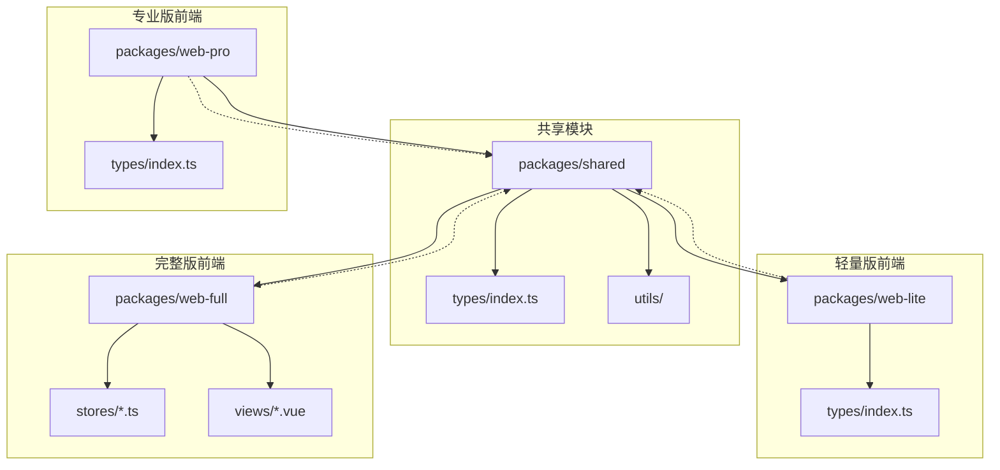
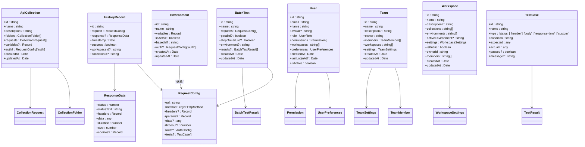
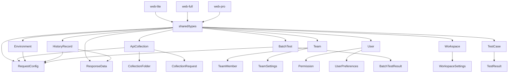

# 共享类型

<cite>
**本文档引用的文件**  
- [index.ts](file://packages\shared\types\index.ts) - *核心类型定义*
- [index.ts](file://packages\web-lite\src\types\index.ts) - *轻量版环境类型扩展*
- [environment.ts](file://packages\web-full\src\stores\environment.ts) - *完整版环境状态管理*
- [Environments.vue](file://packages\web-full\src\views\Environments.vue) - *环境管理视图组件*
- [index.ts](file://packages\web-pro\src\types\index.ts) - *专业版用户与团队类型*
- [team.ts](file://packages\web-full\src\stores\team.ts) - *团队状态管理*
</cite>

## 更新摘要
**变更内容**  
- 全面更新共享类型文档，完整覆盖 `packages/shared/types/index.ts` 中所有接口定义
- 新增对 `BatchTest`、`Workspace`、`TestCase`、`ShareLink` 等高级功能类型的详细说明
- 扩展 `User`、`Team`、`Environment` 等核心模型的字段解释与业务含义
- 更新架构图以反映最新类型关系
- 增加泛型、联合类型、映射类型等高级TS特性的使用说明

## 目录
1. [简介](#简介)
2. [项目结构](#项目结构)
3. [核心组件](#核心组件)
4. [架构概览](#架构概览)
5. [详细组件分析](#详细组件分析)
6. [依赖分析](#依赖分析)
7. [性能考虑](#性能考虑)
8. [故障排除指南](#故障排除指南)
9. [结论](#结论)

## 简介
本项目是一个在线接口调试工具，包含多个子项目（web-lite、web-full、web-pro），通过 `packages/shared` 模块共享核心类型定义。`types/index.ts` 文件集中定义了所有跨项目复用的数据模型，包括 API 集合、环境配置、历史记录、用户信息、团队协作等。这些类型确保了各子项目间的数据一致性与类型安全，支持 TypeScript 的高级特性如泛型、联合类型和映射类型，便于扩展和维护。

## 项目结构

**图示来源**  
- [index.ts](file://packages\shared\types\index.ts)
- [index.ts](file://packages\web-lite\src\types\index.ts)
- [index.ts](file://packages\web-pro\src\types\index.ts)
- [environment.ts](file://packages\web-full\src\stores\environment.ts)
- [Environments.vue](file://packages\web-full\src\views\Environments.vue)

**本节来源**  
- [index.ts](file://packages\shared\types\index.ts)
- [web-lite](file://packages\web-lite)
- [web-full](file://packages\web-full)
- [web-pro](file://packages\web-pro)

## 核心组件

`packages/shared/types/index.ts` 是整个项目类型系统的核心，定义了跨子项目复用的数据结构。这些接口被 `web-lite`、`web-full` 和 `web-pro` 三个前端子项目共同引用，确保了数据模型的一致性。主要类型包括 `ApiCollection`、`Environment`、`HistoryRecord`、`UserProfile`、`Team` 等，涵盖了接口调试、环境管理、历史记录、用户权限和团队协作等关键业务领域。类型设计采用可扩展的接口模式，允许各子项目在共享基础上进行定制化扩展。

**本节来源**  
- [index.ts](file://packages\shared\types\index.ts)

## 架构概览

**图示来源**  
- [index.ts](file://packages\shared\types\index.ts)

**本节来源**  
- [index.ts](file://packages\shared\types\index.ts)

## 详细组件分析

### ApiCollection 分析

`ApiCollection` 接口定义了 API 集合的核心结构，包含集合的元信息（ID、名称、描述）、文件夹结构（`folders`）、请求列表（`requests`）、变量（`variables`）和认证配置（`auth`）。该类型被 `web-full` 和 `web-pro` 用于集合管理功能，支持嵌套文件夹和请求示例。`variables` 字段允许定义环境无关的变量，提升可复用性。`auth` 字段复用 `RequestConfig` 的认证结构，确保认证信息的一致性。

**本节来源**  
- [index.ts](file://packages\shared\types\index.ts#L84-L94)

### Environment 分析

`Environment` 接口在共享模块中定义了环境的基本结构，包含 ID、名称、变量、激活状态、基础 URL 和认证信息。该类型在不同子项目中被扩展：`web-lite` 添加了可选的 `active` 字段；`web-full` 在多个文件中扩展了 `description` 和 `groupId` 字段，并在视图层定义了更详细的结构，包含 `type`（开发/测试/生产）和 `variables` 数组；`web-pro` 未直接重定义，但通过继承使用。这种设计体现了共享类型作为基类，各子项目按需扩展的复用模式。

**本节来源**  
- [index.ts](file://packages\shared\types\index.ts#L122-L131)
- [index.ts](file://packages\web-lite\src\types\index.ts#L63-L69)
- [environment.ts](file://packages\web-full\src\stores\environment.ts#L17-L21)
- [Environments.vue](file://packages\web-full\src\views\Environments.vue#L133-L142)

### HistoryRecord 分析

`HistoryRecord` 接口记录了单次请求的历史信息，包含请求配置（`request`）、响应数据（`response`）、时间戳（`timestamp`）和执行结果（`success`）。此外，还关联了工作空间（`workspaceId`）和集合（`collectionId`），便于数据追溯。该类型被 `web-lite` 和 `web-full` 用于历史记录功能，确保请求历史的数据结构统一。

**本节来源**  
- [index.ts](file://packages\shared\types\index.ts#L157-L165)

### User 分析

`User` 接口在共享模块中定义了用户的核心结构，包含用户基本信息、角色、权限、工作空间关联和偏好设置。`role` 字段使用 `UserRole` 联合类型，明确限定为 'admin'、'project_lead'、'developer'、'tester'、'guest' 五种角色。`permissions` 字段通过 `Permission` 接口定义资源级别的细粒度权限控制，支持 `read`、`write`、`delete` 等操作。`preferences` 字段包含主题、语言、通知等个性化设置，提升用户体验。

**本节来源**  
- [index.ts](file://packages\shared\types\index.ts#L280-L305)

### Team 分析

`Team` 接口在共享模块中定义了团队的核心结构，包含团队信息、成员列表、工作空间关联和设置。`web-pro` 对此接口进行了大幅扩展，增加了头像、网站、联系邮箱、时区、订阅计划、统计信息和创建者等字段，以支持企业级团队管理功能。`web-full` 的定义则较为简洁，仅包含基本字段。这体现了共享类型作为最小公共接口，专业版在此基础上进行功能增强的设计思想。

**本节来源**  
- [index.ts](file://packages\shared\types\index.ts#L340-L350)
- [index.ts](file://packages\web-pro\src\types\index.ts#L228-L243)
- [team.ts](file://packages\web-full\src\stores\team.ts#L27-L34)

### BatchTest 分析

`BatchTest` 接口定义了批量测试的核心结构，包含测试名称、请求列表、执行模式（并行/串行）、失败停止策略、环境配置和结果记录。`results` 字段存储每次请求的详细结果，包括响应数据、测试断言和执行时长。该类型支持自动化测试场景，被 `web-pro` 的自动化测试模块广泛使用。

**本节来源**  
- [index.ts](file://packages\shared\types\index.ts#L60-L75)

### Workspace 分析

`Workspace` 接口定义了工作空间的结构，包含空间元信息、集合与环境的引用、活动环境、设置、可见性、所有者和成员列表。`settings` 字段通过 `WorkspaceSettings` 接口定义请求超时、重定向、SSL验证等全局配置。该类型作为项目组织的核心单元，被所有子项目用于多项目管理。

**本节来源**  
- [index.ts](file://packages\shared\types\index.ts#L135-L155)

## 依赖分析

**图示来源**  
- [index.ts](file://packages\shared\types\index.ts)

**本节来源**  
- [index.ts](file://packages\shared\types\index.ts)

## 性能考虑
共享类型的设计对性能影响较小，主要体现在编译时类型检查。由于所有类型均为接口（interface），不产生运行时代码，因此不会增加打包体积。建议在大型项目中合理使用 `Pick`、`Omit` 等映射类型来创建子集，避免传递不必要的字段。对于高频操作（如历史记录），可考虑使用更轻量的类型别名或简化接口。

## 故障排除指南
当遇到类型不匹配错误时，首先检查子项目是否正确扩展了共享类型。例如，`web-full` 中的 `Environment` 类型扩展了共享定义，若直接使用共享类型可能导致缺少字段的错误。其次，确认各子项目使用的 `shared` 包版本一致，避免因版本差异导致的类型冲突。最后，利用 TypeScript 的 `extends` 关键字进行类型兼容性检查，确保扩展类型符合基类契约。

## 结论
`packages/shared/types/index.ts` 成功实现了跨项目类型共享，通过清晰的接口定义和可扩展的设计，支持了 `web-lite`、`web-full` 和 `web-pro` 三个不同复杂度的前端应用。建议未来进一步规范化扩展模式，例如统一使用 `BaseEnvironment` 作为基类，子项目通过 `interface Environment extends BaseEnvironment` 进行扩展，以增强代码可维护性。