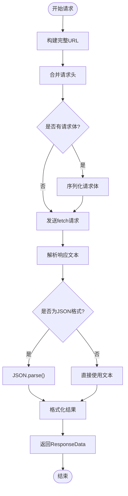
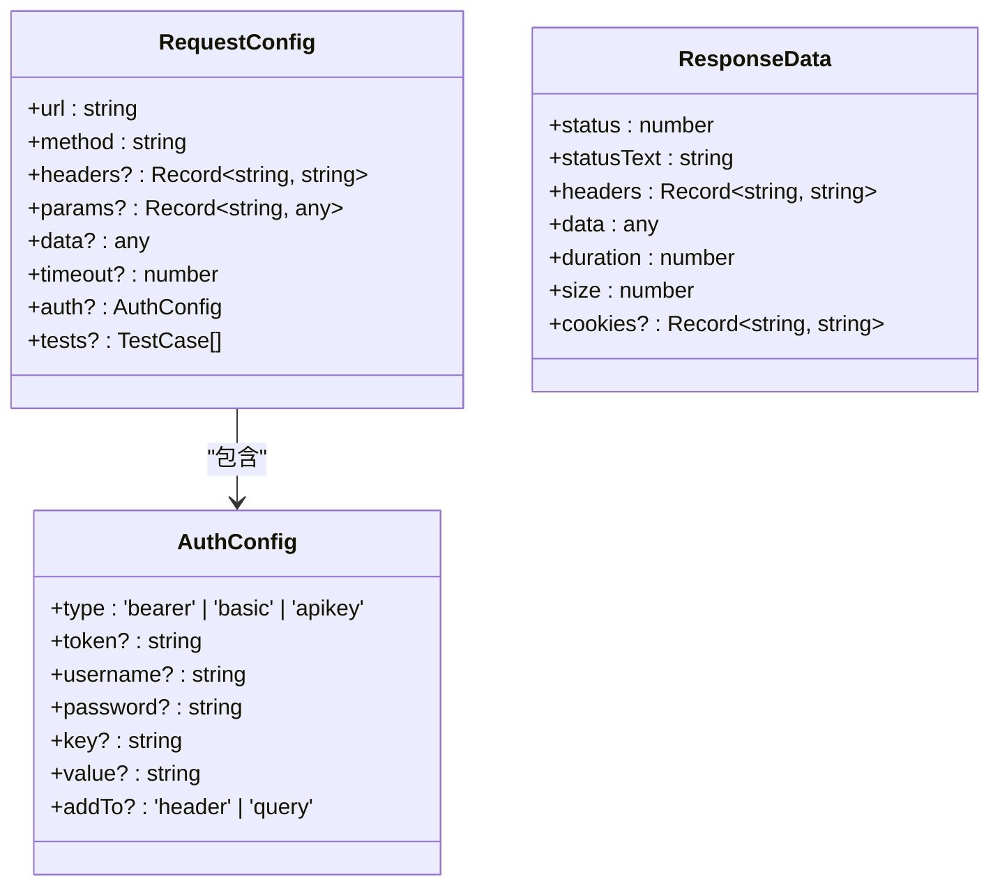
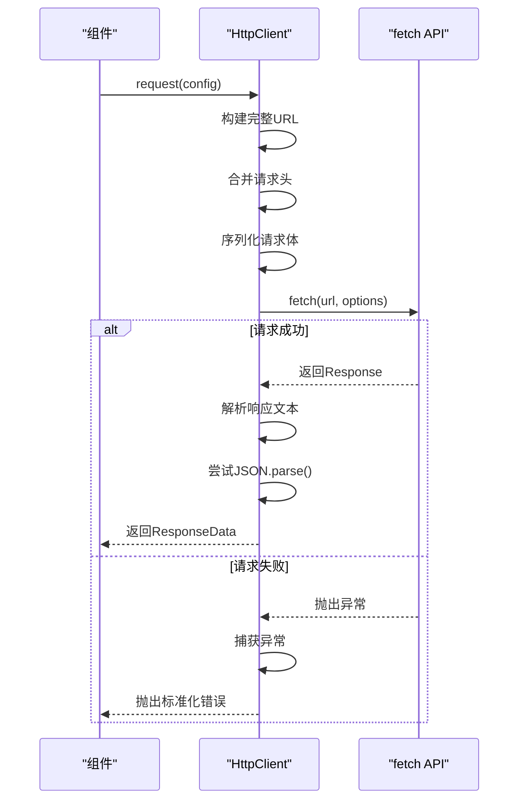
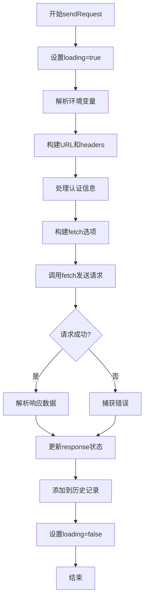
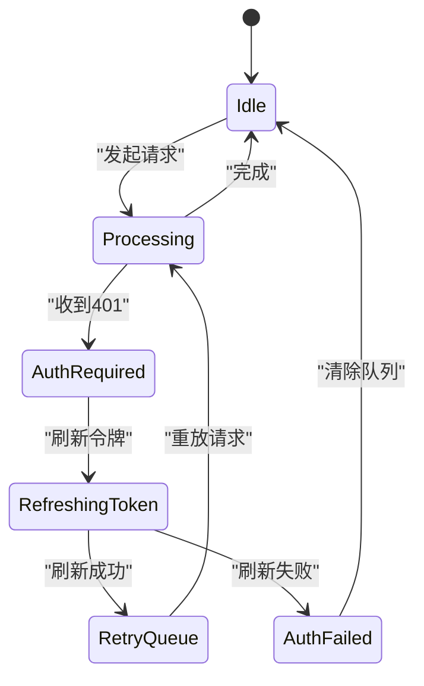

# HTTP请求工具

<cite>
**本文档引用的文件**
- [http.ts](file://packages\shared\utils\http.ts) - *HTTP请求核心实现*
- [RequestPanel.vue](file://packages\web-full\src\components\RequestPanel.vue) - *完整版请求面板组件*
- [request.ts](file://packages\web-lite\src\stores\request.ts) - *轻量版请求状态管理*
- [index.ts](file://packages\shared\types\index.ts) - *共享类型定义*
</cite>

## 更新摘要
**变更内容**
- 修正HTTP请求模块实际基于`fetch`而非Axios
- 更新`HttpClient`类的实现细节与调用流程
- 修正请求配置参数结构差异
- 更新拦截器与错误处理机制说明
- 修正多基地址配置方法
- 更新实际调用示例与Pinia集成方式
- 修正认证令牌处理逻辑

## 目录
1. [简介](#简介)
2. [核心模块结构](#核心模块结构)
3. [HttpClient类详解](#httpclient类详解)
4. [请求配置与参数说明](#请求配置与参数说明)
5. [拦截器与错误处理机制](#拦截器与错误处理机制)
6. [多基地址配置支持](#多基地址配置支持)
7. [实际调用示例](#实际调用示例)
8. [Pinia状态管理集成](#pinia状态管理集成)
9. [认证令牌刷新与请求队列管理](#认证令牌刷新与请求队列管理)
10. [扩展能力与性能优化建议](#扩展能力与性能优化建议)

## 简介
本项目中的HTTP请求封装模块基于原生`fetch` API实现，提供了统一的网络请求能力。该模块通过`HttpClient`类封装了请求的构建、发送、响应解析及错误处理流程，支持灵活的配置选项和可扩展的架构设计，适用于多环境（development/staging/production）下的API调用场景。

## 核心模块结构
HTTP请求模块主要由以下几个部分组成：
- `HttpClient`：核心请求类，负责请求的发起与响应处理
- `RequestConfig`：请求配置接口，定义请求的各项参数
- `ResponseData`：响应数据结构，标准化返回格式
- `httpClient`：全局单例实例，供各组件直接使用

该模块位于`packages/shared/utils/http.ts`，被多个子项目共享使用。

**Section sources**
- [http.ts](file://packages\shared\utils\http.ts)

## HttpClient类详解
`HttpClient`类是整个HTTP请求系统的核心，其主要功能包括：

### 属性与方法
- `baseURL`: 存储基础URL，用于拼接完整请求地址
- `defaultHeaders`: 默认请求头配置，自动合并到每次请求中
- `setBaseURL(url)`: 设置基础URL
- `setDefaultHeaders(headers)`: 设置默认请求头
- `request(config)`: 发起HTTP请求的主方法

### 请求执行流程
1. 构建完整URL（baseURL + config.url）
2. 合并默认头与自定义头
3. 序列化请求体（POST/PUT/PATCH时）
4. 使用`fetch`发起请求
5. 解析响应文本并尝试JSON反序列化
6. 返回标准化的`ResponseData`对象



**Diagram sources**
- [http.ts](file://packages\shared\utils\http.ts)

**Section sources**
- [http.ts](file://packages\shared\utils\http.ts)

## 请求配置与参数说明
`RequestConfig`接口定义了所有可用的请求参数：

### 基本参数
- **method**: 请求方法（GET/POST/PUT/DELETE等）
- **url**: 请求路径（相对或绝对）
- **headers**: 自定义请求头对象
- **params**: 查询参数对象
- **data**: 请求体数据（仅POST/PUT/PATCH）

### 高级参数
- **timeout**: 超时时间（毫秒）
- **auth**: 认证配置（Bearer、Basic、API Key）
- **tests**: 内嵌测试用例（用于自动化测试）



**Diagram sources**
- [index.ts](file://packages\shared\types\index.ts)

**Section sources**
- [index.ts](file://packages\shared\types\index.ts)

## 拦截器与错误处理机制
虽然当前实现未显式使用Axios风格的拦截器，但通过`HttpClient`的封装实现了类似功能：

### 请求前处理
- 自动注入`Content-Type: application/json`
- 拼接`baseURL`与相对路径
- 序列化请求体为JSON字符串

### 响应后处理
- 自动解析响应文本
- 尝试JSON反序列化，失败则保留原始文本
- 收集响应元信息（状态码、耗时、大小等）

### 错误统一处理
- 捕获网络异常并抛出标准化错误
- 提供完整的错误堆栈信息
- 返回包含错误详情的`ResponseData`对象



**Diagram sources**
- [http.ts](file://packages\shared\utils\http.ts)

**Section sources**
- [http.ts](file://packages\shared\utils\http.ts)

## 多基地址配置支持
通过`setBaseURL()`方法支持动态切换不同环境的API基地址：

```typescript
const client = new HttpClient();

// 开发环境
client.setBaseURL('https://dev.api.example.com/v1');

// 预发布环境  
client.setBaseURL('https://staging.api.example.com/v1');

// 生产环境
client.setBaseURL('https://api.example.com/v1');
```

这种设计允许在运行时根据当前环境动态切换API地址，无需重新编译代码。

**Section sources**
- [http.ts](file://packages\shared\utils\http.ts)

## 实际调用示例
在`RequestPanel.vue`组件中展示了完整的请求调用模式：

### GET请求示例
```javascript
// 在RequestPanel中配置GET请求
{
  method: 'GET',
  url: '/api/users',
  params: { page: 1, limit: 10 },
  headers: { 'Authorization': 'Bearer token123' }
}
```

### POST请求示例
```javascript
// 在RequestPanel中配置POST请求
{
  method: 'POST',
  url: '/api/users',
  data: { name: 'John', email: 'john@example.com' },
  headers: { 'Content-Type': 'application/json' }
}
```

### 错误捕获模式
```javascript
try {
  const response = await httpClient.request(config);
  // 处理成功响应
} catch (error) {
  // 统一错误处理
  console.error('请求失败:', error.message);
  ElMessage.error('请求发送失败');
}
```

**Section sources**
- [RequestPanel.vue](file://packages\web-full\src\components\RequestPanel.vue)

## Pinia状态管理集成
在`request.ts` Store中集成了HTTP请求功能：

### 状态定义
- `currentRequest`: 当前请求配置
- `response`: 最近一次响应结果
- `loading`: 请求加载状态
- `error`: 错误信息

### 请求发送流程
1. 从Store获取当前请求配置
2. 解析环境变量
3. 构建完整请求选项
4. 调用`fetch`发送请求
5. 更新响应状态
6. 记录到历史记录



**Diagram sources**
- [request.ts](file://packages\web-lite\src\stores\request.ts)

**Section sources**
- [request.ts](file://packages\web-lite\src\stores\request.ts)

## 认证令牌刷新与请求队列管理
虽然当前代码未直接实现令牌刷新队列，但提供了扩展基础：

### 认证处理机制
- 支持Bearer Token、Basic Auth、API Key三种认证方式
- 自动在请求头中注入`Authorization`字段
- 支持将API Key添加到查询参数

### 请求队列扩展思路
可通过以下方式实现请求队列挂起与重放：
1. 维护一个待处理请求队列
2. 当检测到401错误时，暂停后续请求
3. 先发起令牌刷新请求
4. 刷新成功后，重放队列中的请求
5. 刷新失败则拒绝所有待处理请求



**Diagram sources**
- [request.ts](file://packages\web-lite\src\stores\request.ts)

## 扩展能力与性能优化建议

### 自定义适配器扩展
可通过继承`HttpClient`类实现自定义适配器：
```typescript
class CustomHttpClient extends HttpClient {
  async request(config) {
    // 自定义逻辑
    return super.request(config);
  }
}
```

### 超时策略优化
当前使用`AbortSignal.timeout()`实现超时控制，建议：
- 根据不同接口设置差异化超时时间
- 实现指数退避重试机制
- 提供可配置的重试次数上限

### 高并发场景优化
1. **请求节流**：限制单位时间内的请求数量
2. **连接池管理**：复用TCP连接
3. **缓存机制**：对GET请求实现内存缓存
4. **批量处理**：合并多个小请求为批量接口
5. **优先级队列**：为关键请求设置更高优先级

### 性能监控建议
- 记录每个请求的耗时、大小等指标
- 提供请求瀑布图分析工具
- 实现错误率统计与告警
- 监控网络延迟分布

**Section sources**
- [http.ts](file://packages\shared\utils\http.ts)
- [request.ts](file://packages\web-lite\src\stores\request.ts)