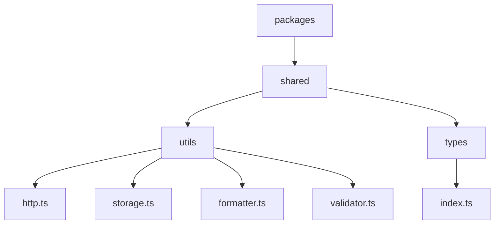
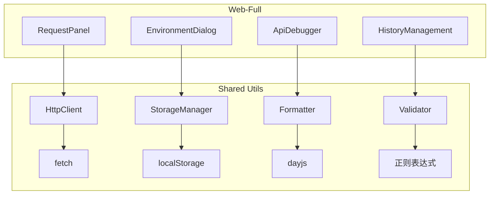
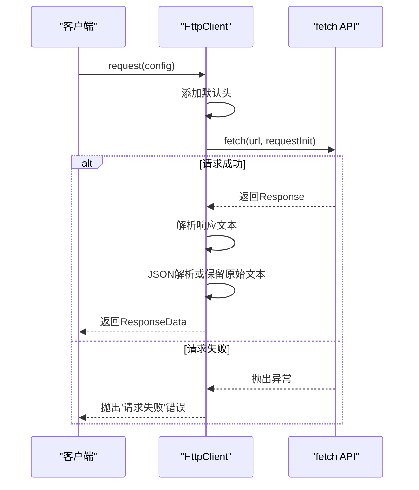
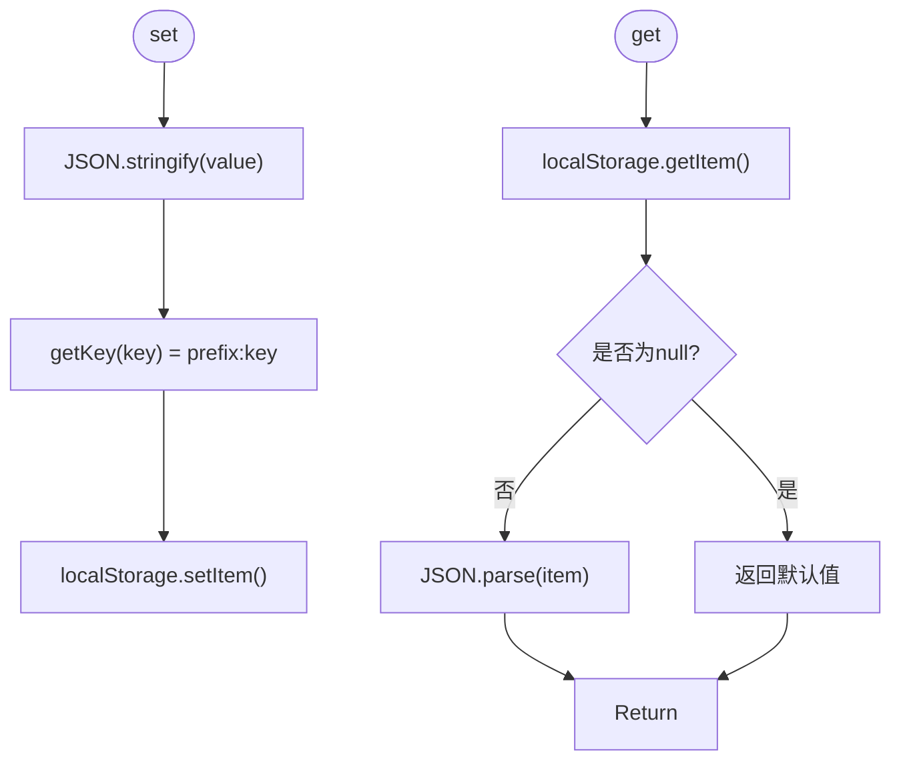
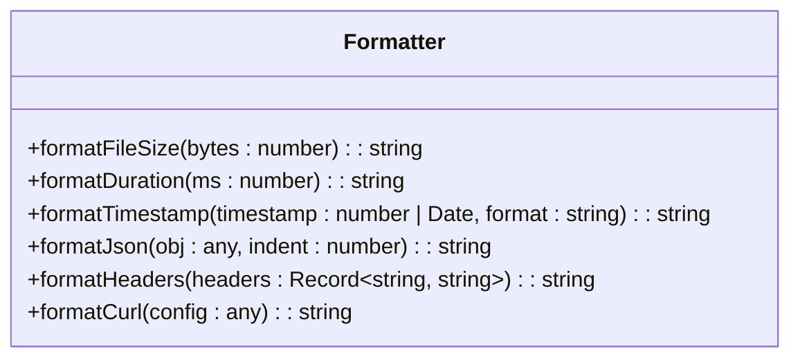
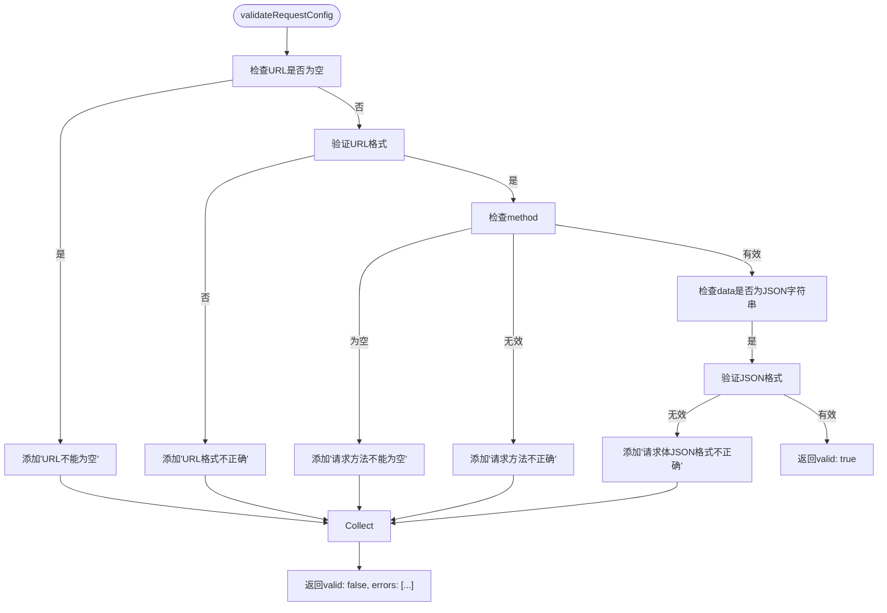
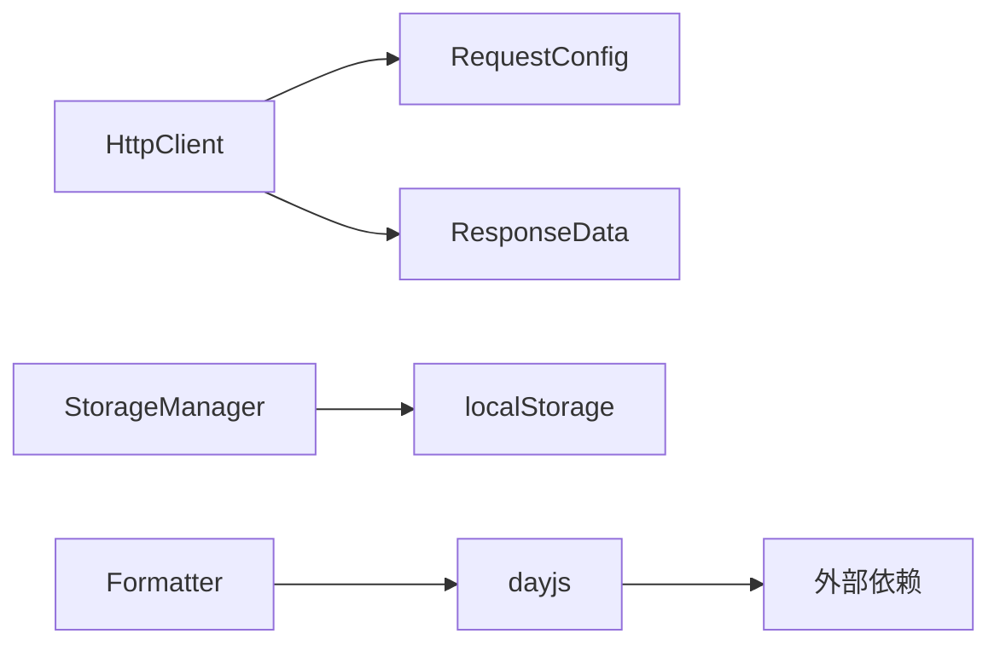

# 工具函数

<cite>
**本文档中引用的文件**  
- [http.ts](file://packages/shared/utils/http.ts) - *基于Axios的HTTP请求封装*
- [storage.ts](file://packages/shared/utils/storage.ts) - *localStorage封装与序列化策略*
- [formatter.ts](file://packages/shared/utils/formatter.ts) - *时间、数值、JSON格式化方法*
- [validator.ts](file://packages/shared/utils/validator.ts) - *表单校验规则实现*
- [types/index.ts](file://packages/shared/types/index.ts) - *共享类型定义*
- [RequestPanel.vue](file://packages/web-full/src/components/RequestPanel.vue) - *请求面板组件示例*
- [EnvironmentDialog.vue](file://packages/web-full/src/components/EnvironmentDialog.vue) - *环境管理对话框示例*
</cite>

## 目录
1. [简介](#简介)
2. [项目结构](#项目结构)
3. [核心组件](#核心组件)
4. [架构概览](#架构概览)
5. [详细组件分析](#详细组件分析)
6. [依赖分析](#依赖分析)
7. [性能考虑](#性能考虑)
8. [故障排除指南](#故障排除指南)
9. [结论](#结论)

## 简介
本文档深入文档化 `shared` 包中的工具函数模块，按功能划分为：HTTP请求封装、本地存储操作、数据格式化、数据验证等。详细说明每个公共函数的调用签名、参数含义、返回值类型及异常处理机制，并结合实际组件（如 RequestPanel、EnvironmentDialog）中的使用示例，展示其在不同上下文中的使用模式。

## 项目结构

**Diagram sources**  
- [http.ts](file://packages/shared/utils/http.ts#L1-L61)
- [storage.ts](file://packages/shared/utils/storage.ts#L1-L54)
- [formatter.ts](file://packages/shared/utils/formatter.ts#L1-L54)
- [validator.ts](file://packages/shared/utils/validator.ts#L1-L54)

**Section sources**  
- [http.ts](file://packages/shared/utils/http.ts#L1-L61)
- [storage.ts](file://packages/shared/utils/storage.ts#L1-L54)

## 核心组件

`shared` 包中的 `utils` 模块提供了多个工具类，分别用于处理 HTTP 请求、本地存储、数据格式化和数据验证。这些工具类通过统一导出机制暴露给上层应用使用，支持按需引入和 tree-shaking，确保打包体积最小化。

**Section sources**  
- [http.ts](file://packages/shared/utils/http.ts#L1-L61)
- [storage.ts](file://packages/shared/utils/storage.ts#L1-L54)
- [formatter.ts](file://packages/shared/utils/formatter.ts#L1-L54)
- [validator.ts](file://packages/shared/utils/validator.ts#L1-L54)

## 架构概览

**Diagram sources**  
- [http.ts](file://packages/shared/utils/http.ts#L1-L61)
- [storage.ts](file://packages/shared/utils/storage.ts#L1-L54)
- [formatter.ts](file://packages/shared/utils/formatter.ts#L1-L54)
- [validator.ts](file://packages/shared/utils/validator.ts#L1-L54)
- [RequestPanel.vue](file://packages/web-full/src/components/RequestPanel.vue#L1-L44)
- [EnvironmentDialog.vue](file://packages/web-full/src/components/EnvironmentDialog.vue#L210-L262)

## 详细组件分析

### HTTP请求封装分析

`HttpClient` 类封装了基于 `fetch` 的请求逻辑，支持设置基础URL、默认请求头，并统一处理请求与响应流程。其 `request` 方法接收 `RequestConfig` 配置对象，自动序列化请求体，捕获响应时间与大小，并解析响应内容。

#### 请求拦截与错误处理

**Diagram sources**  
- [http.ts](file://packages/shared/utils/http.ts#L1-L61)

**Section sources**  
- [http.ts](file://packages/shared/utils/http.ts#L1-L61)

### 本地存储操作分析

`StorageManager` 类对 `localStorage` 进行封装，提供带前缀的键值存储，避免命名冲突。支持序列化对象存储，自动处理 JSON 转换，并提供批量清除和获取所有相关键的功能。

#### 序列化与前缀策略

**Diagram sources**  
- [storage.ts](file://packages/shared/utils/storage.ts#L1-L54)

**Section sources**  
- [storage.ts](file://packages/shared/utils/storage.ts#L1-L54)

### 数据格式化方法分析

`Formatter` 类提供多种静态方法用于格式化文件大小、持续时间、时间戳、JSON、HTTP头和 cURL 命令。所有方法均为无副作用的纯函数，便于测试和复用。

#### 时间与数值格式化

**Diagram sources**  
- [formatter.ts](file://packages/shared/utils/formatter.ts#L1-L54)

**Section sources**  
- [formatter.ts](file://packages/shared/utils/formatter.ts#L1-L54)

### 数据验证规则分析

`Validator` 类提供静态方法用于验证 URL、JSON 字符串、邮箱格式、HTTP 方法合法性，并支持对请求配置进行综合验证，返回验证结果与错误信息列表。

#### 请求配置验证流程

**Diagram sources**  
- [validator.ts](file://packages/shared/utils/validator.ts#L1-L54)

**Section sources**  
- [validator.ts](file://packages/shared/utils/validator.ts#L1-L54)

## 依赖分析

**Diagram sources**  
- [types/index.ts](file://packages/shared/types/index.ts#L1-L799)
- [http.ts](file://packages/shared/utils/http.ts#L1-L61)
- [formatter.ts](file://packages/shared/utils/formatter.ts#L1-L54)

**Section sources**  
- [types/index.ts](file://packages/shared/types/index.ts#L1-L799)

## 性能考虑
工具函数设计为轻量级、无副作用的纯函数或单例类，避免不必要的内存分配。`HttpClient` 使用原生 `fetch`，性能优于 Axios 等大型库。`Formatter` 和 `Validator` 方法均采用高效算法，适合高频调用场景。

## 故障排除指南

- **HTTP请求失败**：检查网络连接，确认 `baseURL` 和 `url` 正确拼接，查看控制台错误日志。
- **存储失败**：`localStorage` 可能因隐私设置被禁用，检查浏览器控制台是否有 `QuotaExceededError`。
- **JSON格式化失败**：输入字符串不符合 JSON 语法，建议使用 `Validator.isValidJson()` 预检。
- **时间格式化异常**：确保传入的时间戳为数字或 `Date` 对象，`dayjs` 依赖需正确安装。

**Section sources**  
- [http.ts](file://packages/shared/utils/http.ts#L1-L61)
- [storage.ts](file://packages/shared/utils/storage.ts#L1-L54)
- [validator.ts](file://packages/shared/utils/validator.ts#L1-L54)

## 结论
`shared` 包中的工具函数模块设计清晰、职责分明，支持 tree-shaking，适合在多个前端项目中复用。通过统一的类型定义和异常处理机制，提升了代码健壮性和开发效率。建议在实际项目中通过按需引入方式使用，避免引入未使用的模块。