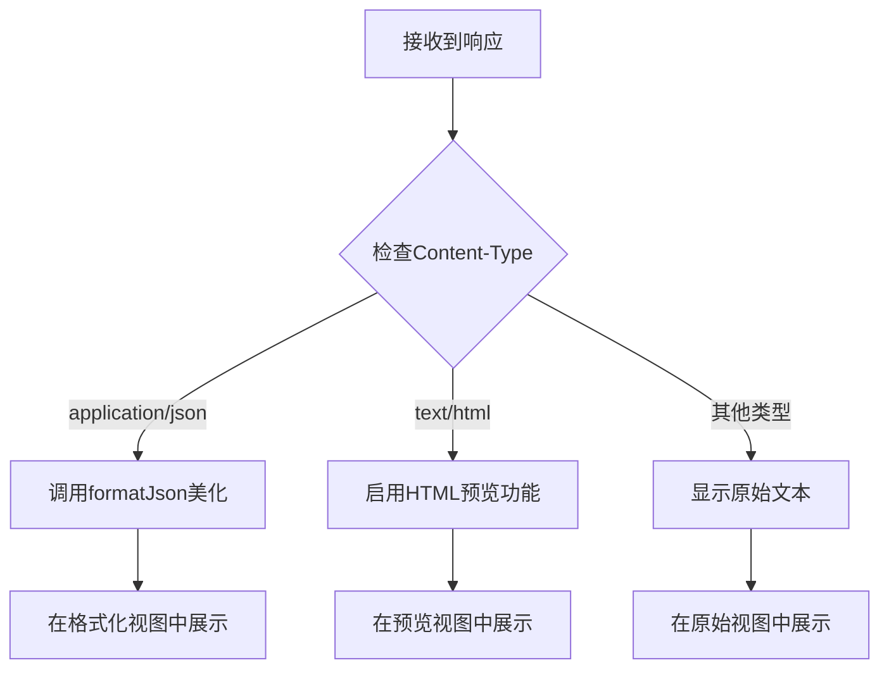

# 数据格式化工具

<cite>
**本文档中引用的文件**  
- [formatter.ts](file://packages/shared/utils/formatter.ts)
- [ResponsePanel.vue](file://packages/web-lite/src/components/ResponsePanel.vue)
- [CollectionTree.vue](file://packages/web-full/src/components/CollectionTree.vue)
</cite>

## 目录
1. [简介](#简介)
2. [核心格式化函数](#核心格式化函数)
3. [响应体展示中的格式化策略](#响应体展示中的格式化策略)
4. [集合树中的实际应用](#集合树中的实际应用)
5. [自定义格式化插件接入](#自定义格式化插件接入)
6. [性能优化技巧](#性能优化技巧)
7. [结论](#结论)

## 简介
本系统提供了一套完整的数据格式化工具，集中封装于 `formatter.ts` 文件中，旨在统一处理接口调试过程中的各类数据展示需求。该工具集支持时间、数字、JSON、文件大小等多种数据类型的格式化，并在 `ResponsePanel.vue` 和 `CollectionTree.vue` 等核心组件中得到广泛应用，确保了用户界面信息的可读性与一致性。

## 核心格式化函数

### 时间格式化（timeFormat）
`formatTimestamp` 函数用于将时间戳或 `Date` 对象格式化为指定格式的字符串。它基于 `dayjs` 库实现，支持灵活的模板配置，默认格式为 `YYYY-MM-DD HH:mm:ss`。

- **时间单位支持**：函数接受毫秒级时间戳或 `Date` 对象作为输入，自动处理单位转换。
- **格式化模板**：通过 `format` 参数自定义输出格式，如 `YYYY/MM/DD`、`HH:mm` 等。
- **国际化处理**：依赖 `dayjs` 的国际化插件，可轻松实现多语言日期显示。

```typescript
static formatTimestamp(timestamp: number | Date, format: string = 'YYYY-MM-DD HH:mm:ss'): string
```

**Section sources**
- [formatter.ts](file://packages/shared/utils/formatter.ts#L18-L20)

### 数字与文件大小格式化（numberFormat）
`formatFileSize` 函数将字节数转换为人类可读的文件大小字符串，如 "1.5 MB"。它实现了千分位分隔和小数位数控制（保留两位小数），并自动选择合适的单位（B, KB, MB, GB）。

```typescript
static formatFileSize(bytes: number): string
```

此外，`formatDuration` 函数将毫秒数转换为更直观的时间表示，如 "1.2s" 或 "3.5min"。

**Section sources**
- [formatter.ts](file://packages/shared/utils/formatter.ts#L4-L10)
- [formatter.ts](file://packages/shared/utils/formatter.ts#L12-L14)

### JSON 格式化（jsonFormat）
`formatJson` 函数提供 JSON 数据的美化输出与压缩功能。通过 `indent` 参数控制缩进空格数（默认为2），实现代码的可读性美化。对于非 JSON 数据，函数会安全地回退到字符串表示。

```typescript
static formatJson(obj: any, indent: number = 2): string
```

**Section sources**
- [formatter.ts](file://packages/shared/utils/formatter.ts#L22-L28)

## 响应体展示中的格式化策略

在 `ResponsePanel.vue` 组件中，系统根据响应头的 `Content-Type` 字段自动选择合适的格式化策略，以优化用户体验。

- **JSON 响应**：当 `Content-Type` 包含 `application/json` 时，响应体在“格式化”视图中自动调用 `JSON.stringify` 进行美化输出。
- **HTML 响应**：当 `Content-Type` 包含 `text/html` 时，“预览”选项被激活，允许用户在内嵌 `iframe` 中直接查看渲染后的 HTML 内容。
- **原始数据**：用户可切换至“原始”视图，查看未经处理的原始响应数据。

该策略通过 `computed` 属性 `formattedResponse` 实现，结合 `isHtmlContent` 判断，动态决定展示内容。



**Diagram sources**
- [ResponsePanel.vue](file://packages/web-lite/src/components/ResponsePanel.vue#L289-L307)

**Section sources**
- [ResponsePanel.vue](file://packages/web-lite/src/components/ResponsePanel.vue#L289-L307)
- [ResponsePanel.vue](file://packages/web-lite/src/components/ResponsePanel.vue#L78-L113)

## 集合树中的实际应用

`CollectionTree.vue` 组件在接口集合的树形结构展示中，应用了数据格式化原则，主要体现在接口名称的显示上。

- **名称截断**：通过 CSS 的 `text-overflow: ellipsis` 属性，当接口名称过长时自动进行省略显示，保持界面整洁。
- **时间戳显示**：虽然当前代码未直接在 `CollectionTree.vue` 中使用 `formatTimestamp`，但其设计模式与 `History.vue` 等组件一致，后者使用了类似的时间格式化逻辑（如“刚刚”、“X分钟前”）。

```css
.node-label {
  font-size: 14px;
  color: #303133;
  white-space: nowrap;
  overflow: hidden;
  text-overflow: ellipsis;
}
```

**Section sources**
- [CollectionTree.vue](file://packages/web-full/src/components/CollectionTree.vue#L158-L164)

## 自定义格式化插件接入

系统通过 `formatter.ts` 中的 `Formatter` 静态类提供了清晰的扩展点。开发者可以通过以下方式接入自定义格式化插件：

1. 在 `formatter.ts` 文件中添加新的静态方法。
2. 或者，在项目其他位置创建新的格式化工具文件，并通过 `index.ts` 导出，保持 API 的一致性。

例如，可以添加一个 `formatCurrency` 方法来支持货币符号和千分位分隔。

**Section sources**
- [formatter.ts](file://packages/shared/utils/formatter.ts#L0-L54)
- [index.ts](file://packages/shared/utils/index.ts#L0-L3)

## 性能优化技巧

在处理大数据量渲染时，如大型 JSON 响应或包含大量接口的集合树，应注意以下性能优化技巧：

- **防抖（Debounce）**：对于频繁触发的格式化操作（如实时预览），应使用防抖技术，避免在用户输入过程中过度计算。
- **虚拟滚动（Virtual Scrolling）**：对于长列表（如历史记录或大型集合），应采用虚拟滚动技术，仅渲染可视区域内的 DOM 元素，显著提升渲染性能。

虽然当前 `ResponsePanel.vue` 和 `CollectionTree.vue` 未显式实现这些优化，但它们是处理大数据量时推荐的最佳实践。

## 结论
本文档系统化地阐述了 `formatter.ts` 中提供的数据格式化函数及其在 `ResponsePanel.vue` 和 `CollectionTree.vue` 组件中的实际应用。该工具集不仅提升了数据的可读性，还通过自动化的格式化策略增强了用户体验。未来可通过引入防抖和虚拟滚动等技术，进一步优化系统在处理大数据量时的性能表现。