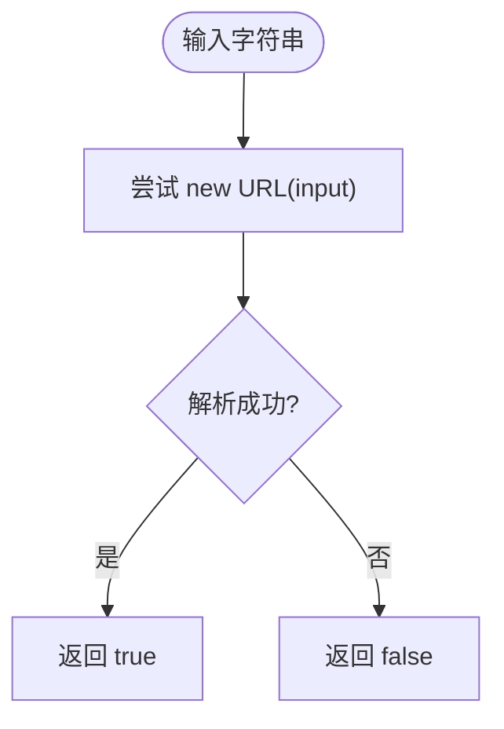
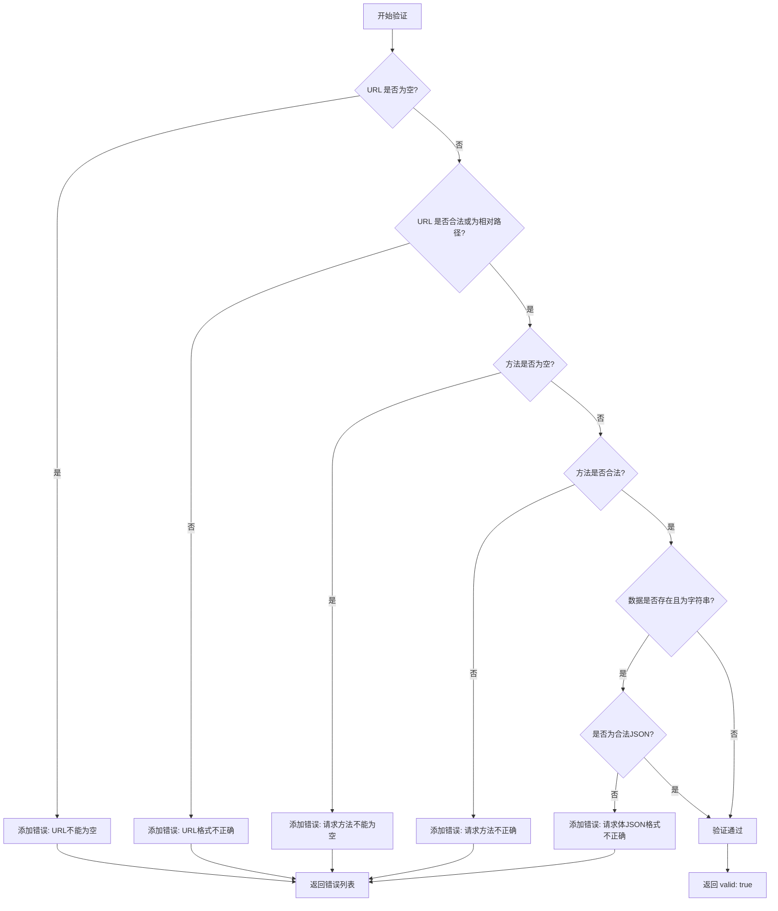
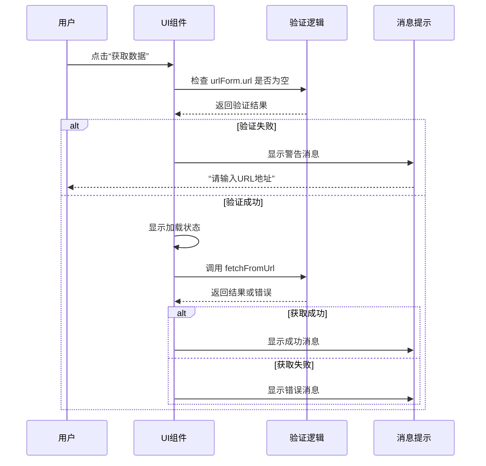

# 数据验证工具

<cite>
**本文档引用文件**  
- [validator.ts](file://packages/shared/utils/validator.ts)
- [EnvironmentDialog.vue](file://packages/web-full/src/components/EnvironmentDialog.vue)
- [ImportDialog.vue](file://packages/web-full/src/components/ImportDialog.vue)
</cite>

## 目录
1. [简介](#简介)
2. [核心验证规则](#核心验证规则)
3. [组合式验证与错误消息](#组合式验证与错误消息)
4. [表单验证绑定与错误提示联动](#表单验证绑定与错误提示联动)
5. [异步验证扩展接口设计](#异步验证扩展接口设计)
6. [Element Plus 集成方案](#element-plus-集成方案)
7. [常见误用场景及解决方案](#常见误用场景及解决方案)
8. [总结](#总结)

## 简介
本项目中的 `validator.ts` 文件提供了一套用于前端表单数据校验的静态工具方法，主要服务于环境管理、数据导入等关键功能模块。这些验证规则被集成在 `EnvironmentDialog.vue` 和 `ImportDialog.vue` 等组件中，确保用户输入的数据格式正确、合法。本文档将深入分析其正则逻辑、组合验证机制、与 Element Plus 的集成方式以及实际应用中的边界处理。

**Section sources**
- [validator.ts](file://packages/shared/utils/validator.ts#L0-L54)
- [EnvironmentDialog.vue](file://packages/web-full/src/components/EnvironmentDialog.vue#L0-L392)
- [ImportDialog.vue](file://packages/web-full/src/components/ImportDialog.vue#L0-L432)

## 核心验证规则
`Validator` 类提供了多个静态方法用于验证不同类型的输入数据，其核心规则如下：

### URL 格式验证
使用 `new URL()` 构造函数进行解析，利用浏览器原生的 URL 解析能力来判断 URL 的合法性。这种方式比正则表达式更准确，能有效处理各种复杂的 URL 结构和编码情况。



**Diagram sources**
- [validator.ts](file://packages/shared/utils/validator.ts#L4-L8)

### JSON 格式验证
通过 `JSON.parse()` 尝试解析字符串，若抛出异常则说明 JSON 格式不合法。该方法能准确识别语法错误，如缺少引号、括号不匹配等。

**Section sources**
- [validator.ts](file://packages/shared/utils/validator.ts#L10-L14)

### 邮箱格式验证
使用正则表达式 `/^[^\s@]+@[^\s@]+\.[^\s@]+$/` 进行基础校验：
- `^[^\s@]+`：开头不能有空格或 @，至少一个非空格非@字符（用户名）
- `@`：必须包含 @ 符号
- `[^\s@]+`：@ 后不能有空格或 @，至少一个非空格非@字符（域名主体）
- `\.`：必须包含点号
- `[^\s@]+$`：结尾不能有空格或 @，至少一个非空格非@字符（顶级域名）

此规则适用于大多数标准邮箱格式，但不支持国际化域名（IDN）或特殊字符邮箱。

**Section sources**
- [validator.ts](file://packages/shared/utils/validator.ts#L16-L19)

### HTTP 方法验证
通过预定义的合法方法数组 `['GET', 'POST', 'PUT', 'DELETE', 'PATCH', 'HEAD', 'OPTIONS']` 进行白名单校验，输入方法会先转为大写再比对，确保大小写不敏感。

**Section sources**
- [validator.ts](file://packages/shared/utils/validator.ts#L21-L24)

### 请求配置综合验证
`validateRequestConfig` 方法对整个请求对象进行多字段联合校验，包括：
- URL 非空且格式正确（或为相对路径）
- 请求方法非空且在允许列表中
- 请求体为字符串时需为合法 JSON

返回包含 `valid` 和 `errors` 的对象，便于前端展示具体错误信息。



**Diagram sources**
- [validator.ts](file://packages/shared/utils/validator.ts#L26-L54)

## 组合式验证与错误消息
虽然 `Validator` 类本身未直接提供 `isEmail`、`isPhone`、`isRequired` 等方法，但其设计模式支持在上层组件中实现组合式验证。例如，在 `EnvironmentDialog.vue` 中，虽然未显式调用 `Validator`，但其表单逻辑体现了类似的验证思想：

- 环境名称输入框虽无格式校验，但通过 `saveEnvironment` 方法在保存时隐式要求非空。
- 变量名和变量值的输入通过 `addVariable` 和 `updateVariableKey` 方法进行动态管理，确保结构完整性。

错误消息以中文提示（如“URL不能为空”）直接返回，便于用户理解。

**Section sources**
- [validator.ts](file://packages/shared/utils/validator.ts#L26-L54)
- [EnvironmentDialog.vue](file://packages/web-full/src/components/EnvironmentDialog.vue#L257-L324)

## 表单验证绑定与错误提示联动
在 `ImportDialog.vue` 中展示了完整的表单验证流程与错误提示机制：

- **URL 导入页签**：点击“获取数据”前会检查 `urlForm.url` 是否为空，若为空则通过 `ElMessage.warning('请输入URL地址')` 提示用户。
- **文本导入页签**：选择格式后粘贴内容，提交时通过 `parseImportData` 方法尝试解析，失败时提示“数据格式解析失败”。
- **导入按钮状态控制**：通过计算属性 `hasValidData` 控制“导入”按钮的 `disabled` 状态，实现“无有效数据时禁用”的联动机制。



**Diagram sources**
- [ImportDialog.vue](file://packages/web-full/src/components/ImportDialog.vue#L280-L300)

**Section sources**
- [ImportDialog.vue](file://packages/web-full/src/components/ImportDialog.vue#L0-L432)

## 异步验证扩展接口设计
当前 `Validator` 类主要提供同步验证方法。对于异步验证（如唯一性检查），可通过以下方式扩展：

1. 在需要异步校验的组件中（如 `EnvironmentDialog.vue`），于 `saveEnvironment` 方法内添加异步请求。
2. 调用后端 API 检查环境名称是否已存在。
3. 若存在冲突，则阻止保存并提示用户。

虽然当前代码未实现此逻辑，但其结构允许轻松集成异步验证，例如：

```ts
const saveEnvironment = async () => {
  if (!selectedEnvironment.value) return;
  
  // 异步唯一性检查
  const isNameUnique = await checkEnvironmentNameUnique(selectedEnvironment.value.name);
  if (!isNameUnique) {
    ElMessage.error('环境名称已存在');
    return;
  }
  
  // 保存逻辑...
}
```

**Section sources**
- [EnvironmentDialog.vue](file://packages/web-full/src/components/EnvironmentDialog.vue#L257-L324)

## Element Plus 集成方案
本项目已深度集成 Element Plus 组件库，验证规则通过以下方式与其结合：

- 使用 `el-form` 和 `el-form-item` 构建表单结构。
- 利用 `el-input`、`el-upload` 等组件收集用户输入。
- 通过 `ElMessage` 和 `ElMessageBox` 展示验证结果和提示信息。
- 使用 `:disabled` 绑定计算属性（如 `hasValidData`）实现按钮状态联动。

尽管未使用 Element Plus 的内置表单验证规则（rules），但通过手动调用 `Validator` 方法并结合 `@click` 事件实现了等效功能，提供了更高的灵活性。

**Section sources**
- [ImportDialog.vue](file://packages/web-full/src/components/ImportDialog.vue#L0-L432)
- [EnvironmentDialog.vue](file://packages/web-full/src/components/EnvironmentDialog.vue#L0-L392)

## 常见误用场景及解决方案
### 空字符串判定
问题：`isValidEmail('')` 会返回 `false`，但可能希望明确区分“未填写”和“格式错误”。

解决方案：在调用 `isValidEmail` 前先检查是否为空，或封装一个包含必填校验的复合方法。

### 类型强制转换
问题：`isValidUrl` 接收 `string` 类型，若传入非字符串（如 `null` 或对象）会导致 `new URL()` 抛出异常。

解决方案：在调用前进行类型检查，或在 `Validator` 内部添加类型判断：

```ts
static isValidUrl(url: string): boolean {
  if (!url || typeof url !== 'string') return false;
  try {
    new URL(url);
    return true;
  } catch {
    return false;
  }
}
```

**Section sources**
- [validator.ts](file://packages/shared/utils/validator.ts#L4-L8)

## 总结
`validator.ts` 提供了一套简洁高效的同步验证工具，适用于 URL、JSON、邮箱等常见格式校验。其与 `EnvironmentDialog.vue` 和 `ImportDialog.vue` 的结合展示了手动验证流程的设计模式，虽未使用 Element Plus 的内置验证系统，但通过计算属性和事件处理实现了灵活的错误提示与状态联动。未来可扩展异步验证接口，并增强类型安全性和边界情况处理。