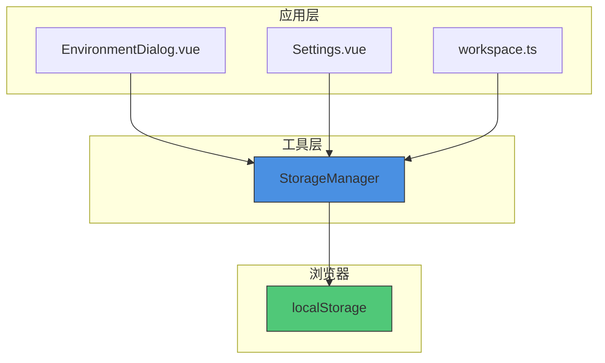
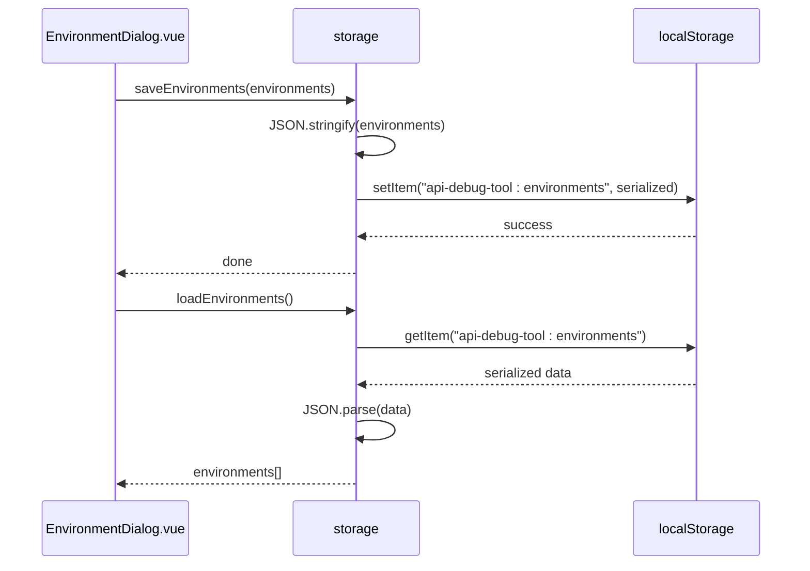
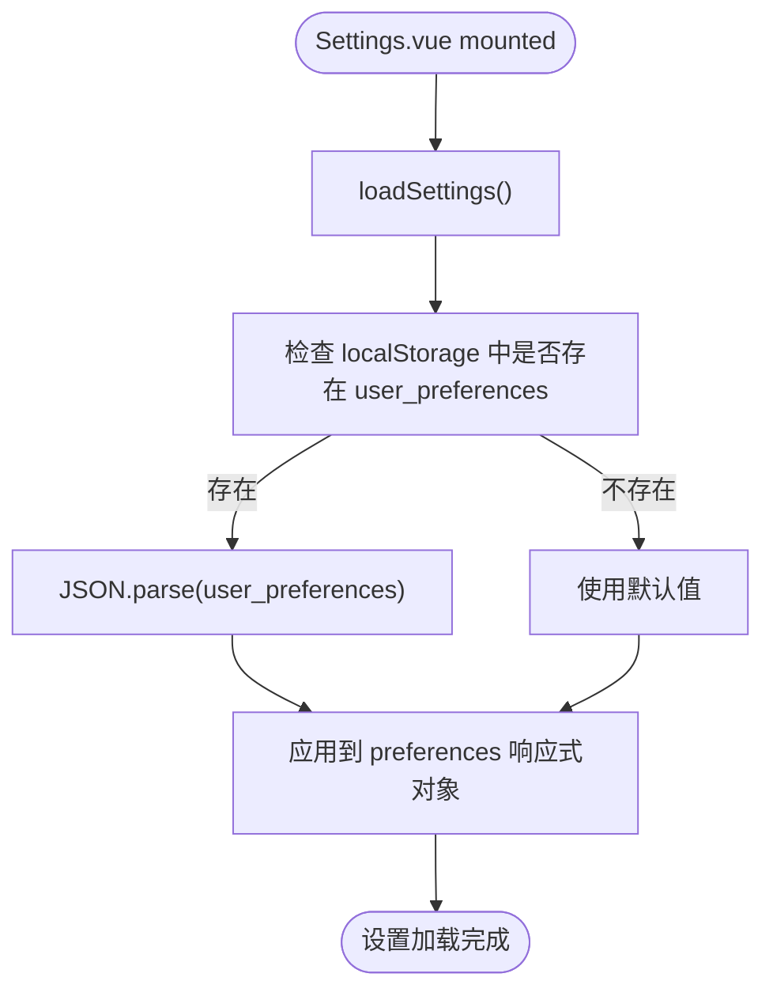
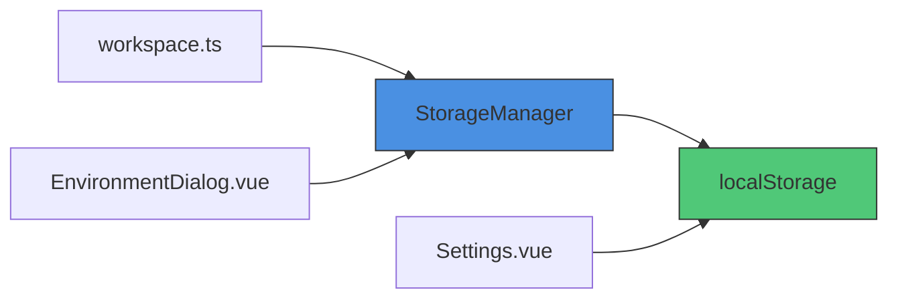

# 本地存储工具

<cite>
**本文档引用的文件**  
- [storage.ts](file://packages/shared/utils/storage.ts)
- [EnvironmentDialog.vue](file://packages/web-full/src/components/EnvironmentDialog.vue)
- [Settings.vue](file://packages/web-full/src/pages/Settings.vue)
- [workspace.ts](file://packages/web-full/src/stores/workspace.ts)
</cite>

## 目录
1. [简介](#简介)
2. [核心组件](#核心组件)
3. [架构概述](#架构概述)
4. [详细组件分析](#详细组件分析)
5. [依赖分析](#依赖分析)
6. [性能考虑](#性能考虑)
7. [故障排除指南](#故障排除指南)
8. [结论](#结论)

## 简介
`StorageManager` 类是对浏览器 `localStorage` 的封装，旨在提供更安全、更便捷的本地存储操作。该工具通过命名空间前缀防止键名冲突，并自动处理 JSON 序列化与反序列化，简化了复杂数据类型的存储与读取。它被广泛应用于环境配置、用户偏好设置等持久化场景中，支持异常处理和无痕模式降级，具备良好的浏览器兼容性。

## 核心组件

`StorageManager` 是一个通用的本地存储管理类，提供类型安全的 set/get/remove 操作。其默认实例 `storage` 被多个模块复用，实现跨组件的数据持久化。

**Section sources**
- [storage.ts](file://packages/shared/utils/storage.ts#L1-L54)

## 架构概述



**Diagram sources**
- [storage.ts](file://packages/shared/utils/storage.ts#L1-L54)
- [EnvironmentDialog.vue](file://packages/web-full/src/components/EnvironmentDialog.vue#L1-L392)
- [Settings.vue](file://packages/web-full/src/pages/Settings.vue#L1-L799)

## 详细组件分析

### StorageManager 类分析

`StorageManager` 封装了对 `localStorage` 的访问，提供了命名空间隔离、自动序列化、异常捕获等特性。

#### 类图
```mermaid
classDiagram
class StorageManager {
-prefix : string
+set(key : string, value : T) : void
+get(key : string, defaultValue? : T) : T | undefined
+remove(key : string) : void
+clear() : void
+getAllKeys() : string[]
-getKey(key : string) : string
}
note right of StorageManager
构造函数参数 :
- prefix : 命名空间前缀，默认为 'api-debug-tool'
end note
```

**Diagram sources**
- [storage.ts](file://packages/shared/utils/storage.ts#L1-L54)

#### 方法行为特性

- **setItem 等价于 set 方法**：接收泛型参数，自动进行 `JSON.stringify` 序列化后存储。使用前缀命名空间避免键名冲突。
- **getItem 等价于 get 方法**：从存储中读取并自动 `JSON.parse` 反序列化。支持提供默认值，在键不存在或解析失败时返回。
- **removeItem 等价于 remove 方法**：根据键名删除对应条目，同样应用命名空间前缀。
- **clear 方法**：仅清除当前实例前缀下的所有键，避免影响其他应用数据。

**Section sources**
- [storage.ts](file://packages/shared/utils/storage.ts#L1-L54)

### 使用场景分析

#### 环境配置持久化（EnvironmentDialog.vue）

环境管理对话框使用 `storage` 实例持久化环境列表。当用户创建、编辑或删除环境时，数据通过 `storage.set('environments', environments)` 保存，并在初始化时通过 `storage.get('environments')` 恢复。



**Diagram sources**
- [EnvironmentDialog.vue](file://packages/web-full/src/components/EnvironmentDialog.vue#L1-L392)
- [storage.ts](file://packages/shared/utils/storage.ts#L1-L54)

#### 用户偏好设置（Settings.vue）

在设置页面中，个人偏好（如主题、语言、字体大小）通过原生 `localStorage` 直接存储于 `user_preferences` 键下。安全设置则存储于 `security_settings` 键。这表明项目中存在两种持久化策略：统一的 `StorageManager` 和直接的 `localStorage` 调用。



**Diagram sources**
- [Settings.vue](file://packages/web-full/src/pages/Settings.vue#L1-L799)
- [storage.ts](file://packages/shared/utils/storage.ts#L1-L54)

## 依赖分析

`StorageManager` 依赖于浏览器的 `localStorage` API，属于 Web Storage API 的一部分。其设计为无外部 npm 依赖的轻量级工具。在 `packages/web-full` 中，多个 store 模块（如 workspace.ts）直接或间接依赖此工具进行数据持久化。



**Diagram sources**
- [storage.ts](file://packages/shared/utils/storage.ts#L1-L54)
- [workspace.ts](file://packages/web-full/src/stores/workspace.ts#L183-L233)

## 性能考虑

- **序列化开销**：每次 set/get 都涉及 JSON 序列化/反序列化，对于大型对象可能影响性能。
- **存储容量**：受限于浏览器 ~5-10MB 的 localStorage 限制，需注意数据膨胀。
- **同步阻塞**：localStorage 操作是同步的，大量数据读写可能阻塞主线程。
- **命名空间清理**：`clear()` 方法遍历所有 localStorage 键，性能随键数量线性增长。

## 故障排除指南

### 异常处理机制
- **存储空间不足**：`set` 方法使用 try-catch 包裹，捕获 `QuotaExceededError` 并输出错误日志，避免应用崩溃。
- **解析错误**：`get` 方法同样使用 try-catch，当存储的字符串非合法 JSON 时返回默认值或 undefined。
- **无痕模式**：在无痕模式下，部分浏览器会限制或清空 localStorage。应用应能优雅降级，如使用内存存储作为 fallback。

### 安全建议
- **避免明文存储敏感信息**：如密码、API 密钥等，应使用加密或仅存储 token。
- **前缀命名空间**：使用 `api-debug-tool:` 前缀有效防止与其他应用或同一应用不同实例的键名冲突。
- **输入验证**：虽然工具本身不验证数据，但上层应用应在存储前验证数据合法性。

### SSR 兼容性设计
由于 `localStorage` 是浏览器特有 API，在服务端渲染（SSR）环境中不存在。`StorageManager` 在 SSR 环境下实例化时，所有操作将因 `localStorage` 未定义而静默失败（通过 try-catch）。建议在 SSR 场景中通过 feature detection 判断环境，或使用 cookie/sessionStorage 替代方案。

**Section sources**
- [storage.ts](file://packages/shared/utils/storage.ts#L1-L54)
- [Settings.vue](file://packages/web-full/src/pages/Settings.vue#L675-L716)

## 结论
`StorageManager` 提供了一个简洁、安全的 localStorage 封装，通过自动序列化、命名空间隔离和异常处理，显著提升了本地存储的开发体验和健壮性。其在环境管理和用户设置等场景中得到了有效应用。未来可扩展支持过期时间（expire）、加密存储等高级特性，以满足更复杂的需求。