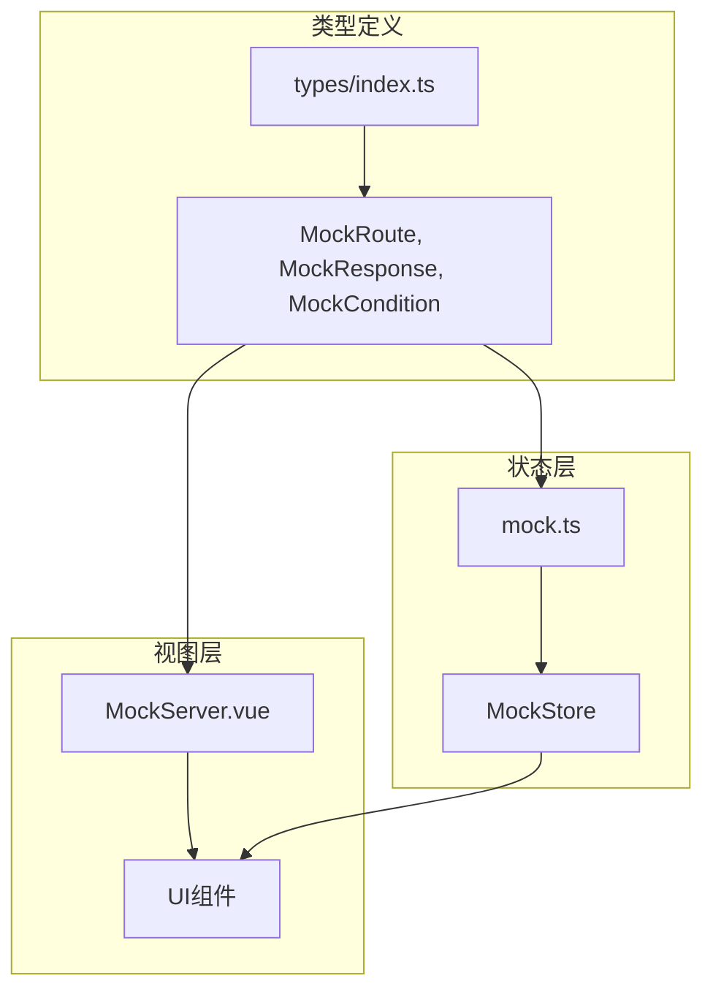
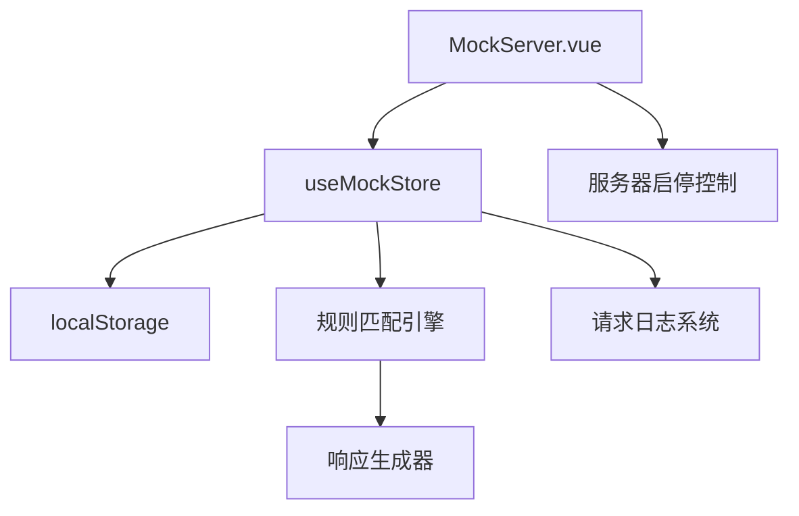
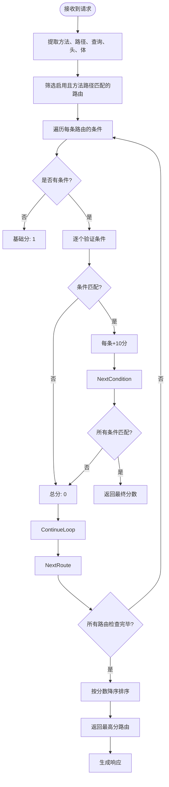
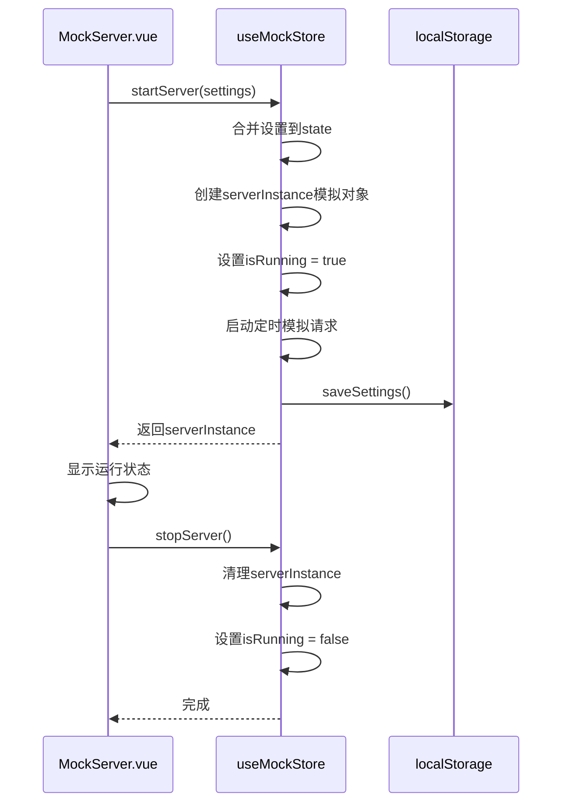
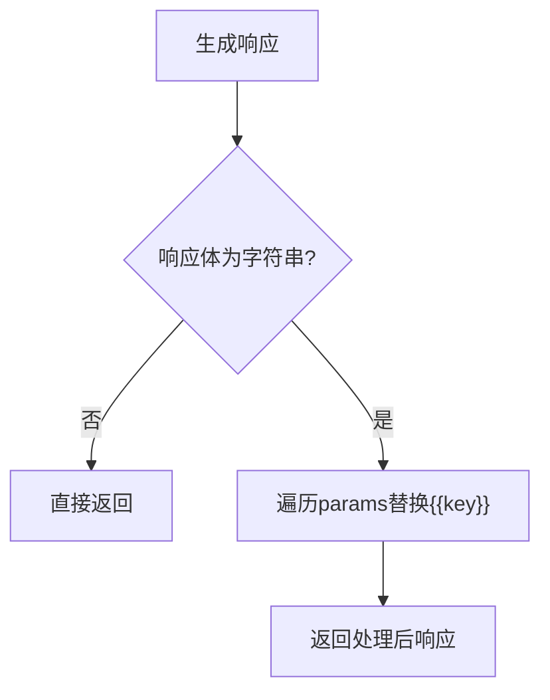
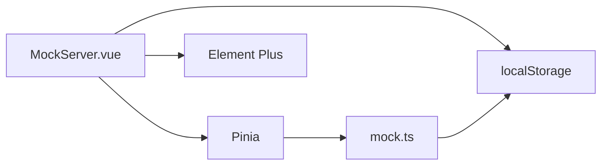

# Mock服务模块

<cite>
**本文档引用的文件**  
- [mock.ts](file://packages/web-pro/src/stores/mock.ts)
- [MockServer.vue](file://packages/web-pro/src/views/MockServer.vue)
- [types/index.ts](file://packages/web-pro/src/types/index.ts)
</cite>

## 目录
1. [简介](#简介)
2. [项目结构](#项目结构)
3. [核心组件](#核心组件)
4. [架构概述](#架构概述)
5. [详细组件分析](#详细组件分析)
6. [依赖分析](#依赖分析)
7. [性能考虑](#性能考虑)
8. [故障排除指南](#故障排除指南)
9. [结论](#结论)

## 简介
本模块实现了一个前端Mock服务器，用于模拟HTTP接口响应。系统通过定义路由规则、响应条件和动态变量替换，支持对API请求的精准拦截与响应模拟。用户可在`MockServer.vue`页面中可视化管理Mock规则，包括路径匹配、请求条件设置、响应延迟控制及请求日志查看。该模块广泛应用于接口调试、前端独立开发和自动化测试场景。

## 项目结构
Mock服务模块主要由状态管理（Pinia Store）和UI视图两部分构成，分别位于`stores/mock.ts`和`views/MockServer.vue`中。类型定义集中于`types/index.ts`，确保数据结构一致性。



**Diagram sources**  
- [mock.ts](file://packages/web-pro/src/stores/mock.ts#L1-L353)
- [MockServer.vue](file://packages/web-pro/src/views/MockServer.vue#L1-L840)
- [types/index.ts](file://packages/web-pro/src/types/index.ts#L317-L349)

**Section sources**  
- [mock.ts](file://packages/web-pro/src/stores/mock.ts#L1-L353)
- [MockServer.vue](file://packages/web-pro/src/views/MockServer.vue#L1-L840)

## 核心组件
核心功能由`useMockStore`状态管理器驱动，包含路由配置、条件匹配、响应生成、日志记录和服务器生命周期控制。`MockServer.vue`作为管理界面，提供完整的CRUD操作与实时监控能力。

**Section sources**  
- [mock.ts](file://packages/web-pro/src/stores/mock.ts#L1-L353)
- [MockServer.vue](file://packages/web-pro/src/views/MockServer.vue#L1-L840)

## 架构概述
系统采用分层架构设计，上层为UI交互层，中层为状态管理层，底层为持久化与模拟逻辑层。所有HTTP请求拦截逻辑均在内存中完成，无需真实后端支持。



**Diagram sources**  
- [mock.ts](file://packages/web-pro/src/stores/mock.ts#L1-L353)
- [MockServer.vue](file://packages/web-pro/src/views/MockServer.vue#L1-L840)

## 详细组件分析

### 路由状态模型分析
`MockStore`中的`routes`字段存储所有Mock路由规则，每条路由包含路径、方法、响应体、启用状态、命中统计及匹配条件等元数据。

#### 数据模型结构
```mermaid
classDiagram
class MockRoute {
+string id
+string method
+string path
+string description
+boolean enabled
+MockResponse response
+number delay
+MockCondition[] conditions
+number hitCount
+number lastHit
+Date createdAt
+Date updatedAt
}
class MockResponse {
+number statusCode
+{key : string, value : string}[] headers
+any body
+string bodyType
+boolean dynamic
+string script
}
class MockCondition {
+string type
+string field
+string operator
+string value
+boolean caseSensitive
}
MockRoute --> MockResponse : "包含"
MockRoute --> MockCondition : "包含多个"
```

**Diagram sources**  
- [types/index.ts](file://packages/web-pro/src/types/index.ts#L317-L349)

**Section sources**  
- [types/index.ts](file://packages/web-pro/src/types/index.ts#L317-L349)

### 响应规则匹配算法分析
系统通过`matchRoute`方法实现多维度条件匹配，优先级由`calculateMatchScore`评分机制决定。

#### 匹配流程图


**Diagram sources**  
- [mock.ts](file://packages/web-pro/src/stores/mock.ts#L200-L250)

**Section sources**  
- [mock.ts](file://packages/web-pro/src/stores/mock.ts#L200-L250)

### 服务器控制逻辑分析
`startServer`与`stopServer`方法管理Mock服务的生命周期，支持动态配置更新与自动持久化。

#### 服务启停序列图


**Diagram sources**  
- [mock.ts](file://packages/web-pro/src/stores/mock.ts#L100-L130)
- [MockServer.vue](file://packages/web-pro/src/views/MockServer.vue#L250-L280)

**Section sources**  
- [mock.ts](file://packages/web-pro/src/stores/mock.ts#L100-L130)

### 动态响应与变量替换机制
`generateResponse`方法支持路径参数的动态替换，使用`{{key}}`语法实现模板渲染。



**Diagram sources**  
- [mock.ts](file://packages/web-pro/src/stores/mock.ts#L280-L295)

**Section sources**  
- [mock.ts](file://packages/web-pro/src/stores/mock.ts#L280-L295)

## 依赖分析
系统依赖Pinia进行状态管理，Element Plus提供UI组件，浏览器localStorage实现数据持久化。无外部网络依赖，完全运行于客户端。



**Diagram sources**  
- [mock.ts](file://packages/web-pro/src/stores/mock.ts#L1-L353)
- [MockServer.vue](file://packages/web-pro/src/views/MockServer.vue#L1-L840)

**Section sources**  
- [mock.ts](file://packages/web-pro/src/stores/mock.ts#L1-L353)

## 性能考虑
- 日志数量受`maxLogs`限制，默认保留最近1000条
- 路由匹配采用线性扫描+评分排序，建议控制路由总数在合理范围
- 响应延迟模拟通过`delay`字段实现，不影响主线程
- 所有数据存储于内存，读写高效

## 故障排除指南
常见问题及解决方案：

| 问题现象 | 可能原因 | 解决方案 |
|--------|--------|--------|
| 服务器无法启动 | 端口被占用 | 更改`settings.port` |
| 路由不匹配 | 路径或条件配置错误 | 检查路径参数语法与条件逻辑 |
| 响应体未替换变量 | 未使用`{{key}}`格式 | 确保模板语法正确 |
| 日志不显示 | 浏览器阻止定时器 | 检查页面是否处于激活状态 |

**Section sources**  
- [mock.ts](file://packages/web-pro/src/stores/mock.ts#L150-L180)
- [MockServer.vue](file://packages/web-pro/src/views/MockServer.vue#L300-L350)

## 结论
该Mock服务模块提供了完整的前端接口模拟解决方案，具备灵活的路由配置、强大的条件匹配、动态响应生成和可视化管理界面。通过Pinia状态管理与Vue组件的良好集成，实现了高内聚、低耦合的设计。适用于开发调试、联调测试和离线开发等多种场景，显著提升开发效率。