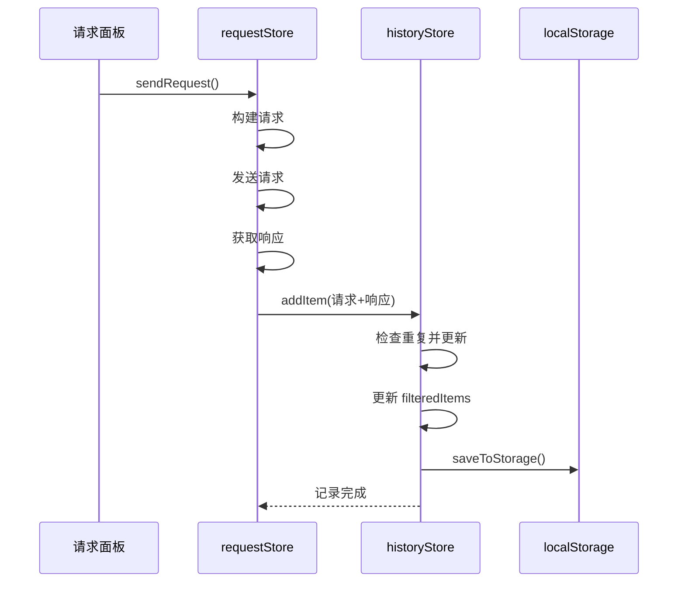
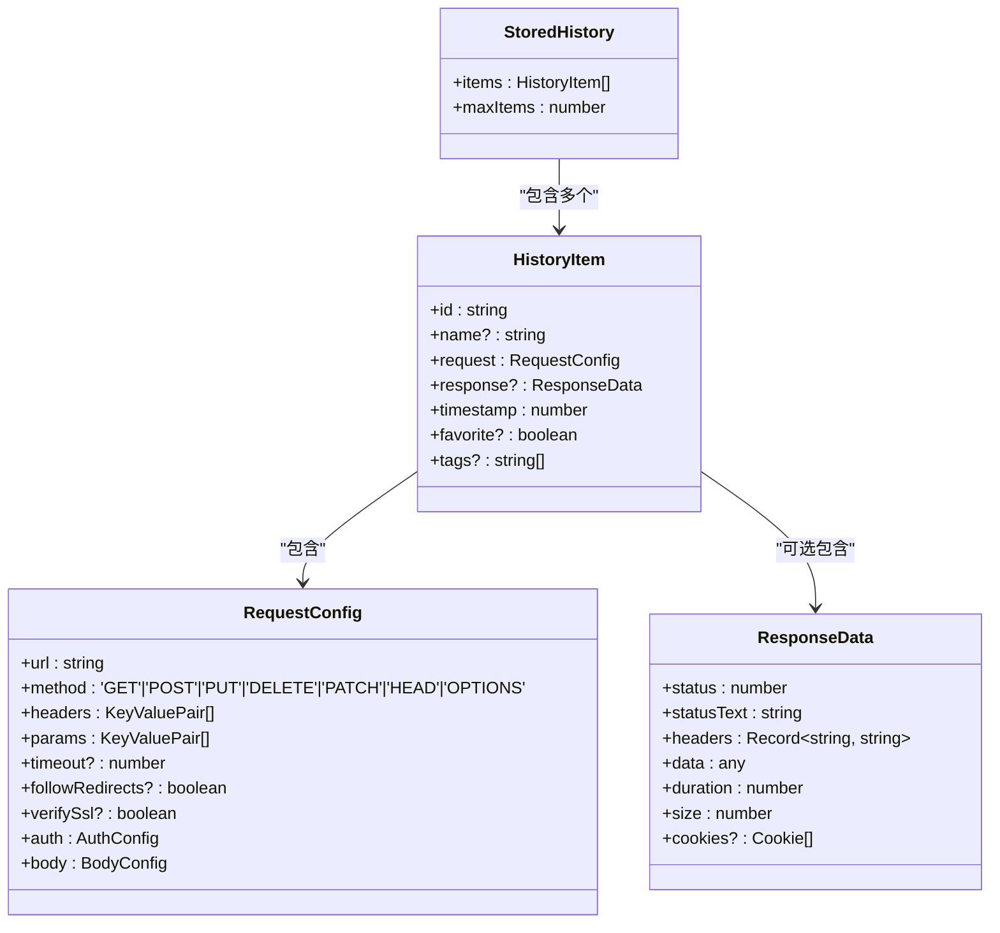
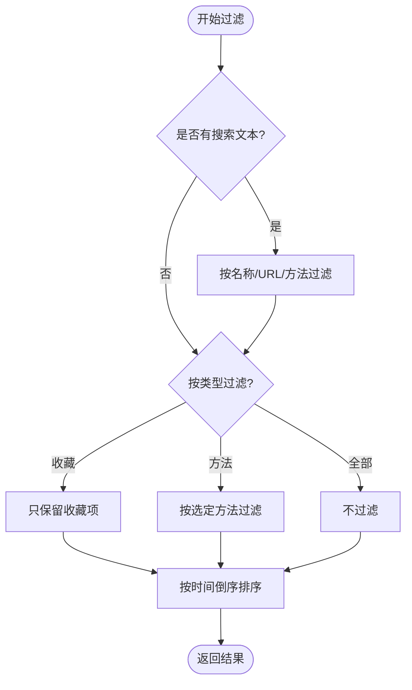
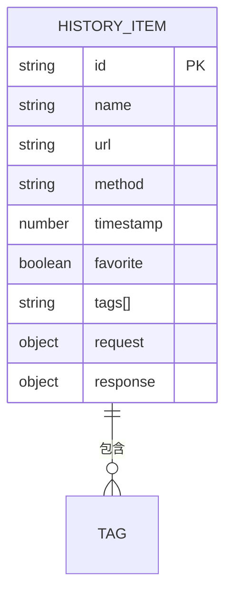
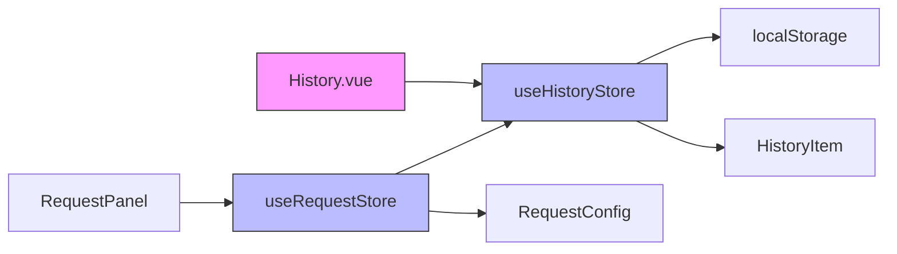
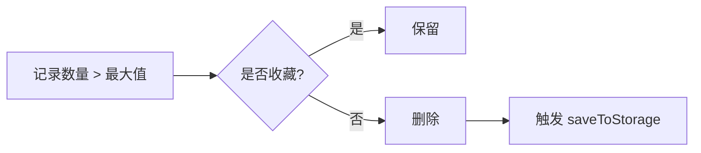

# 历史记录模块

<cite>
**本文档引用的文件**  
- [history.ts](file://packages/web-lite/src/stores/history.ts)
- [request.ts](file://packages/web-lite/src/stores/request.ts)
- [index.ts](file://packages/web-lite/src/types/index.ts)
- [History.vue](file://packages/web-lite/src/views/History.vue)
</cite>

## 目录
1. [介绍](#介绍)
2. [项目结构](#项目结构)
3. [核心组件](#核心组件)
4. [架构概述](#架构概述)
5. [详细组件分析](#详细组件分析)
6. [依赖分析](#依赖分析)
7. [性能考虑](#性能考虑)
8. [故障排除指南](#故障排除指南)
9. [结论](#结论)

## 介绍
本文档详细说明了在线接口调试工具中的历史记录模块设计与实现。该模块基于 Pinia 状态管理库构建，用于持久化用户请求历史、支持搜索与过滤、并提供收藏与标签管理功能。模块通过 `localStorage` 实现数据持久化，并与请求模块联动，在每次请求完成后自动记录请求与响应信息。

## 项目结构

```mermaid
graph TB
subgraph "stores"
history[history.ts]
request[request.ts]
end
subgraph "types"
types[index.ts]
end
subgraph "views"
HistoryView[History.vue]
end
history --> types
request --> history
HistoryView --> history
HistoryView --> types
```

**图示来源**  
- [history.ts](file://packages/web-lite/src/stores/history.ts)
- [request.ts](file://packages/web-lite/src/stores/request.ts)
- [index.ts](file://packages/web-lite/src/types/index.ts)
- [History.vue](file://packages/web-lite/src/views/History.vue)

**节段来源**  
- [history.ts](file://packages/web-lite/src/stores/history.ts#L1-L248)
- [request.ts](file://packages/web-lite/src/stores/request.ts#L1-L304)
- [History.vue](file://packages/web-lite/src/views/History.vue#L1-L698)

## 核心组件

历史记录模块的核心组件包括：
- `useHistoryStore`：Pinia store，管理历史记录的状态与行为
- `HistoryItem`：定义单条历史记录的数据结构
- `StoredHistory`：定义本地存储的数据格式
- `History.vue`：视图组件，展示历史记录列表并提供交互功能

该模块通过 `addItem` 方法接收请求完成后的数据，自动去重并更新时间戳，确保记录的时效性与唯一性。

**节段来源**  
- [history.ts](file://packages/web-lite/src/stores/history.ts#L1-L248)
- [index.ts](file://packages/web-lite/src/types/index.ts#L1-L130)

## 架构概述



**图示来源**  
- [request.ts](file://packages/web-lite/src/stores/request.ts#L150-L200)
- [history.ts](file://packages/web-lite/src/stores/history.ts#L45-L80)

**节段来源**  
- [request.ts](file://packages/web-lite/src/stores/request.ts#L1-L304)
- [history.ts](file://packages/web-lite/src/stores/history.ts#L1-L248)

## 详细组件分析

### 接口设计与数据结构

历史记录模块使用以下核心数据结构：



**图示来源**  
- [index.ts](file://packages/web-lite/src/types/index.ts#L50-L90)

**节段来源**  
- [index.ts](file://packages/web-lite/src/types/index.ts#L1-L130)

### 记录管理机制

#### 添加记录（addRecord）
- 检查是否已存在相同请求（URL + 方法 + 请求体）
- 若存在则更新时间戳与响应数据
- 若不存在则插入到数组头部
- 限制最大记录数（默认100条），超出则截断

#### 删除记录（deleteRecord）
- 支持单条删除（`removeItem`）
- 支持清空全部（`clearHistory`）
- 支持清除非收藏项（`clearNonFavorites`）
- 所有操作均触发 `saveToStorage`

#### 搜索与过滤（searchRecords）
- 支持关键词搜索：名称、URL、方法
- 支持类型过滤：全部、收藏、按方法
- 使用计算属性 `filteredItems` 实现响应式过滤
- 自动按时间倒序排序



**图示来源**  
- [history.ts](file://packages/web-lite/src/stores/history.ts#L15-L40)

**节段来源**  
- [history.ts](file://packages/web-lite/src/stores/history.ts#L1-L248)

### 性能优化手段

#### 节流搜索
- 未显式实现节流，但通过 Vue 的 `computed` 属性实现惰性求值
- 仅在 `searchText` 变化时重新计算 `filteredItems`
- 避免频繁执行过滤逻辑

#### 数据持久化优化
- 使用 `localStorage` 同步存储，避免阻塞主线程
- 仅在数据变更时调用 `saveToStorage`
- 存储结构扁平化，减少序列化开销

#### 内存管理
- 限制最大记录数，防止内存溢出
- 使用 `ref` 和 `computed` 实现响应式，避免手动监听

### Getter 方法分析

#### getRecentRecords（通过 filteredItems 实现）
- 返回经过搜索与过滤后的记录
- 自动按时间倒序排列
- 为 `History.vue` 提供直接可渲染的数据集
- 支持实时响应用户交互



**图示来源**  
- [history.ts](file://packages/web-lite/src/stores/history.ts#L15-L40)

**节段来源**  
- [history.ts](file://packages/web-lite/src/stores/history.ts#L1-L248)

## 依赖分析



**图示来源**  
- [history.ts](file://packages/web-lite/src/stores/history.ts)
- [request.ts](file://packages/web-lite/src/stores/request.ts)
- [History.vue](file://packages/web-lite/src/views/History.vue)

**节段来源**  
- [history.ts](file://packages/web-lite/src/stores/history.ts#L1-L248)
- [request.ts](file://packages/web-lite/src/stores/request.ts#L1-L304)
- [History.vue](file://packages/web-lite/src/views/History.vue#L1-L698)

## 性能考虑

- **存储压力**：大量历史记录可能导致 `localStorage` 容量不足（通常5-10MB）
- **加载性能**：初始化时同步读取可能阻塞UI，建议异步化
- **搜索性能**：未索引，全文搜索在大量数据下可能变慢

### 存储优化策略

#### 分库分表
- 可按时间分表（如每月一个 key）
- 可按类型分库（收藏 vs 普通）

#### 自动清理策略
- 设置过期时间（如保留最近30天）
- 定期清理非收藏项
- 提供手动清理入口



**节段来源**  
- [history.ts](file://packages/web-lite/src/stores/history.ts#L70-L80)

## 故障排除指南

- **历史记录未保存**：检查 `localStorage` 是否被禁用或已满
- **搜索无结果**：确认 `searchText` 是否正确绑定
- **数据丢失**：检查 `loadFromStorage` 是否在初始化时调用
- **性能卡顿**：检查记录数量是否过多，考虑启用自动清理

**节段来源**  
- [history.ts](file://packages/web-lite/src/stores/history.ts#L200-L248)
- [request.ts](file://packages/web-lite/src/stores/request.ts#L250-L300)

## 结论
历史记录模块实现了完整的请求记录管理功能，具备良好的可扩展性与用户体验。通过与请求模块的深度集成，实现了请求完成后的自动持久化。未来可优化方向包括：引入 IndexedDB 支持更大容量存储、实现搜索索引提升性能、增加分页加载支持海量数据。