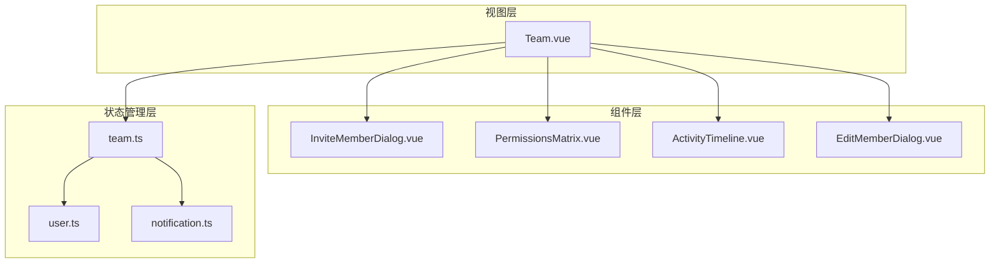
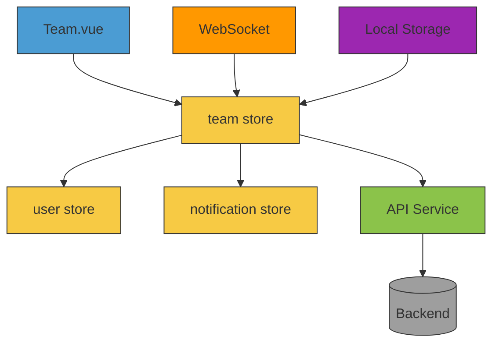
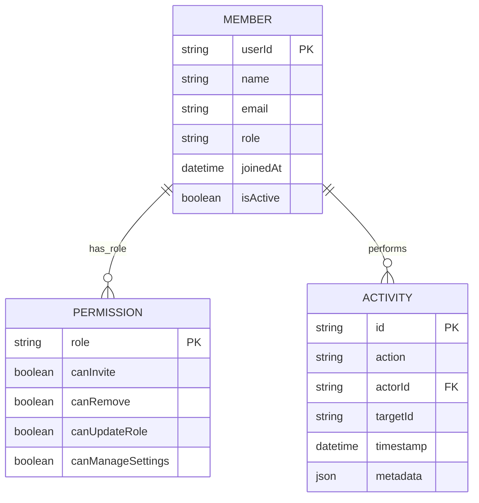
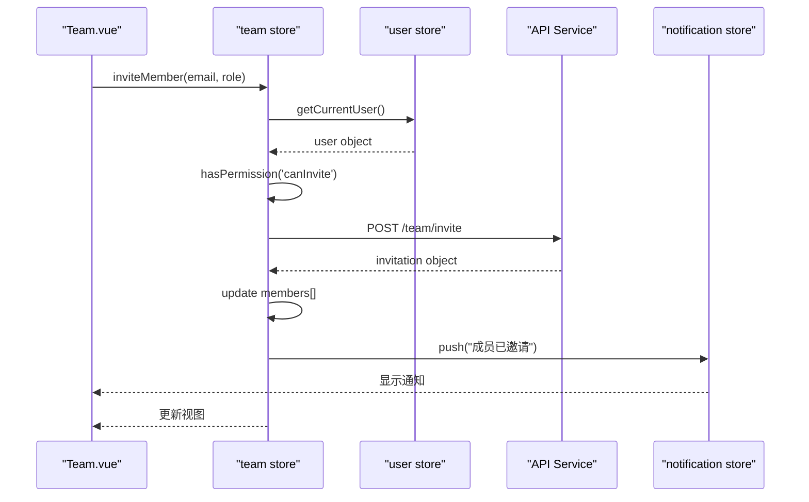
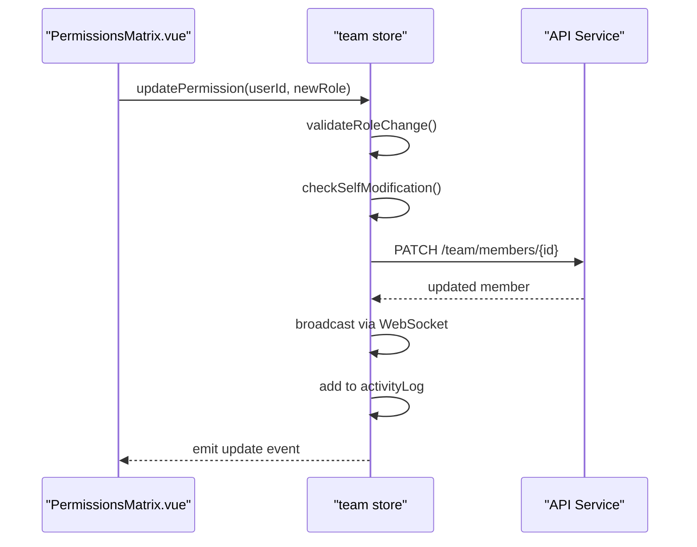
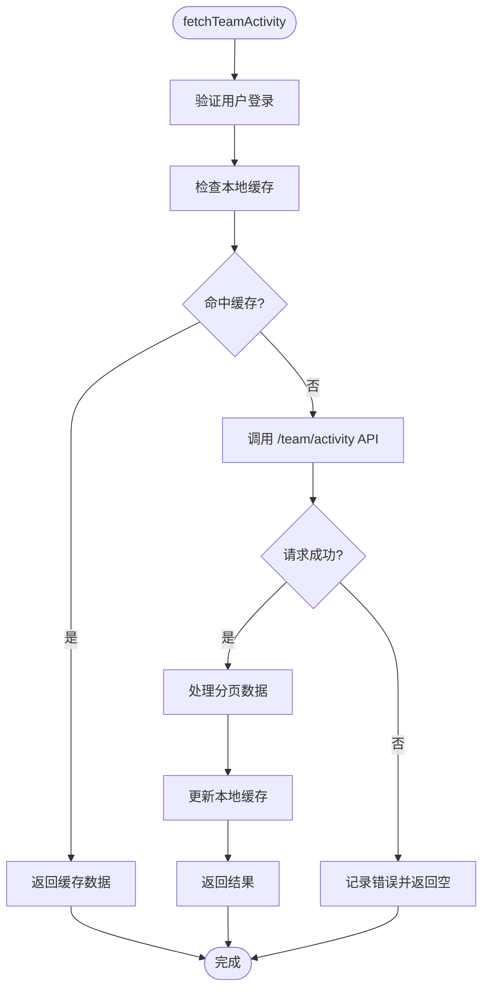
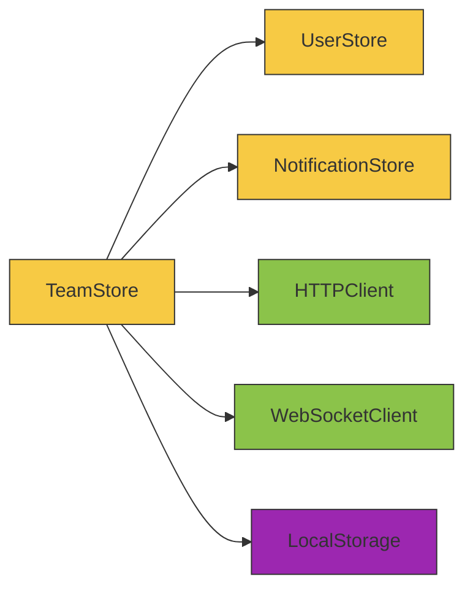

# 团队协作管理模块

<cite>
**本文档引用文件**  
- [team.ts](file://packages/web-pro/src/stores/team.ts)
- [user.ts](file://packages/web-pro/src/stores/user.ts)
- [notification.ts](file://packages/web-pro/src/stores/notification.ts)
- [Team.vue](file://packages/web-pro/src/pages/Team.vue)
- [index.ts](file://packages/shared/types/index.ts)
- [InviteMemberDialog.vue](file://packages/web-pro/src/components/team/InviteMemberDialog.vue)
- [PermissionsMatrix.vue](file://packages/web-pro/src/components/team/PermissionsMatrix.vue)
- [ActivityTimeline.vue](file://packages/web-pro/src/components/team/ActivityTimeline.vue)
</cite>

## 目录
1. [简介](#简介)
2. [项目结构](#项目结构)
3. [核心组件](#核心组件)
4. [架构概览](#架构概览)
5. [详细组件分析](#详细组件分析)
6. [依赖分析](#依赖分析)
7. [性能考量](#性能考量)
8. [故障排查指南](#故障排查指南)
9. [结论](#结论)

## 简介
本模块为团队协作管理核心，提供成员管理、权限控制、操作审计与实时通知机制。通过 `team store` 统一维护团队状态，与 `user store` 联动实现身份认证与角色校验，并通过 `notification store` 推送团队事件。支持大规模团队场景下的高效数据同步与离线处理。

## 项目结构
团队管理功能集中于 `web-pro` 包中，主要包含视图、组件与状态管理三部分：

**Diagram sources**  
- [Team.vue](file://packages/web-pro/src/pages/Team.vue)
- [team.ts](file://packages/web-pro/src/stores/team.ts)
- [user.ts](file://packages/web-pro/src/stores/user.ts)
- [notification.ts](file://packages/web-pro/src/stores/notification.ts)

**Section sources**  
- [Team.vue](file://packages/web-pro/src/pages/Team.vue)
- [team.ts](file://packages/web-pro/src/stores/team.ts)

## 核心组件
`team store` 是团队管理的核心，维护以下关键状态字段：
- `members`: 成员列表，包含用户ID、角色、加入时间等
- `permissions`: 权限矩阵，定义角色与操作的映射关系
- `activityLog`: 操作审计日志，记录团队内关键事件
- `pendingInvitations`: 待处理的邀请列表

相关操作包括 `inviteMember`、`updatePermission`、`fetchTeamActivity` 等，均包含完整的权限校验逻辑。

**Section sources**  
- [team.ts](file://packages/web-pro/src/stores/team.ts#L15-L80)

## 架构概览
系统采用分层架构，实现关注点分离与职责清晰：

**Diagram sources**  
- [team.ts](file://packages/web-pro/src/stores/team.ts#L10-L50)
- [user.ts](file://packages/web-pro/src/stores/user.ts#L20-L40)
- [notification.ts](file://packages/web-pro/src/stores/notification.ts#L15-L35)

## 详细组件分析

### 团队状态模型分析
`team store` 中的数据模型定义了团队协作的基础结构。

#### 数据模型定义

**Diagram sources**  
- [team.ts](file://packages/web-pro/src/stores/team.ts#L25-L60)
- [index.ts](file://packages/shared/types/index.ts#L5-L20)

### 操作逻辑与权限校验分析
关键操作方法的实现逻辑与权限控制机制。

#### 邀请成员流程

**Diagram sources**  
- [team.ts](file://packages/web-pro/src/stores/team.ts#L85-L120)
- [InviteMemberDialog.vue](file://packages/web-pro/src/components/team/InviteMemberDialog.vue#L30-L60)

#### 权限更新流程

**Diagram sources**  
- [team.ts](file://packages/web-pro/src/stores/team.ts#L130-L160)
- [PermissionsMatrix.vue](file://packages/web-pro/src/components/team/PermissionsMatrix.vue#L45-L75)

#### 活动日志查询流程

**Diagram sources**  
- [team.ts](file://packages/web-pro/src/stores/team.ts#L170-L200)
- [ActivityTimeline.vue](file://packages/web-pro/src/components/team/ActivityTimeline.vue#L20-L50)

## 依赖分析
团队模块与其他核心模块存在紧密协作关系：

**Diagram sources**  
- [team.ts](file://packages/web-pro/src/stores/team.ts#L5-L10)
- [user.ts](file://packages/web-pro/src/stores/user.ts#L5-L10)
- [notification.ts](file://packages/web-pro/src/stores/notification.ts#L5-L10)

**Section sources**  
- [team.ts](file://packages/web-pro/src/stores/team.ts#L1-L100)
- [user.ts](file://packages/web-pro/src/stores/user.ts#L1-L80)
- [notification.ts](file://packages/web-pro/src/stores/notification.ts#L1-L60)

## 性能考量
针对大规模团队场景，系统采用以下优化策略：

### 分页加载机制
- 活动日志默认分页大小为20条
- 成员列表支持滚动加载（每页50人）
- 初始加载仅获取活跃成员

### 懒加载策略
- 权限矩阵在对话框打开时才加载完整数据
- 历史邀请记录按需查询
- 成员详细信息点击后异步加载

### 数据同步策略
- 使用WebSocket实现实时更新
- 离线状态下操作暂存本地队列
- 网络恢复后自动重试同步
- 本地状态与服务器最终一致性保证

**Section sources**  
- [team.ts](file://packages/web-pro/src/stores/team.ts#L200-L250)
- [ActivityTimeline.vue](file://packages/web-pro/src/components/team/ActivityTimeline.vue#L60-L90)

## 故障排查指南
常见问题及解决方案：

### 成员邀请失败
- 检查当前用户是否具有 `canInvite` 权限
- 确认目标邮箱未达到邀请频率限制
- 验证网络连接状态

### 权限更新无反应
- 检查是否尝试修改自身权限（需特殊处理）
- 查看浏览器控制台是否有API错误
- 确认WebSocket连接正常

### 活动日志不同步
- 检查WebSocket连接状态
- 尝试手动刷新日志
- 查看本地缓存是否异常

**Section sources**  
- [team.ts](file://packages/web-pro/src/stores/team.ts#L250-L300)
- [notification.ts](file://packages/web-pro/src/stores/notification.ts#L40-L70)

## 结论
团队协作管理模块通过清晰的状态管理、严格的权限校验与高效的同步机制，实现了安全可靠的团队协作功能。与用户系统和通知系统的深度集成，确保了身份一致性与操作可见性。针对大规模场景的分页与懒加载设计，保障了系统性能与用户体验。