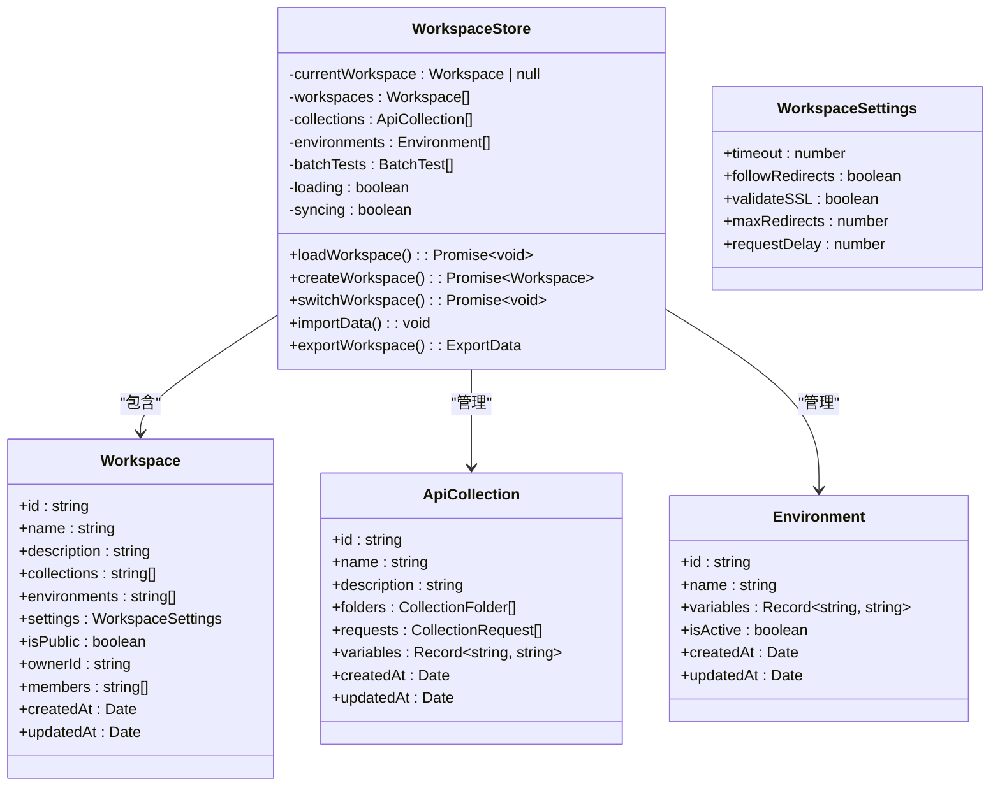
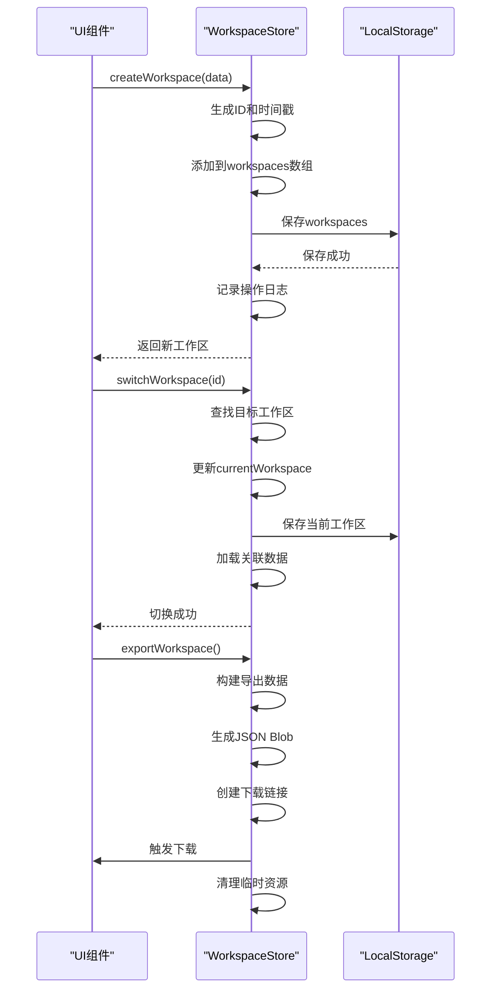
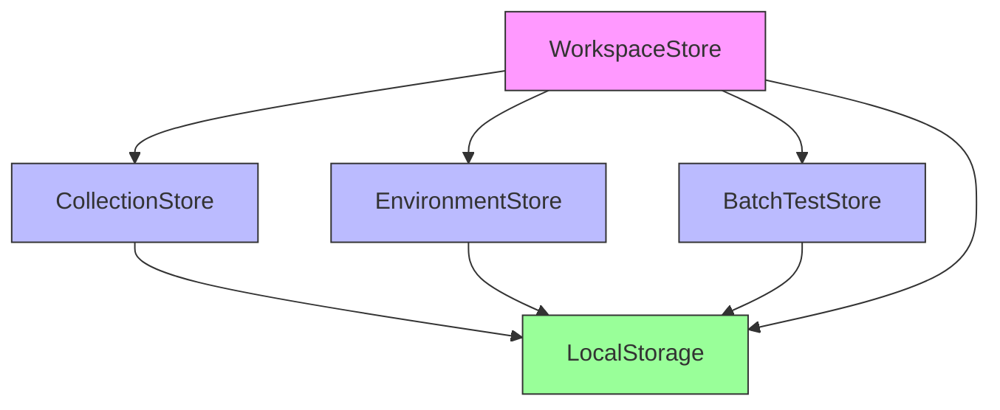
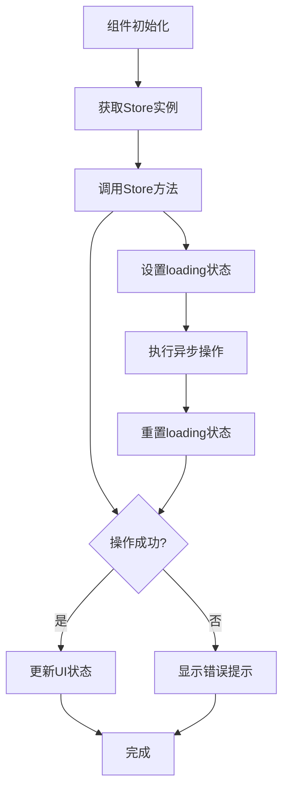
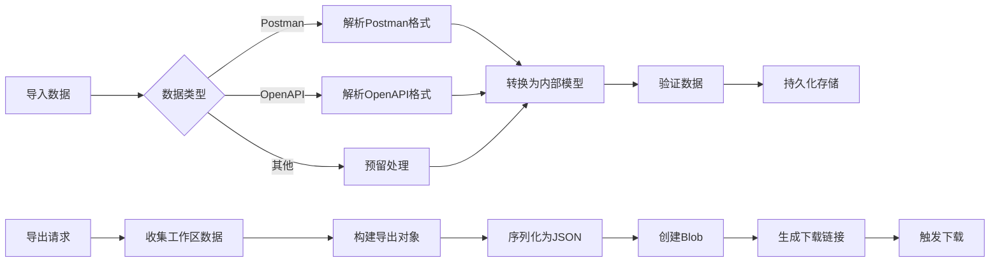

# 工作区管理模块

<cite>
**本文档引用的文件**
- [workspace.ts](file://packages/web-full/src/stores/workspace.ts)
- [WorkspaceManagement.vue](file://packages/web-full/src/pages/WorkspaceManagement.vue)
- [index.ts](file://packages/shared/types/index.ts)
- [formatter.ts](file://packages/shared/utils/formatter.ts)
- [collection.ts](file://packages/web-full/src/stores/collection.ts)
- [environment.ts](file://packages/web-full/src/stores/environment.ts)
</cite>

## 目录
1. [架构设计与状态管理](#架构设计与状态管理)
2. [核心操作方法实现](#核心操作方法实现)
3. [跨Store数据协调机制](#跨store数据协调机制)
4. [UI层调用模式](#ui层调用模式)
5. [数据导入导出流程](#数据导入导出流程)
6. [性能优化建议](#性能优化建议)

## 架构设计与状态管理

工作区管理模块采用Pinia状态管理模式，通过`useWorkspaceStore`定义全局工作区状态。该模块负责维护工作区相关的核心状态字段，包括当前工作区、工作区列表、集合、环境等数据。

状态字段定义与约束条件如下：
- `currentWorkspace`：当前激活的工作区对象，类型为`Workspace`，初始值为`null`
- `workspaces`：工作区列表数组，类型为`Workspace[]`，存储用户拥有的所有工作区
- `collections`：API集合列表，类型为`ApiCollection[]`，与当前工作区关联
- `environments`：环境配置列表，类型为`Environment[]`，支持多环境管理
- `batchTests`：批量测试配置列表，类型为`BatchTest[]`
- `loading`：加载状态标志，类型为`boolean`，用于UI加载指示
- `syncing`：同步状态标志，类型为`boolean`，表示数据同步进行中

工作区状态通过`localStorage`实现持久化存储，确保用户刷新页面后仍能保持当前状态。状态更新采用响应式设计，通过`watch`监听器自动保存变更到本地存储。

**图示来源**
- [workspace.ts](file://packages/web-full/src/stores/workspace.ts#L1-L810)
- [index.ts](file://packages/shared/types/index.ts#L0-L991)

**本节来源**
- [workspace.ts](file://packages/web-full/src/stores/workspace.ts#L1-L810)
- [index.ts](file://packages/shared/types/index.ts#L0-L991)

## 核心操作方法实现

工作区管理模块提供了完整的CRUD操作接口，涵盖创建工作区、切换工作区、数据导入导出等核心功能。

### 创建工作区

`createWorkspace`方法用于创建新的工作区，实现逻辑如下：
1. 接收工作区基础信息作为参数
2. 生成唯一ID和时间戳
3. 将新工作区添加到工作区列表
4. 持久化存储到`localStorage`
5. 记录操作日志
6. 显示成功提示

该方法采用事务处理机制，通过try-catch捕获异常，确保操作的原子性。在发生错误时会抛出异常并显示错误提示，保证数据一致性。

### 切换工作区

`switchWorkspace`方法实现工作区上下文切换：
1. 根据ID查找目标工作区
2. 更新`currentWorkspace`状态
3. 持久化当前工作区到存储
4. 重新加载关联数据（集合、环境、批量测试）
5. 记录切换日志
6. 显示切换成功提示

### 数据导入

`importData`方法支持多种格式的数据导入，采用策略模式处理不同类型的导入请求：
- Postman格式：解析Postman集合结构，转换为内部集合模型
- OpenAPI格式：解析OpenAPI文档，生成对应的API请求
- 其他格式：预留扩展点，支持未来新增导入类型

导入过程包含完整的错误处理机制，确保异常情况下不会破坏现有数据。

### 数据导出

`exportWorkspace`方法实现工作区数据导出功能：
1. 构建包含工作区、集合、环境等数据的导出对象
2. 生成JSON格式的Blob数据
3. 创建临时下载链接
4. 触发浏览器下载
5. 清理临时资源

导出过程确保数据完整性，包含版本信息和导出时间戳。

**图示来源**
- [workspace.ts](file://packages/web-full/src/stores/workspace.ts#L1-L810)

**本节来源**
- [workspace.ts](file://packages/web-full/src/stores/workspace.ts#L1-L810)

## 跨Store数据协调机制

工作区管理模块与其他Store模块（如collection、environment）通过依赖注入和事件驱动机制实现数据隔离与上下文切换。

### 数据隔离设计

各Store模块保持独立的状态管理：
- `collectionStore`：管理API集合相关状态
- `environmentStore`：管理环境配置相关状态
- `workspaceStore`：管理工作区相关状态

这种设计确保了模块间的低耦合性，每个Store只关注自身领域的状态管理。

### 上下文切换协调

当工作区切换时，通过以下机制协调数据同步：
1. `workspaceStore`触发`switchWorkspace`操作
2. 更新`currentWorkspace`状态
3. 通知相关Store加载新工作区数据
4. 各Store根据新工作区ID加载关联数据

这种协调机制确保了工作区切换时，所有相关数据都能正确更新，保持应用状态的一致性。

### 依赖关系

工作区Store通过`useCollectionStore`和`useEnvironmentStore`等方法注入其他Store实例，建立依赖关系。这种设计模式实现了：
- 依赖反转：高层模块不直接依赖低层模块
- 控制反转：依赖关系由容器管理
- 松耦合：模块间通过接口交互

**图示来源**
- [workspace.ts](file://packages/web-full/src/stores/workspace.ts#L1-L810)
- [collection.ts](file://packages/web-full/src/stores/collection.ts#L1-L809)
- [environment.ts](file://packages/web-full/src/stores/environment.ts#L1-L1025)

**本节来源**
- [workspace.ts](file://packages/web-full/src/stores/workspace.ts#L1-L810)
- [collection.ts](file://packages/web-full/src/stores/collection.ts#L1-L809)
- [environment.ts](file://packages/web-full/src/stores/environment.ts#L1-L1025)

## UI层调用模式

在UI层（如WorkspaceManagement.vue）中调用工作区Store的标准模式遵循Vue 3 Composition API的最佳实践。

### 异步操作管理

UI组件通过以下方式管理异步操作的loading状态：
1. 定义loading状态变量（如`creating`、`updating`）
2. 在异步操作开始时设置为`true`
3. 在`finally`块中重置为`false`
4. 在模板中绑定loading状态到UI元素

这种模式确保了用户界面的响应性，提供了良好的用户体验。

### 错误回滚策略

采用分层错误处理机制：
- **UI层**：捕获异常，显示用户友好的错误提示
- **Store层**：记录详细错误日志，执行事务回滚
- **全局层**：统一错误处理，确保应用稳定性

错误处理遵循"fail fast"原则，在检测到错误时立即终止操作，防止数据不一致。

### 标准调用示例

**图示来源**
- [WorkspaceManagement.vue](file://packages/web-full/src/pages/WorkspaceManagement.vue#L0-L1033)

**本节来源**
- [WorkspaceManagement.vue](file://packages/web-full/src/pages/WorkspaceManagement.vue#L0-L1033)

## 数据导入导出流程

工作区数据导入导出涉及完整的序列化/反序列化流程，与shared utils中的formatter工具紧密集成。

### 序列化流程

导出时的序列化步骤：
1. 收集工作区、集合、环境等数据
2. 构建`ExportData`对象
3. 使用`JSON.stringify`序列化为JSON字符串
4. 创建Blob对象
5. 生成下载链接

### 反序列化流程

导入时的反序列化步骤：
1. 解析导入数据
2. 根据类型分发处理
3. 验证数据完整性
4. 转换为内部数据模型
5. 持久化到存储

### Formatter工具集成

与`formatter.ts`工具的集成方式：
- 使用`formatJson`方法格式化导出的JSON数据
- 使用`formatTimestamp`方法处理时间戳
- 使用`formatFileSize`方法显示文件大小信息

这种集成确保了数据格式的一致性和可读性。

**图示来源**
- [workspace.ts](file://packages/web-full/src/stores/workspace.ts#L1-L810)
- [formatter.ts](file://packages/shared/utils/formatter.ts#L0-L54)

**本节来源**
- [workspace.ts](file://packages/web-full/src/stores/workspace.ts#L1-L810)
- [formatter.ts](file://packages/shared/utils/formatter.ts#L0-L54)

## 性能优化建议

针对大数据量迁移场景，提出以下性能优化建议：

### 批量操作优化

1. **批量持久化**：减少`localStorage`写入次数，采用批量保存策略
2. **延迟保存**：使用防抖技术，避免频繁保存
3. **增量同步**：只同步变更的数据，减少数据传输量

### 内存管理

1. **数据分页**：对大型集合和环境数据进行分页加载
2. **懒加载**：按需加载非关键数据
3. **缓存策略**：合理使用内存缓存，避免重复计算

### 导入导出优化

1. **流式处理**：对大型文件采用流式处理，避免内存溢出
2. **进度反馈**：提供导入导出进度指示，提升用户体验
3. **后台处理**：将耗时操作移至Web Worker，避免阻塞UI线程

### 索引优化

1. **建立索引**：对常用查询字段建立索引
2. **预计算**：预先计算常用聚合数据
3. **缓存查询结果**：避免重复查询相同数据

这些优化建议可显著提升大数据量场景下的系统性能和用户体验。

**本节来源**
- [workspace.ts](file://packages/web-full/src/stores/workspace.ts#L1-L810)
- [collection.ts](file://packages/web-full/src/stores/collection.ts#L1-L809)
- [environment.ts](file://packages/web-full/src/stores/environment.ts#L1-L1025)