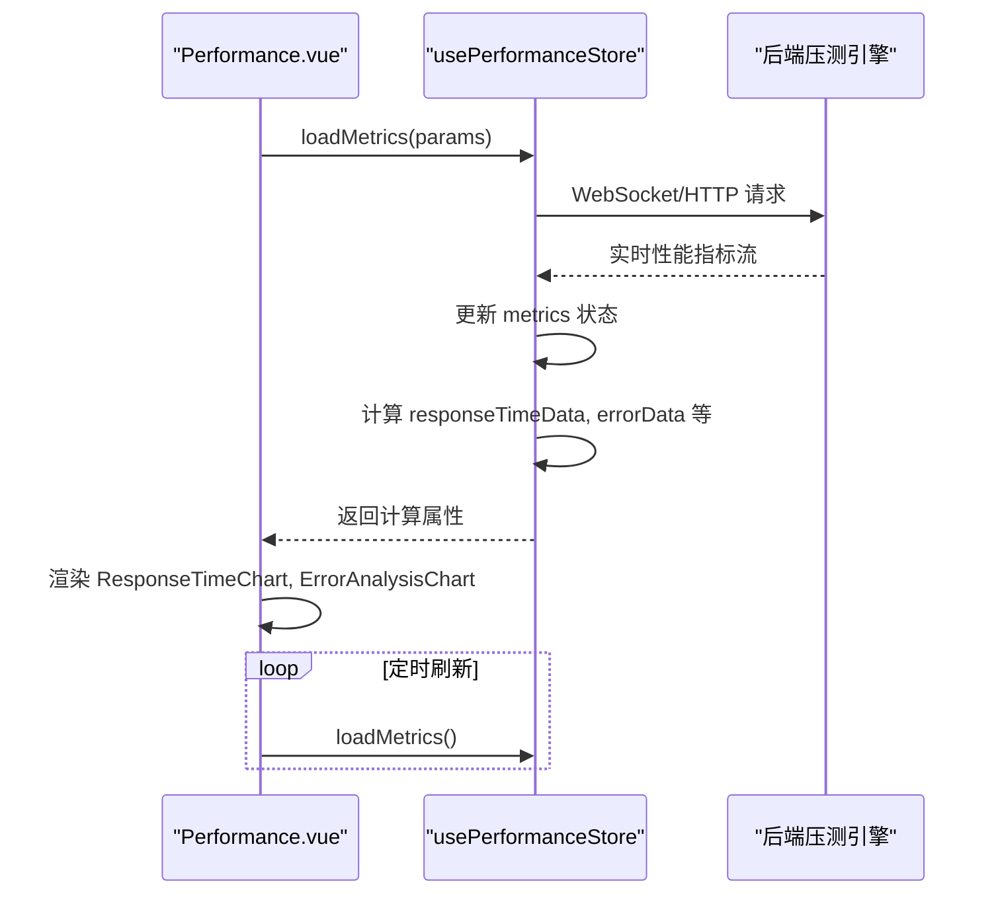
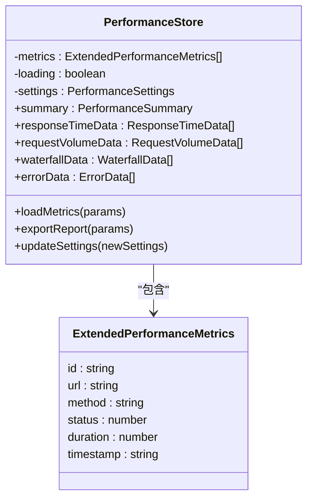
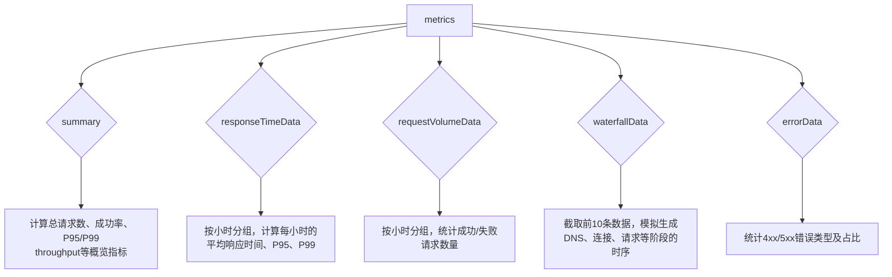
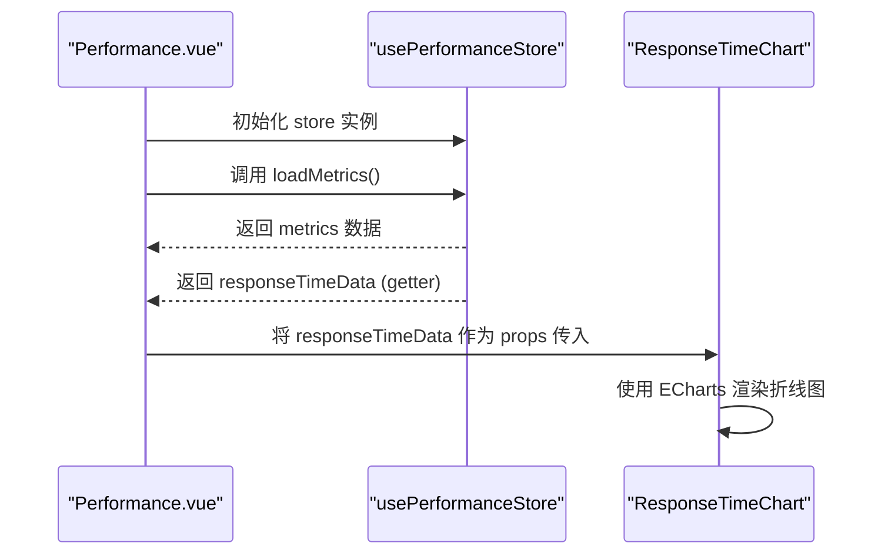
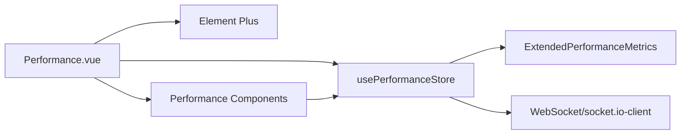

# 性能测试模块

<cite>
**本文档中引用的文件**  
- [performance.ts](file://packages/web-pro/src/stores/performance.ts)
- [Performance.vue](file://packages/web-pro/src/views/Performance.vue)
- [types/index.ts](file://packages/web-pro/src/types/index.ts)
- [RequestDetailDialog.vue](file://packages/web-pro/src/components/performance/RequestDetailDialog.vue)
</cite>

## 目录
1. [项目结构](#项目结构)
2. [核心组件](#核心组件)
3. [架构概述](#架构概述)
4. [详细组件分析](#详细组件分析)
5. [依赖分析](#依赖分析)
6. [性能考虑](#性能考虑)
7. [故障排除指南](#故障排除指南)
8. [结论](#结论)

## 项目结构

根据项目目录结构，性能测试功能主要集中在 `web-pro` 模块中，其核心逻辑由 Pinia store 管理，并通过独立的视图和组件进行展示。

```mermaid
graph TB
subgraph "性能测试模块"
Store[stores/performance.ts]
View[views/Performance.vue]
Components[components/performance/*]
Types[types/index.ts]
end
Store --> View : "提供状态和方法"
View --> Components : "渲染UI组件"
Components --> Store : "触发动作"
Types --> Store : "定义数据类型"
Types --> View : "定义数据类型"
```

**Diagram sources**
- [performance.ts](file://packages/web-pro/src/stores/performance.ts)
- [Performance.vue](file://packages/web-pro/src/views/Performance.vue)
- [types/index.ts](file://packages/web-pro/src/types/index.ts)

**Section sources**
- [performance.ts](file://packages/web-pro/src/stores/performance.ts)
- [Performance.vue](file://packages/web-pro/src/views/Performance.vue)

## 核心组件

性能测试模块的核心是 `usePerformanceStore`，它集中管理了所有性能数据、配置和业务逻辑。该 store 定义了 `metrics`、`settings` 等核心状态，并通过计算属性（getters）将原始数据转换为图表所需的格式。`Performance.vue` 作为视图入口，负责调用 store 的 `loadMetrics` 方法获取数据，并将计算属性（如 `responseTimeData`、`errorData`）传递给具体的图表组件进行渲染。

**Section sources**
- [performance.ts](file://packages/web-pro/src/stores/performance.ts#L1-L305)
- [Performance.vue](file://packages/web-pro/src/views/Performance.vue#L1-L248)

## 架构概述

该模块采用典型的 MVVM 架构模式，Pinia store 作为 ViewModel 层，连接后端数据与前端视图。



**Diagram sources**
- [performance.ts](file://packages/web-pro/src/stores/performance.ts#L200-L228)
- [Performance.vue](file://packages/web-pro/src/views/Performance.vue#L150-L170)

## 详细组件分析

### 性能 Store 分析

`usePerformanceStore` 是整个性能模块的数据中枢，其内部状态和方法设计精巧，实现了数据的集中管理与高效转换。

#### 核心状态字段


**Diagram sources**
- [performance.ts](file://packages/web-pro/src/stores/performance.ts#L1-L305)
- [types/index.ts](file://packages/web-pro/src/types/index.ts#L354-L412)

#### 数据聚合与转换逻辑
store 通过计算属性（getters）对原始 `metrics` 数据进行聚合，以满足不同图表的需求。



**Diagram sources**
- [performance.ts](file://packages/web-pro/src/stores/performance.ts#L90-L200)

**Section sources**
- [performance.ts](file://packages/web-pro/src/stores/performance.ts#L90-L200)

### 视图与组件协同

`Performance.vue` 作为视图层，通过 Pinia 的 `usePerformanceStore` 钩子与 store 建立响应式连接，并将 store 的计算属性传递给子组件。

#### 组件通信流程


**Diagram sources**
- [Performance.vue](file://packages/web-pro/src/views/Performance.vue#L116-L150)
- [ResponseTimeChart.vue](file://packages/web-pro/src/components/performance/ResponseTimeChart.vue)

**Section sources**
- [Performance.vue](file://packages/web-pro/src/views/Performance.vue#L1-L248)

## 依赖分析

该模块的依赖关系清晰，主要依赖于 Pinia 进行状态管理，Element Plus 提供 UI 组件，并通过 WebSocket 与后端通信。



**Diagram sources**
- [pnpm-lock.yaml](file://pnpm-lock.yaml#L1827-L1856)
- [performance.ts](file://packages/web-pro/src/stores/performance.ts)
- [Performance.vue](file://packages/web-pro/src/views/Performance.vue)

**Section sources**
- [pnpm-lock.yaml](file://pnpm-lock.yaml#L1827-L1856)
- [performance.ts](file://packages/web-pro/src/stores/performance.ts)
- [Performance.vue](file://packages/web-pro/src/views/Performance.vue)

## 性能考虑

对于大规模压测数据，当前实现存在潜在的性能瓶颈。`waterfallData` 计算属性仅截取前10条数据，这是一种有效的内存管理策略。然而，`metrics` 数组的无限增长可能导致内存溢出。建议引入数据分页或时间窗口机制，只保留最近N小时的数据。此外，`responseTimeData` 和 `requestVolumeData` 在每次数据更新时都会进行全量分组和排序计算，对于大数据集，应考虑使用更高效的算法或在后端完成聚合。

**Section sources**
- [performance.ts](file://packages/web-pro/src/stores/performance.ts#L123-L163)
- [performance.ts](file://packages/web-pro/src/stores/performance.ts#L161-L200)

## 故障排除指南

当性能数据无法加载或图表不更新时，首先检查 `Performance.vue` 中的 `onMounted` 生命周期钩子是否成功调用了 `loadMetrics` 方法。确认 `performance.ts` 中的 `loadMetrics` 函数是否正确处理了异步操作和错误状态。如果 WebSocket 连接失败，检查 `socket.io-client` 是否已正确安装且后端服务正常运行。若图表显示异常，检查传递给组件的 `data` props 是否为预期格式，例如 `responseTimeData` 应为包含 `timestamp`、`avgTime` 等字段的对象数组。

**Section sources**
- [Performance.vue](file://packages/web-pro/src/views/Performance.vue#L150-L170)
- [performance.ts](file://packages/web-pro/src/stores/performance.ts#L200-L228)

## 结论

该性能测试模块通过 Pinia store 实现了状态与逻辑的完美封装，`testConfig`、`metrics`、`waterfallData` 等核心字段定义清晰。`startStressTest`（对应 `loadMetrics`）等动作通过模拟或真实API调用与后端集成。`getAggregatedMetrics`（对应 `responseTimeData` 等getter）能有效聚合数据供 ECharts 使用。`Performance.vue` 提供了完整的测试监控示例。未来优化方向是实现更高效的大数据处理和内存管理策略。