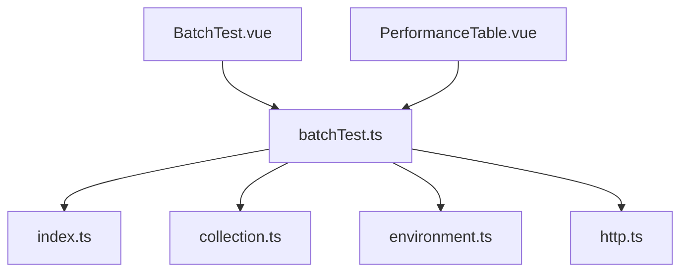
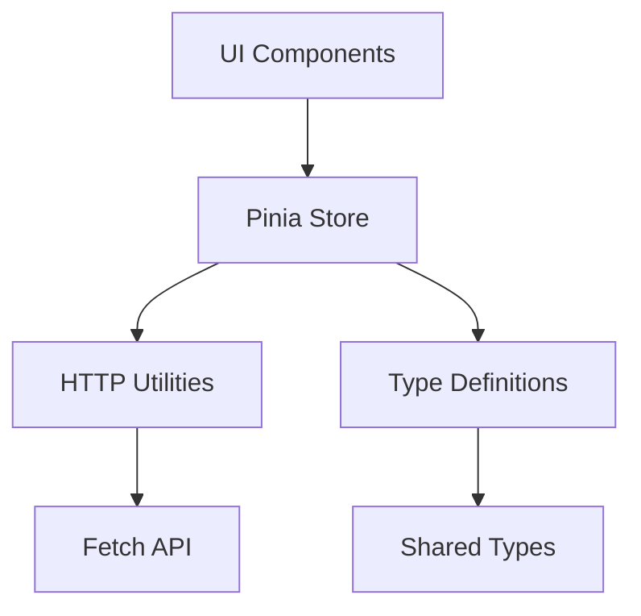
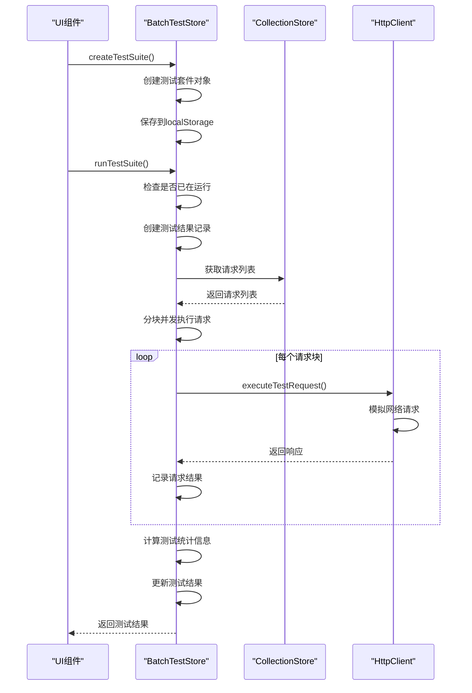
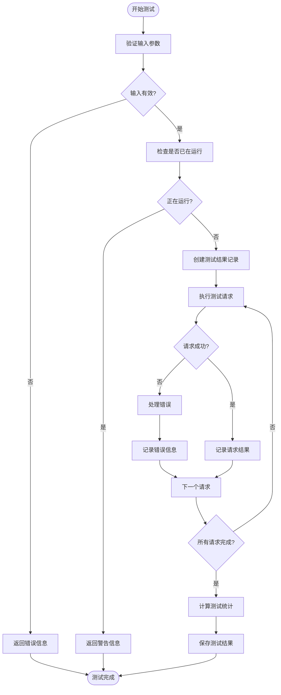
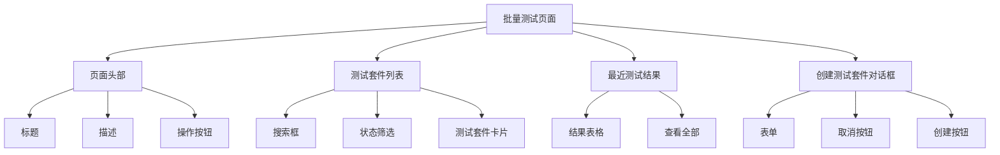
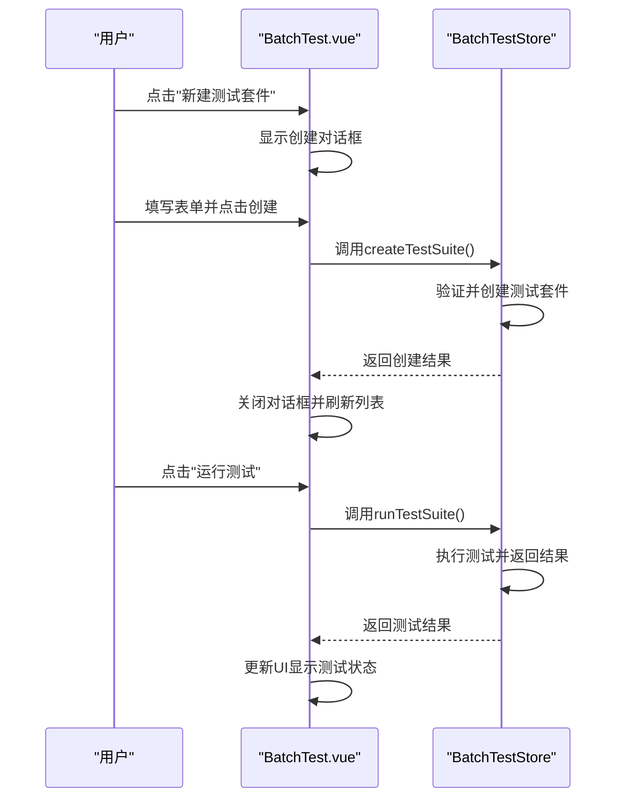
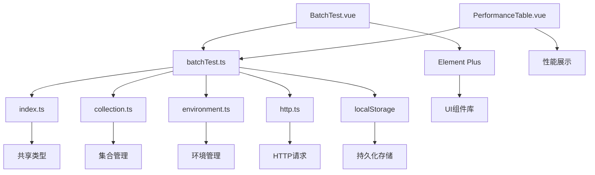

# 批量测试管理模块

<cite>
**本文档引用的文件**  
- [batchTest.ts](file://packages/web-full/src/stores/batchTest.ts)
- [BatchTest.vue](file://packages/web-full/src/pages/BatchTest.vue)
- [index.ts](file://packages/shared/types/index.ts)
- [collection.ts](file://packages/web-full/src/stores/collection.ts)
- [environment.ts](file://packages/web-full/src/stores/environment.ts)
- [PerformanceTable.vue](file://packages/web-pro/src/components/performance/PerformanceTable.vue)
- [http.ts](file://packages/shared/utils/http.ts)
</cite>

## 目录
1. [简介](#简介)
2. [项目结构](#项目结构)
3. [核心组件](#核心组件)
4. [架构概览](#架构概览)
5. [详细组件分析](#详细组件分析)
6. [依赖分析](#依赖分析)
7. [性能考量](#性能考量)
8. [故障排除指南](#故障排除指南)
9. [结论](#结论)

## 简介
批量测试管理模块是在线接口调试工具中的核心功能之一，用于创建、管理和执行API测试套件。该模块通过Pinia状态管理库实现，支持测试套件的创建、运行、停止、导入和导出等操作。它与集合(store)、环境(store)等模块紧密集成，能够从集合中获取待测接口列表，并通过HTTP工具发起并发请求。测试结果以结构化方式存储，并可通过PerformanceTable等组件进行可视化展示。本模块特别适用于高并发场景下的接口性能测试和自动化回归测试。

## 项目结构
批量测试管理模块主要由以下几个文件构成：
- `batchTest.ts`：定义了批量测试的核心状态和逻辑
- `BatchTest.vue`：批量测试的主页面组件
- `index.ts`：共享类型定义
- `collection.ts`：集合管理store
- `environment.ts`：环境管理store
- `PerformanceTable.vue`：性能结果展示组件
- `http.ts`：HTTP请求工具



**图表来源**  
- [batchTest.ts](file://packages/web-full/src/stores/batchTest.ts)
- [BatchTest.vue](file://packages/web-full/src/pages/BatchTest.vue)
- [index.ts](file://packages/shared/types/index.ts)
- [collection.ts](file://packages/web-full/src/stores/collection.ts)
- [environment.ts](file://packages/web-full/src/stores/environment.ts)
- [PerformanceTable.vue](file://packages/web-pro/src/components/performance/PerformanceTable.vue)
- [http.ts](file://packages/shared/utils/http.ts)

**章节来源**
- [batchTest.ts](file://packages/web-full/src/stores/batchTest.ts)
- [BatchTest.vue](file://packages/web-full/src/pages/BatchTest.vue)

## 核心组件
批量测试管理模块的核心是`useBatchTestStore`，它定义了测试套件、测试结果、运行状态等关键状态。该store提供了创建测试套件、运行测试、停止测试、导入导出等功能。测试执行过程中，会根据配置的并发数和延迟时间调度请求，并记录每个请求的响应时间、成功率等指标。测试完成后，会生成详细的测试报告，包括总请求数、通过数、失败数、平均响应时间等统计信息。

**章节来源**
- [batchTest.ts](file://packages/web-full/src/stores/batchTest.ts)

## 架构概览
批量测试管理模块采用分层架构设计，上层为UI组件，中层为状态管理store，底层为工具类和类型定义。UI组件通过调用store的方法来触发测试操作，store负责管理测试状态和执行逻辑，工具类提供HTTP请求等基础功能。这种架构使得业务逻辑与UI分离，提高了代码的可维护性和可测试性。



**图表来源**  
- [batchTest.ts](file://packages/web-full/src/stores/batchTest.ts)
- [BatchTest.vue](file://packages/web-full/src/pages/BatchTest.vue)
- [http.ts](file://packages/shared/utils/http.ts)
- [index.ts](file://packages/shared/types/index.ts)

## 详细组件分析

### 批量测试Store分析
批量测试Store是整个模块的核心，负责管理所有与批量测试相关的状态和逻辑。

#### 状态定义
```mermaid
classDiagram
class TestSuite {
+string id
+string name
+string description
+RequestConfig[] requests
+Date createdAt
+Date updatedAt
}
class TestResult {
+string id
+string suiteId
+string suiteName
+string status
+Date startTime
+Date endTime
+number duration
+number totalCount
+number passedCount
+number failedCount
+number skippedCount
+BatchTestResult[] results
+TestSummary summary
}
class TestSummary {
+number totalRequests
+number passedRequests
+number failedRequests
+number skippedRequests
+number totalTime
+number averageResponseTime
+number successRate
}
class TestSettings {
+number concurrency
+number delay
+number timeout
+number retries
+string environmentId
+Array<{ key : string; value : string }> variables
+boolean stopOnFailure
+boolean followRedirects
+boolean validateSSL
}
TestSuite --> TestResult : "has"
TestResult --> TestSummary : "has"
TestResult --> BatchTestResult : "contains"
TestSuite --> RequestConfig : "contains"
```

**图表来源**  
- [batchTest.ts](file://packages/web-full/src/stores/batchTest.ts)
- [index.ts](file://packages/shared/types/index.ts)

#### 方法调用流程


**图表来源**  
- [batchTest.ts](file://packages/web-full/src/stores/batchTest.ts)
- [collection.ts](file://packages/web-full/src/stores/collection.ts)
- [http.ts](file://packages/shared/utils/http.ts)

#### 异常处理机制


**图表来源**  
- [batchTest.ts](file://packages/web-full/src/stores/batchTest.ts)

**章节来源**
- [batchTest.ts](file://packages/web-full/src/stores/batchTest.ts)

### 批量测试页面分析
批量测试页面是用户与批量测试功能交互的主要界面，提供了测试套件的创建、运行、查看等功能。

#### 页面结构


**图表来源**  
- [BatchTest.vue](file://packages/web-full/src/pages/BatchTest.vue)

#### 组件交互流程


**图表来源**  
- [BatchTest.vue](file://packages/web-full/src/pages/BatchTest.vue)
- [batchTest.ts](file://packages/web-full/src/stores/batchTest.ts)

**章节来源**
- [BatchTest.vue](file://packages/web-full/src/pages/BatchTest.vue)

## 依赖分析
批量测试管理模块依赖于多个其他模块和工具类，形成了一个完整的功能体系。



**图表来源**  
- [batchTest.ts](file://packages/web-full/src/stores/batchTest.ts)
- [BatchTest.vue](file://packages/web-full/src/pages/BatchTest.vue)
- [index.ts](file://packages/shared/types/index.ts)
- [collection.ts](file://packages/web-full/src/stores/collection.ts)
- [environment.ts](file://packages/web-full/src/stores/environment.ts)
- [http.ts](file://packages/shared/utils/http.ts)
- [PerformanceTable.vue](file://packages/web-pro/src/components/performance/PerformanceTable.vue)

**章节来源**
- [batchTest.ts](file://packages/web-full/src/stores/batchTest.ts)
- [BatchTest.vue](file://packages/web-full/src/pages/BatchTest.vue)

## 性能考量
在高并发测试场景下，批量测试管理模块可能面临内存占用和响应延迟的问题。为优化性能，建议采取以下措施：

1. **限制并发数**：通过`concurrency`参数控制同时执行的请求数量，避免过多的并发请求导致浏览器内存溢出。
2. **分批执行**：将大量请求分成多个批次执行，每批之间添加适当的延迟，以减轻系统压力。
3. **结果分页**：对于大量测试结果，采用分页显示的方式，避免一次性渲染过多DOM元素。
4. **内存清理**：定期清理过期的测试结果，避免localStorage无限增长。
5. **异步处理**：使用Web Worker将耗时的计算任务（如统计分析）移到后台线程执行，避免阻塞UI线程。
6. **懒加载**：对于不常用的组件（如详细的测试报告），采用懒加载的方式，减少初始加载时间。

**章节来源**
- [batchTest.ts](file://packages/web-full/src/stores/batchTest.ts)

## 故障排除指南
在使用批量测试管理模块时，可能会遇到以下常见问题：

1. **测试无法启动**：检查测试套件是否存在，以及是否已在运行中。
2. **请求超时**：增加`timeout`配置值，或检查网络连接是否正常。
3. **内存不足**：减少并发数，或分批执行测试。
4. **结果不准确**：检查请求配置是否正确，特别是URL和请求头。
5. **导入失败**：确保导入文件格式正确，且包含必要的字段。
6. **性能下降**：清理过期的测试结果，或优化测试用例。

**章节来源**
- [batchTest.ts](file://packages/web-full/src/stores/batchTest.ts)

## 结论
批量测试管理模块为在线接口调试工具提供了强大的自动化测试能力。通过合理的状态管理和组件设计，实现了测试套件的创建、运行、监控和结果分析全流程。该模块与集合、环境等模块紧密集成，能够灵活配置测试环境和请求参数。在高并发场景下，通过并发控制和分批执行策略，保证了系统的稳定性和性能。未来可以进一步优化测试结果的存储和查询效率，以及增强测试报告的可视化能力。