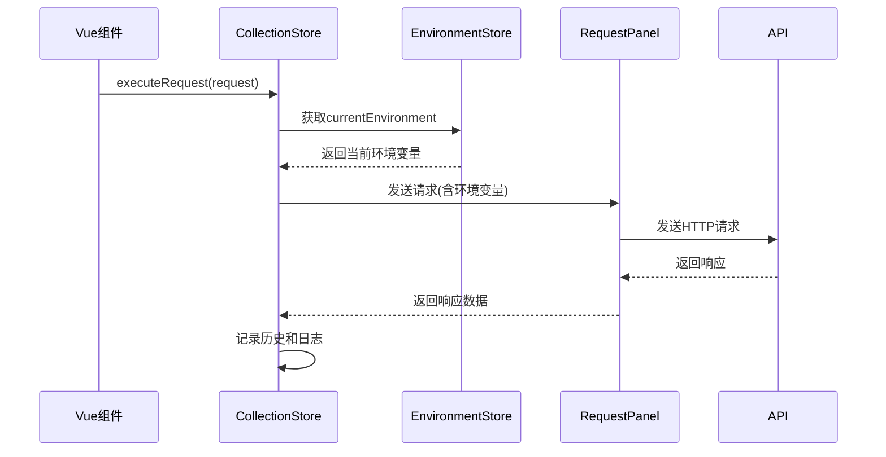
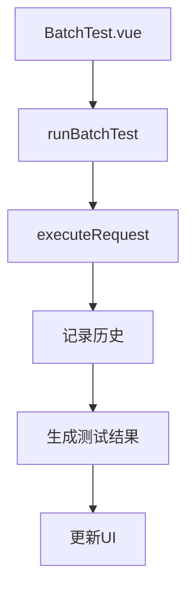

# 接口集合管理模块

<cite>
**本文档引用文件**  
- [collection.ts](file://packages/web-full/src/stores/collection.ts)
- [environment.ts](file://packages/web-full/src/stores/environment.ts)
- [index.ts](file://packages/shared/types/index.ts)
- [CollectionTree.vue](file://packages/web-full/src/components/CollectionTree.vue)
- [ApiDebugger.vue](file://packages/web-full/src/pages/ApiDebugger.vue)
- [RequestPanel.vue](file://packages/web-full/src/components/RequestPanel.vue)
- [BatchTest.vue](file://packages/web-full/src/pages/BatchTest.vue)
- [workspace.ts](file://packages/web-full/src/stores/workspace.ts)
</cite>

## 目录
1. [引言](#引言)
2. [集合Store状态结构](#集合store状态结构)
3. [核心Actions方法详解](#核心actions方法详解)
4. [Getters计算属性说明](#getters计算属性说明)
5. [与环境Store的协同工作机制](#与环境store的协同工作机制)
6. [批量测试与接口调试数据流](#批量测试与接口调试数据流)
7. [Vue组件中使用Store的完整示例](#vue组件中使用store的完整示例)
8. [持久化机制与错误处理策略](#持久化机制与错误处理策略)
9. [复杂操作最佳实践](#复杂操作最佳实践)
10. [总结](#总结)

## 引言

本文档详细阐述了Pinia中`collection store`的接口设计，涵盖其状态结构、操作方法、计算属性以及与其他模块的协同工作机制。该store作为接口集合管理的核心，负责维护API集合、请求、文件夹等数据的生命周期管理，支持创建、更新、删除、执行请求等核心功能，并与环境管理模块深度集成，实现变量注入和环境切换。文档还详细说明了在批量测试和接口调试场景下的数据调用流程，提供了在Vue组件中使用该store的完整示例，并描述了其本地持久化机制和错误处理策略。

**Section sources**
- [collection.ts](file://packages/web-full/src/stores/collection.ts#L1-L809)

## 集合Store状态结构

`collection store`的state结构设计用于管理接口集合及其相关数据，主要包含以下字段：

- **collections**: `ref<ApiCollection[]>` - 存储所有API集合的数组，是store的核心数据源。
- **currentCollection**: `ref<ApiCollection | null>` - 当前选中的集合，用于UI上下文。
- **currentRequest**: `ref<CollectionRequest | null>` - 当前正在编辑或执行的请求。
- **requestHistory**: `ref<HistoryRecord[]>` - 请求历史记录，用于快速访问最近执行的请求。
- **testResults**: `ref<SimpleTestResult[]>` - 临时存储单个请求的测试结果。
- **batchTestResults**: `ref<BatchTestResult[]>` - 存储批量测试的结果。
- **UI状态**: 包括`loading`、`testing`、`importing`、`exporting`等布尔值，用于控制UI加载状态。
- **搜索与过滤**: `searchQuery`、`selectedTags`、`selectedMethods`等字段，用于实现集合和请求的搜索过滤功能。

这些状态字段共同构成了接口集合管理的数据模型，支持复杂的用户交互和数据操作。

**Section sources**
- [collection.ts](file://packages/web-full/src/stores/collection.ts#L25-L50)

## 核心Actions方法详解

`collection store`提供了丰富的actions方法，用于操作集合、文件夹和请求。

### 集合管理方法

- **createCollection**: 创建新的API集合。接收一个不包含`id`、`createdAt`、`updatedAt`的`ApiCollection`对象，自动生成ID和时间戳，并将其添加到`collections`数组中，最后触发持久化保存。
- **updateCollection**: 更新指定ID的集合。通过`collectionId`查找集合，应用`updates`对象中的更改，并更新`updatedAt`时间戳。
- **deleteCollection**: 删除指定ID的集合。从`collections`数组中移除该集合，并清理其相关的请求历史记录。
- **duplicateCollection**: 复制指定ID的集合。创建一个新集合，其名称为原集合名称后加“（副本）”，并为所有请求生成新的ID。

### 文件夹与请求管理方法

- **createFolder**: 在指定集合中创建新文件夹。如果集合没有`folders`数组，则先初始化。
- **createRequest**: 在指定集合中创建新请求。将请求添加到集合的`requests`数组中。
- **updateRequest**: 更新指定集合中指定ID的请求。应用`updates`对象中的更改，并更新集合的`updatedAt`时间戳。
- **deleteRequest**: 从指定集合中删除指定ID的请求，并清理相关的历史记录。
- **toggleFavorite**: 切换请求的收藏状态（当前实现中`CollectionRequest`类型未包含`isFavorite`字段，此功能待实现）。

### 请求执行与批量测试

- **executeRequest**: 执行一个请求。该方法模拟了HTTP请求的发送过程，记录响应到`requestHistory`，并处理成功和失败的情况。
- **runBatchTest**: 执行批量测试。遍历传入的请求数组，依次调用`executeRequest`，收集测试结果，并生成汇总报告。

### 数据导入导出

- **importCollection**: 从Postman、OpenAPI或Insomnia等格式导入集合。根据`format`参数调用相应的解析函数。
- **exportCollection**: 将指定集合导出为Postman、OpenAPI或Insomnia等格式。

**Section sources**
- [collection.ts](file://packages/web-full/src/stores/collection.ts#L300-L700)

## Getters计算属性说明

`collection store`通过计算属性提供对数据的过滤和衍生视图。

- **filteredCollections**: 根据`searchQuery`对`collections`数组进行过滤。如果搜索查询不为空，则检查集合名称、描述以及其请求的名称和URL是否包含查询字符串。
- **filteredRequests**: 根据`searchQuery`和`selectedMethods`对当前集合的请求进行过滤。支持按HTTP方法（GET、POST等）进行筛选。
- **allTags**: 从所有请求中提取标签（当前实现为空，需根据实际需求实现标签提取逻辑）。
- **recentRequests**: 获取最近的10条请求历史记录，按时间倒序排列。
- **favoriteRequests**: 获取所有收藏的请求（当前实现为空，因`CollectionRequest`类型未包含`isFavorite`字段）。

这些计算属性使得UI可以根据用户的搜索和筛选条件动态更新显示内容。

**Section sources**
- [collection.ts](file://packages/web-full/src/stores/collection.ts#L150-L250)

## 与环境Store的协同工作机制

`collection store`与`environment store`通过`useEnvironmentStore`进行协同工作，实现环境变量的注入。



**Diagram sources**
- [collection.ts](file://packages/web-full/src/stores/collection.ts#L500-L550)
- [environment.ts](file://packages/web-full/src/stores/environment.ts#L100-L150)
- [RequestPanel.vue](file://packages/web-full/src/components/RequestPanel.vue#L100-L200)

在`executeRequest`方法中，store会从`useEnvironmentStore`获取当前激活的环境（`currentEnvironment`），并将环境变量注入到请求的URL、Headers或Body中。例如，在`ApiDebugger.vue`组件中，当用户选择一个环境时，该环境的变量会被自动应用到请求中，实现动态变量替换。

**Section sources**
- [collection.ts](file://packages/web-full/src/stores/collection.ts#L500-L550)
- [environment.ts](file://packages/web-full/src/stores/environment.ts#L100-L150)

## 批量测试与接口调试数据流

在批量测试和接口调试场景下，数据流遵循特定的调用流程。

### 批量测试数据流



**Diagram sources**
- [BatchTest.vue](file://packages/web-full/src/pages/BatchTest.vue#L200-L300)
- [collection.ts](file://packages/web-full/src/stores/collection.ts#L600-L650)

在`BatchTest.vue`页面中，用户选择一个测试套件并点击“运行测试”按钮，触发`runBatchTest`方法。该方法遍历套件中的请求，调用`collection store`的`executeRequest`方法执行每个请求，并收集结果，最终在UI上展示测试报告。

### 接口调试数据流

在`ApiDebugger.vue`中，用户通过`CollectionTree.vue`选择一个请求，该请求被加载到`RequestPanel.vue`中进行编辑和发送。`RequestPanel`组件通过`v-model`绑定请求数据，并在发送时调用`collection store`的`executeRequest`方法。

**Section sources**
- [BatchTest.vue](file://packages/web-full/src/pages/BatchTest.vue#L200-L300)
- [ApiDebugger.vue](file://packages/web-full/src/pages/ApiDebugger.vue#L100-L200)
- [RequestPanel.vue](file://packages/web-full/src/components/RequestPanel.vue#L100-L200)

## Vue组件中使用Store的完整示例

以下是在Vue组件中通过setup语法糖使用`collection store`的完整示例：

```vue
<script setup lang="ts">
import { useCollectionStore } from '@/stores/collection'
import { useEnvironmentStore } from '@/stores/environment'
import type { ApiCollection, CollectionRequest } from '@shared/types'

// 获取store实例
const collectionStore = useCollectionStore()
const environmentStore = useEnvironmentStore()

// 获取响应式数据
const { collections, currentCollection, currentRequest } = storeToRefs(collectionStore)
const { currentEnvironment } = storeToRefs(environmentStore)

// 调用actions方法
const handleCreateCollection = async (name: string) => {
  try {
    const newCollection = await collectionStore.createCollection({ name })
    console.log('创建成功:', newCollection)
  } catch (error) {
    console.error('创建失败:', error)
  }
}

const handleExecuteRequest = async (request: CollectionRequest) => {
  try {
    const response = await collectionStore.executeRequest(request)
    console.log('响应:', response)
  } catch (error) {
    console.error('执行失败:', error)
  }
}
</script>
```

该示例展示了如何导入类型、获取store实例、解构响应式数据以及调用actions方法。

**Section sources**
- [ApiDebugger.vue](file://packages/web-full/src/pages/ApiDebugger.vue#L100-L200)

## 持久化机制与错误处理策略

### 持久化机制

`collection store`通过一个简单的`storage`工具实现本地持久化，该工具封装了`localStorage`的读写操作。

```ts
const storage = {
  async get(key: string) {
    try {
      const value = localStorage.getItem(key)
      return value ? JSON.parse(value) : null
    } catch {
      return null
    }
  },
  async set(key: string, value: any) {
    try {
      localStorage.setItem(key, JSON.stringify(value))
    } catch (error) {
      console.error('Storage error:', error)
    }
  }
}
```

在store中，通过`watch`监听`collections`和`requestHistory`的变化，一旦数据发生改变，立即调用`saveCollections`或`saveHistory`方法进行持久化保存，确保数据不会丢失。

### 错误处理策略

store采用了统一的错误处理策略：
- **捕获异常**: 所有异步操作都使用`try-catch`块包裹。
- **日志记录**: 在`catch`块中使用`console.error`记录错误信息。
- **用户反馈**: 使用`ElMessage`向用户显示友好的错误提示，如“加载集合失败”、“创建集合失败”等。
- **抛出错误**: 对于关键操作（如创建、更新），在捕获错误后会重新抛出，以便上层组件进行进一步处理。

此外，store还通过`workspaceStore.logActivity`记录所有操作日志，便于问题追踪和审计。

**Section sources**
- [collection.ts](file://packages/web-full/src/stores/collection.ts#L100-L150)
- [collection.ts](file://packages/web-full/src/stores/collection.ts#L300-L350)

## 复杂操作最佳实践

### 拖拽排序

对于拖拽排序操作，最佳实践是：
1. 在UI组件（如`CollectionTree.vue`）中实现拖拽逻辑。
2. 拖拽结束后，调用`collection store`的`updateCollection`方法，更新集合中请求或文件夹的顺序。
3. 在`updateCollection`中，通过修改`requests`或`folders`数组的顺序来实现排序，并触发持久化。

### 嵌套文件夹管理

对于嵌套文件夹管理，最佳实践是：
1. 在`ApiCollection`类型中，`CollectionFolder`应包含`parentId`字段，以支持多级嵌套。
2. 在`createFolder`方法中，允许指定`parentId`，以创建子文件夹。
3. 在`CollectionTree.vue`中，递归渲染文件夹结构，支持展开/折叠。
4. 在`updateCollection`和`deleteCollection`方法中，正确处理文件夹的父子关系，确保数据一致性。

这些最佳实践确保了复杂操作的稳定性和用户体验。

**Section sources**
- [collection.ts](file://packages/web-full/src/stores/collection.ts#L400-L450)
- [CollectionTree.vue](file://packages/web-full/src/components/CollectionTree.vue#L100-L200)

## 总结

本文档全面介绍了Pinia中`collection store`的接口设计。该store通过清晰的state结构、丰富的actions方法和高效的getters计算属性，实现了对接口集合的完整管理。它与`environment store`协同工作，支持环境变量注入，并在批量测试和接口调试场景下提供了流畅的数据流。通过setup语法糖，开发者可以在Vue组件中轻松使用该store。其基于`localStorage`的持久化机制和完善的错误处理策略，确保了数据的安全性和应用的健壮性。对于拖拽排序和嵌套文件夹等复杂操作，也提供了最佳实践建议。

**Section sources**
- [collection.ts](file://packages/web-full/src/stores/collection.ts#L1-L809)