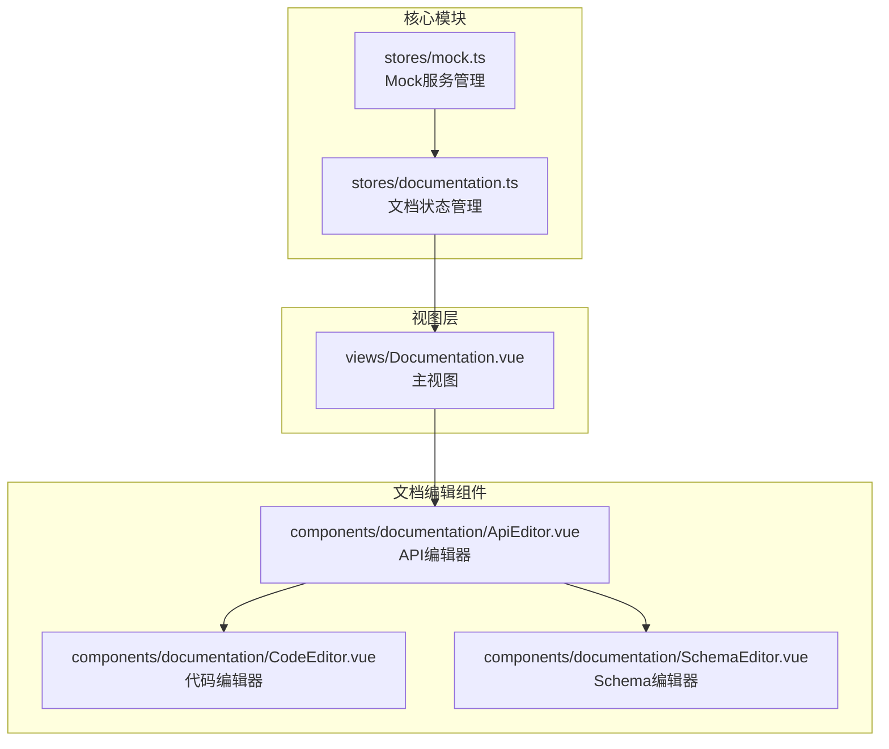
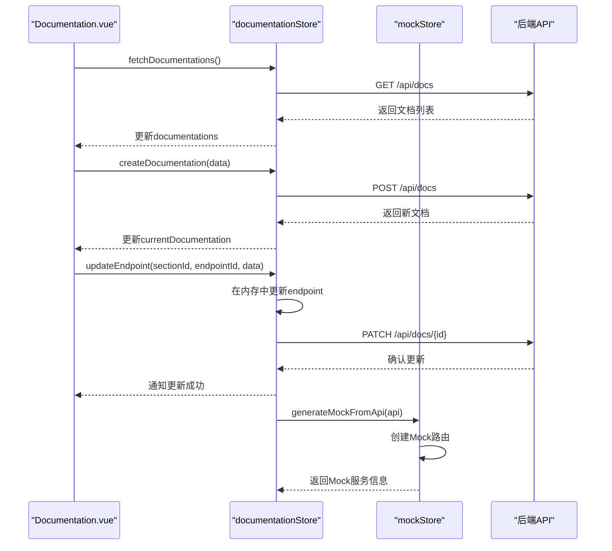
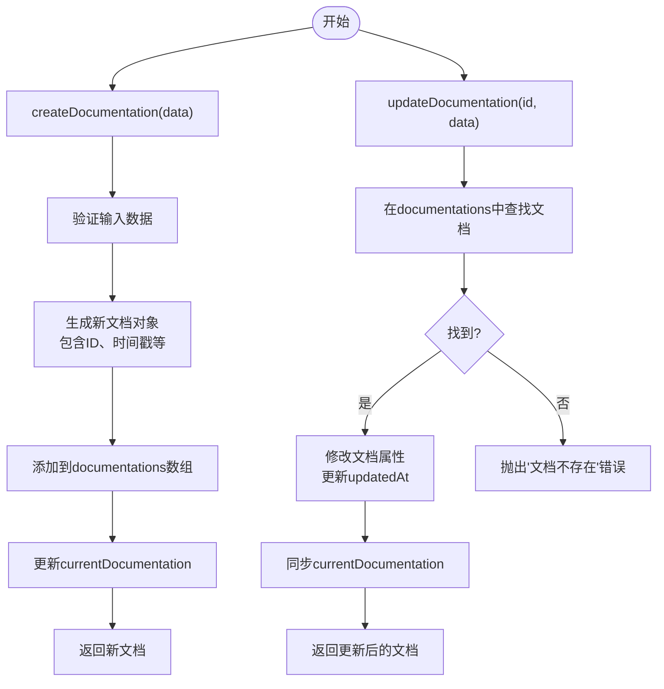
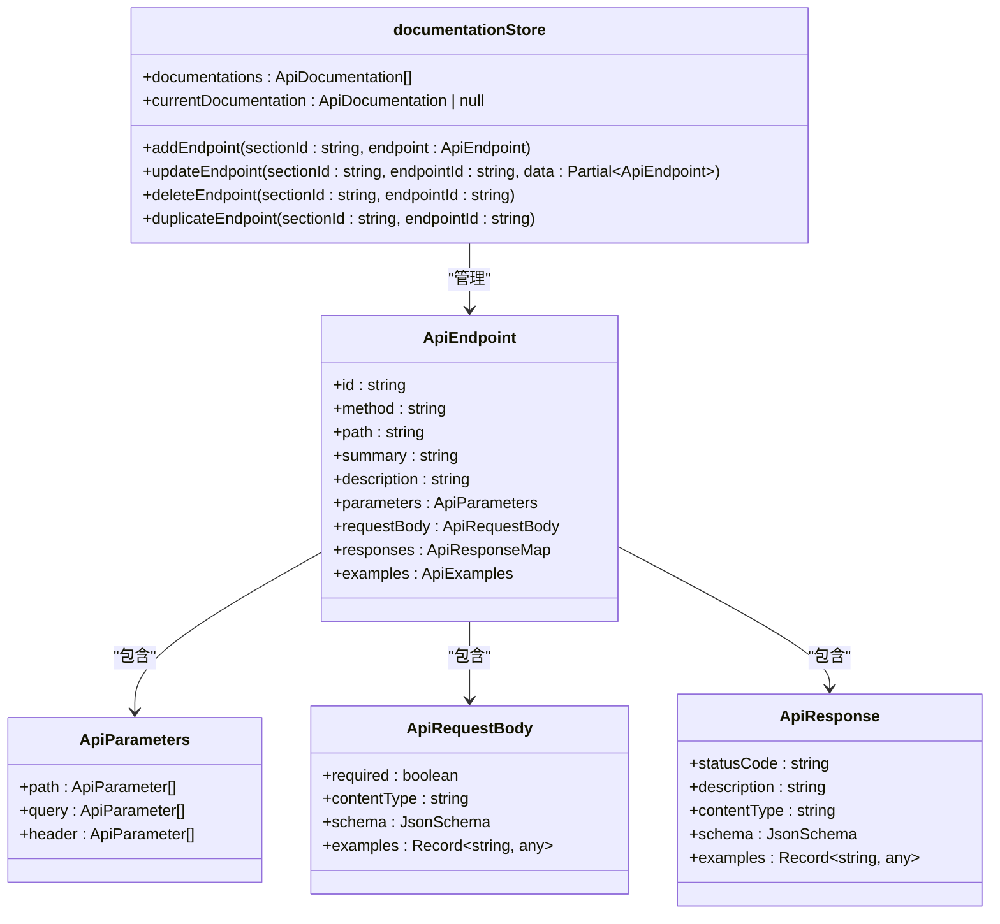

# 文档管理模块

<cite>
**本文档中引用的文件**  
- [documentation.ts](file://packages/web-pro/src/stores/documentation.ts)
- [Documentation.vue](file://packages/web-pro/src/views/Documentation.vue)
- [ApiEditor.vue](file://packages/web-pro/src/components/documentation/ApiEditor.vue)
- [CodeEditor.vue](file://packages/web-pro/src/components/documentation/CodeEditor.vue)
- [SchemaEditor.vue](file://packages/web-pro/src/components/documentation/SchemaEditor.vue)
- [mock.ts](file://packages/web-pro/src/stores/mock.ts)
</cite>

## 目录
1. [引言](#引言)
2. [项目结构](#项目结构)
3. [核心组件](#核心组件)
4. [架构概述](#架构概述)
5. [详细组件分析](#详细组件分析)
6. [依赖分析](#依赖分析)
7. [性能考虑](#性能考虑)
8. [故障排除指南](#故障排除指南)
9. [结论](#结论)

## 引言
本文档深入阐述了 `onlineInterfaceDebugTool` 项目中 `documentation store` 的 API 文档编辑与管理接口。重点涵盖状态管理机制、核心操作逻辑、组件集成方式、视图使用流程以及与 Mock 模块的联动机制。

## 项目结构



**图示来源**  
- [documentation.ts](file://packages/web-pro/src/stores/documentation.ts#L1-L607)
- [Documentation.vue](file://packages/web-pro/src/views/Documentation.vue#L1-L770)
- [ApiEditor.vue](file://packages/web-pro/src/components/documentation/ApiEditor.vue#L1-L631)

**本节来源**  
- [documentation.ts](file://packages/web-pro/src/stores/documentation.ts#L1-L607)
- [Documentation.vue](file://packages/web-pro/src/views/Documentation.vue#L1-L770)

## 核心组件

本模块的核心是 `useDocumentationStore`，它集中管理所有 API 文档的状态和业务逻辑。该 store 提供了从文档创建、编辑、发布到导出的完整生命周期管理功能。

**本节来源**  
- [documentation.ts](file://packages/web-pro/src/stores/documentation.ts#L1-L607)

## 架构概述



**图示来源**  
- [documentation.ts](file://packages/web-pro/src/stores/documentation.ts#L1-L607)
- [Documentation.vue](file://packages/web-pro/src/views/Documentation.vue#L1-L770)
- [mock.ts](file://packages/web-pro/src/stores/mock.ts#L1-L50)

## 详细组件分析

### 文档状态管理分析

`useDocumentationStore` 使用 Pinia 管理文档状态，其核心状态字段包括：
- `documentations`: 存储所有文档的数组
- `currentDocumentation`: 当前正在编辑的文档
- `currentTheme`: 当前编辑的主题配置
- `loading`: 全局加载状态
- `searchQuery`, `selectedStatus`, `selectedTags`: 过滤条件

这些状态通过 `ref` 进行响应式管理，并通过 `computed` 属性提供过滤后的文档列表和统计信息。

**本节来源**  
- [documentation.ts](file://packages/web-pro/src/stores/documentation.ts#L1-L607)

### 核心操作方法分析

#### 文档管理操作


**图示来源**  
- [documentation.ts](file://packages/web-pro/src/stores/documentation.ts#L150-L250)

#### API端点管理操作


**图示来源**  
- [documentation.ts](file://packages/web-pro/src/stores/documentation.ts#L350-L450)
- [types/index.ts](file://packages/shared/types/index.ts#L1-L50)

### 编辑器组件集成分析

#### 组件集成关系
```mermaid
graph TD
DocumentationView --> ApiEditor
ApiEditor --> CodeEditor
ApiEditor --> SchemaEditor
ApiEditor --> ParameterTable
CodeEditor -.-> "支持多种语言<br>语法高亮<br>代码格式化" .-> CodeEditor
SchemaEditor -.-> "JSON Schema可视化编辑" .-> SchemaEditor
ParameterTable -.-> "参数表格化管理" .-> ParameterTable
```

**图示来源**  
- [ApiEditor.vue](file://packages/web-pro/src/components/documentation/ApiEditor.vue#L1-L631)
- [CodeEditor.vue](file://packages/web-pro/src/components/documentation/CodeEditor.vue#L1-L418)
- [SchemaEditor.vue](file://packages/web-pro/src/components/documentation/SchemaEditor.vue#L1-L100)

#### 代码编辑器功能
`CodeEditor` 组件提供了丰富的代码编辑功能：
- **语法高亮**: 支持 JSON、JavaScript 等多种语言的简单语法高亮
- **代码格式化**: 支持 JSON 和 JavaScript 的自动格式化
- **全屏编辑**: 提供全屏模式以获得更好的编辑体验
- **代码复制**: 一键复制代码到剪贴板
- **Tab 键支持**: 正确处理 Tab 键的缩进功能

**本节来源**  
- [CodeEditor.vue](file://packages/web-pro/src/components/documentation/CodeEditor.vue#L1-L418)

## 依赖分析

```mermaid
dependency-graph
direction LR
documentationStore --> sharedTypes
documentationStore --> sharedUtils
documentationStore --> mockStore
DocumentationView --> documentationStore
DocumentationView --> ApiEditor
DocumentationView --> ElementPlus
ApiEditor --> CodeEditor
ApiEditor --> SchemaEditor
ApiEditor --> ElementPlus
CodeEditor --> ElementPlus
```

**图示来源**  
- [documentation.ts](file://packages/web-pro/src/stores/documentation.ts#L1-L607)
- [Documentation.vue](file://packages/web-pro/src/views/Documentation.vue#L1-L770)
- [package.json](file://packages/web-pro/package.json#L1-L50)

**本节来源**  
- [documentation.ts](file://packages/web-pro/src/stores/documentation.ts#L1-L607)
- [Documentation.vue](file://packages/web-pro/src/views/Documentation.vue#L1-L770)
- [package.json](file://packages/web-pro/package.json#L1-L50)

## 性能考虑

对于大型文档项目的性能优化，建议采用以下策略：

1. **分块加载**: 对于包含大量 API 端点的文档，可以实现懒加载机制，只在用户展开特定分组时才加载其内容。
2. **增量保存**: 在 `updateEndpoint` 等操作中，只发送变更的数据，而不是整个文档对象，减少网络传输量。
3. **状态缓存**: 在 `documentationStore` 中合理使用计算属性的缓存特性，避免重复计算。
4. **虚拟滚动**: 在文档列表和 API 列表中使用虚拟滚动技术，避免渲染大量 DOM 节点。

**本节来源**  
- [documentation.ts](file://packages/web-pro/src/stores/documentation.ts#L1-L607)

## 故障排除指南

### 常见问题及解决方案

| 问题现象 | 可能原因 | 解决方案 |
|---------|---------|---------|
| 文档无法保存 | 网络请求失败或后端验证错误 | 检查网络连接，确认数据格式符合要求 |
| API 示例生成失败 | 请求体或参数格式不正确 | 检查请求参数和请求体的 schema 定义 |
| 主题预览不生效 | CSS 样式冲突或自定义 CSS 错误 | 检查自定义 CSS 语法，清除浏览器缓存 |
| Mock 服务未同步 | 文档与 Mock store 连接中断 | 检查 `generateMockFromApi` 方法的调用逻辑 |

**本节来源**  
- [documentation.ts](file://packages/web-pro/src/stores/documentation.ts#L1-L607)
- [mock.ts](file://packages/web-pro/src/stores/mock.ts#L1-L50)

## 结论

`documentation store` 模块为 API 文档的创建和管理提供了一套完整的解决方案。通过 Pinia store 集中管理文档状态，实现了文档的增删改查、版本控制和发布功能。与 `CodeEditor`、`SchemaEditor` 等组件的深度集成，使得 OpenAPI 规范的可视化编辑成为可能。通过与 `mock store` 的联动，实现了文档到 Mock 服务的自动转换，极大地提升了开发效率。对于大型项目，建议实施分块加载和增量保存策略以优化性能。