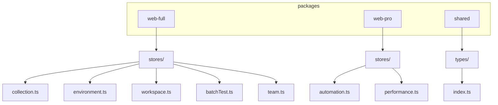
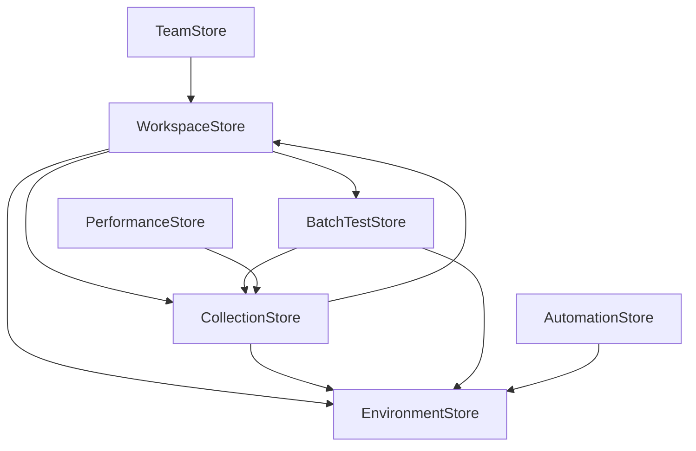

# 状态管理接口

<cite>
**本文档中引用的文件**   
- [collection.ts](file://packages/web-full/src/stores/collection.ts)
- [environment.ts](file://packages/web-full/src/stores/environment.ts)
- [workspace.ts](file://packages/web-full/src/stores/workspace.ts)
- [batchTest.ts](file://packages/web-full/src/stores/batchTest.ts)
- [team.ts](file://packages/web-full/src/stores/team.ts)
- [automation.ts](file://packages/web-pro/src/stores/automation.ts)
- [performance.ts](file://packages/web-pro/src/stores/performance.ts)
</cite>

## 目录
1. [项目结构](#项目结构)
2. [核心状态管理模块](#核心状态管理模块)
3. [Collection Store](#collection-store)
4. [Environment Store](#environment-store)
5. [Workspace Store](#workspace-store)
6. [BatchTest Store](#batchtest-store)
7. [Team Store](#team-store)
8. [Automation Store](#automation-store)
9. [Performance Store](#performance-store)
10. [Store 依赖关系与数据共享](#store-依赖关系与数据共享)
11. [Vue 组件中的使用模式](#vue-组件中的使用模式)
12. [持久化策略与初始化逻辑](#持久化策略与初始化逻辑)
13. [错误处理机制](#错误处理机制)
14. [最佳实践示例](#最佳实践示例)

## 项目结构



**Diagram sources**
- [packages/web-full/src/stores/collection.ts](file://packages/web-full/src/stores/collection.ts)
- [packages/web-full/src/stores/environment.ts](file://packages/web-full/src/stores/environment.ts)
- [packages/web-full/src/stores/workspace.ts](file://packages/web-full/src/stores/workspace.ts)
- [packages/web-full/src/stores/batchTest.ts](file://packages/web-full/src/stores/batchTest.ts)
- [packages/web-full/src/stores/team.ts](file://packages/web-full/src/stores/team.ts)
- [packages/web-pro/src/stores/automation.ts](file://packages/web-pro/src/stores/automation.ts)
- [packages/web-pro/src/stores/performance.ts](file://packages/web-pro/src/stores/performance.ts)

**Section sources**
- [packages/web-full/src/stores/collection.ts](file://packages/web-full/src/stores/collection.ts)
- [packages/web-full/src/stores/environment.ts](file://packages/web-full/src/stores/environment.ts)
- [packages/web-full/src/stores/workspace.ts](file://packages/web-full/src/stores/workspace.ts)
- [packages/web-full/src/stores/batchTest.ts](file://packages/web-full/src/stores/batchTest.ts)
- [packages/web-full/src/stores/team.ts](file://packages/web-full/src/stores/team.ts)
- [packages/web-pro/src/stores/automation.ts](file://packages/web-pro/src/stores/automation.ts)
- [packages/web-pro/src/stores/performance.ts](file://packages/web-pro/src/stores/performance.ts)

## 核心状态管理模块

本项目采用 Pinia 作为状态管理解决方案，通过模块化设计将不同功能域的状态分离到独立的 store 中。每个 store 负责管理特定业务领域的状态、操作和计算属性，实现了关注点分离和代码可维护性。

所有 store 都遵循统一的设计模式：定义状态（state）、计算属性（getters）、动作（actions），并通过 TypeScript 提供完整的类型安全。store 之间通过依赖注入和数据共享机制协同工作，形成完整的状态管理生态系统。

**Section sources**
- [packages/web-full/src/stores/collection.ts](file://packages/web-full/src/stores/collection.ts)
- [packages/web-full/src/stores/environment.ts](file://packages/web-full/src/stores/environment.ts)
- [packages/web-full/src/stores/workspace.ts](file://packages/web-full/src/stores/workspace.ts)

## Collection Store

### State 结构
- `collections`: ApiCollection[] - 存储所有 API 集合
- `currentCollection`: ApiCollection | null - 当前选中的集合
- `currentRequest`: CollectionRequest | null - 当前选中的请求
- `requestHistory`: HistoryRecord[] - 请求历史记录
- `testResults`: SimpleTestResult[] - 测试结果
- `batchTestResults`: BatchTestResult[] - 批量测试结果
- `loading`: boolean - 加载状态
- `testing`: boolean - 测试执行状态
- `importing`: boolean - 导入状态
- `exporting`: boolean - 导出状态
- `searchQuery`: string - 搜索查询
- `selectedTags`: string[] - 选中的标签
- `selectedMethods`: HttpMethod[] - 选中的 HTTP 方法

### Actions 方法
- `loadCollections()`: 加载集合数据
- `saveCollections()`: 保存集合数据
- `createCollection(collectionData)`: 创建新集合
- `updateCollection(collectionId, updates)`: 更新集合
- `deleteCollection(collectionId)`: 删除集合
- `duplicateCollection(collectionId)`: 复制集合
- `createFolder(collectionId, folderData)`: 创建文件夹
- `createRequest(collectionId, requestData)`: 创建请求
- `updateRequest(collectionId, requestId, updates)`: 更新请求
- `deleteRequest(collectionId, requestId)`: 删除请求
- `toggleFavorite(collectionId, requestId)`: 切换收藏状态
- `executeRequest(request)`: 执行请求
- `runBatchTest(collectionId, requests)`: 运行批量测试
- `importCollection(data, format)`: 导入集合
- `exportCollection(collectionId, format)`: 导出集合

### Getters 计算属性
- `filteredCollections`: 根据搜索条件过滤的集合
- `filteredRequests`: 当前集合中过滤的请求
- `allTags`: 所有标签
- `recentRequests`: 最近的请求记录
- `favoriteRequests`: 收藏的请求

**Section sources**
- [packages/web-full/src/stores/collection.ts](file://packages/web-full/src/stores/collection.ts)

## Environment Store

### State 结构
- `environments`: Environment[] - 环境列表
- `environmentGroups`: EnvironmentGroup[] - 环境组列表
- `environmentTemplates`: EnvironmentTemplate[] - 环境模板列表
- `currentEnvironment`: Environment | null - 当前环境
- `globalVariables`: EnvironmentVariable[] - 全局变量
- `loading`: boolean - 加载状态
- `saving`: boolean - 保存状态
- `importing`: boolean - 导入状态
- `exporting`: boolean - 导出状态
- `searchQuery`: string - 搜索查询
- `selectedGroups`: string[] - 选中的组
- `showInactive`: boolean - 是否显示非激活环境

### Actions 方法
- `loadEnvironments()`: 加载环境数据
- `saveEnvironments()`: 保存环境数据
- `createEnvironment(environmentData)`: 创建环境
- `updateEnvironment(environmentId, updates)`: 更新环境
- `deleteEnvironment(environmentId)`: 删除环境
- `duplicateEnvironment(environmentId)`: 复制环境
- `switchEnvironment(environmentId)`: 切换环境
- `createEnvironmentGroup(groupData)`: 创建环境组
- `updateEnvironmentGroup(groupId, updates)`: 更新环境组
- `deleteEnvironmentGroup(groupId)`: 删除环境组
- `addVariable(environmentId, variable)`: 添加变量
- `updateVariable(environmentId, variableKey, updates)`: 更新变量
- `deleteVariable(environmentId, variableKey)`: 删除变量
- `addGlobalVariable(variable)`: 添加全局变量
- `updateGlobalVariable(variableId, updates)`: 更新全局变量
- `deleteGlobalVariable(variableId)`: 删除全局变量
- `createTemplate(templateData)`: 创建模板
- `applyTemplate(templateId, environmentName)`: 应用模板
- `importEnvironments(data, format)`: 导入环境
- `exportEnvironments(environmentIds, format)`: 导出环境

### Getters 计算属性
- `filteredEnvironments`: 过滤后的环境
- `activeEnvironments`: 激活的环境
- `environmentsByGroup`: 按组分组的环境
- `allVariableKeys`: 所有变量键
- `variableConflicts`: 变量冲突

**Section sources**
- [packages/web-full/src/stores/environment.ts](file://packages/web-full/src/stores/environment.ts)

## Workspace Store

### State 结构
- `currentWorkspace`: Workspace | null - 当前工作空间
- `workspaces`: Workspace[] - 工作空间列表
- `collections`: ApiCollection[] - 集合列表
- `environments`: Environment[] - 环境列表
- `batchTests`: BatchTest[] - 批量测试列表
- `currentUser`: User | null - 当前用户
- `currentTeam`: Team | null - 当前团队
- `teamMembers`: TeamMember[] - 团队成员
- `shareLinks`: ShareLink[] - 分享链接
- `activityLogs`: ActivityLog[] - 活动日志
- `syncStatus`: DataSync | null - 同步状态
- `permissions`: Permission[] - 权限列表
- `loading`: boolean - 加载状态
- `syncing`: boolean - 同步状态
- `lastSyncTime`: Date | null - 最后同步时间

### Actions 方法
- `loadWorkspace()`: 加载工作空间
- `loadWorkspaces()`: 加载工作空间列表
- `saveWorkspace()`: 保存工作空间
- `saveEnvironment(environment)`: 保存环境
- `deleteEnvironment(environmentId)`: 删除环境
- `saveCollection(collection)`: 保存集合
- `deleteCollection(collectionId)`: 删除集合
- `saveBatchTest(batchTest)`: 保存批量测试
- `deleteBatchTest(testId)`: 删除批量测试
- `importData(importData)`: 导入数据
- `exportWorkspace()`: 导出工作空间
- `createWorkspace(workspace)`: 创建工作空间
- `switchWorkspace(workspaceId)`: 切换工作空间
- `updateWorkspaceSettings(settings)`: 更新工作空间设置
- `inviteTeamMember(email, role)`: 邀请团队成员
- `removeTeamMember(memberId)`: 移除团队成员
- `createShareLink(resourceType, resourceId, permission)`: 创建分享链接
- `revokeShareLink(linkId)`: 撤销分享链接
- `syncData()`: 同步数据
- `logActivity(activity)`: 记录活动
- `activateEnvironment(environmentId)`: 激活环境

### Getters 计算属性
- `hasPermission(action, resource)`: 检查权限
- `canManageWorkspace`: 是否可以管理工作空间
- `canManageTeam`: 是否可以管理团队
- `canCreateCollection`: 是否可以创建集合
- `isWorkspaceOwner`: 是否是工作空间所有者
- `activeEnvironment`: 激活的环境
- `recentActivity`: 最近活动

**Section sources**
- [packages/web-full/src/stores/workspace.ts](file://packages/web-full/src/stores/workspace.ts)

## BatchTest Store

### State 结构
- `testSuites`: TestSuite[] - 测试套件列表
- `testResults`: TestResult[] - 测试结果列表
- `currentSuite`: TestSuite | null - 当前测试套件
- `runningTests`: string[] - 正在运行的测试
- `loading`: boolean - 加载状态

### Actions 方法
- `loadTestSuites()`: 加载测试套件
- `loadTestResults()`: 加载测试结果
- `saveTestSuites()`: 保存测试套件
- `saveTestResults()`: 保存测试结果
- `createTestSuite(suiteData)`: 创建测试套件
- `updateTestSuite(suiteId, updates)`: 更新测试套件
- `deleteTestSuite(suiteId)`: 删除测试套件
- `duplicateTestSuite(suiteId)`: 复制测试套件
- `runTestSuite(suiteId)`: 运行测试套件
- `stopTestSuite(suiteId)`: 停止测试套件
- `executeTestRequests(suite)`: 执行测试请求
- `executeTestRequest(request, settings)`: 执行单个测试请求
- `exportTestSuite(suiteId)`: 导出测试套件
- `importTestSuite(file)`: 导入测试套件
- `clearTestResults(suiteId)`: 清理测试结果

### Getters 计算属性
- `activeSuites`: 活跃的测试套件
- `recentResults`: 最近的测试结果
- `isRunning(suiteId)`: 测试是否正在运行

**Section sources**
- [packages/web-full/src/stores/batchTest.ts](file://packages/web-full/src/stores/batchTest.ts)

## Team Store

### State 结构
- `currentTeam`: Team | null - 当前团队
- `members`: TeamMember[] - 团队成员
- `invites`: TeamInvite[] - 邀请列表
- `permissions`: Permission[] - 权限列表
- `currentUser`: TeamMember | null - 当前用户
- `loading`: boolean - 加载状态
- `error`: string | null - 错误信息

### Actions 方法
- `loadTeam(teamId)`: 加载团队
- `updateTeamSettings(settings)`: 更新团队设置
- `loadMembers()`: 加载成员
- `updateMemberRole(memberId, role)`: 更新成员角色
- `removeMember(memberId)`: 移除成员
- `loadInvites()`: 加载邀请
- `inviteMember(inviteData)`: 邀请成员
- `resendInvite(inviteId)`: 重新发送邀请
- `cancelInvite(inviteId)`: 取消邀请
- `acceptInvite(inviteId)`: 接受邀请
- `loadPermissions()`: 加载权限
- `clearTeamData()`: 清理团队数据

### Getters 计算属性
- `isAdmin`: 是否是管理员
- `isEditor`: 是否是编辑者
- `canInvite`: 是否可以邀请
- `activeMembers`: 活跃成员
- `pendingInvites`: 待处理邀请
- `hasPermission(permission)`: 检查权限
- `canEditMember(memberId)`: 是否可以编辑成员
- `canRemoveMember(memberId)`: 是否可以移除成员

**Section sources**
- [packages/web-full/src/stores/team.ts](file://packages/web-full/src/stores/team.ts)

## Automation Store

### State 结构
- `suites`: TestSuite[] - 自动化测试套件
- `testResults`: TestResult[] - 测试结果
- `schedules`: Schedule[] - 调度计划
- `settings`: 自动化设置
- `loading`: boolean - 加载状态
- `runningTests`: string[] - 正在运行的测试

### Actions 方法
- `loadSuites()`: 加载测试套件
- `createSuite(suiteData)`: 创建测试套件
- `updateSuite(id, updates)`: 更新测试套件
- `deleteSuite(id)`: 删除测试套件
- `runSuite(suite)`: 运行测试套件
- `runAllSuites()`: 运行所有套件
- `getTestResults(suiteId)`: 获取测试结果
- `clearResults()`: 清理结果
- `exportResults(format)`: 导出结果
- `updateSettings(newSettings)`: 更新设置
- `createSchedule(schedule)`: 创建调度
- `updateSchedule(id, updates)`: 更新调度
- `deleteSchedule(id)`: 删除调度

### Getters 计算属性
- `activeSuites`: 活跃套件
- `totalTests`: 总测试数
- `successRate`: 成功率
- `summary`: 汇总信息
- `historyData`: 历史数据

**Section sources**
- [packages/web-pro/src/stores/automation.ts](file://packages/web-pro/src/stores/automation.ts)

## Performance Store

### State 结构
- `metrics`: ExtendedPerformanceMetrics[] - 性能指标
- `loading`: boolean - 加载状态
- `settings`: PerformanceSettings - 性能设置

### Actions 方法
- `loadMetrics(params)`: 加载指标
- `exportReport(params)`: 导出报告
- `updateSettings(newSettings)`: 更新设置
- `getErrorType(status)`: 获取错误类型

### Getters 计算属性
- `summary`: 性能汇总
- `responseTimeData`: 响应时间数据
- `requestVolumeData`: 请求量数据
- `waterfallData`: 瀑布图数据
- `errorData`: 错误数据

**Section sources**
- [packages/web-pro/src/stores/performance.ts](file://packages/web-pro/src/stores/performance.ts)

## Store 依赖关系与数据共享



**Diagram sources**
- [packages/web-full/src/stores/collection.ts](file://packages/web-full/src/stores/collection.ts)
- [packages/web-full/src/stores/environment.ts](file://packages/web-full/src/stores/environment.ts)
- [packages/web-full/src/stores/workspace.ts](file://packages/web-full/src/stores/workspace.ts)
- [packages/web-full/src/stores/batchTest.ts](file://packages/web-full/src/stores/batchTest.ts)
- [packages/web-pro/src/stores/automation.ts](file://packages/web-pro/src/stores/automation.ts)
- [packages/web-pro/src/stores/performance.ts](file://packages/web-pro/src/stores/performance.ts)

**Section sources**
- [packages/web-full/src/stores/collection.ts](file://packages/web-full/src/stores/collection.ts)
- [packages/web-full/src/stores/environment.ts](file://packages/web-full/src/stores/environment.ts)
- [packages/web-full/src/stores/workspace.ts](file://packages/web-full/src/stores/workspace.ts)

## Vue 组件中的使用模式

### Setup 语法糖中的调用方式

```typescript
import { useCollectionStore } from '@/stores/collection'
import { useEnvironmentStore } from '@/stores/environment'

export default defineComponent({
  setup() {
    const collectionStore = useCollectionStore()
    const environmentStore = useEnvironmentStore()
    
    // 初始化数据
    onMounted(async () => {
      await collectionStore.loadCollections()
      await environmentStore.loadEnvironments()
    })
    
    // 使用计算属性
    const filteredCollections = computed(() => collectionStore.filteredCollections)
    const activeEnvironment = computed(() => environmentStore.currentEnvironment)
    
    // 调用 actions
    const handleCreateCollection = async (data) => {
      try {
        await collectionStore.createCollection(data)
      } catch (error) {
        ElMessage.error('创建集合失败')
      }
    }
    
    return {
      collectionStore,
      environmentStore,
      filteredCollections,
      activeEnvironment,
      handleCreateCollection
    }
  }
})
```

**Section sources**
- [packages/web-full/src/stores/collection.ts](file://packages/web-full/src/stores/collection.ts)
- [packages/web-full/src/stores/environment.ts](file://packages/web-full/src/stores/environment.ts)

## 持久化策略与初始化逻辑

### 持久化策略

所有 store 都使用 localStorage 作为持久化存储，通过封装的 storage 工具实现数据的存取：

```typescript
const storage = {
  async get(key: string) {
    try {
      const value = localStorage.getItem(key)
      return value ? JSON.parse(value) : null
    } catch {
      return null
    }
  },
  async set(key: string, value: any) {
    try {
      localStorage.setItem(key, JSON.stringify(value))
    } catch (error) {
      console.error('Storage error:', error)
    }
  }
}
```

每个 store 在初始化时调用相应的 load 方法加载数据，并通过 watch 监听状态变化自动保存：

```typescript
watch(collections, () => {
  saveCollections()
}, { deep: true })
```

### 初始化逻辑

初始化流程遵循以下模式：
1. 在组件挂载时调用 store 的 load 方法
2. 如果没有找到数据，则创建默认数据
3. 将数据保存到存储中
4. 更新 UI 状态

```typescript
const loadCollections = async () => {
  loading.value = true
  try {
    const savedCollections = await storage.get('collections') || []
    collections.value = savedCollections
    
    const savedHistory = await storage.get('requestHistory') || []
    requestHistory.value = savedHistory
    
    const savedTestResults = await storage.get('testResults') || []
    testResults.value = savedTestResults
  } catch (error) {
    console.error('Failed to load collections:', error)
    ElMessage.error('加载集合失败')
  } finally {
    loading.value = false
  }
}
```

**Section sources**
- [packages/web-full/src/stores/collection.ts](file://packages/web-full/src/stores/collection.ts)
- [packages/web-full/src/stores/environment.ts](file://packages/web-full/src/stores/environment.ts)
- [packages/web-full/src/stores/workspace.ts](file://packages/web-full/src/stores/workspace.ts)

## 错误处理机制

### 统一错误处理

所有 store 都采用统一的错误处理模式，使用 try-catch 包裹异步操作，并通过 ElMessage 显示用户友好的错误信息：

```typescript
const createCollection = async (collectionData) => {
  try {
    // 业务逻辑
  } catch (error) {
    console.error('Failed to create collection:', error)
    ElMessage.error('创建集合失败')
    throw error
  }
}
```

### 错误分类

错误处理分为以下几类：
- **存储错误**: localStorage 操作失败
- **网络错误**: API 请求失败
- **验证错误**: 数据验证失败
- **业务逻辑错误**: 业务规则违反

### 错误恢复

对于可恢复的错误，提供重试机制；对于不可恢复的错误，提供清晰的错误信息和解决方案建议。

```typescript
const saveCollections = async () => {
  try {
    await storage.set('collections', collections.value)
  } catch (error) {
    console.error('Failed to save collections:', error)
    ElMessage.error('保存集合失败')
  }
}
```

**Section sources**
- [packages/web-full/src/stores/collection.ts](file://packages/web-full/src/stores/collection.ts)
- [packages/web-full/src/stores/environment.ts](file://packages/web-full/src/stores/environment.ts)
- [packages/web-full/src/stores/workspace.ts](file://packages/web-full/src/stores/workspace.ts)

## 最佳实践示例

### 异步操作处理

```typescript
const executeRequest = async (request) => {
  testing.value = true
  try {
    // 显示加载状态
    const response = await executeRequest(request)
    return response
  } catch (error) {
    // 统一错误处理
    console.error('Failed to execute request:', error)
    throw error
  } finally {
    // 确保状态重置
    testing.value = false
  }
}
```

### 状态同步

```typescript
// 使用 watch 实现状态同步
watch(collections, () => {
  saveCollections()
}, { deep: true })

// 在跨 store 依赖中同步状态
const createCollection = async (collectionData) => {
  // ...
  await workspaceStore.logActivity({
    action: 'create',
    resource: 'collection',
    resourceId: newCollection.id,
    details: `创建集合: ${newCollection.name}`
  })
}
```

### 事件响应

```typescript
// 监听环境切换事件
const switchEnvironment = async (environmentId) => {
  try {
    // ...
    await workspaceStore.logActivity({
      action: 'switch',
      resource: 'environment',
      resourceId: environmentId || '',
      details: `切换环境: ${envName}`
    })
  } catch (error) {
    console.error('Failed to switch environment:', error)
    ElMessage.error('切换环境失败')
  }
}
```

### 复杂场景处理

```typescript
// 批量测试中的并发控制
const executeTestRequests = async (suite) => {
  const results = []
  const { concurrency, delay } = defaultSettings

  // 分块处理请求
  const chunks = []
  for (let i = 0; i < suite.requests.length; i += concurrency) {
    chunks.push(suite.requests.slice(i, i + concurrency))
  }

  // 逐块执行
  for (const chunk of chunks) {
    const chunkResults = await Promise.all(
      chunk.map(request => executeTestRequest(request, defaultSettings))
    )
    results.push(...chunkResults)
    
    // 请求间延迟
    if (delay > 0 && chunks.indexOf(chunk) < chunks.length - 1) {
      await new Promise(resolve => setTimeout(resolve, delay))
    }
  }

  return results
}
```

**Section sources**
- [packages/web-full/src/stores/collection.ts](file://packages/web-full/src/stores/collection.ts)
- [packages/web-full/src/stores/environment.ts](file://packages/web-full/src/stores/environment.ts)
- [packages/web-full/src/stores/batchTest.ts](file://packages/web-full/src/stores/batchTest.ts)