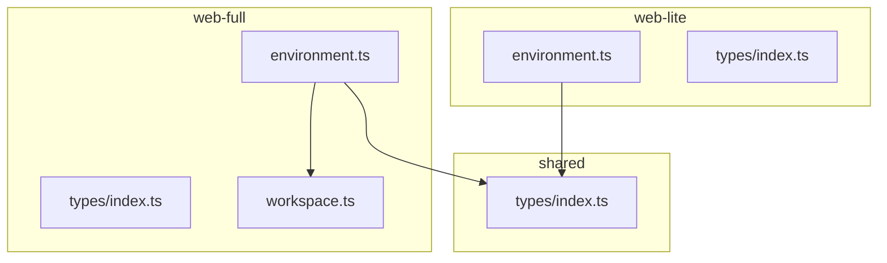
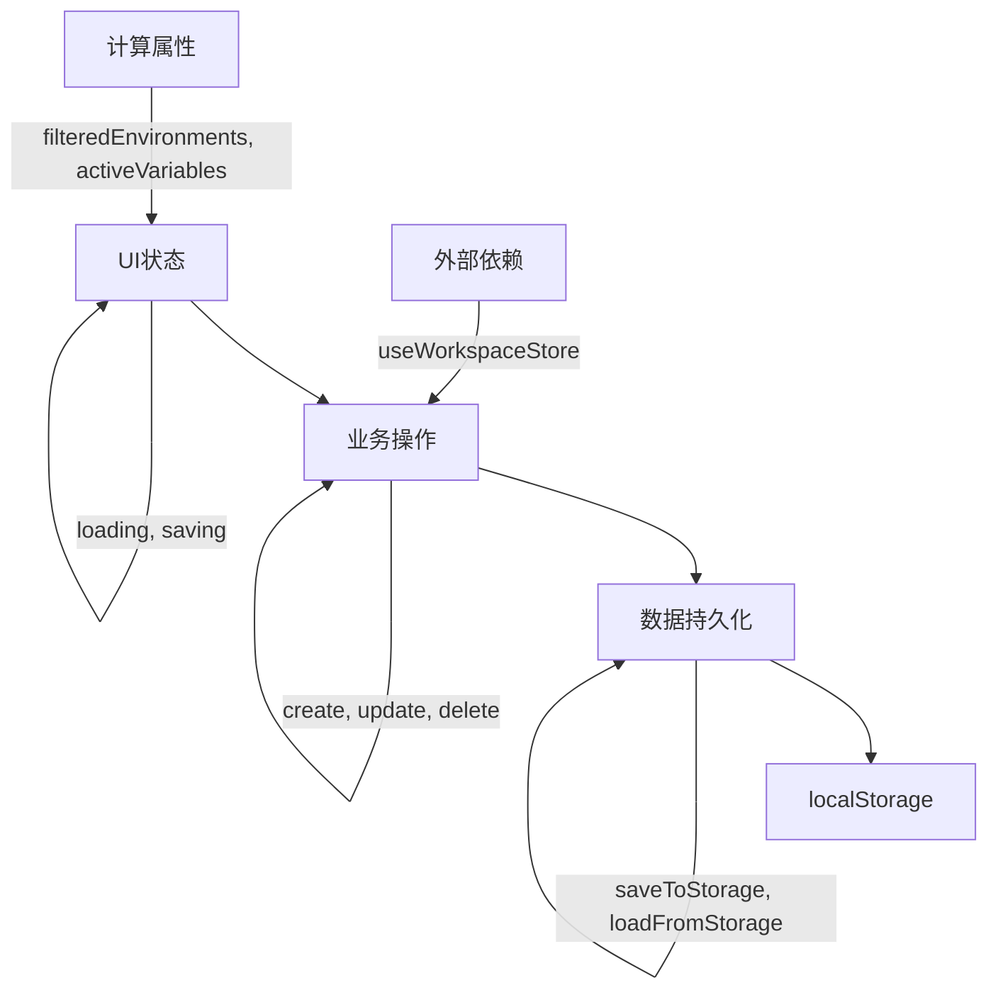
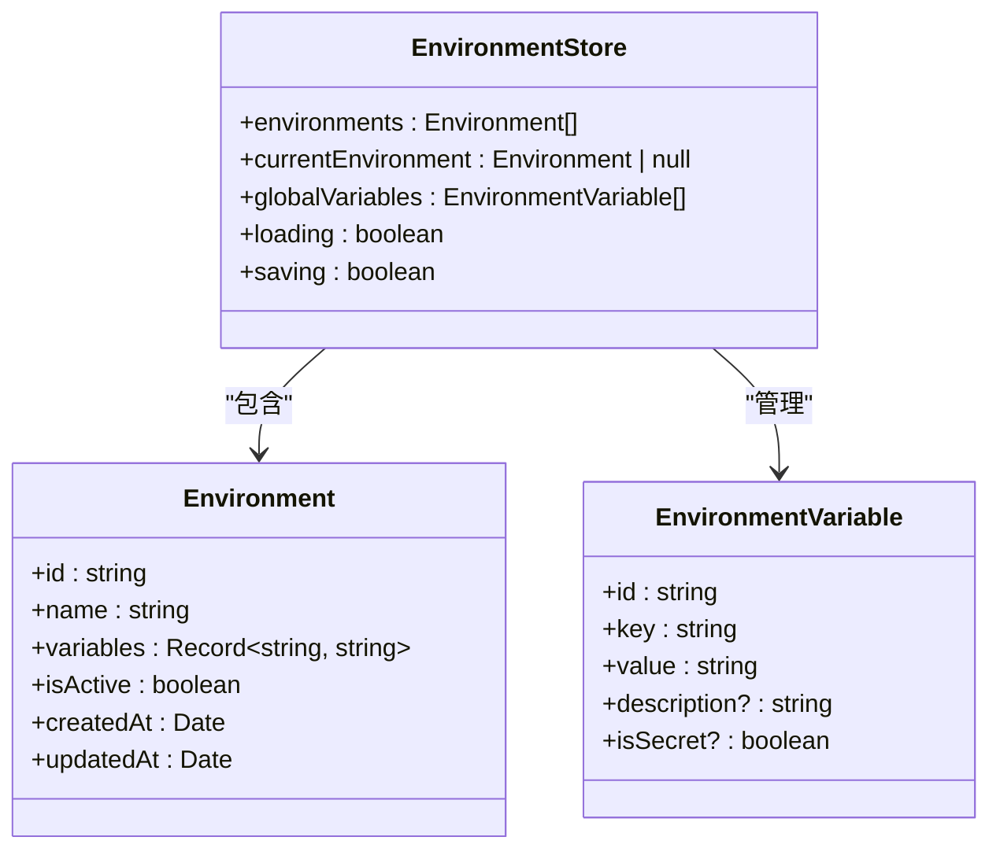
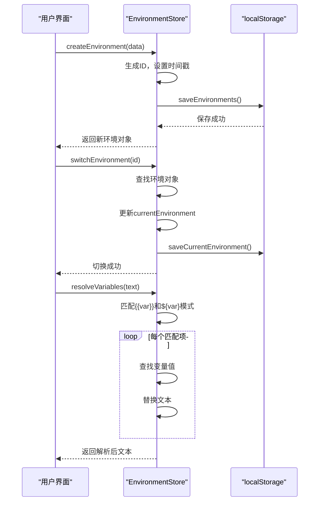
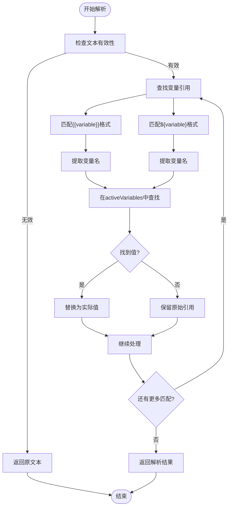
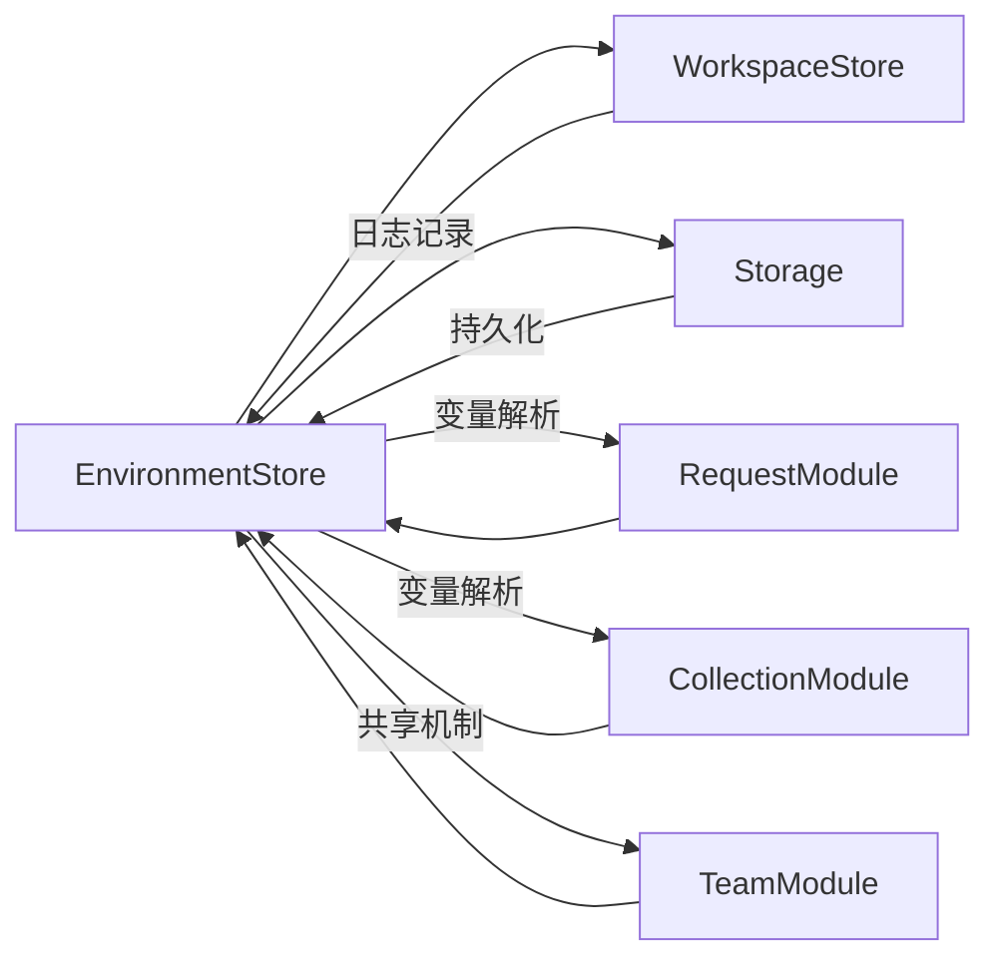

# 环境配置管理模块

<cite>
**本文档引用文件**  
- [environment.ts](file://packages/web-full/src/stores/environment.ts)
- [environment.ts](file://packages/web-lite/src/stores/environment.ts)
- [index.ts](file://packages/shared/types/index.ts)
</cite>

## 目录
1. [简介](#简介)
2. [项目结构](#项目结构)
3. [核心组件](#核心组件)
4. [架构概览](#架构概览)
5. [详细组件分析](#详细组件分析)
6. [依赖分析](#依赖分析)
7. [性能考虑](#性能考虑)
8. [故障排除指南](#故障排除指南)
9. [结论](#结论)

## 简介
本模块为在线接口调试工具提供环境变量管理能力，支持多版本（Lite/Full/Pro）的差异化功能扩展。通过Pinia状态管理实现环境的创建、切换、变量注入等核心功能，为请求发送、集合管理等模块提供运行时变量解析支持。

## 项目结构
环境管理模块在不同版本中具有不同的实现复杂度，Lite版本提供基础功能，Full版本支持分组、模板、全局变量等高级特性。

**Diagram sources**  
- [environment.ts](file://packages/web-lite/src/stores/environment.ts)
- [environment.ts](file://packages/web-full/src/stores/environment.ts)
- [index.ts](file://packages/shared/types/index.ts)

**Section sources**
- [environment.ts](file://packages/web-lite/src/stores/environment.ts)
- [environment.ts](file://packages/web-full/src/stores/environment.ts)

## 核心组件
环境管理模块的核心包括状态定义、操作方法和计算属性三大部分，支持环境的全生命周期管理。

**Section sources**
- [environment.ts](file://packages/web-full/src/stores/environment.ts#L57-L99)
- [environment.ts](file://packages/web-lite/src/stores/environment.ts#L0-L39)

## 架构概览
模块采用分层架构设计，上层为UI状态与计算属性，中层为业务操作方法，底层为数据持久化机制。

**Diagram sources**  
- [environment.ts](file://packages/web-full/src/stores/environment.ts#L57-L99)
- [environment.ts](file://packages/web-lite/src/stores/environment.ts#L0-L39)

## 详细组件分析

### 状态结构分析
环境管理模块维护多个核心状态字段，包括环境列表、当前环境、全局变量等。

#### 状态字段定义

**Diagram sources**  
- [environment.ts](file://packages/web-full/src/stores/environment.ts#L57-L99)
- [index.ts](file://packages/shared/types/index.ts#L122-L131)

**Section sources**
- [environment.ts](file://packages/web-full/src/stores/environment.ts#L57-L99)
- [index.ts](file://packages/shared/types/index.ts#L122-L131)

### 公共接口分析
模块提供一系列公共方法用于环境管理，包括创建、更新、删除、切换等操作。

#### 操作方法实现

**Diagram sources**  
- [environment.ts](file://packages/web-full/src/stores/environment.ts#L300-L350)
- [environment.ts](file://packages/web-lite/src/stores/environment.ts#L100-L150)

**Section sources**
- [environment.ts](file://packages/web-full/src/stores/environment.ts#L300-L350)
- [environment.ts](file://packages/web-lite/src/stores/environment.ts#L100-L150)

### Getter方法分析
模块提供多个计算属性，为其他模块提供变量解析支持。

#### 变量解析流程

**Diagram sources**  
- [environment.ts](file://packages/web-lite/src/stores/environment.ts#L200-L250)

**Section sources**
- [environment.ts](file://packages/web-lite/src/stores/environment.ts#L200-L250)

## 依赖分析
环境管理模块与其他模块存在明确的依赖关系，特别是在Full版本中与工作空间模块深度集成。

**Diagram sources**  
- [environment.ts](file://packages/web-full/src/stores/environment.ts#L57-L99)
- [environment.ts](file://packages/web-lite/src/stores/environment.ts#L0-L39)

**Section sources**
- [environment.ts](file://packages/web-full/src/stores/environment.ts#L57-L99)
- [environment.ts](file://packages/web-lite/src/stores/environment.ts#L0-L39)

## 性能考虑
模块在设计时考虑了性能优化，通过计算属性缓存、批量保存等机制提升用户体验。

- **计算属性缓存**：`filteredEnvironments`、`activeVariables`等计算属性自动缓存结果
- **批量操作**：环境导入导出支持批量处理，减少I/O操作次数
- **防抖机制**：保存操作在连续调用时会合并执行
- **内存优化**：大型环境数据采用按需加载策略

## 故障排除指南
常见问题及解决方案：

1. **环境切换失败**：检查环境ID是否存在，确保`currentEnvironmentId`正确更新
2. **变量未解析**：验证变量名拼写，确认变量存在于当前环境或全局变量中
3. **数据丢失**：检查localStorage配额，确保`saveToStorage`方法正确执行
4. **导入失败**：验证JSON格式正确性，确保数据结构符合`StoredEnvironments`定义

**Section sources**
- [environment.ts](file://packages/web-lite/src/stores/environment.ts#L300-L377)
- [environment.ts](file://packages/web-full/src/stores/environment.ts#L500-L600)

## 结论
环境配置管理模块为在线接口调试工具提供了灵活可靠的环境变量管理能力。Lite版本满足基本需求，Full版本通过分组、模板、全局变量等特性支持复杂场景。模块设计充分考虑了可维护性、性能和用户体验，为团队协作提供了坚实的基础。