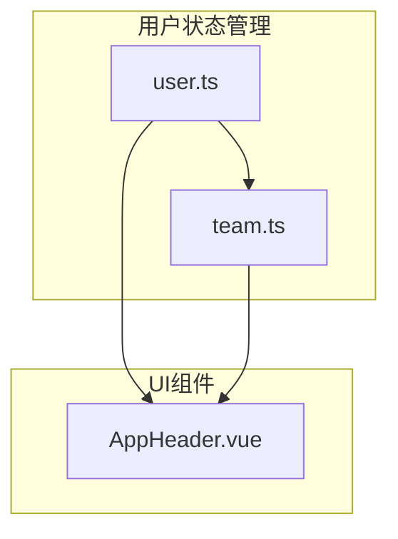
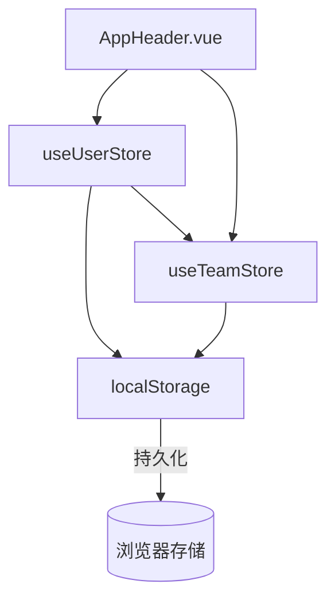
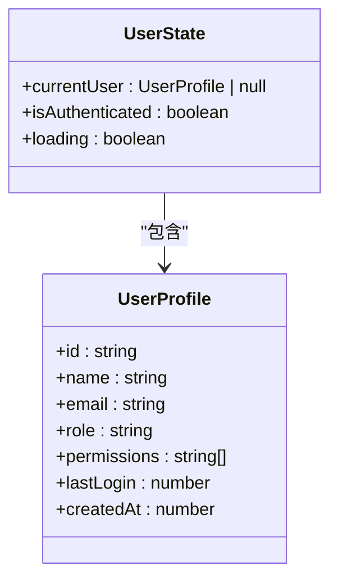
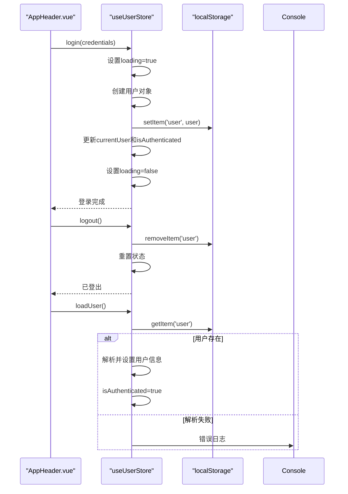
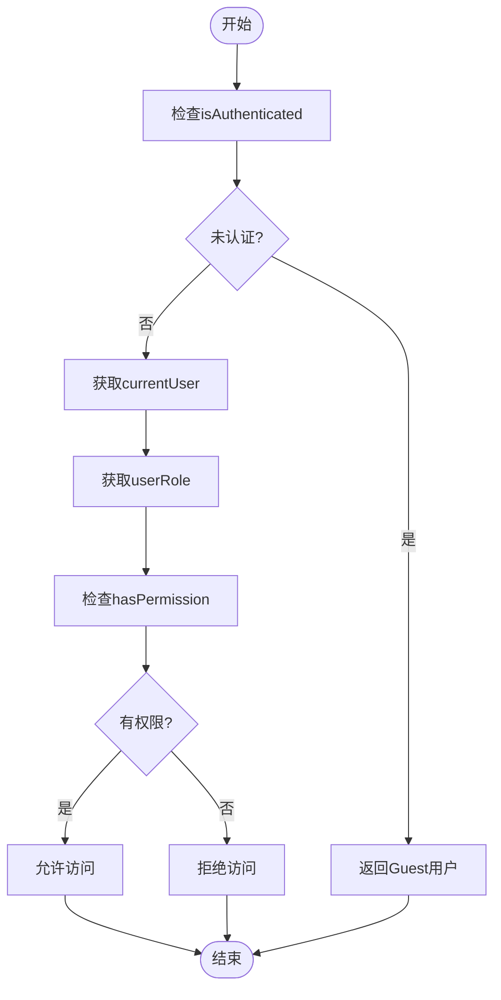
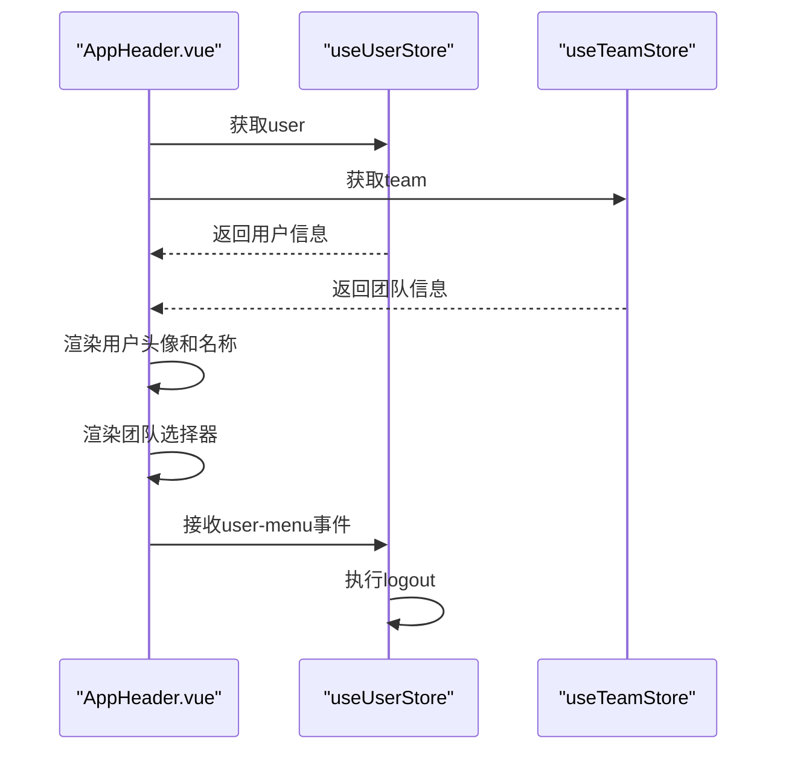
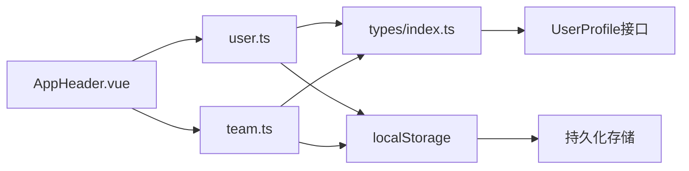

# 用户状态管理模块

<cite>
**本文档中引用的文件**   
- [user.ts](file://packages/web-pro/src/stores/user.ts)
- [team.ts](file://packages/web-pro/src/stores/team.ts)
- [AppHeader.vue](file://packages/web-pro/src/components/layout/AppHeader.vue)
- [index.ts](file://packages/shared/types/index.ts)
</cite>

## 目录
1. [简介](#简介)
2. [项目结构](#项目结构)
3. [核心组件](#核心组件)
4. [架构概览](#架构概览)
5. [详细组件分析](#详细组件分析)
6. [依赖分析](#依赖分析)
7. [性能考虑](#性能考虑)
8. [故障排除指南](#故障排除指南)
9. [结论](#结论)

## 简介
本模块负责管理用户认证状态、权限控制及与团队协作的集成。它通过Pinia状态管理实现用户登录、登出、权限验证和用户信息持久化，并与团队模块协同实现基于角色的访问控制（RBAC）。该模块还为前端组件如AppHeader提供用户信息展示支持。

## 项目结构
用户状态管理模块位于`packages/web-pro/src/stores/`目录下，主要由`user.ts`和`team.ts`两个store组成，配合`AppHeader.vue`等UI组件实现完整的用户交互体验。

**Diagram sources**
- [user.ts](file://packages/web-pro/src/stores/user.ts#L1-L67)
- [team.ts](file://packages/web-pro/src/stores/team.ts#L1-L574)
- [AppHeader.vue](file://packages/web-pro/src/components/layout/AppHeader.vue#L1-L167)

**Section sources**
- [user.ts](file://packages/web-pro/src/stores/user.ts#L1-L67)
- [team.ts](file://packages/web-pro/src/stores/team.ts#L1-L574)

## 核心组件
用户状态管理的核心是`useUserStore`，它维护当前用户信息、认证状态和加载状态。通过`login`、`logout`和`loadUser`等actions实现完整的认证流程，并利用localStorage进行安全的数据持久化。

**Section sources**
- [user.ts](file://packages/web-pro/src/stores/user.ts#L1-L67)

## 架构概览
系统采用分层架构设计，上层UI组件通过store访问用户状态，store内部处理业务逻辑并与浏览器存储交互。用户store与团队store通过共享状态实现协同工作。

**Diagram sources**
- [user.ts](file://packages/web-pro/src/stores/user.ts#L1-L67)
- [team.ts](file://packages/web-pro/src/stores/team.ts#L1-L574)
- [AppHeader.vue](file://packages/web-pro/src/components/layout/AppHeader.vue#L1-L167)

## 详细组件分析

### 用户Store分析
`useUserStore`实现了用户认证的核心功能，包括登录、登出和用户信息加载。

#### 状态字段分析

**Diagram sources**
- [user.ts](file://packages/web-pro/src/stores/user.ts#L4-L10)
- [index.ts](file://packages/shared/types/index.ts#L946-L990)

#### 认证流程分析

**Diagram sources**
- [user.ts](file://packages/web-pro/src/stores/user.ts#L25-L67)
- [AppHeader.vue](file://packages/web-pro/src/components/layout/AppHeader.vue#L1-L167)

### 团队权限协同分析
用户store与团队store协同实现基于角色的访问控制，通过权限矩阵进行精细化权限管理。

#### 权限控制流程

**Diagram sources**
- [user.ts](file://packages/web-pro/src/stores/user.ts#L15-L23)
- [team.ts](file://packages/web-pro/src/stores/team.ts#L15-L35)

### AppHeader集成分析
`AppHeader.vue`组件展示了用户信息的典型用例，包括头像、用户名显示和登出操作。

#### UI交互流程

**Diagram sources**
- [AppHeader.vue](file://packages/web-pro/src/components/layout/AppHeader.vue#L1-L167)
- [user.ts](file://packages/web-pro/src/stores/user.ts#L50-L67)

## 依赖分析
用户状态管理模块依赖于多个核心组件，形成完整的认证和权限管理体系。

**Diagram sources**
- [user.ts](file://packages/web-pro/src/stores/user.ts#L1-L67)
- [team.ts](file://packages/web-pro/src/stores/team.ts#L1-L574)
- [AppHeader.vue](file://packages/web-pro/src/components/layout/AppHeader.vue#L1-L167)
- [index.ts](file://packages/shared/types/index.ts#L506-L569)

**Section sources**
- [user.ts](file://packages/web-pro/src/stores/user.ts#L1-L67)
- [team.ts](file://packages/web-pro/src/stores/team.ts#L1-L574)

## 性能考虑
该模块在性能方面进行了优化，避免不必要的计算和渲染。通过Pinia的响应式系统，只有当用户状态发生变化时才会触发UI更新。localStorage操作被限制在必要的时候执行，减少I/O开销。

## 故障排除指南
常见问题包括用户信息无法持久化、权限验证失败等。检查localStorage是否被正确读写，确认用户对象的序列化和反序列化过程无误。对于权限问题，验证用户角色和权限数组是否正确加载。

**Section sources**
- [user.ts](file://packages/web-pro/src/stores/user.ts#L55-L67)
- [team.ts](file://packages/web-pro/src/stores/team.ts#L550-L574)

## 结论
用户状态管理模块通过清晰的状态设计和合理的架构分层，实现了安全可靠的认证机制。与团队模块的协同工作支持了复杂的权限控制需求，为整个应用提供了坚实的身份验证基础。