# 自动化测试模块

<cite>
**本文档引用的文件**
- [automation.ts](file://packages/web-pro/src/stores/automation.ts)
- [notification.ts](file://packages/web-pro/src/stores/notification.ts)
- [RunHistoryChart.vue](file://packages/web-pro/src/components/automation/RunHistoryChart.vue)
- [Automation.vue](file://packages/web-pro/src/views/Automation.vue)
- [ScheduleDialog.vue](file://packages/web-pro/src/components/automation/ScheduleDialog.vue)
</cite>

## 目录
1. [项目结构](#项目结构)
2. [核心状态设计](#核心状态设计)
3. [核心操作方法](#核心操作方法)
4. [计算属性与数据聚合](#计算属性与数据聚合)
5. [定时任务调度机制](#定时任务调度机制)
6. [通知系统集成](#通知系统集成)
7. [运行历史可视化](#运行历史可视化)
8. [自动化管理页面实现](#自动化管理页面实现)
9. [最佳实践建议](#最佳实践建议)

## 项目结构

自动化测试功能主要分布在 `web-pro` 包中，采用模块化架构设计，各组件职责清晰。

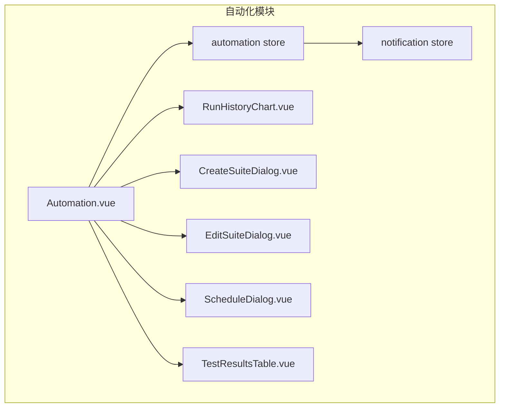

**Diagram sources**
- [Automation.vue](file://packages/web-pro/src/views/Automation.vue)
- [automation.ts](file://packages/web-pro/src/stores/automation.ts)

**Section sources**
- [Automation.vue](file://packages/web-pro/src/views/Automation.vue)
- [automation.ts](file://packages/web-pro/src/stores/automation.ts)

## 核心状态设计

自动化 store 的状态设计围绕测试套件、执行结果和调度配置三大核心概念展开。

### 状态字段说明

| 字段 | 类型 | 描述 |
|------|------|------|
| suites | TestSuite[] | 存储所有测试套件的集合 |
| testResults | TestResult[] | 记录每次测试执行的结果 |
| schedules | Schedule[] | 定时任务调度配置列表 |
| settings | Object | 全局自动化执行设置 |
| runningTests | string[] | 当前正在运行的测试套件ID列表 |

**Section sources**
- [automation.ts](file://packages/web-pro/src/stores/automation.ts#L6-L20)

## 核心操作方法

### 测试套件管理

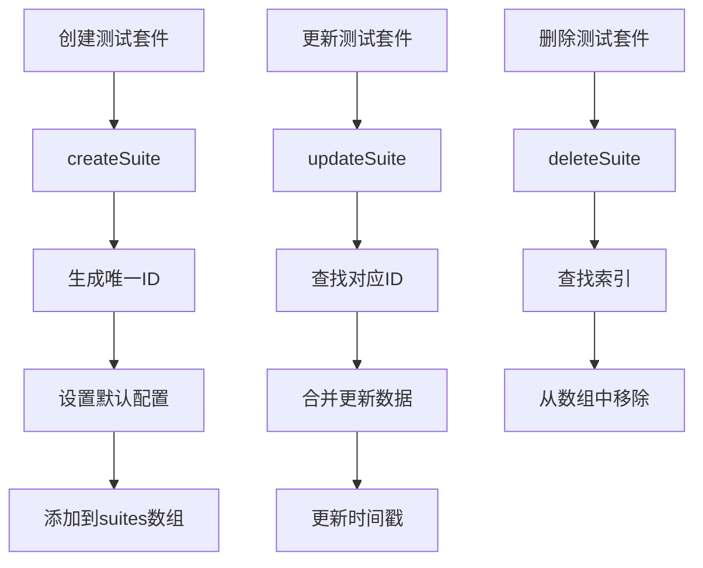

**Diagram sources**
- [automation.ts](file://packages/web-pro/src/stores/automation.ts#L198-L240)

### 自动化执行流程

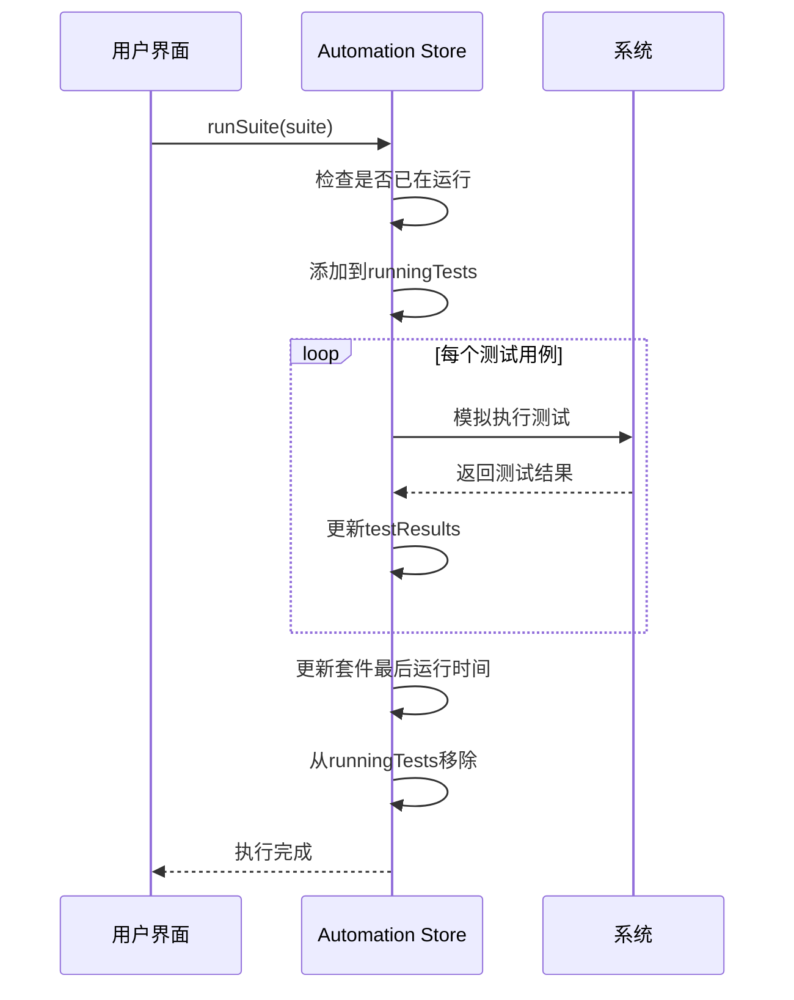

**Diagram sources**
- [automation.ts](file://packages/web-pro/src/stores/automation.ts#L242-L290)
- [Automation.vue](file://packages/web-pro/src/views/Automation.vue#L278-L300)

**Section sources**
- [automation.ts](file://packages/web-pro/src/stores/automation.ts#L198-L318)
- [Automation.vue](file://packages/web-pro/src/views/Automation.vue#L278-L300)

## 计算属性与数据聚合

store 提供了丰富的计算属性来聚合和展示数据。

### 核心计算属性

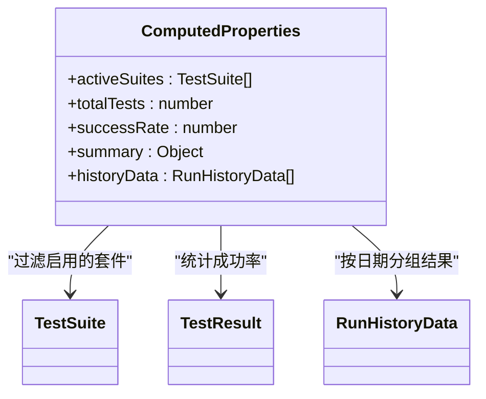

**Diagram sources**
- [automation.ts](file://packages/web-pro/src/stores/automation.ts#L22-L60)

### 历史数据聚合逻辑

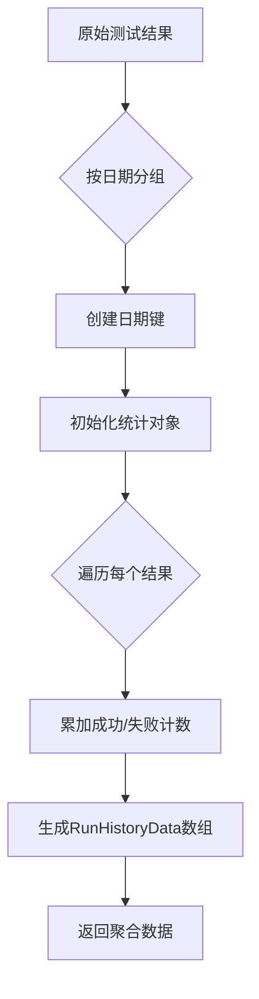

**Diagram sources**
- [automation.ts](file://packages/web-pro/src/stores/automation.ts#L52-L78)

**Section sources**
- [automation.ts](file://packages/web-pro/src/stores/automation.ts#L52-L78)
- [RunHistoryChart.vue](file://packages/web-pro/src/components/automation/RunHistoryChart.vue#L120-L140)

## 定时任务调度机制

系统支持多种调度类型，通过 cron 表达式实现灵活的定时任务配置。

### 调度类型支持

| 类型 | 配置参数 | 示例 |
|------|---------|------|
| cron | cronExpression | "0 0 2 * * *" (每天凌晨2点) |
| interval | interval, intervalUnit | 每2小时执行一次 |
| once | executeAt | 在指定时间单次执行 |

### 调度配置流程

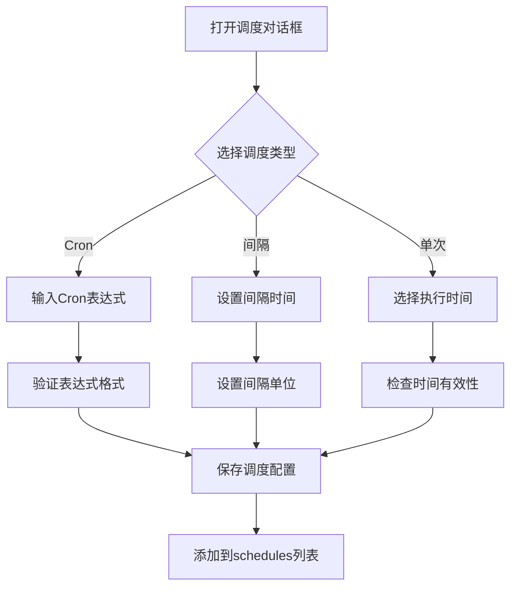

**Diagram sources**
- [ScheduleDialog.vue](file://packages/web-pro/src/components/automation/ScheduleDialog.vue#L43-L105)
- [automation.ts](file://packages/web-pro/src/stores/automation.ts#L378-L400)

**Section sources**
- [ScheduleDialog.vue](file://packages/web-pro/src/components/automation/ScheduleDialog.vue)
- [automation.ts](file://packages/web-pro/src/stores/automation.ts#L378-L400)

## 通知系统集成

自动化模块与通知系统深度集成，实现在关键事件发生时发送通知。

### 通知触发条件

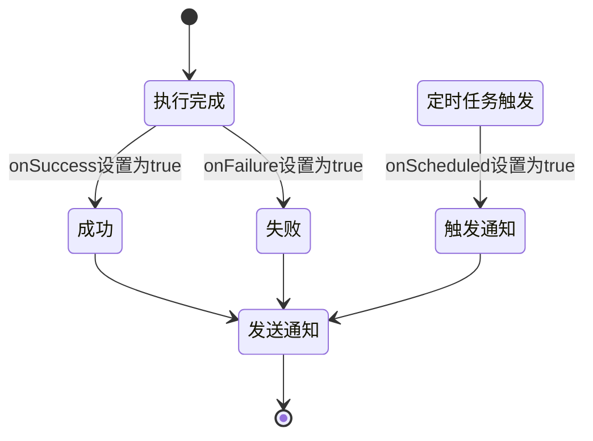

### 通知系统交互

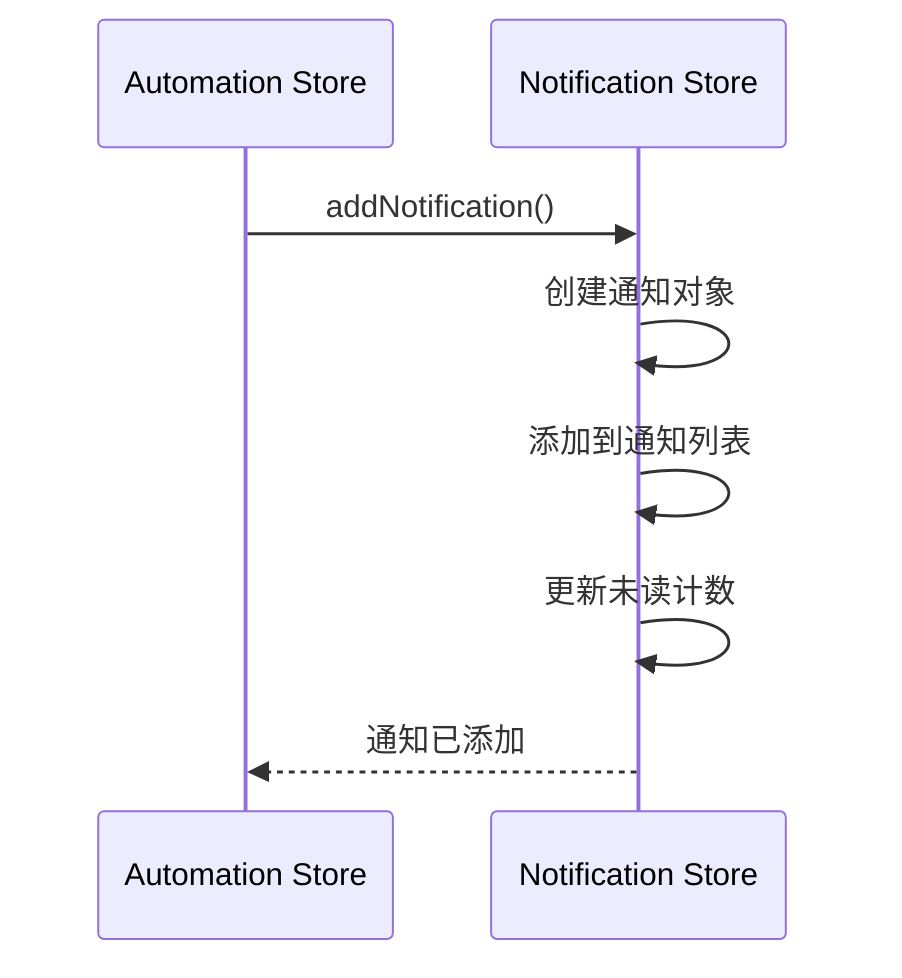

**Diagram sources**
- [notification.ts](file://packages/web-pro/src/stores/notification.ts#L28-L47)
- [automation.ts](file://packages/web-pro/src/stores/automation.ts)

**Section sources**
- [notification.ts](file://packages/web-pro/src/stores/notification.ts)
- [automation.ts](file://packages/web-pro/src/stores/automation.ts)

## 运行历史可视化

RunHistoryChart 组件将执行历史数据可视化为趋势图表。

### 数据流分析

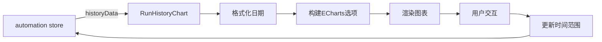

### 图表配置逻辑

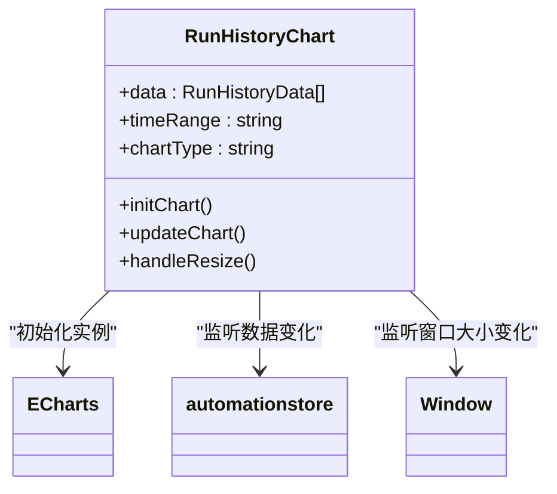

**Diagram sources**
- [RunHistoryChart.vue](file://packages/web-pro/src/components/automation/RunHistoryChart.vue)
- [automation.ts](file://packages/web-pro/src/stores/automation.ts#L52-L78)

**Section sources**
- [RunHistoryChart.vue](file://packages/web-pro/src/components/automation/RunHistoryChart.vue)
- [automation.ts](file://packages/web-pro/src/stores/automation.ts#L52-L78)

## 自动化管理页面实现

Automation.vue 是自动化测试的主管理页面，集成了所有核心功能。

### 页面功能结构

```mermaid
erDiagram
AUTOMATION_PAGE {
string title PK
string subtitle
boolean showCreateSuiteDialog
boolean showScheduleDialog
TestSuite selectedSuite
}
TEST_SUITE_CARD {
string name PK
string description
number testCount
number successRate
datetime lastRun
}
ACTION_BUTTONS {
string action PK
boolean loading
}
AUTOMATION_PAGE ||--o{ TEST_SUITE_CARD : "包含多个"
AUTOMATION_PAGE }|--| ACTION_BUTTONS : "提供操作"
```

### 组件交互关系

```mermaid
graph TD
A[Automation.vue] --> B[PageHeader]
A --> C[TestResultsTable]
A --> D[RunHistoryChart]
A --> E[CreateSuiteDialog]
A --> F[EditSuiteDialog]
A --> G[ScheduleDialog]
A --> H[TestDetailsDialog]
A --> I[automation store]
I --> C : "提供测试结果"
I --> D : "提供历史数据"
I --> G : "提供调度列表"
```

**Diagram sources**
- [Automation.vue](file://packages/web-pro/src/views/Automation.vue)
- [automation.ts](file://packages/web-pro/src/stores/automation.ts)

**Section sources**
- [Automation.vue](file://packages/web-pro/src/views/Automation.vue)
- [automation.ts](file://packages/web-pro/src/stores/automation.ts)

## 最佳实践建议

### 长时间运行任务处理

1. **状态持久化**：定期将运行状态保存到本地存储
2. **故障恢复**：记录检查点，支持从断点恢复执行
3. **超时处理**：设置合理的超时阈值，避免任务卡死

### 失败重试机制

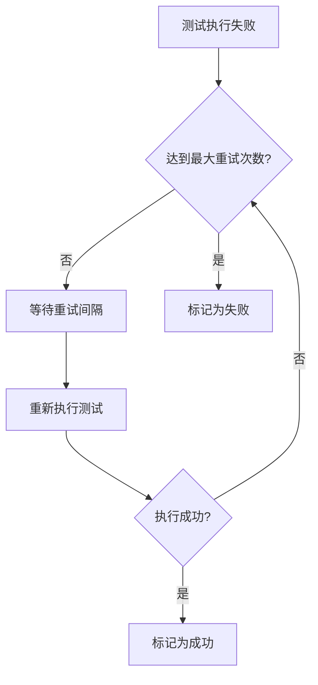

### 报警阈值设置

建议配置以下报警阈值：
- **成功率阈值**：低于90%时触发警告
- **响应时间阈值**：超过1000ms时标记性能问题
- **错误率阈值**：连续3次失败时发送严重警报

**Section sources**
- [automation.ts](file://packages/web-pro/src/stores/automation.ts#L12-L18)
- [ScheduleDialog.vue](file://packages/web-pro/src/components/automation/ScheduleDialog.vue#L184-L233)