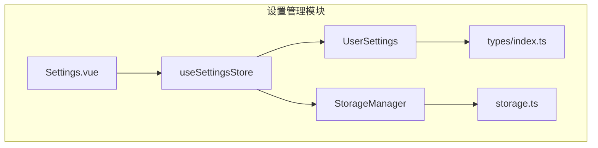
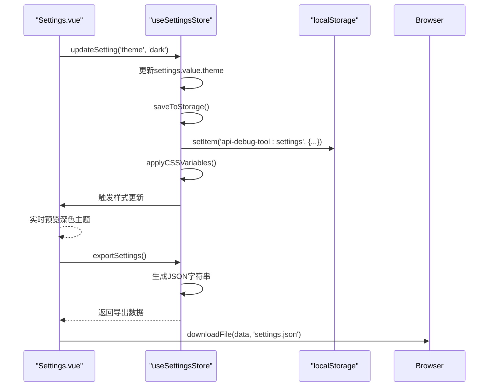
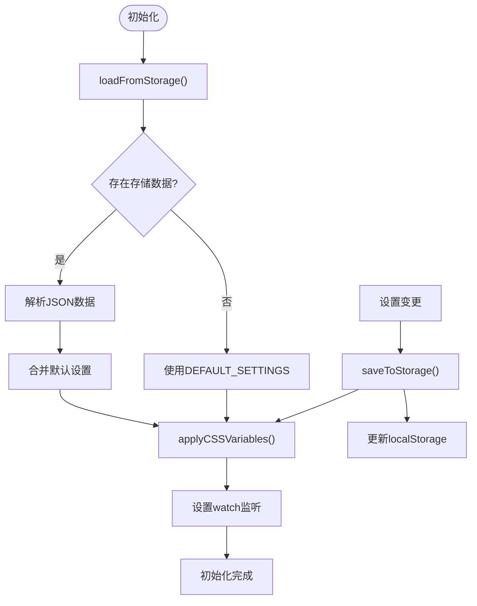
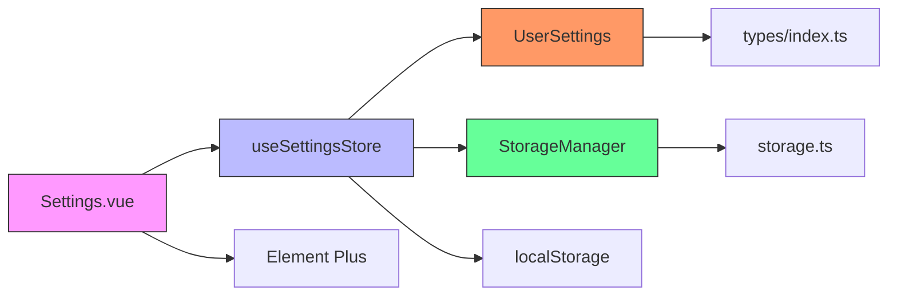

# 设置管理模块

<cite>
**本文档引用文件**  
- [settings.ts](file://packages/web-lite/src/stores/settings.ts)
- [types/index.ts](file://packages/shared/types/index.ts)
- [Settings.vue](file://packages/web-lite/src/views/Settings.vue)
- [storage.ts](file://packages/shared/utils/storage.ts)
</cite>

## 目录
1. [简介](#简介)
2. [项目结构](#项目结构)
3. [核心组件](#核心组件)
4. [架构概述](#架构概述)
5. [详细组件分析](#详细组件分析)
6. [依赖分析](#依赖分析)
7. [性能考虑](#性能考虑)
8. [故障排除指南](#故障排除指南)
9. [结论](#结论)

## 简介
本模块为在线接口调试工具提供统一的用户偏好设置管理功能，涵盖界面主题、自动保存、请求超时等核心配置项。通过Pinia状态管理实现响应式数据绑定，结合本地存储机制确保配置跨会话持久化，并支持深色模式动态切换与多设备同步扩展。

## 项目结构
设置管理模块采用分层架构设计，包含类型定义、状态存储、UI组件三个主要层级。核心逻辑位于`packages/web-lite/src/stores/settings.ts`，视图层由`Settings.vue`实现，共享类型与工具函数分别存放于`shared/types`和`shared/utils`目录。



**图示来源**  
- [settings.ts](file://packages/web-lite/src/stores/settings.ts)
- [types/index.ts](file://packages/shared/types/index.ts)
- [Settings.vue](file://packages/web-lite/src/views/Settings.vue)

**本节来源**  
- [settings.ts](file://packages/web-lite/src/stores/settings.ts)
- [types/index.ts](file://packages/shared/types/index.ts)

## 核心组件

设置管理模块的核心是`useSettingsStore`，它定义了用户偏好设置的状态模型与操作接口。该store通过`ref`管理响应式状态，利用`watch`监听配置变更，并通过`localStorage`实现持久化存储。

**本节来源**  
- [settings.ts](file://packages/web-lite/src/stores/settings.ts#L19-L62)
- [types/index.ts](file://packages/shared/types/index.ts#L1-L50)

## 架构概述

```mermaid
classDiagram
class UserSettings {
+theme : 'light' | 'dark' | 'auto'
+fontSize : 'small' | 'medium' | 'large'
+layout : 'horizontal' | 'vertical'
+autoSave : boolean
+requestTimeout : number
+verifySsl : boolean
+followRedirects : boolean
+maxHistoryItems : number
+showLineNumbers : boolean
+wordWrap : boolean
}
class StoredSettings {
+version : string
+lastUpdated : number
}
class SettingsStore {
-settings : ref~UserSettings~
+updateSettings(newSettings)
+resetSettings()
+updateSetting(key, value)
+toggleTheme()
+toggleLayout()
+increaseFontSize()
+decreaseFontSize()
+exportSettings()
+importSettings(jsonData)
+getCSSVariables()
+applyCSSVariables()
+loadFromStorage()
+saveToStorage()
}
class StorageManager {
-prefix : string
+set(key, value)
+get(key, defaultValue)
+remove(key)
+clear()
}
UserSettings <|-- StoredSettings
SettingsStore --> UserSettings : "管理"
SettingsStore --> StorageManager : "使用"
SettingsStore --> "localStorage" : "持久化"
```

**图示来源**  
- [settings.ts](file://packages/web-lite/src/stores/settings.ts#L1-L271)
- [types/index.ts](file://packages/shared/types/index.ts#L1-L50)
- [storage.ts](file://packages/shared/utils/storage.ts#L1-L54)

## 详细组件分析

### 设置状态分析

#### 对象导向组件
```mermaid
classDiagram
class useSettingsStore {
+settings : ref~UserSettings~
+updateSettings(newSettings : Partial~UserSettings~)
+resetSettings()
+updateSetting~K~(key : K, value : UserSettings[K])
+toggleTheme()
+toggleLayout()
+increaseFontSize()
+decreaseFontSize()
+exportSettings() : string
+importSettings(jsonData : string) : boolean
+getCSSVariables() : Record~string, string~
+applyCSSVariables()
+loadFromStorage()
+saveToStorage()
}
class DEFAULT_SETTINGS {
+theme : 'light'
+fontSize : 'medium'
+layout : 'horizontal'
+autoSave : true
+requestTimeout : 30000
+verifySsl : true
+followRedirects : true
+maxHistoryItems : 100
+showLineNumbers : true
+wordWrap : true
}
useSettingsStore --> DEFAULT_SETTINGS : "初始化"
useSettingsStore --> "localStorage" : "持久化"
```

**图示来源**  
- [settings.ts](file://packages/web-lite/src/stores/settings.ts#L1-L271)

#### API/服务组件


**图示来源**  
- [settings.ts](file://packages/web-lite/src/stores/settings.ts#L19-L62)
- [Settings.vue](file://packages/web-lite/src/views/Settings.vue#L51-L84)

#### 复杂逻辑组件


**图示来源**  
- [settings.ts](file://packages/web-lite/src/stores/settings.ts#L188-L236)
- [settings.ts](file://packages/web-lite/src/stores/settings.ts#L230-L271)

**本节来源**  
- [settings.ts](file://packages/web-lite/src/stores/settings.ts#L1-L271)
- [Settings.vue](file://packages/web-lite/src/views/Settings.vue#L1-L593)

## 依赖分析



**图示来源**  
- [settings.ts](file://packages/web-lite/src/stores/settings.ts)
- [types/index.ts](file://packages/shared/types/index.ts)
- [storage.ts](file://packages/shared/utils/storage.ts)
- [Settings.vue](file://packages/web-lite/src/views/Settings.vue)

**本节来源**  
- [settings.ts](file://packages/web-lite/src/stores/settings.ts#L1-L271)
- [types/index.ts](file://packages/shared/types/index.ts#L1-L50)
- [storage.ts](file://packages/shared/utils/storage.ts#L1-L54)

## 性能考虑
设置管理模块采用轻量级状态管理方案，避免不必要的重新渲染。通过`watch`精确监听关键配置项变化，仅在主题、字体、布局变更时触发CSS变量更新。本地存储操作使用try-catch包裹，防止异常中断主流程。默认设置采用浅拷贝初始化，确保性能高效。

## 故障排除指南
当配置无法持久化时，请检查浏览器是否禁用`localStorage`。若主题切换失效，确认`applyCSSVariables`是否被正确调用。导入设置失败通常源于JSON格式错误，建议使用标准JSON验证工具检查数据完整性。多设备同步问题可通过实现云存储适配器解决。

**本节来源**  
- [settings.ts](file://packages/web-lite/src/stores/settings.ts#L188-L236)
- [settings.ts](file://packages/web-lite/src/stores/settings.ts#L103-L150)

## 结论
设置管理模块提供了完整的用户偏好配置解决方案，具备良好的扩展性与维护性。通过Pinia实现响应式状态管理，结合本地存储确保数据持久化，支持主题动态切换与配置导入导出。未来可扩展云同步功能，实现多设备间配置无缝同步。