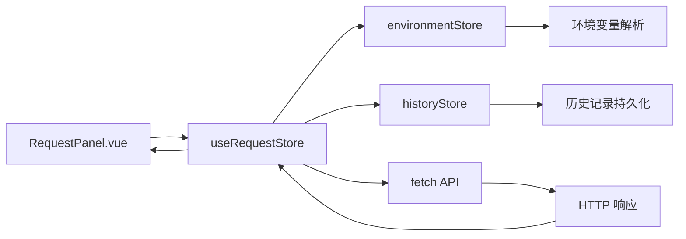
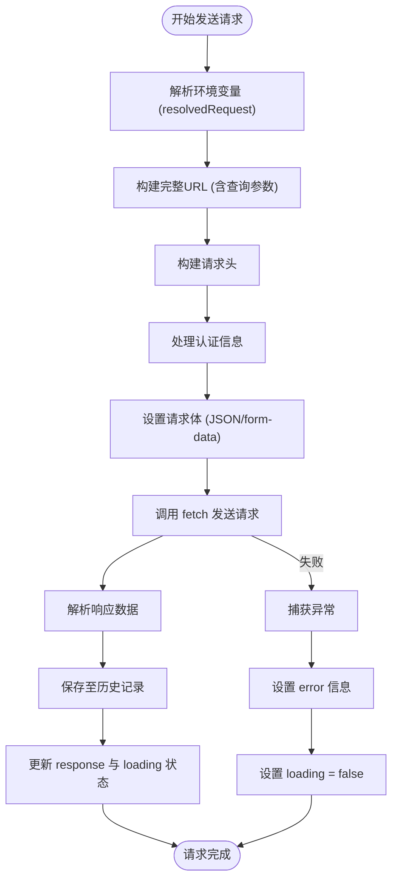

# 请求管理模块

<cite>
**本文档引用的文件**  
- [request.ts](file://packages/web-lite/src/stores/request.ts)
- [RequestPanel.vue](file://packages/web-lite/src/components/RequestPanel.vue)
- [formatter.ts](file://packages/shared/utils/formatter.ts)
- [http.ts](file://packages/shared/utils/http.ts)
</cite>

## 目录
1. [简介](#简介)
2. [项目结构](#项目结构)
3. [核心组件](#核心组件)
4. [架构概述](#架构概述)
5. [详细组件分析](#详细组件分析)
6. [依赖分析](#依赖分析)
7. [性能考虑](#性能考虑)
8. [故障排除指南](#故障排除指南)
9. [结论](#结论)

## 简介
本文档系统化描述了在线接口调试工具中的请求管理模块，重点围绕 `useRequestStore` 的状态管理机制、请求处理流程、异常处理策略及与 UI 组件的集成方式。该模块基于 Pinia 实现响应式状态管理，支持完整的 HTTP 请求构建、发送、历史记录保存与响应数据展示功能，适用于轻量级调试场景。

## 项目结构
请求管理模块位于 `web-lite` 子项目中，采用模块化设计，核心逻辑集中于 `stores/request.ts`，并通过 `RequestPanel.vue` 实现用户交互界面。整体结构清晰，职责分离明确。

```mermaid
graph TB
subgraph "请求管理模块"
Store[request.ts]
Component[RequestPanel.vue]
Utils[formatter.ts, http.ts]
end
Store --> Component : "提供状态与方法"
Component --> Store : "触发动作"
Store --> Utils : "调用工具函数"
```

**Diagram sources**
- [request.ts](file://packages/web-lite/src/stores/request.ts#L1-L305)
- [RequestPanel.vue](file://packages/web-lite/src/components/RequestPanel.vue)

## 核心组件
`useRequestStore` 是请求管理的核心，封装了当前请求配置、响应数据、加载状态与错误信息，并提供发送、清除、加载历史等操作方法。其状态设计充分考虑了可维护性与扩展性。

**Section sources**
- [request.ts](file://packages/web-lite/src/stores/request.ts#L1-L305)

## 架构概述
该模块采用典型的 MVVM 架构模式，Pinia Store 作为 ViewModel 层，连接 View（Vue 组件）与 Model（HTTP 工具类与持久化逻辑）。通过计算属性实现环境变量解析，确保请求配置的动态性。



**Diagram sources**
- [request.ts](file://packages/web-lite/src/stores/request.ts#L1-L305)
- [RequestPanel.vue](file://packages/web-lite/src/components/RequestPanel.vue)

## 详细组件分析

### 请求状态管理分析
`useRequestStore` 定义了 `currentRequest`、`response`、`loading` 和 `error` 四个核心响应式状态，分别表示当前请求配置、响应结果、加载状态与错误信息。通过 `ref` 实现响应式绑定，确保视图自动更新。

#### 状态字段说明
| 字段 | 类型 | 描述 |
|------|------|------|
| `currentRequest` | `RequestConfig` | 当前请求的完整配置，包括方法、URL、头信息、参数、认证等 |
| `response` | `ResponseData \| null` | 最近一次请求的响应数据，初始为 `null` |
| `loading` | `boolean` | 是否正在发送请求，用于控制按钮状态与加载指示器 |
| `error` | `string \| null` | 请求过程中发生的错误信息，`null` 表示无错误 |

**Section sources**
- [request.ts](file://packages/web-lite/src/stores/request.ts#L4-L20)

### 请求发送流程分析
`sendRequest` 方法是核心业务逻辑入口，负责构建最终请求并调用浏览器 `fetch` API 发送。其流程包括环境变量解析、URL 构建、头信息设置、认证处理、请求体序列化与响应解析。



**Diagram sources**
- [request.ts](file://packages/web-lite/src/stores/request.ts#L50-L250)

### 状态操作方法分析
Store 提供了多个操作方法用于管理请求生命周期：

- `clearRequest`: 重置 `currentRequest` 为默认值
- `clearResponse`: 清空响应数据与错误信息
- `clearAll`: 同时清除请求与响应
- `loadFromHistory`: 从历史记录加载请求配置

这些方法通过直接修改 `ref` 值实现状态变更，符合 Vue 的响应式更新机制。

**Section sources**
- [request.ts](file://packages/web-lite/src/stores/request.ts#L250-L300)

## 依赖分析
请求管理模块依赖多个内部与外部组件，形成清晰的依赖链。

```mermaid
graph TD
RequestStore --> EnvironmentStore : "使用环境变量解析"
RequestStore --> HistoryStore : "保存请求历史"
RequestStore --> FetchAPI : "发送HTTP请求"
RequestStore --> Formatter : "可选：格式化请求体"
EnvironmentStore --> Storage : "持久化环境变量"
HistoryStore --> Storage : "持久化历史记录"
```

**Diagram sources**
- [request.ts](file://packages/web-lite/src/stores/request.ts#L6-L8)
- [environment.ts](file://packages/web-lite/src/stores/environment.ts)
- [history.ts](file://packages/web-lite/src/stores/history.ts)

## 性能考虑
对于大体积响应数据，建议在 `ResponsePanel.vue` 中采用流式渲染策略，避免一次性渲染导致页面卡顿。可通过以下方式优化：
- 对 JSON 响应使用懒加载树形组件
- 对文本响应启用虚拟滚动
- 在 `clearResponse` 时及时释放内存引用
- 限制历史记录条目数量，避免内存泄漏

## 故障排除指南
常见问题及解决方案：

- **请求超时**：检查 `timeout` 配置值，默认 30 秒，可通过界面调整
- **认证失败**：确认认证类型与参数正确，Bearer Token 是否包含前缀
- **环境变量未替换**：确保环境已激活且变量名匹配 `${var}` 格式
- **CORS 错误**：此为浏览器安全策略限制，需目标服务支持跨域
- **历史记录丢失**：检查浏览器本地存储是否被清除

**Section sources**
- [request.ts](file://packages/web-lite/src/stores/request.ts#L150-L200)
- [storage.ts](file://packages/shared/utils/storage.ts)

## 结论
`useRequestStore` 模块设计合理，功能完整，具备良好的可维护性与扩展性。通过 Pinia 实现的状态管理有效解耦了业务逻辑与 UI 层，结合环境变量与历史记录功能，为用户提供高效便捷的接口调试体验。未来可进一步集成请求体格式化（通过 `formatter.ts`）与更精细的错误码映射机制，提升专业性。