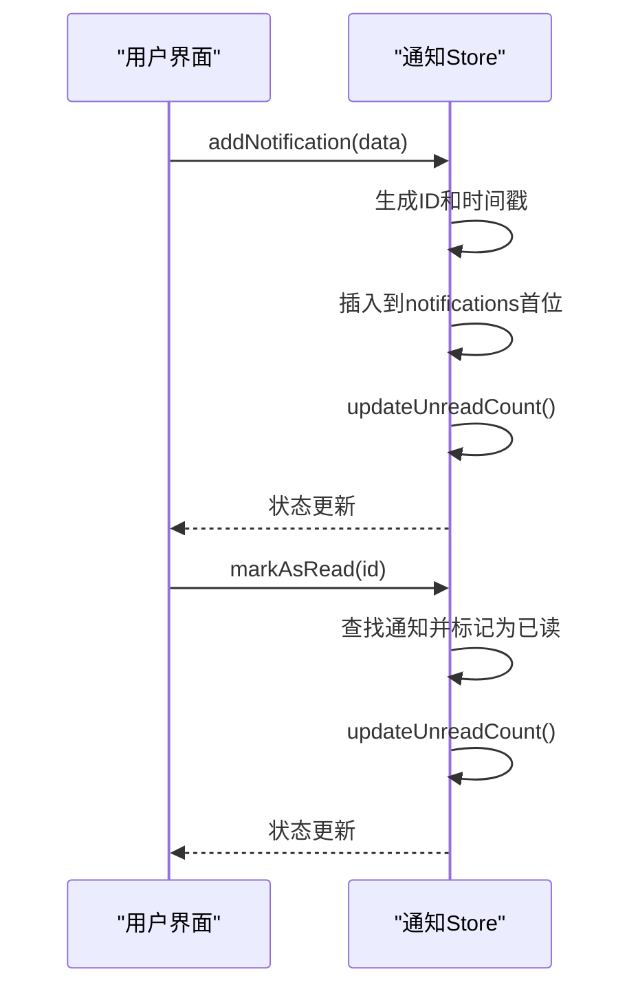
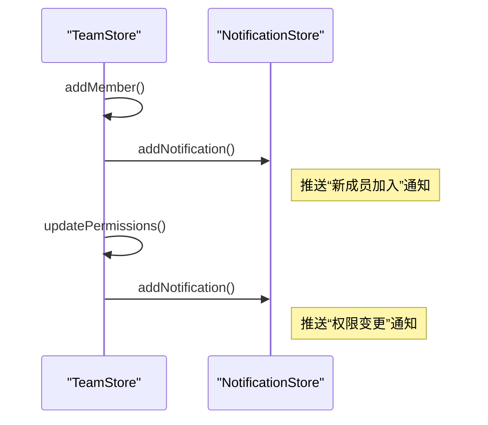
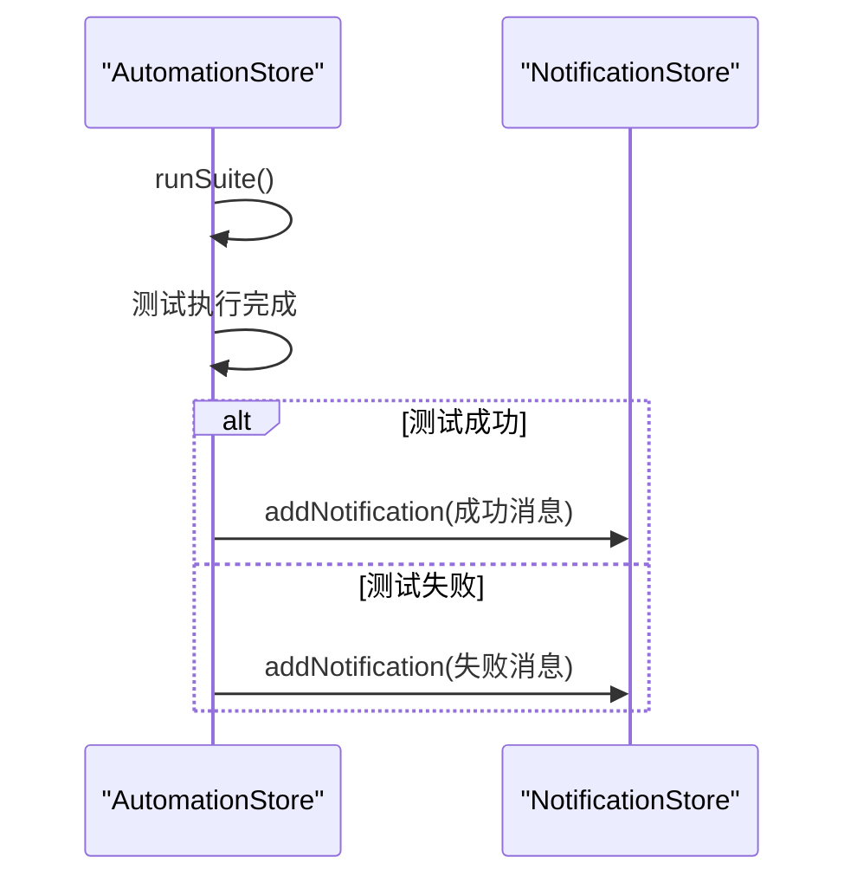
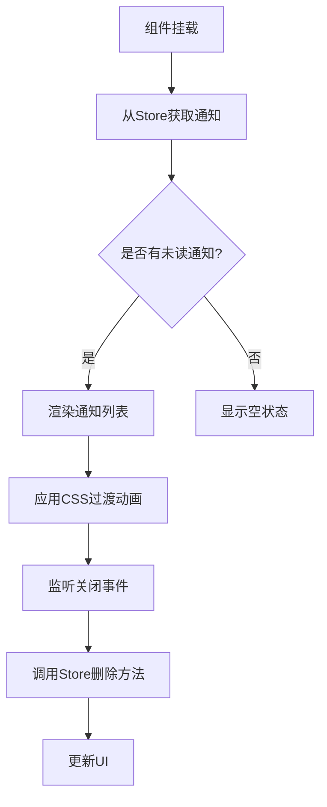
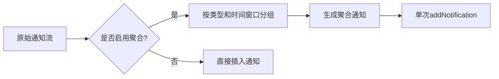

# 通知中心模块

<cite>
**本文档引用的文件**  
- [notification.ts](file://packages/web-pro/src/stores/notification.ts)
- [NotificationCenter.vue](file://packages/web-pro/src/components/common/NotificationCenter.vue)
- [team.ts](file://packages/web-pro/src/stores/team.ts)
- [automation.ts](file://packages/web-pro/src/stores/automation.ts)
</cite>

## 目录
1. [简介](#简介)
2. [状态管理设计](#状态管理设计)
3. [核心操作方法](#核心操作方法)
4. [与其他模块的集成](#与其他模块的集成)
5. [通知中心组件实现](#通知中心组件实现)
6. [WebSocket与离线消息处理](#websocket与离线消息处理)
7. [性能优化策略](#性能优化策略)
8. [总结](#总结)

## 简介
本模块负责管理应用中的通知系统，提供统一的消息存储、状态跟踪和用户交互机制。通过Pinia状态管理实现通知的增删改查、未读计数、生命周期管理，并与团队、自动化测试等核心功能模块深度集成，支持实时事件推送与用户反馈。

## 状态管理设计

```mermaid
classDiagram
class NotificationState {
+notifications : Notification[]
+unreadCount : number
}
class Notification {
+id : string
+title : string
+message : string
+type : 'success' | 'warning' | 'error' | 'info'
+timestamp : number
+read : boolean
+actions? : Array<{ label : string, action : Function }>
}
NotificationState --> Notification : "包含多个"
```

**图示来源**  
- [notification.ts](file://packages/web-pro/src/stores/notification.ts#L4-L10)

**本节来源**  
- [notification.ts](file://packages/web-pro/src/stores/notification.ts#L1-L20)

## 核心操作方法

### 添加通知
通过 `addNotification` 方法创建新通知，自动补全 `id`、`timestamp` 和 `read` 字段，并将通知插入到列表头部，确保最新消息优先展示。

### 标记已读
`markAsRead(id)` 方法根据ID查找指定通知并设置其 `read` 状态为 `true`，随后调用 `updateUnreadCount()` 同步更新未读数量。

### 批量操作
支持 `markAllAsRead()` 全部标记为已读和 `clearAll()` 清空所有通知，适用于用户主动清理场景。

### 移除通知
`removeNotification(id)` 支持单个移除，常用于用户手动关闭特定通知。



**图示来源**  
- [notification.ts](file://packages/web-pro/src/stores/notification.ts#L25-L64)

**本节来源**  
- [notification.ts](file://packages/web-pro/src/stores/notification.ts#L25-L64)

## 与其他模块的集成

### 团队模块集成
团队模块在关键事件（如成员加入、权限变更）发生时，通过调用通知模块接口推送提醒：



**图示来源**  
- [team.ts](file://packages/web-pro/src/stores/team.ts#L280-L300)
- [notification.ts](file://packages/web-pro/src/stores/notification.ts#L30-L38)

### 自动化测试模块集成
自动化测试模块在测试完成或失败时触发通知：



**图示来源**  
- [automation.ts](file://packages/web-pro/src/stores/automation.ts#L250-L280)
- [notification.ts](file://packages/web-pro/src/stores/notification.ts#L30-L38)

**本节来源**  
- [team.ts](file://packages/web-pro/src/stores/team.ts#L280-L300)
- [automation.ts](file://packages/web-pro/src/stores/automation.ts#L250-L280)

## 通知中心组件实现

### 组件结构
`NotificationCenter.vue` 是一个固定在右上角的浮动面板，使用 `<transition-group>` 实现通知的入场与离场动画效果。

### 数据绑定
通过 `computed` 属性 `visibleNotifications` 动态获取未读的最近10条通知，实现消息流的实时更新。

### 交互逻辑
- 点击关闭按钮调用 `removeNotification(id)` 删除指定通知
- 支持内联操作按钮（actions），可执行自定义回调函数



**图示来源**  
- [NotificationCenter.vue](file://packages/web-pro/src/components/common/NotificationCenter.vue#L1-L124)

**本节来源**  
- [NotificationCenter.vue](file://packages/web-pro/src/components/common/NotificationCenter.vue#L1-L124)

## WebSocket与离线消息处理

### WebSocket消息解析
系统通过WebSocket接收实时事件，消息到达后由事件总线分发至对应模块。通知模块监听以下事件类型：
- `team:member_joined`：团队成员加入
- `test:completed`：测试任务完成
- `system:alert`：系统级警告

解析流程：
1. 接收JSON格式消息
2. 验证消息结构与签名
3. 映射到对应通知类型
4. 调用 `addNotification` 插入消息

### 离线消息恢复
使用浏览器 `localStorage` 持久化存储未读通知，在用户重新上线时恢复状态：
- 页面加载时从本地存储读取缓存通知
- 与服务器同步最新状态，去重合并
- 更新Store中的 `notifications` 和 `unreadCount`

**本节来源**  
- [notification.ts](file://packages/web-pro/src/stores/notification.ts#L25-L64)
- [team.ts](file://packages/web-pro/src/stores/team.ts#L280-L300)
- [automation.ts](file://packages/web-pro/src/stores/automation.ts#L250-L280)

## 性能优化策略

### 高频通知节流
针对批量测试完成等高频场景，采用以下优化方案：



### 聚合策略
- **时间窗口**：5秒内相同类型通知合并
- **计数显示**：如“3个测试套件已完成”
- **展开详情**：点击后展示具体列表

### 内存管理
- 限制最大存储数量（默认100条）
- 超出时自动清理最旧的已读通知
- 提供手动清理入口

**本节来源**  
- [notification.ts](file://packages/web-pro/src/stores/notification.ts#L25-L64)
- [automation.ts](file://packages/web-pro/src/stores/automation.ts#L250-L280)

## 总结
通知中心模块作为系统级服务，实现了完整的生命周期管理、跨模块集成和用户体验优化。通过清晰的状态设计、灵活的API接口和高效的性能策略，为团队协作与自动化测试提供了可靠的消息通道支持。