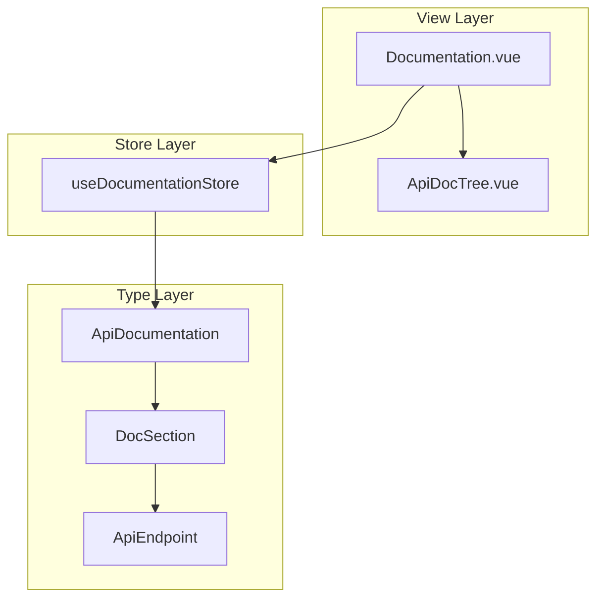
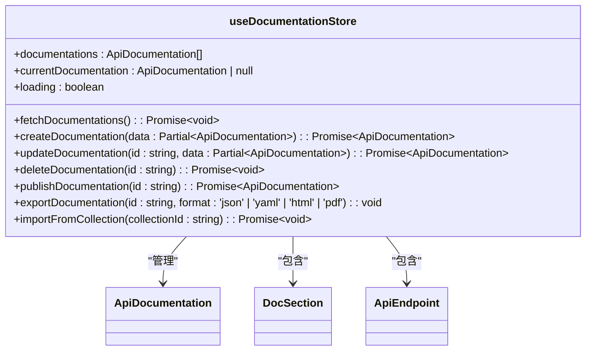
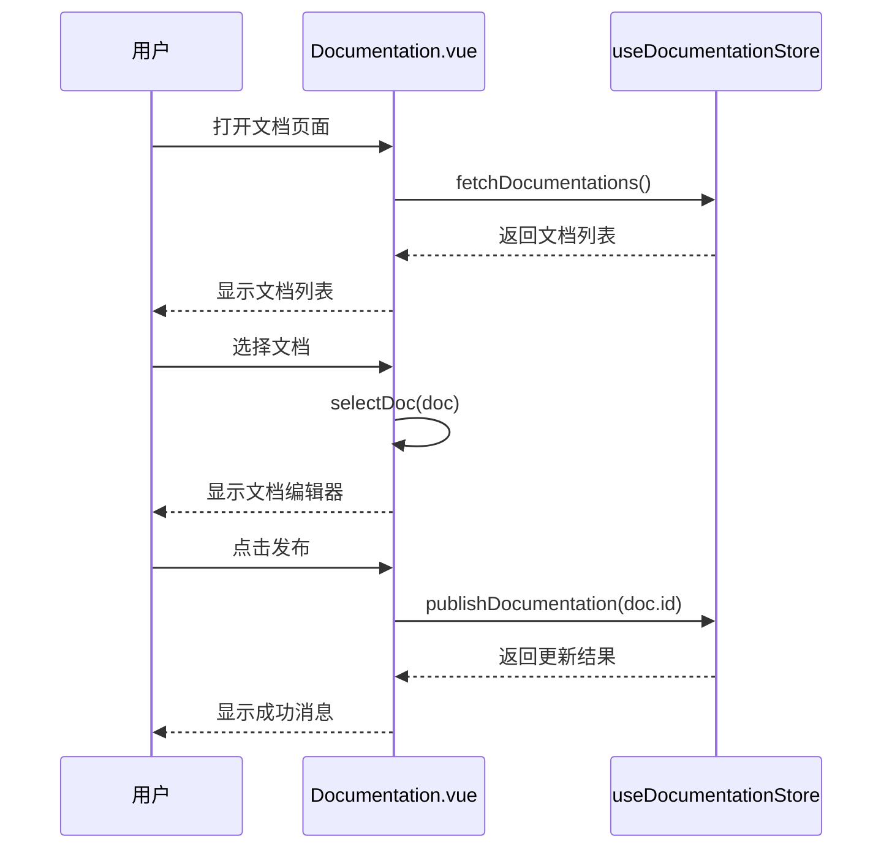
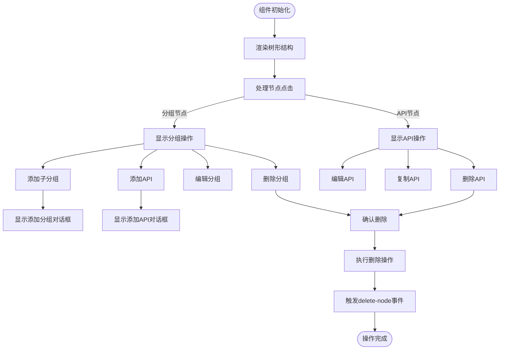
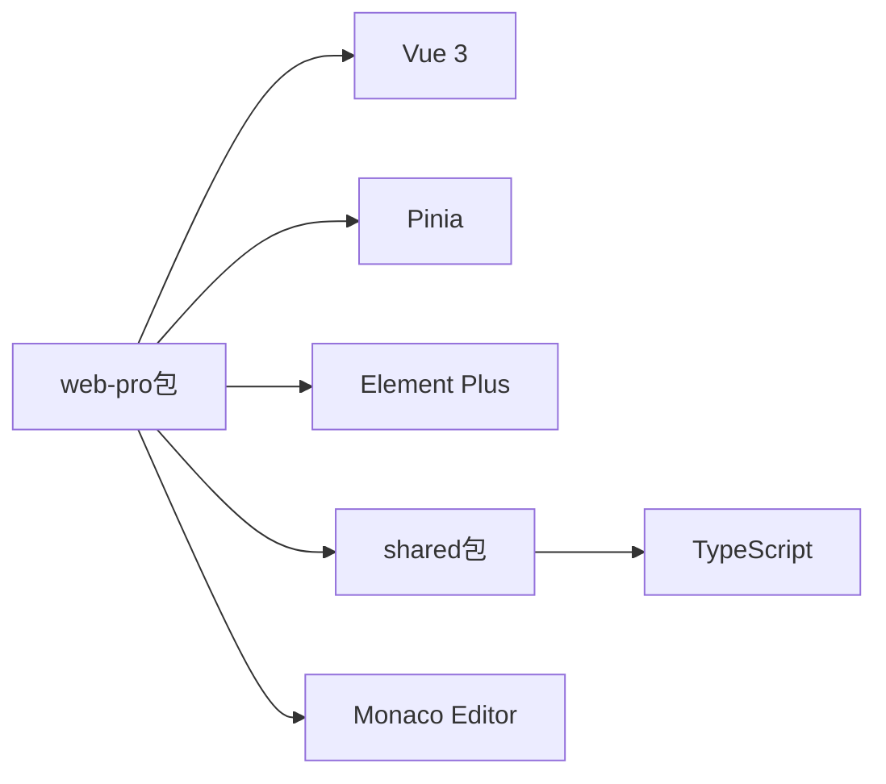

# API文档生成

<cite>
**本文档引用的文件**  
- [documentation.ts](file://packages\web-pro\src\stores\documentation.ts)
- [index.ts](file://packages\web-pro\src\types\index.ts)
- [Documentation.vue](file://packages\web-pro\src\views\Documentation.vue)
- [ApiDocTree.vue](file://packages\web-pro\src\components\documentation\ApiDocTree.vue)
</cite>

## 目录
1. [简介](#简介)
2. [项目结构](#项目结构)
3. [核心组件](#核心组件)
4. [架构概述](#架构概述)
5. [详细组件分析](#详细组件分析)
6. [依赖分析](#依赖分析)
7. [性能考虑](#性能考虑)
8. [故障排除指南](#故障排除指南)
9. [结论](#结论)

## 简介
本项目是一个在线接口调试工具，支持API文档的自动生成与发布。`web-pro`包提供了高级功能，包括API文档管理、团队协作、自动化测试和性能监控。文档功能允许用户创建、编辑、发布和导出API文档，支持从集合导入接口，并提供预览和分享功能。

## 项目结构
项目采用多包结构，`web-pro`包专注于高级功能，特别是API文档生成和管理。`shared`包包含跨包共享的类型定义。`web-pro`的`src`目录包含组件、页面、存储和类型定义，支持复杂的文档编辑和预览功能。

**文档来源**
- [documentation.ts](file://packages\web-pro\src\stores\documentation.ts#L1-L612)
- [index.ts](file://packages\web-pro\src\types\index.ts#L679-L748)

## 核心组件
核心组件包括`ApiDocumentation`类型定义、`useDocumentationStore`存储和`Documentation.vue`视图。这些组件共同实现了文档的创建、管理、编辑和发布功能。`ApiDocTree`组件提供了树形结构的API接口管理界面。

**文档来源**
- [documentation.ts](file://packages\web-pro\src\stores\documentation.ts#L1-L612)
- [index.ts](file://packages\web-pro\src\types\index.ts#L679-L748)

## 架构概述
系统采用Vue 3和Pinia构建，使用组件化架构。`Documentation.vue`作为主视图，集成`ApiDocTree`等子组件。`useDocumentationStore`管理所有文档状态和业务逻辑。类型系统定义了文档、章节、接口等实体的结构。

**图表来源**
- [Documentation.vue](file://packages\web-pro\src\views\Documentation.vue#L1-L817)
- [documentation.ts](file://packages\web-pro\src\stores\documentation.ts#L1-L612)
- [index.ts](file://packages\web-pro\src\types\index.ts#L679-L748)

## 详细组件分析

### 文档存储分析
`useDocumentationStore`是文档功能的核心，管理文档的全生命周期操作。

**图表来源**
- [documentation.ts](file://packages\web-pro\src\stores\documentation.ts#L1-L612)

**文档来源**
- [documentation.ts](file://packages\web-pro\src\stores\documentation.ts#L1-L612)

### 文档视图分析
`Documentation.vue`是文档管理的主界面，提供文档列表、编辑器和预览功能。

**图表来源**
- [Documentation.vue](file://packages\web-pro\src\views\Documentation.vue#L1-L817)
- [documentation.ts](file://packages\web-pro\src\stores\documentation.ts#L1-L612)

**文档来源**
- [Documentation.vue](file://packages\web-pro\src\views\Documentation.vue#L1-L817)

### API文档树分析
`ApiDocTree`组件提供树形结构的API接口管理。

**图表来源**
- [ApiDocTree.vue](file://packages\web-pro\src\components\documentation\ApiDocTree.vue#L1-L355)

**文档来源**
- [ApiDocTree.vue](file://packages\web-pro\src\components\documentation\ApiDocTree.vue#L1-L355)

## 依赖分析
项目依赖于Vue 3、Pinia、Element Plus等框架和库。`web-pro`包依赖`shared`包的类型定义。文档功能依赖`@element-plus/icons-vue`用于图标显示。

**图表来源**
- [package.json](file://packages\web-pro\package.json)
- [tsconfig.json](file://packages\web-pro\tsconfig.json)

## 性能考虑
文档功能在加载大量文档时可能影响性能。建议实现分页加载和虚拟滚动。`fetchDocumentations`方法使用1秒延迟模拟API调用，实际应用中应优化网络请求。`exportDocumentation`方法在导出大文档时可能阻塞UI线程，建议使用Web Worker。

## 故障排除指南
常见问题包括文档无法保存、预览无法加载和导入失败。检查网络连接和API端点。确保`previewUrl`格式正确。验证文档数据结构是否符合`ApiDocumentation`类型定义。检查浏览器控制台是否有JavaScript错误。

**文档来源**
- [documentation.ts](file://packages\web-pro\src\stores\documentation.ts#L1-L612)
- [Documentation.vue](file://packages\web-pro\src\views\Documentation.vue#L1-L817)

## 结论
API文档生成功能提供了完整的文档生命周期管理，从创建、编辑到发布和导出。系统设计合理，组件职责清晰。建议完善类型定义的一致性，优化性能，并实现真实的API集成替代模拟数据。