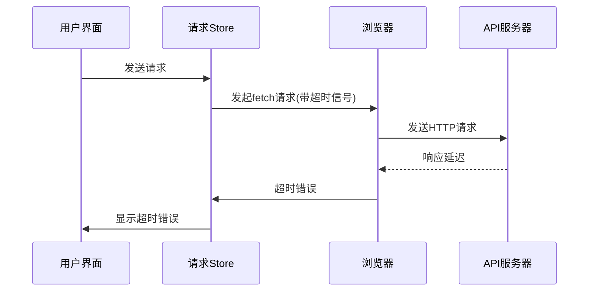
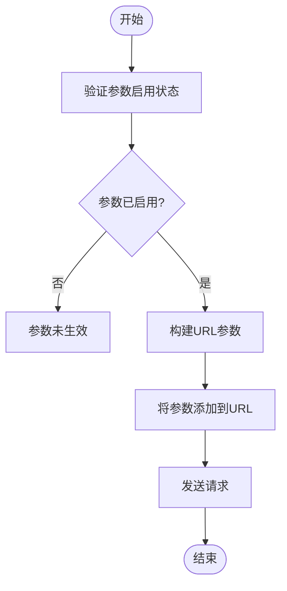
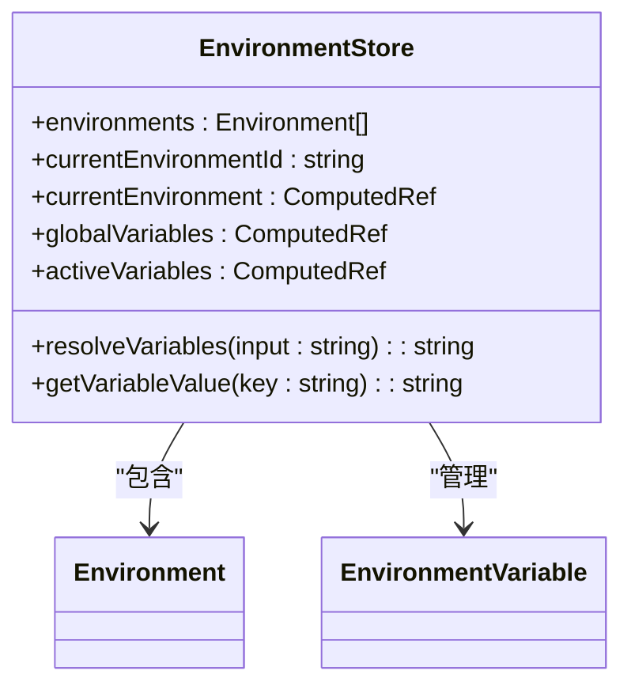
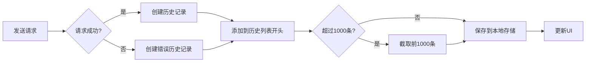
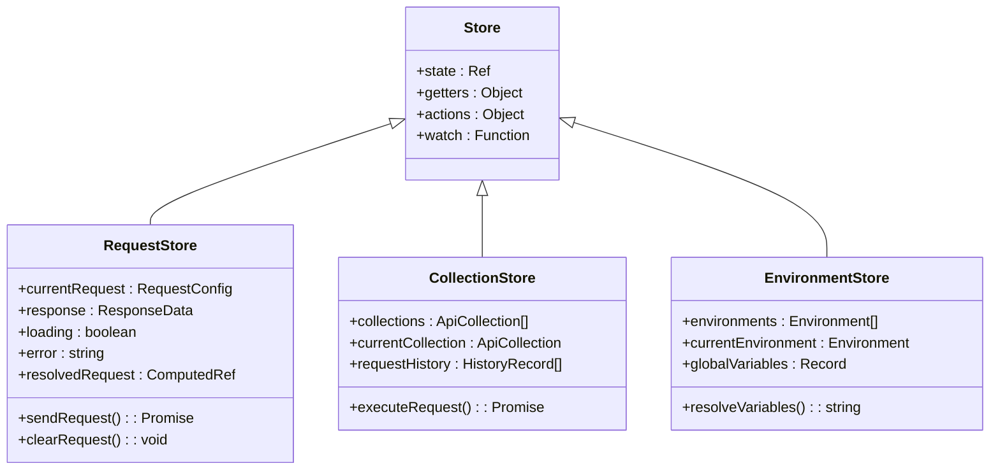
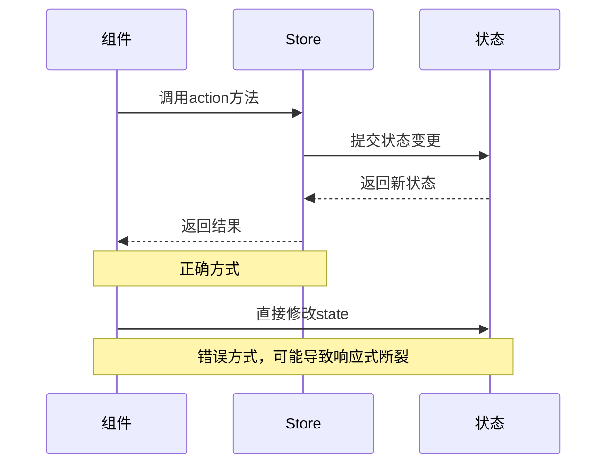
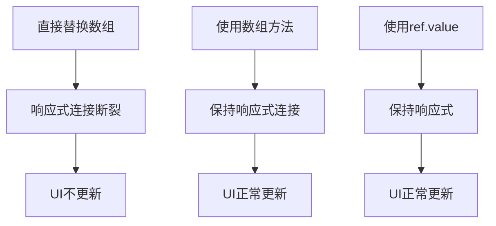
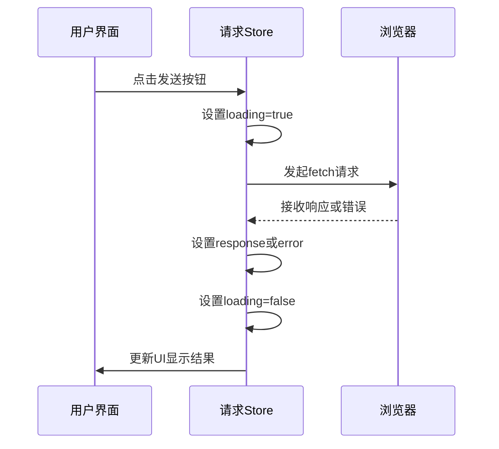
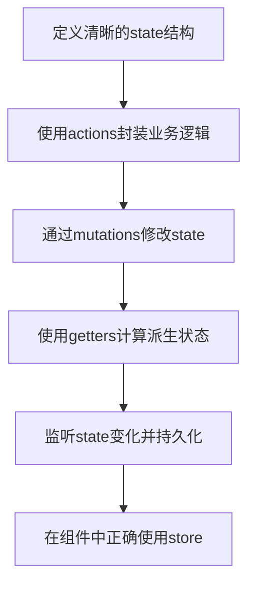

# 功能使用问题

<cite>
**本文档引用的文件**  
- [request.ts](file://packages/web-lite/src/stores/request.ts)
- [collection.ts](file://packages/web-full/src/stores/collection.ts)
- [environment.ts](file://packages/web-lite/src/stores/environment.ts)
- [history.ts](file://packages/web-lite/src/stores/history.ts)
- [RequestPanel.vue](file://packages/web-lite/src/components/RequestPanel.vue)
- [ResponsePanel.vue](file://packages/web-lite/src/components/ResponsePanel.vue)
- [ApiDebugger.vue](file://packages/web-full/src/pages/ApiDebugger.vue)
- [EnvironmentManagement.vue](file://packages/web-full/src/pages/EnvironmentManagement.vue)
- [HistoryManagement.vue](file://packages/web-full/src/pages/HistoryManagement.vue)
</cite>

## 目录
1. [常见功能问题](#常见功能问题)  
2. [API请求失败问题](#api请求失败问题)  
3. [请求参数未生效](#请求参数未生效)  
4. [环境变量注入失败](#环境变量注入失败)  
5. [历史记录丢失](#历史记录丢失)  
6. [Pinia状态管理机制](#pinia状态管理机制)  
7. [Store更新失败原因](#store更新失败原因)  
8. [开发者工具使用方法](#开发者工具使用方法)  
9. [正确使用模式](#正确使用模式)

## 常见功能问题

本文档系统整理用户在日常使用接口调试工具时遇到的典型问题，包括API请求发送失败、请求参数未生效、环境变量无法正确注入、历史记录丢失等。通过分析Pinia状态管理机制，解释store更新失败的可能原因，并提供浏览器开发者工具检查状态、追踪请求生命周期、验证store提交的方法。

## API请求失败问题

### 超时问题
当API请求超时时，系统会自动中断请求并返回错误信息。在`request.ts`中，请求配置包含`timeout`字段，默认值为30000毫秒（30秒），通过`AbortSignal.timeout()`实现超时控制。

**Diagram sources**  
- [request.ts](file://packages/web-lite/src/stores/request.ts#L84-L121)

### CORS问题
跨域资源共享(CORS)问题通常由服务器端配置引起。当浏览器检测到跨域请求时，会先发送预检请求(OPTIONS)，如果服务器未正确响应CORS头信息，则请求会被浏览器阻止。

**Section sources**  
- [request.ts](file://packages/web-lite/src/stores/request.ts#L84-L121)

## 请求参数未生效

### Query参数问题
在`RequestPanel.vue`中，查询参数通过`params`数组管理，每个参数包含`key`、`value`和`enabled`状态。参数未生效的常见原因是参数未启用或键值对格式错误。

**Diagram sources**  
- [RequestPanel.vue](file://packages/web-lite/src/components/RequestPanel.vue#L46-L87)
- [ApiDebugger.vue](file://packages/web-full/src/pages/ApiDebugger.vue#L177-L210)

**Section sources**  
- [RequestPanel.vue](file://packages/web-lite/src/components/RequestPanel.vue#L46-L87)
- [ApiDebugger.vue](file://packages/web-full/src/pages/ApiDebugger.vue#L177-L210)

## 环境变量注入失败

### 变量解析机制
环境变量注入通过`environment.ts`中的`resolveVariables`函数实现，该函数使用正则表达式`{{key}}`匹配并替换URL、请求头和参数中的变量。

**Diagram sources**  
- [environment.ts](file://packages/web-lite/src/stores/environment.ts#L0-L39)

### 常见注入失败原因
1. 变量语法错误：必须使用`{{variable_name}}`格式
2. 环境未激活：当前环境未正确设置
3. 变量不存在：引用的变量在当前环境中未定义
4. 作用域问题：全局变量与环境变量冲突

**Section sources**  
- [environment.ts](file://packages/web-lite/src/stores/environment.ts#L931-L984)

## 历史记录丢失

### 历史记录管理
历史记录通过`history.ts`中的`items`数组管理，支持添加、删除、搜索和导出功能。系统会自动将每次成功的请求保存到历史记录中。

**Diagram sources**  
- [collection.ts](file://packages/web-full/src/stores/collection.ts#L489-L537)
- [history.ts](file://packages/web-lite/src/stores/history.ts#L127-L180)

### 历史记录丢失原因
1. 浏览器隐私模式：localStorage数据在会话结束后清除
2. 存储空间不足：浏览器限制了存储容量
3. 手动清除：用户清除了浏览器数据
4. 同步问题：多标签页操作导致数据竞争

**Section sources**  
- [collection.ts](file://packages/web-full/src/stores/collection.ts#L489-L537)
- [history.ts](file://packages/web-lite/src/stores/history.ts#L177-L248)
- [HistoryManagement.vue](file://packages/web-full/src/pages/HistoryManagement.vue#L985-L1038)

## Pinia状态管理机制

### Store结构
Pinia store采用模块化设计，每个功能模块对应一个独立的store文件，通过`defineStore`创建。状态(state)、计算属性(getters)、动作(actions)和监听器(watch)构成了完整的状态管理机制。

**Diagram sources**  
- [request.ts](file://packages/web-lite/src/stores/request.ts#L0-L304)
- [collection.ts](file://packages/web-full/src/stores/collection.ts#L0-L799)
- [environment.ts](file://packages/web-full/src/stores/environment.ts#L0-L799)

## Store更新失败原因

### Action调用错误
Store更新失败最常见的原因是action调用方式不正确。正确的调用方式是通过store实例调用action方法，而不是直接修改state。

**Diagram sources**  
- [request.ts](file://packages/web-lite/src/stores/request.ts#L0-L304)

### 响应式断裂
当直接替换整个对象或数组时，可能会导致Vue的响应式系统无法追踪变化，从而造成UI不更新。

**Section sources**  
- [request.ts](file://packages/web-lite/src/stores/request.ts#L0-L304)
- [collection.ts](file://packages/web-full/src/stores/collection.ts#L0-L799)

## 开发者工具使用方法

### 检查状态
使用浏览器开发者工具的Vue插件可以实时查看和调试Pinia store的状态变化。

1. 打开浏览器开发者工具
2. 切换到Vue选项卡
3. 在Components面板中找到store实例
4. 查看state、getters和actions

### 追踪请求生命周期
通过`ResponsePanel.vue`中的响应状态管理，可以追踪请求的完整生命周期：

**Diagram sources**  
- [ResponsePanel.vue](file://packages/web-lite/src/components/ResponsePanel.vue#L43-L79)
- [request.ts](file://packages/web-lite/src/stores/request.ts#L0-L304)

### 验证Store提交
在开发者工具中，可以通过以下方式验证store提交：

1. 监听store的$subscribe事件
2. 查看mutation日志
3. 检查state变化前后对比
4. 验证持久化存储是否同步

**Section sources**  
- [request.ts](file://packages/web-lite/src/stores/request.ts#L0-L304)
- [ResponsePanel.vue](file://packages/web-lite/src/components/ResponsePanel.vue#L43-L79)

## 正确使用模式

### 状态更新最佳实践
遵循以下模式确保状态管理的正确性和可维护性：

### 具体使用示例
1. **请求发送**：通过`requestStore.sendRequest()`方法
2. **环境切换**：通过`environmentStore.switchEnvironment()`方法
3. **历史记录管理**：通过`historyStore.addItem()`方法
4. **集合操作**：通过`collectionStore.createCollection()`方法

**Section sources**  
- [request.ts](file://packages/web-lite/src/stores/request.ts#L0-L304)
- [environment.ts](file://packages/web-lite/src/stores/environment.ts#L0-L39)
- [history.ts](file://packages/web-lite/src/stores/history.ts#L127-L180)
- [collection.ts](file://packages/web-full/src/stores/collection.ts#L290-L335)