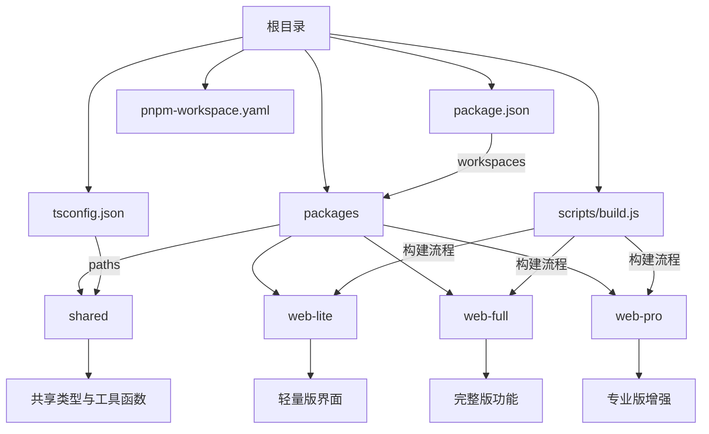
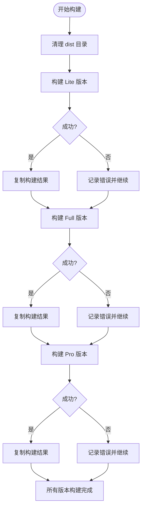

# 安装与部署问题

<cite>
**本文档引用的文件**  
- [package.json](file://package.json)
- [pnpm-workspace.yaml](file://pnpm-workspace.yaml)
- [tsconfig.json](file://tsconfig.json)
- [scripts/build.js](file://scripts/build.js)
- [packages/shared/package.json](file://packages/shared/package.json)
- [packages/web-lite/package.json](file://packages/web-lite/package.json)
- [packages/web-full/package.json](file://packages/web-full/package.json)
- [packages/web-pro/package.json](file://packages/web-pro/package.json)
- [packages/shared/tsconfig.json](file://packages/shared/tsconfig.json)
</cite>

## 目录
1. [简介](#简介)
2. [项目结构与依赖管理机制](#项目结构与依赖管理机制)
3. [典型安装与部署问题及解决方案](#典型安装与部署问题及解决方案)
4. [构建脚本执行异常排查](#构建脚本执行异常排查)
5. [Vite开发服务器启动报错处理](#vite开发服务器启动报错处理)
6. [TypeScript编译错误与类型检查](#typescript编译错误与类型检查)
7. [共享包引用失败诊断](#共享包引用失败诊断)
8. [环境变量配置缺失问题](#环境变量配置缺失问题)
9. [日志查看与调试模式启用](#日志查看与调试模式启用)
10. [附录：常用命令速查](#附录常用命令速查)

## 简介
本指南旨在为 `online-interface-debug-tool` 项目提供全面的安装部署故障排除支持。该项目采用 PNPM Workspaces 构建的 Monorepo 架构，包含多个前端子包（web-lite、web-full、web-pro）和一个共享库（shared）。文档将深入解析依赖管理机制，并针对常见问题如依赖安装失败、构建脚本异常、开发服务器启动错误等提供系统性解决方案。

## 项目结构与依赖管理机制



**Diagram sources**
- [package.json](file://package.json#L5-L8)
- [pnpm-workspace.yaml](file://pnpm-workspace.yaml#L1-L2)
- [tsconfig.json](file://tsconfig.json#L25-L27)

**Section sources**
- [package.json](file://package.json#L1-L36)
- [pnpm-workspace.yaml](file://pnpm-workspace.yaml#L1-L2)
- [tsconfig.json](file://tsconfig.json#L1-L35)

## 典型安装与部署问题及解决方案

### PNPM工作区依赖安装失败
当执行 `pnpm install` 时出现跨包依赖解析失败或版本冲突，通常由以下原因导致：
- Node.js 或 PNPM 版本不符合要求（需 Node >=16, PNPM >=8）
- 缓存损坏或 `node_modules` 状态不一致
- 工作区链接失败（如 `@api-debug-tool/shared` 无法正确链接）

**解决方案：**
1. 清理并重新安装：
```bash
pnpm clean
rm -rf node_modules pnpm-lock.yaml
pnpm install
```
2. 强制重建链接：
```bash
pnpm install --force
```

### 跨包依赖解析错误
在 `web-full` 或 `web-pro` 中引用 `@api-debug-tool/shared` 报错，可能由于：
- `package.json` 中未正确声明 `workspace:*` 依赖
- TypeScript 路径映射未生效

**验证步骤：**
- 检查 `packages/web-full/package.json` 是否包含 `"@api-debug-tool/shared": "workspace:*"`
- 确认根目录 `tsconfig.json` 中 `"@shared/*": ["./packages/shared/*"]` 配置正确

**Section sources**
- [packages/web-full/package.json](file://packages/web-full/package.json#L15-L16)
- [packages/web-pro/package.json](file://packages/web-pro/package.json#L10-L11)
- [tsconfig.json](file://tsconfig.json#L25-L27)

## 构建脚本执行异常排查

### build.js 运行失败
`scripts/build.js` 脚本负责依次构建三个版本并聚合输出到 `/dist`。常见失败点包括：
- 子项目构建命令失败（如 `vite build` 报错）
- 文件系统权限问题导致无法删除或创建目录
- 并行构建时资源竞争

**诊断流程：**
1. 检查 `build.js` 输出日志，定位具体失败版本
2. 单独运行该版本构建命令验证：
```bash
pnpm --filter web-lite build
```
3. 确保 `dist` 目录可写，且无进程占用



**Diagram sources**
- [scripts/build.js](file://scripts/build.js#L1-L38)

**Section sources**
- [scripts/build.js](file://scripts/build.js#L1-L38)
- [package.json](file://package.json#L10-L15)

## Vite开发服务器启动报错处理

### 启动命令说明
各子项目通过以下命令启动开发服务器：
- `pnpm dev:lite` → `web-lite`
- `pnpm dev:full` → `web-full`（端口 3001）
- `pnpm dev:pro` → `web-pro`（端口 3002）

### 常见启动错误
- **端口占用**：修改 `vite.config.ts` 或使用 `--port` 覆盖
- **依赖缺失**：确保已运行 `pnpm install`
- **TypeScript 类型错误**：运行 `pnpm type-check` 预检

**调试建议：**
- 启用 Vite 调试日志：`pnpm dev:full --debug`
- 检查 `vite.config.ts` 是否存在语法错误

**Section sources**
- [package.json](file://package.json#L9-L14)
- [packages/web-full/package.json](file://packages/web-full/package.json#L5-L7)

## TypeScript编译错误与类型检查

### 类型检查命令
根目录提供统一类型检查：
```bash
pnpm type-check
```
该命令调用 `vue-tsc --noEmit`，基于 `tsconfig.json` 配置进行类型验证。

### 常见类型错误
- 共享包导出类型未正确声明
- 子项目 `tsconfig.json` 未继承根配置
- `@shared/*` 路径别名未被识别

**解决方案：**
1. 确保 `packages/shared/index.ts` 正确导出所需类型
2. 检查各子项目 `tsconfig.json` 是否包含 `"extends": "../../tsconfig.json"`

**Section sources**
- [tsconfig.json](file://tsconfig.json#L1-L35)
- [package.json](file://package.json#L16-L17)

## 共享包引用失败诊断

### 引用方式
子项目通过 `@shared/*` 别名引用共享模块：
```ts
import { validator } from '@shared/utils'
```

### 故障排查步骤
1. 确认 `tsconfig.json` 中 `paths` 配置正确
2. 检查 `packages/shared/package.json` 的 `exports` 字段是否导出对应路径
3. 验证 PNPM 是否成功链接包：
```bash
pnpm list @api-debug-tool/shared
```

**Section sources**
- [tsconfig.json](file://tsconfig.json#L25-L27)
- [packages/shared/package.json](file://packages/shared/package.json#L7-L12)

## 环境变量配置缺失问题

### 当前项目环境变量使用
本项目暂未在 `package.json` 或构建脚本中显式使用 `.env` 文件。若需扩展环境变量支持：
- 在各子项目根目录添加 `.env` 文件
- 使用 `import.meta.env` 访问变量
- 确保 `vite.config.ts` 正确配置 `envPrefix`

**建议实践：**
- 统一环境变量前缀（如 `VITE_`）
- 提供 `.env.example` 模板文件

## 日志查看与调试模式启用

### 查看构建日志
- 构建脚本输出包含详细状态（🚀、✅、❌）
- 可通过 `--verbose` 参数增强日志输出（需修改 `build.js`）

### 启用调试模式
1. **Vite 调试**：
```bash
vite --debug
```
2. **Node.js 调试（build.js）**：
```bash
node --inspect scripts/build.js
```
3. **PNPM 调试日志**：
```bash
pnpm --reporter=ndjson install
```

**Section sources**
- [scripts/build.js](file://scripts/build.js#L1-L38)

## 附录常用命令速查

| 命令 | 说明 |
|------|------|
| `pnpm install` | 安装所有依赖 |
| `pnpm dev:lite` | 启动 Lite 版开发服务器 |
| `pnpm dev:full` | 启动 Full 版开发服务器（端口 3001） |
| `pnpm dev:pro` | 启动 Pro 版开发服务器（端口 3002） |
| `pnpm build:all` | 构建所有版本 |
| `pnpm type-check` | 执行 TypeScript 类型检查 |
| `pnpm clean` | 清理 node_modules |
| `pnpm list <pkg>` | 查看包链接状态 |

**Section sources**
- [package.json](file://package.json#L9-L17)