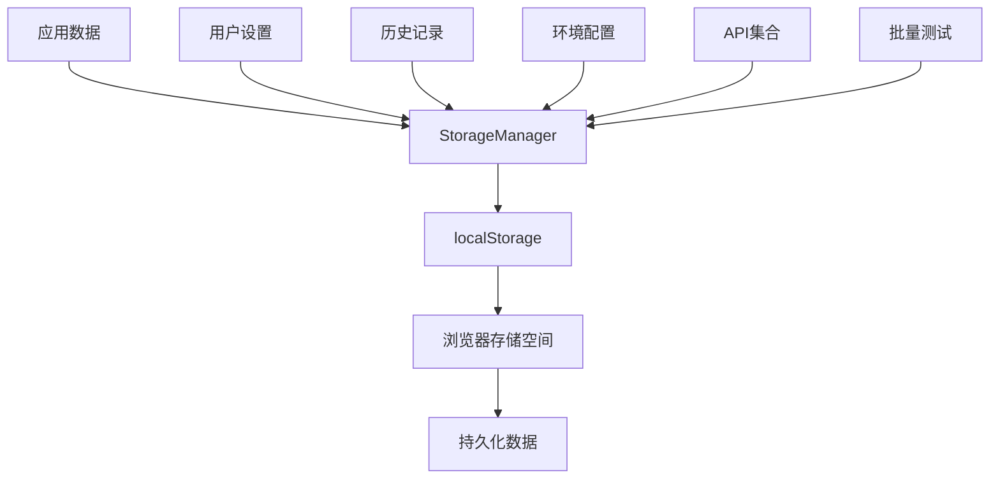
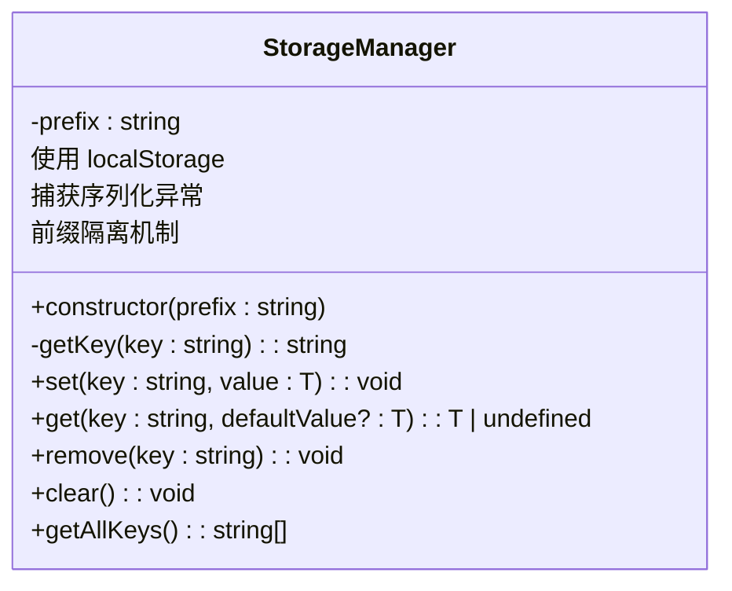
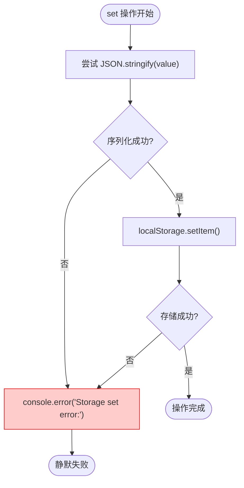
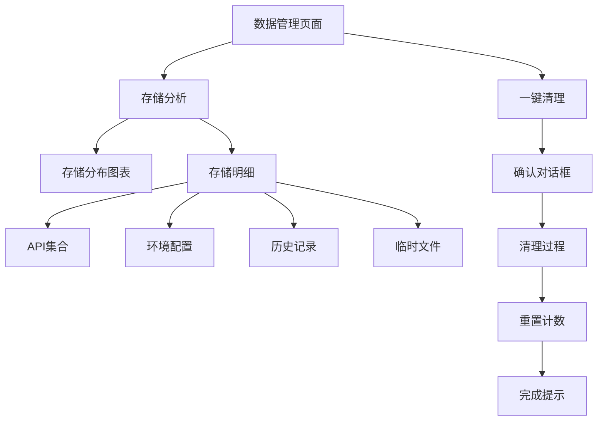

# 数据同步与持久化问题

<cite>
**本文档引用文件**  
- [storage.ts](file://packages/shared/utils/storage.ts)
- [DataManagement.vue](file://packages/web-full/src/pages/DataManagement.vue)
- [workspace.ts](file://packages/web-full/src/stores/workspace.ts)
</cite>

## 目录
1. [问题概述](#问题概述)
2. [本地存储机制分析](#本地存储机制分析)
3. [存储封装类详解](#存储封装类详解)
4. [常见存储陷阱与限制](#常见存储陷阱与限制)
5. [存储调试方法](#存储调试方法)
6. [异常处理机制](#异常处理机制)
7. [数据管理界面分析](#数据管理界面分析)
8. [解决方案与最佳实践](#解决方案与最佳实践)

## 问题概述

用户在使用在线接口调试工具时，常遇到历史记录未持久化、批量测试结果丢失、用户设置重置、环境配置跨设备不同步等问题。这些问题的根本原因在于本地存储机制的使用不当或异常处理不完善。本文将深入剖析基于 `storage.ts` 的本地存储封装机制，提供完整的调试与解决方案。

## 本地存储机制分析

本项目采用浏览器的 `localStorage` 作为主要的本地数据持久化方案，用于存储用户设置、历史记录、环境配置等关键数据。通过统一的 `StorageManager` 封装类进行管理，确保数据隔离与操作安全。



**Diagram sources**  
- [storage.ts](file://packages/shared/utils/storage.ts#L1-L54)

## 存储封装类详解

`StorageManager` 类提供了类型安全、前缀隔离、异常捕获的本地存储操作接口，是整个项目数据持久化的基础。



**Diagram sources**  
- [storage.ts](file://packages/shared/utils/storage.ts#L1-L54)

### 核心功能说明

- **前缀隔离**：所有存储键名均以 `api-debug-tool:` 为前缀，避免与其他应用冲突
- **类型安全**：通过泛型 `<T>` 支持任意类型数据的存储与读取
- **异常捕获**：`try-catch` 包裹所有操作，防止因存储异常导致应用崩溃
- **批量清理**：`clear()` 方法仅清除本应用前缀的数据，不影响其他应用

**Section sources**  
- [storage.ts](file://packages/shared/utils/storage.ts#L1-L54)

## 常见存储陷阱与限制

### localStorage 使用限制

- **容量限制**：通常为 5-10MB，超出将抛出 `QUOTA_EXCEEDED_ERR`
- **同步阻塞**：读写操作在主线程执行，大数据量可能导致界面卡顿
- **仅字符串存储**：需手动进行序列化/反序列化
- **同源策略**：不同域名/端口无法共享数据

### 序列化错误

当存储包含循环引用、函数、Symbol 等无法序列化的对象时，`JSON.stringify()` 将抛出异常：

```typescript
const obj = { a: 1 }
obj.self = obj // 循环引用
storage.set('test', obj) // 可能失败
```

### 键名冲突

若多个应用使用相同前缀或键名，可能导致数据覆盖。本项目通过 `api-debug-tool:` 前缀有效避免此问题。

**Section sources**  
- [storage.ts](file://packages/shared/utils/storage.ts#L1-L54)

## 存储调试方法

### 使用浏览器 Application 面板

1. 打开开发者工具（F12）
2. 切换到 **Application** 选项卡
3. 在左侧 Storage -> Local Storage 中选择当前域名
4. 查看以 `api-debug-tool:` 开头的所有键值对
5. 可手动编辑、删除或清除数据进行测试

### 验证 set/get 流程

通过控制台直接调用存储接口验证流程：

```javascript
// 模拟设置数据
storage.set('testKey', { name: 'test', value: 123 })

// 读取验证
storage.get('testKey')

// 检查 localStorage
localStorage.getItem('api-debug-tool:testKey')
```

### 监控存储异常

在控制台查看 `Storage set error:` 和 `Storage get error:` 日志，定位序列化或解析失败的具体原因。

**Section sources**  
- [storage.ts](file://packages/shared/utils/storage.ts#L1-L54)

## 异常处理机制

`StorageManager` 通过完善的异常处理确保应用稳定性：

- **set 操作**：序列化失败时记录错误日志，但不中断程序执行
- **get 操作**：解析失败或数据为空时返回默认值，保证调用方安全
- **静默失败**：所有异常均被捕获，避免影响用户体验



**Diagram sources**  
- [storage.ts](file://packages/shared/utils/storage.ts#L1-L54)

## 数据管理界面分析

`DataManagement.vue` 页面提供了存储空间的可视化分析与管理功能，帮助用户了解数据占用情况。



**Diagram sources**  
- [DataManagement.vue](file://packages/web-full/src/pages/DataManagement.vue#L463-L522)

该页面通过 `storageBreakdown` 对象统计各类数据的存储占用，并提供一键清理功能，有效帮助用户管理本地存储空间。

**Section sources**  
- [DataManagement.vue](file://packages/web-full/src/pages/DataManagement.vue#L463-L522)

## 解决方案与最佳实践

### 数据分片存储

对于大数据量（如大量历史记录），建议分片存储，避免单个键值过大：

```typescript
// bad: 存储所有历史记录
storage.set('history', allRecords)

// good: 分页存储
storage.set('history_page_1', page1)
storage.set('history_page_2', page2)
```

### 定期清理策略

实现自动清理机制，删除过期或无用数据：

```typescript
// 清理超过30天的历史记录
const oldRecords = history.filter(h => h.date < thirtyDaysAgo)
// ... 删除逻辑
```

### 备份与同步

提供数据导出/导入功能，实现跨设备同步：

```typescript
// 导出为JSON文件
const data = { 
  collections: storage.get('collections'),
  environments: storage.get('environments'),
  settings: storage.get('settings')
}
// 生成文件下载
```

### 监控存储使用

实时监控存储占用，接近上限时给出提示：

```typescript
const usage = calculateStorageUsage()
if (usage > 0.8) {
  ElMessage.warning('本地存储空间即将耗尽')
}
```

**Section sources**  
- [storage.ts](file://packages/shared/utils/storage.ts#L1-L54)
- [DataManagement.vue](file://packages/web-full/src/pages/DataManagement.vue#L463-L522)