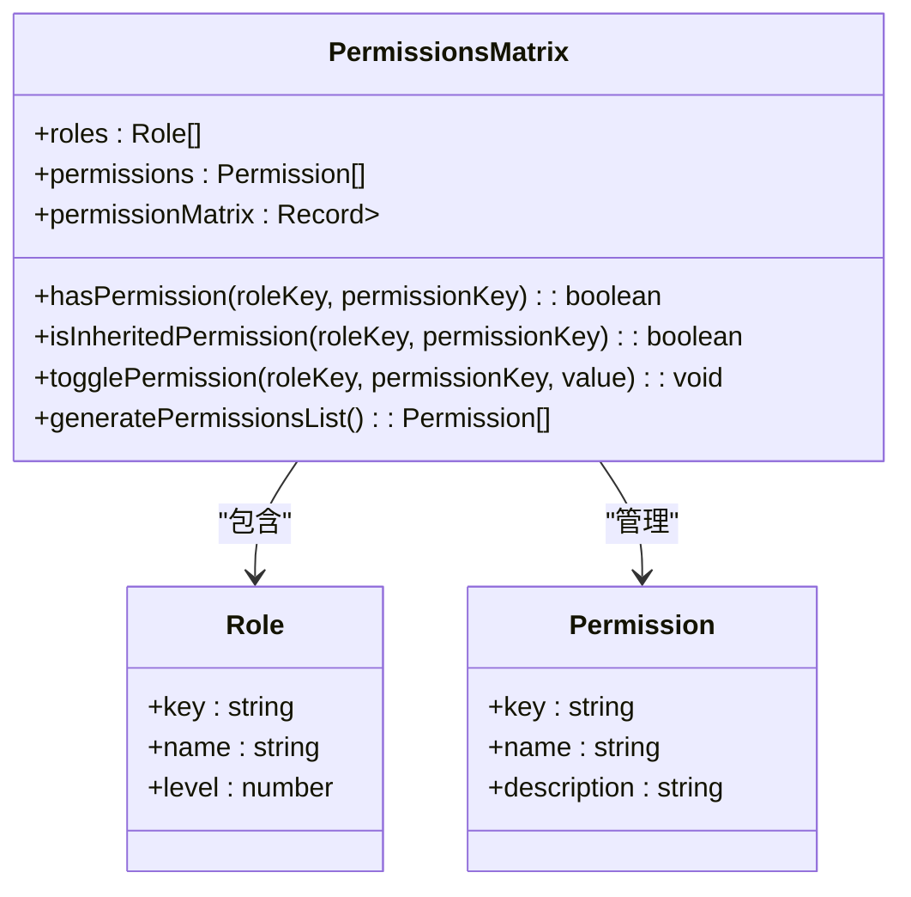
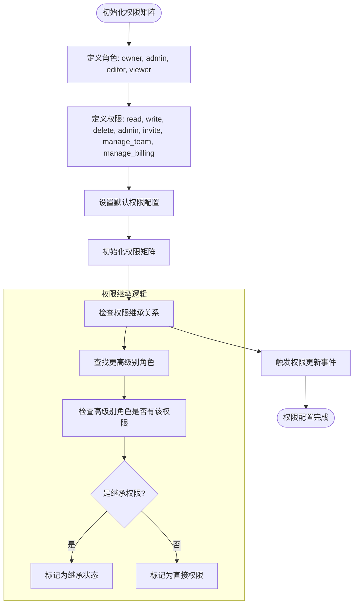
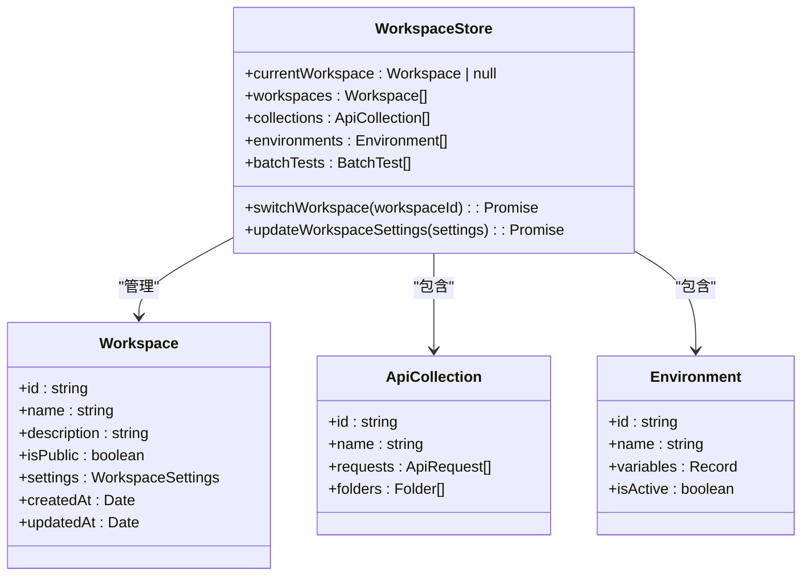
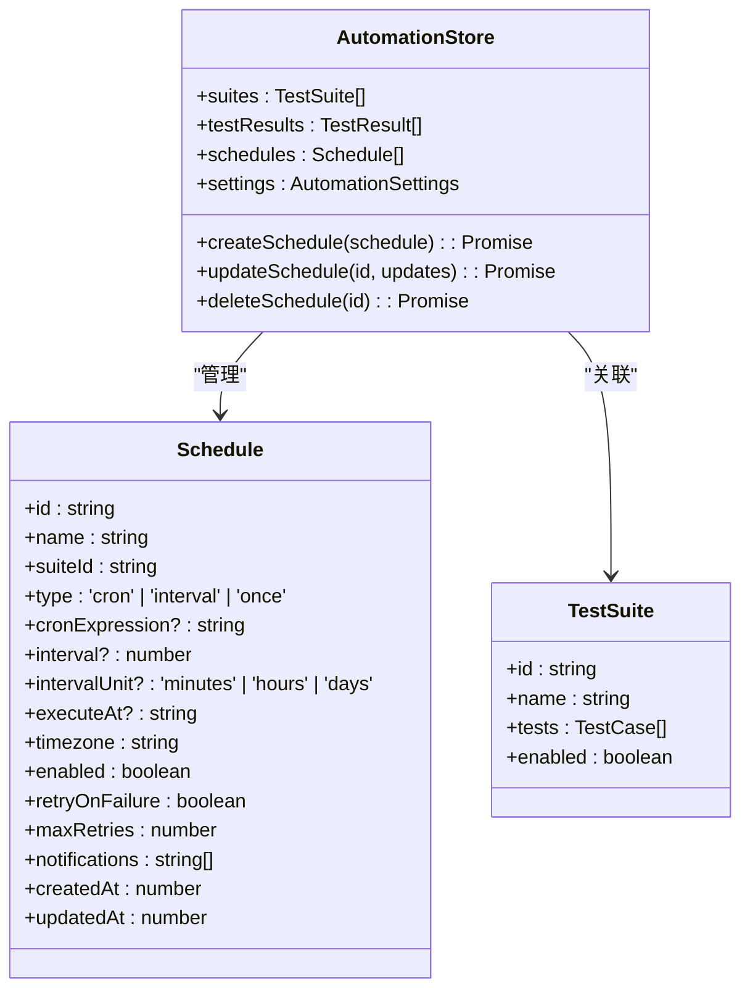
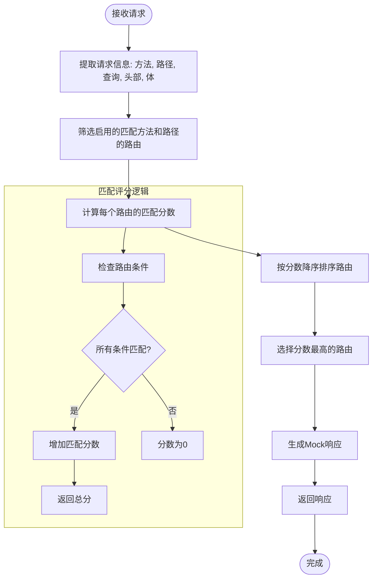
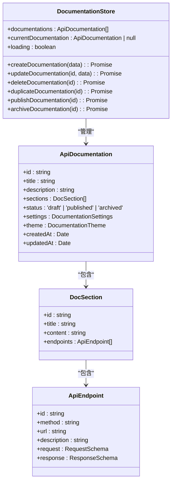

# 配置与权限问题

<cite>
**本文档引用的文件**  
- [PermissionsMatrix.vue](file://packages/web-pro/src/components/team/PermissionsMatrix.vue)
- [team.ts](file://packages/web-pro/src/stores/team.ts)
- [workspace.ts](file://packages/web-full/src/stores/workspace.ts)
- [automation.ts](file://packages/web-pro/src/stores/automation.ts)
- [mock.ts](file://packages/web-pro/src/stores/mock.ts)
- [documentation.ts](file://packages/web-pro/src/stores/documentation.ts)
- [MockServer.vue](file://packages/web-pro/src/views/MockServer.vue)
- [Documentation.vue](file://packages/web-pro/src/views/Documentation.vue)
</cite>

## 目录
1. [问题概述](#问题概述)
2. [权限控制机制分析](#权限控制机制分析)
3. [工作区数据隔离问题](#工作区数据隔离问题)
4. [自动化测试调度任务问题](#自动化测试调度任务问题)
5. [Mock服务路由匹配问题](#mock服务路由匹配问题)
6. [API文档编辑内容未保存问题](#api文档编辑内容未保存问题)
7. [综合解决方案与建议](#综合解决方案与建议)

## 问题概述

本文档针对在线接口调试工具中的高级功能配置难题提供解决方案，包括团队成员权限设置不生效、工作区数据隔离失效、自动化测试调度任务未触发、Mock服务路由匹配失败、API文档编辑内容未保存等问题。通过分析前端权限控制逻辑、角色与权限映射关系在store中的管理方式，指导用户检查配置项格式、验证规则触发条件以及跨模块状态依赖关系。

**Section sources**
- [PermissionsMatrix.vue](file://packages/web-pro/src/components/team/PermissionsMatrix.vue#L0-L277)
- [team.ts](file://packages/web-pro/src/stores/team.ts#L0-L574)

## 权限控制机制分析

### 前端权限实现机制

系统采用基于角色的权限控制（RBAC）模型，通过`PermissionsMatrix`组件实现可视化权限配置。该组件维护一个权限矩阵，将角色与权限进行映射，并支持权限继承机制。

**Diagram sources**
- [PermissionsMatrix.vue](file://packages/web-pro/src/components/team/PermissionsMatrix.vue#L87-L131)

### 角色与权限映射管理

在`team` store中，权限矩阵通过`permissionsMatrix`状态进行管理，包含角色定义、权限列表和矩阵映射关系。系统实现了权限继承机制，高级别角色的权限会自动向下继承。

**Diagram sources**
- [team.ts](file://packages/web-pro/src/stores/team.ts#L13-L574)

### 权限验证规则

权限验证通过`hasPermission`方法实现，该方法检查指定角色是否拥有特定权限。同时提供`isInheritedPermission`方法判断权限是否为继承而来，确保权限配置的透明性和可追溯性。

**Section sources**
- [PermissionsMatrix.vue](file://packages/web-pro/src/components/team/PermissionsMatrix.vue#L131-L166)

## 工作区数据隔离问题

### 数据隔离机制

工作区数据隔离通过`workspace` store实现，每个工作区拥有独立的集合、环境和批量测试数据。系统通过`currentWorkspace`状态管理当前工作区，并在切换时重新加载相关数据。

**Diagram sources**
- [workspace.ts](file://packages/web-full/src/stores/workspace.ts#L0-L810)

### 隔离失效原因分析

工作区数据隔离失效可能由以下原因导致：
1. 本地存储键名冲突
2. 数据加载时机不当
3. 状态同步机制缺陷
4. 缓存清理不彻底

**Section sources**
- [workspace.ts](file://packages/web-full/src/stores/workspace.ts#L475-L519)

## 自动化测试调度任务问题

### 调度任务管理

自动化测试调度任务通过`automation` store进行管理，支持定时、间隔和一次性任务类型。系统提供完整的调度配置选项，包括Cron表达式、执行时间、重试机制和通知设置。

**Diagram sources**
- [automation.ts](file://packages/web-pro/src/stores/automation.ts#L0-L416)

### 任务未触发原因

自动化测试调度任务未触发可能由以下原因导致：
1. 调度器未正确启动
2. Cron表达式格式错误
3. 时区配置不匹配
4. 任务状态未启用
5. 系统时间同步问题

**Section sources**
- [automation.ts](file://packages/web-pro/src/stores/automation.ts#L329-L369)

## Mock服务路由匹配问题

### 路由匹配机制

Mock服务通过`mock` store实现路由匹配，支持基于方法、路径、查询参数、请求头和请求体的条件匹配。系统采用评分机制对匹配结果进行排序，确保最精确的路由优先匹配。

**Diagram sources**
- [mock.ts](file://packages/web-pro/src/stores/mock.ts#L177-L224)

### 路由匹配失败原因

Mock服务路由匹配失败可能由以下原因导致：
1. 路径参数格式不匹配
2. 条件表达式语法错误
3. 请求方法不一致
4. 正则表达式无效
5. 条件优先级设置不当

**Section sources**
- [mock.ts](file://packages/web-pro/src/stores/mock.ts#L221-L266)

## API文档编辑内容未保存问题

### 文档管理机制

API文档管理通过`documentation` store实现，支持文档的创建、编辑、发布和归档操作。系统提供完整的文档结构管理，包括章节、端点和主题配置。

**Diagram sources**
- [documentation.ts](file://packages/web-pro/src/stores/documentation.ts#L257-L421)

### 保存失败原因分析

API文档编辑内容未保存可能由以下原因导致：
1. 状态同步延迟
2. 更新方法未正确调用
3. 数据验证失败
4. 异步操作未等待完成
5. 错误处理机制缺失

**Section sources**
- [documentation.ts](file://packages/web-pro/src/stores/documentation.ts#L341-L384)

## 综合解决方案与建议

### 配置检查清单

| 配置项 | 检查要点 | 验证方法 |
|-------|---------|---------|
| 权限配置 | 角色级别设置、权限继承、默认权限 | 检查`permissionsMatrix`状态 |
| 工作区配置 | 隔离键名、数据加载、状态同步 | 检查`currentWorkspace`切换逻辑 |
| 调度配置 | Cron表达式、时区、启用状态 | 验证`schedules`数组内容 |
| Mock路由 | 路径参数、条件表达式、正则语法 | 测试`matchRoute`匹配结果 |
| 文档配置 | 更新方法、异步等待、错误处理 | 检查`updateDocumentation`调用 |

### 跨模块状态依赖

系统各模块间存在以下状态依赖关系：
- 团队权限影响工作区访问
- 工作区状态决定数据隔离范围
- 自动化测试依赖环境配置
- Mock服务需要正确路由匹配
- 文档编辑需要保存状态同步

**Section sources**
- [team.ts](file://packages/web-pro/src/stores/team.ts#L13-L574)
- [workspace.ts](file://packages/web-full/src/stores/workspace.ts#L0-L810)
- [automation.ts](file://packages/web-pro/src/stores/automation.ts#L0-L416)
- [mock.ts](file://packages/web-pro/src/stores/mock.ts#L0-L354)
- [documentation.ts](file://packages/web-pro/src/stores/documentation.ts#L257-L421)