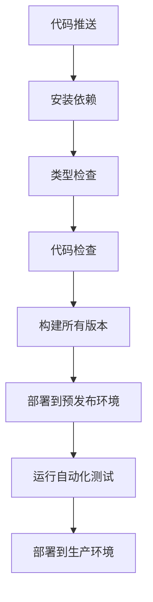

# 开发指南

<cite>
**本文档引用文件**  
- [README.md](file://README.md)
- [package.json](file://package.json)
- [pnpm-workspace.yaml](file://pnpm-workspace.yaml)
- [scripts/build.js](file://scripts/build.js)
- [packages/web-full/vite.config.ts](file://packages/web-full/vite.config.ts)
- [packages/web-lite/vite.config.ts](file://packages/web-lite/vite.config.ts)
- [packages/web-pro/vite.config.ts](file://packages/web-pro/vite.config.ts)
- [packages/shared/package.json](file://packages/shared/package.json)
- [packages/web-full/package.json](file://packages/web-full/package.json)
- [packages/web-lite/package.json](file://packages/web-lite/package.json)
</cite>

## 目录
1. [简介](#简介)
2. [开发环境配置](#开发环境配置)
3. [PNPM Workspaces 多包管理](#pnpm-workspaces-多包管理)
4. [Vite 构建配置详解](#vite-构建配置详解)
5. [自定义构建脚本 build.js](#自定义构建脚本-buildjs)
6. [开发工作流程](#开发工作流程)
7. [代码风格与协作规范](#代码风格与协作规范)
8. [测试与调试](#测试与调试)
9. [版本构建与 CI/CD 集成](#版本构建与-cicd-集成)
10. [附录](#附录)

## 简介
本开发指南旨在为新贡献者提供完整的项目开发环境搭建、代码协作流程和构建部署说明。项目为一个支持多版本（Lite/Full/Pro）的在线接口调试工具，采用 Vue 3 + Vite 技术栈，通过 PNPM Workspaces 实现多包统一管理。

**Section sources**
- [README.md](file://README.md#L1-L3)

## 开发环境配置
### 前置依赖
- Node.js >= 16.0.0
- PNPM >= 8.0.0

### 初始化项目
```bash
# 安装依赖
pnpm install

# 启动 Lite 版本
pnpm dev:lite

# 启动 Full 版本
pnpm dev:full

# 启动 Pro 版本
pnpm dev:pro
```

各版本默认端口：
- Lite: 3000
- Full: 3001
- Pro: 3002

**Section sources**
- [package.json](file://package.json#L10-L15)
- [packages/web-lite/vite.config.ts](file://packages/web-lite/vite.config.ts#L10-L13)
- [packages/web-full/vite.config.ts](file://packages/web-full/vite.config.ts#L10-L13)
- [packages/web-pro/vite.config.ts](file://packages/web-pro/vite.config.ts#L10-L13)

## PNPM Workspaces 多包管理
### 配置说明
项目使用 `pnpm-workspace.yaml` 定义工作区，包含所有 `packages/*` 子包。

```yaml
packages:
  - 'packages/*'
```

### 多包优势
- **依赖共享**：所有子包共享根目录的 `node_modules`，减少磁盘占用
- **版本同步**：通过 `workspace:*` 语法实现包间依赖自动链接
- **独立构建**：可单独构建指定包，也可批量操作
- **统一管理**：根目录统一管理 devDependencies 和脚本

### 包间依赖
`web-full` 和 `web-lite` 均依赖 `@api-debug-tool/shared` 共享库，通过 `workspace:*` 实现本地链接。

**Section sources**
- [pnpm-workspace.yaml](file://pnpm-workspace.yaml#L1-L2)
- [package.json](file://package.json#L5-L7)
- [packages/web-full/package.json](file://packages/web-full/package.json#L20-L22)
- [packages/shared/package.json](file://packages/shared/package.json#L1-L22)

## Vite 构建配置详解
### 共同配置
所有子包的 `vite.config.ts` 均包含以下核心配置：

#### 别名设置
- `@` 指向 `src` 目录
- `@shared` 指向共享包目录

#### 插件
- `@vitejs/plugin-vue`：Vue 3 支持

#### 构建选项
- `outDir`: 输出目录为 `dist`
- `sourcemap`: 启用源码映射

**Section sources**
- [packages/web-full/vite.config.ts](file://packages/web-full/vite.config.ts#L1-L20)
- [packages/web-lite/vite.config.ts](file://packages/web-lite/vite.config.ts#L1-L20)
- [packages/web-pro/vite.config.ts](file://packages/web-pro/vite.config.ts#L1-L20)

## 自定义构建脚本 build.js
### 功能说明
`scripts/build.js` 脚本用于构建所有版本并聚合输出到根目录 `dist` 文件夹。

### 执行流程
1. 清理 `dist` 目录
2. 依次构建 `lite`、`full`、`pro` 版本
3. 复制各版本构建结果到 `dist/{version}` 目录
4. 输出构建状态

### 扩展方法
- 可添加构建前/后钩子
- 可集成版本号注入
- 可添加构建结果校验
- 可扩展为 CI/CD 就绪脚本

**Section sources**
- [scripts/build.js](file://scripts/build.js#L1-L38)

## 开发工作流程
### 添加新功能
1. 确定功能归属包（web-lite/web-full/web-pro）
2. 在对应 `src` 目录下创建组件或页面
3. 更新路由配置（如需）
4. 在 store 中添加状态管理（如需）
5. 提交 PR 并关联 issue

### 运行测试
目前项目暂未包含测试脚本，建议后续添加：

```json
"scripts": {
  "test": "vitest",
  "test:ui": "vitest --ui"
}
```

### 提交代码
1. 确保通过 `pnpm lint` 检查
2. 运行 `pnpm type-check` 验证类型
3. 提交符合 Angular 规范的 commit message

**Section sources**
- [package.json](file://package.json#L16-L18)

## 代码风格与协作规范
### 代码风格
- 使用 Prettier 格式化代码
- 使用 ESLint 进行代码检查
- TypeScript 严格模式
- Vue 3 Composition API

### 提交信息格式
采用 Angular 提交规范：
```
<type>(<scope>): <subject>
```

常见类型：
- `feat`: 新功能
- `fix`: 修复 bug
- `docs`: 文档更新
- `style`: 代码格式调整
- `refactor`: 重构
- `test`: 测试相关
- `chore`: 构建或辅助工具变动

**Section sources**
- [package.json](file://package.json#L16-L18)
- [packages/web-full/package.json](file://packages/web-full/package.json#L40-L62)

## 测试与调试
### 调试技巧
- 使用 `console.log` 结合 sourcemap 定位问题
- 利用 Vue DevTools 检查组件状态
- 使用浏览器 Network 面板分析请求
- 通过 Pinia DevTools 调试状态管理

### 推荐调试流程
1. 复现问题
2. 定位相关组件和 store
3. 添加日志输出
4. 使用断点调试
5. 验证修复方案

## 版本构建与 CI/CD 集成
### 构建命令
```bash
# 构建单个版本
pnpm build:lite
pnpm build:full  
pnpm build:pro

# 构建所有版本
pnpm build:all

# 使用自定义脚本构建并聚合
node scripts/build.js
```

### CI/CD 集成要点
1. **环境准备**：安装 Node.js 和 PNPM
2. **依赖安装**：运行 `pnpm install`
3. **类型检查**：执行 `pnpm type-check`
4. **代码检查**：运行 `pnpm lint`
5. **构建验证**：执行 `node scripts/build.js`
6. **部署**：将 `dist` 目录部署到静态服务器

### 推荐 CI/CD 流程


**Diagram sources**
- [scripts/build.js](file://scripts/build.js#L1-L38)
- [package.json](file://package.json#L13-L15)

**Section sources**
- [scripts/build.js](file://scripts/build.js#L1-L38)
- [package.json](file://package.json#L13-L15)

## 附录
### 项目结构说明
- `packages/shared`: 共享组件和工具库
- `packages/web-lite`: 轻量版前端
- `packages/web-full`: 完整版前端  
- `packages/web-pro`: 专业版前端
- `scripts`: 构建脚本
- 根目录: 全局配置和工作区管理

### 依赖管理策略
- 共享库：`@api-debug-tool/shared`
- UI 框架：Element Plus
- 状态管理：Pinia
- 路由：Vue Router
- HTTP 客户端：Axios
- 工具库：Lodash-es, Day.js

**Section sources**
- [project_structure](file://#L1-L200)
- [packages/shared/package.json](file://packages/shared/package.json#L1-L22)
- [packages/web-full/package.json](file://packages/web-full/package.json#L1-L62)
- [packages/web-lite/package.json](file://packages/web-lite/package.json#L1-L25)