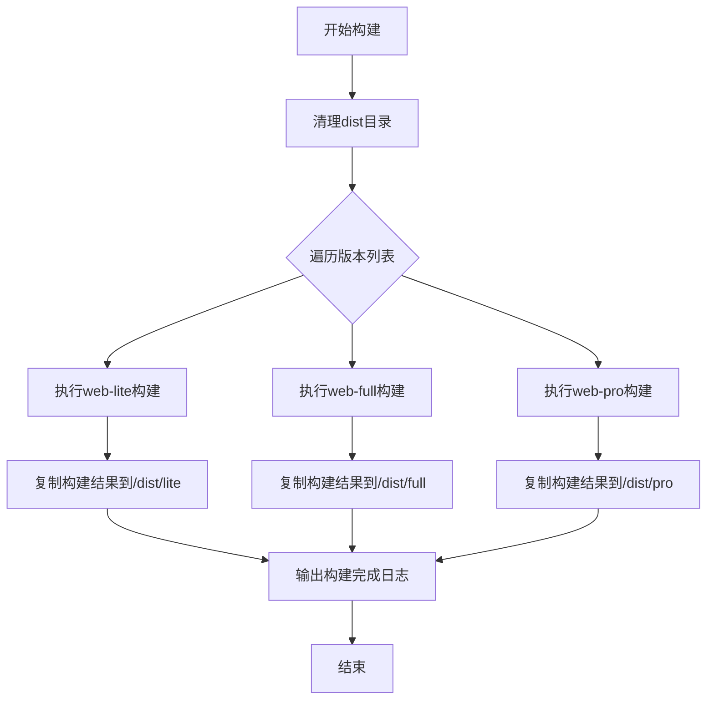
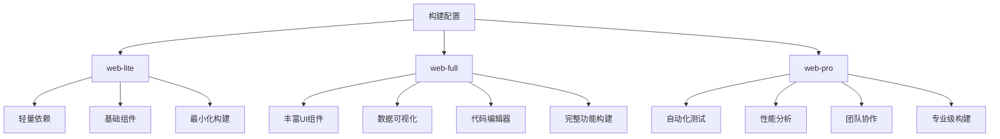
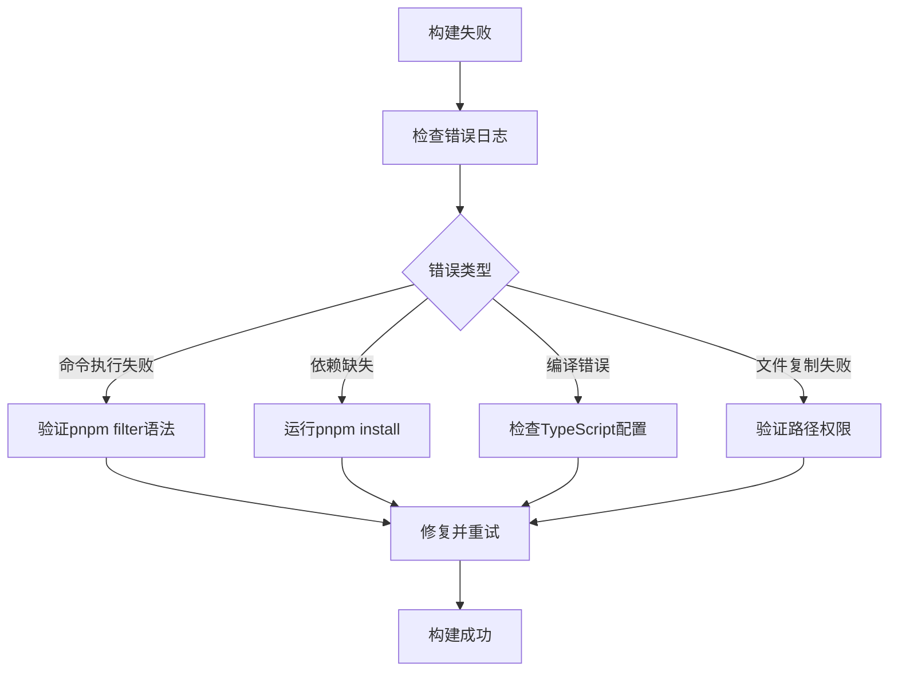

# 构建与部署

<cite>
**本文档引用的文件**  
- [build.js](file://scripts/build.js)
- [web-lite/vite.config.ts](file://packages/web-lite/vite.config.ts)
- [web-full/vite.config.ts](file://packages/web-full/vite.config.ts)
- [web-pro/vite.config.ts](file://packages/web-pro/vite.config.ts)
- [web-lite/package.json](file://packages/web-lite/package.json)
- [web-full/package.json](file://packages/web-full/package.json)
- [web-pro/package.json](file://packages/web-pro/package.json)
- [package.json](file://package.json)
</cite>

## 目录
1. [构建流程概述](#构建流程概述)
2. [核心构建脚本解析](#核心构建脚本解析)
3. [多版本配置差异分析](#多版本配置差异分析)
4. [生产环境构建策略](#生产环境构建策略)
5. [部署方案与推荐配置](#部署方案与推荐配置)
6. [高级构建优化技巧](#高级构建优化技巧)

## 构建流程概述

本项目采用基于 pnpm workspace 的多包管理架构，支持 `web-lite`、`web-full` 和 `web-pro` 三个子项目的独立开发与统一构建。通过根目录的 `scripts/build.js` 脚本实现一键并行构建所有版本，并将输出结果集中到根目录 `dist` 文件夹中，按版本分类存放。

构建流程遵循以下步骤：
1. 清理旧的 `dist` 输出目录
2. 依次执行各子项目的构建命令
3. 将各子项目构建产物复制到统一输出目录
4. 输出构建状态日志

该机制确保了多版本产品线的高效、一致性发布。

**Section sources**
- [build.js](file://scripts/build.js#L1-L37)

## 核心构建脚本解析

`scripts/build.js` 是整个项目的统一构建入口，负责协调多个子项目的构建流程。其核心逻辑包括：

- **版本枚举**：通过数组 `versions = ['lite', 'full', 'pro']` 定义要构建的版本
- **输出目录管理**：在根目录创建 `dist` 文件夹，并为每个版本创建独立子目录
- **并行构建控制**：使用 `execSync` 同步调用 `pnpm --filter web-${version} build` 命令，确保各版本依次构建
- **结果复制**：将各子项目 `dist` 目录内容复制到统一输出路径
- **错误处理**：捕获构建异常并输出错误信息，但不影响其他版本构建

该脚本利用 pnpm 的 `--filter` 功能精准定位目标包，避免全量构建，提升效率。



**Diagram sources**
- [build.js](file://scripts/build.js#L5-L37)

**Section sources**
- [build.js](file://scripts/build.js#L1-L37)

## 多版本配置差异分析

尽管三个子项目共享相似的 Vite 配置结构，但在实际配置中存在关键差异，主要体现在依赖范围、功能模块和构建目标上。

### 配置共性

三者均采用以下基础配置：
- 使用 `@vitejs/plugin-vue` 插件支持 Vue 3
- 设置路径别名 `@` 指向 `src`，`@shared` 指向共享包
- 开发服务器自动打开，端口分别为 3000（lite）、3001（full）、3002（pro）
- 构建输出目录均为 `dist`，并生成 sourcemap

### 功能与依赖差异

| 版本 | 核心功能 | 关键依赖 | 构建目标 |
|------|--------|--------|--------|
| web-lite | 基础接口调试 | vue, vue-router, pinia, element-plus | 轻量级单页应用，最小化体积 |
| web-full | 完整团队协作 | monaco-editor, echarts, tailwindcss, sortablejs | 功能完整的企业级应用 |
| web-pro | 高级自动化测试 | 包含 full 所有功能 + 自动化、性能分析、文档生成模块 | 专业开发者工具套件 |

虽然 `vite.config.ts` 文件内容目前一致，但实际构建行为由 `package.json` 中的依赖和源码结构决定。



**Diagram sources**
- [web-lite/vite.config.ts](file://packages/web-lite/vite.config.ts#L1-L20)
- [web-full/vite.config.ts](file://packages/web-full/vite.config.ts#L1-L20)
- [web-pro/vite.config.ts](file://packages/web-pro/vite.config.ts#L1-L20)

**Section sources**
- [web-lite/vite.config.ts](file://packages/web-lite/vite.config.ts#L1-L20)
- [web-full/vite.config.ts](file://packages/web-full/vite.config.ts#L1-L20)
- [web-pro/vite.config.ts](file://packages/web-pro/vite.config.ts#L1-L20)

## 生产环境构建策略

### 生成生产环境包

执行以下命令生成生产环境包：
```bash
# 构建所有版本
pnpm run build:all

# 或使用统一构建脚本
node scripts/build.js
```

### 代码压缩与优化

构建过程自动启用 Vite 内置的 Rollup 压缩机制：
- 启用 Terser 进行 JavaScript 压缩
- CSS 自动压缩（通过 PostCSS）
- 静态资源自动优化

### 资源哈希命名

Vite 默认为生产构建的静态资源文件名添加内容哈希，确保浏览器缓存更新。无需额外配置。

### CDN 适配

如需适配 CDN，可在 `vite.config.ts` 中添加 `base` 配置：
```ts
export default defineConfig({
  base: 'https://cdn.example.com/online-interface-debug-tool/',
  // ...
})
```

对于不同版本，可设置不同的 CDN 路径以实现独立部署。

**Section sources**
- [package.json](file://package.json#L12-L15)
- [web-lite/package.json](file://packages/web-lite/package.json#L7)
- [web-full/package.json](file://packages/web-full/package.json#L7)
- [web-pro/package.json](file://packages/web-pro/package.json#L7)

## 部署方案与推荐配置

### 静态服务器部署

将 `dist` 目录下的版本文件部署到 Nginx、Apache 或 CDN 服务即可。示例 Nginx 配置：
```nginx
server {
    listen 80;
    root /var/www/html;
    index index.html;

    location / {
        try_files $uri $uri/ /index.html;
    }

    location /lite/ {
        alias /var/www/html/lite/;
        try_files $uri $uri/ /lite/index.html;
    }

    location /full/ {
        alias /var/www/html/full/;
        try_files $uri $uri/ /full/index.html;
    }

    location /pro/ {
        alias /var/www/html/pro/;
        try_files $uri $uri/ /pro/index.html;
    }
}
```

### CI/CD 流水线配置

推荐 GitHub Actions 配置示例：
```yaml
name: Build and Deploy
on: [push]
jobs:
  build:
    runs-on: ubuntu-latest
    steps:
      - uses: actions/checkout@v3
      - uses: pnpm/action-setup@v2
      - uses: actions/setup-node@v3
        with:
          node-version: 18
      - run: pnpm install
      - run: node scripts/build.js
      - uses: actions/upload-artifact@v3
        with:
          name: dist
          path: dist/
```

**Section sources**
- [build.js](file://scripts/build.js#L1-L37)

## 高级构建优化技巧

### 构建缓存优化

- 利用 pnpm 的 `node_modules` 软链接机制减少重复安装
- Vite 的 `.vite` 缓存目录可保留以加速后续开发构建
- 在 CI/CD 中缓存 `node_modules` 和 `~/.pnpm-store`

### 增量构建

虽然当前脚本为全量构建，但可通过以下方式实现增量：
- 使用 `--filter` 参数单独构建指定版本
- 结合 Git diff 判断变更范围，智能选择构建目标

### 错误日志定位

构建失败时，可通过以下方式快速定位：
- 查看 `execSync` 输出的完整错误堆栈
- 检查各子项目 `dist` 目录是否存在
- 验证 `package.json` 中的构建脚本是否正确
- 启用 `--verbose` 模式获取详细日志



**Diagram sources**
- [build.js](file://scripts/build.js#L20-L30)

**Section sources**
- [build.js](file://scripts/build.js#L1-L37)