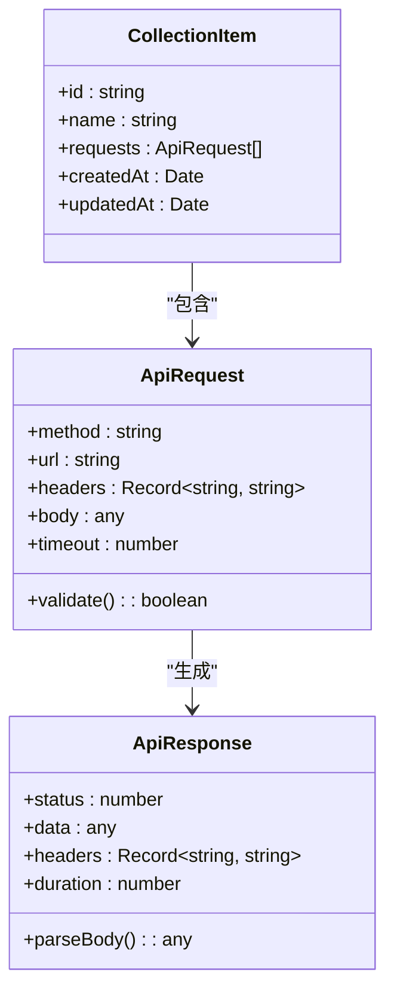
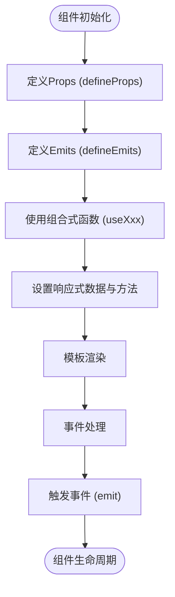
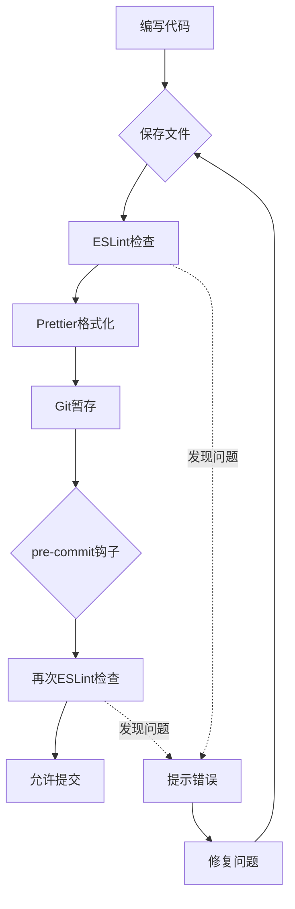
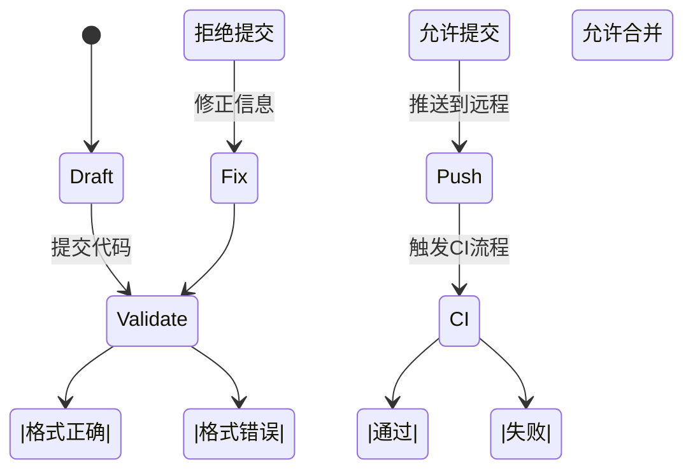
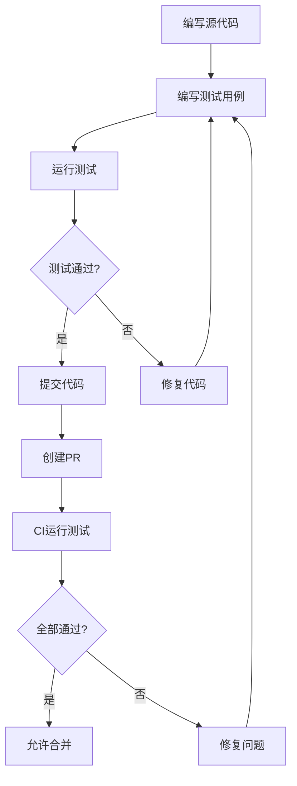

# 贡献指南

<cite>
**本文档引用的文件**  
- [package.json](file://package.json)
- [packages/shared/package.json](file://packages/shared/package.json)
- [packages/web-full/package.json](file://packages/web-full/package.json)
- [packages/web-lite/package.json](file://packages/web-lite/package.json)
- [packages/web-pro/package.json](file://packages/web-pro/package.json)
- [packages/shared/utils/formatter.ts](file://packages/shared/utils/formatter.ts)
- [packages/shared/utils/validator.ts](file://packages/shared/utils/validator.ts)
- [packages/web-full/src/components/RequestPanel.vue](file://packages/web-full/src/components/RequestPanel.vue)
- [packages/web-lite/src/components/RequestPanel.vue](file://packages/web-lite/src/components/RequestPanel.vue)
- [packages/web-pro/src/components/documentation/ApiEditor.vue](file://packages/web-pro/src/components/documentation/ApiEditor.vue)
- [packages/web-full/src/stores/collection.ts](file://packages/web-full/src/stores/collection.ts)
- [packages/web-pro/src/stores/automation.ts](file://packages/web-pro/src/stores/automation.ts)
- [packages/shared/types/index.ts](file://packages/shared/types/index.ts)
- [packages/web-full/src/main.ts](file://packages/web-full/src/main.ts)
- [packages/web-lite/src/main.ts](file://packages/web-lite/src/main.ts)
- [packages/web-pro/src/main.ts](file://packages/web-pro/src/main.ts)
- [packages/web-full/vite.config.ts](file://packages/web-full/vite.config.ts)
- [packages/web-lite/vite.config.ts](file://packages/web-lite/vite.config.ts)
- [packages/web-pro/vite.config.ts](file://packages/web-pro/vite.config.ts)
- [packages/shared/tsconfig.json](file://packages/shared/tsconfig.json)
- [tsconfig.json](file://tsconfig.json)
</cite>

## 目录
1. [简介](#简介)
2. [代码风格规范](#代码风格规范)
3. [TypeScript编码规范](#typescript编码规范)
4. [Vue组件编写约定](#vue组件编写约定)
5. [代码格式化与静态检查](#代码格式化与静态检查)
6. [Git提交信息规范](#git提交信息规范)
7. [分支管理策略](#分支管理策略)
8. [Pull Request流程](#pull-request流程)
9. [单元测试要求](#单元测试要求)
10. [构建与开发脚本](#构建与开发脚本)

## 简介
本指南旨在为参与在线接口调试工具项目的开发者提供清晰的代码贡献规范。项目采用PNPM工作区管理多个前端版本（Lite/Full/Pro），共享核心工具与类型定义。所有贡献需遵循统一的编码风格、提交格式和审查流程，以确保代码库的可维护性与一致性。

**Section sources**
- [package.json](file://package.json#L1-L37)
- [packages/shared/package.json](file://packages/shared/package.json#L1-L22)

## 代码风格规范
项目整体遵循Vue 3生态的最佳实践，采用Composition API与`<script setup>`语法糖编写组件。TypeScript作为主要开发语言，强制类型检查。关键代码风格要求包括：
- 使用ESLint进行代码质量检查
- 采用Prettier统一代码格式
- 所有API接口与工具函数需提供完整类型定义
- 组件命名采用PascalCase，文件名与组件名保持一致

**Section sources**
- [packages/web-full/src/components/RequestPanel.vue](file://packages/web-full/src/components/RequestPanel.vue#L1-L200)
- [packages/web-lite/src/components/RequestPanel.vue](file://packages/web-lite/src/components/RequestPanel.vue#L1-L150)
- [packages/web-pro/src/components/documentation/ApiEditor.vue](file://packages/web-pro/src/components/documentation/ApiEditor.vue#L1-L300)

## TypeScript编码规范
项目使用TypeScript 5.0+版本，配置严格的类型检查规则。核心编码规范包括：
- 所有变量、函数参数和返回值必须有明确类型
- 使用`interface`定义对象结构，`type`定义联合类型或映射类型
- 共享类型定义存放于`packages/shared/types/index.ts`
- 避免使用`any`类型，必要时使用`unknown`并进行类型守卫

**Diagram sources**
- [packages/shared/types/index.ts](file://packages/shared/types/index.ts#L1-L50)
- [packages/web-full/src/stores/collection.ts](file://packages/web-full/src/stores/collection.ts#L10-L80)
- [packages/web-pro/src/stores/automation.ts](file://packages/web-pro/src/stores/automation.ts#L15-L90)

## Vue组件编写约定
所有Vue组件必须使用`<script setup>`语法，遵循以下约定：
- 使用`defineProps`和`defineEmits`声明属性和事件
- 组合式函数（composables）存放于`composables/`目录
- 组件逻辑按功能拆分，避免单文件过大
- 使用Pinia进行状态管理，store文件存放于`stores/`目录

**Diagram sources**
- [packages/web-full/src/components/CollectionDialog.vue](file://packages/web-full/src/components/CollectionDialog.vue#L1-L120)
- [packages/web-pro/src/components/automation/CreateSuiteDialog.vue](file://packages/web-pro/src/components/automation/CreateSuiteDialog.vue#L1-L100)

## 代码格式化与静态检查
项目集成ESLint与Prettier，确保代码一致性。相关配置如下：
- ESLint配置基于`@typescript-eslint`和`eslint-plugin-vue`
- Prettier配置统一缩进、引号、行宽等格式
- 提交前自动格式化通过Husky钩子触发
- 所有代码需通过`pnpm lint`检查

**Diagram sources**
- [package.json](file://package.json#L10-L15)
- [packages/web-full/package.json](file://packages/web-full/package.json#L20-L30)

## Git提交信息规范
所有Git提交必须遵循Conventional Commits规范，格式为：`<type>(<scope>): <subject>`。支持的类型包括：
- `feat`：新增功能
- `fix`：修复缺陷
- `docs`：文档更新
- `style`：代码格式调整（不影响逻辑）
- `refactor`：代码重构
- `test`：测试相关
- `chore`：构建或辅助工具变更

**Diagram sources**
- [package.json](file://package.json#L10-L15)
- [packages/web-full/package.json](file://packages/web-full/package.json#L25-L30)

## 分支管理策略
项目采用Git Flow变体进行分支管理：
- `main`：主分支，保护分支，仅通过PR合并
- `develop`：开发分支，集成所有功能
- `feature/*`：功能分支，从develop创建，完成后合并回develop
- `release/*`：发布分支，用于版本准备
- `hotfix/*`：紧急修复分支，从main创建

**Section sources**
- [package.json](file://package.json#L5-L8)
- [packages/web-full/vite.config.ts](file://packages/web-full/vite.config.ts#L1-L50)

## Pull Request流程
创建Pull Request需遵循以下流程：
1. 从`develop`分支创建功能分支
2. 实现功能并确保通过所有检查
3. 提交PR到`develop`分支
4. 至少一名核心成员审查通过
5. CI流水线全部通过
6. 合并到`develop`分支

审查要点包括：
- 代码功能正确性
- 是否符合编码规范
- 是否有充分的测试覆盖
- 文档是否同步更新
- 是否存在性能问题

**Section sources**
- [packages/web-full/package.json](file://packages/web-full/package.json#L20-L30)
- [packages/web-pro/package.json](file://packages/web-pro/package.json#L25-L35)

## 单元测试要求
所有核心功能必须包含单元测试，要求如下：
- 使用Vitest进行测试
- 关键业务逻辑测试覆盖率不低于80%
- 测试文件与源文件同目录，后缀为`.test.ts`
- Pinia store和composables必须有完整测试
- 组件测试使用Vue Test Utils

**Diagram sources**
- [packages/shared/utils/validator.ts](file://packages/shared/utils/validator.ts#L1-L100)
- [packages/shared/utils/formatter.ts](file://packages/shared/utils/formatter.ts#L1-L80)

## 构建与开发脚本
项目提供统一的开发与构建脚本，通过PNPM工作区管理：
- `pnpm dev:lite`：启动Lite版本开发服务器
- `pnpm dev:full`：启动Full版本开发服务器
- `pnpm dev:pro`：启动Pro版本开发服务器
- `pnpm build:all`：构建所有版本
- `pnpm lint`：运行代码检查
- `pnpm type-check`：运行类型检查

**Section sources**
- [package.json](file://package.json#L6-L15)
- [packages/web-lite/vite.config.ts](file://packages/web-lite/vite.config.ts#L1-L40)
- [packages/web-pro/vite.config.ts](file://packages/web-pro/vite.config.ts#L1-L45)