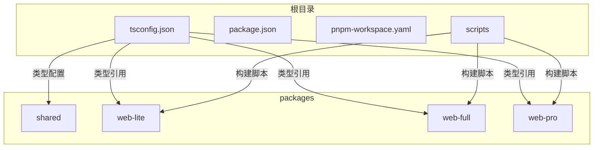
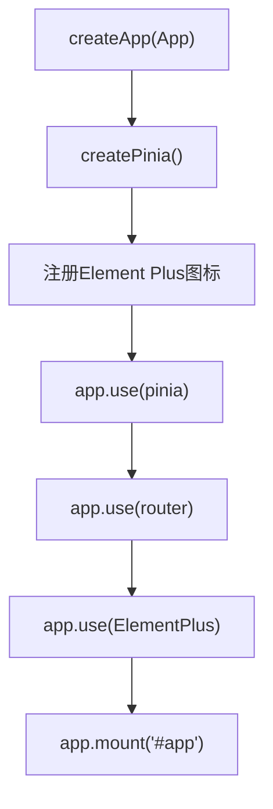
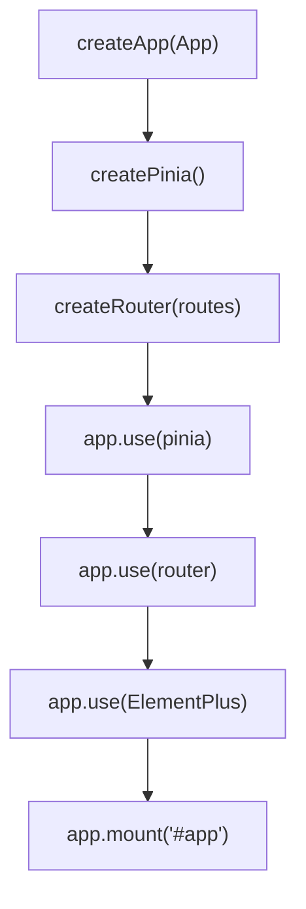
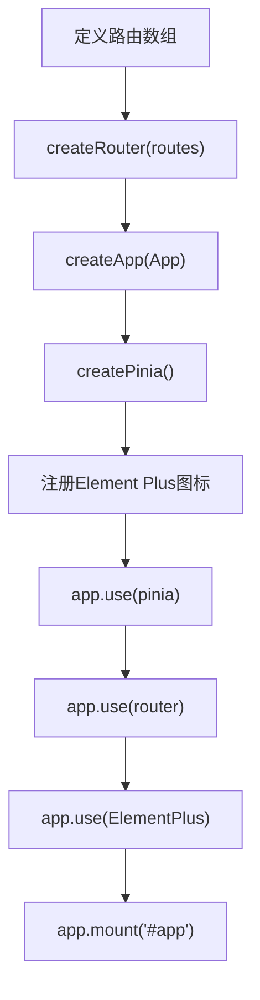
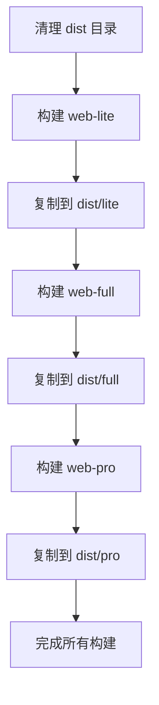

# 项目结构说明

<cite>
**本文档引用的文件**  
- [shared/types/index.ts](file://packages/shared/types/index.ts)
- [shared/utils/index.ts](file://packages/shared/utils/index.ts)
- [shared/utils/http.ts](file://packages/shared/utils/http.ts)
- [shared/utils/storage.ts](file://packages/shared/utils/storage.ts)
- [shared/utils/formatter.ts](file://packages/shared/utils/formatter.ts)
- [shared/utils/validator.ts](file://packages/shared/utils/validator.ts)
- [shared/index.ts](file://packages/shared/index.ts)
- [web-lite/src/main.ts](file://packages/web-lite/src/main.ts)
- [web-full/src/main.ts](file://packages/web-full/src/main.ts)
- [web-pro/src/main.ts](file://packages/web-pro/src/main.ts)
- [web-lite/vite.config.ts](file://packages/web-lite/vite.config.ts)
- [web-full/vite.config.ts](file://packages/web-full/vite.config.ts)
- [web-pro/vite.config.ts](file://packages/web-pro/vite.config.ts)
- [tsconfig.json](file://tsconfig.json)
- [scripts/build.js](file://scripts/build.js)
</cite>

## 目录

1. [项目结构概览](#项目结构概览)
2. [Monorepo 架构与包职责](#monorepo-架构与包职责)
3. [Shared 包：类型与工具复用机制](#shared-包类型与工具复用机制)
4. [前端版本功能对比与入口初始化](#前端版本功能对比与入口初始化)
5. [子项目 src 目录组织规范](#子项目-src-目录组织规范)
6. [构建流程与开发配置](#构建流程与开发配置)

## 项目结构概览

本项目采用 Monorepo 架构，通过 `pnpm` 工作区统一管理多个独立但共享逻辑的子项目。整体结构清晰，分为 `packages`（核心包）、`scripts`（构建脚本）及根级配置文件。



**Diagram sources**
- [tsconfig.json](file://tsconfig.json#L1-L35)
- [scripts/build.js](file://scripts/build.js#L1-L37)

## Monorepo 架构与包职责

项目采用 Monorepo 模式，各子包职责明确，依赖清晰：

- **packages/shared**：共享类型定义与工具函数，供所有前端应用复用。
- **packages/web-lite**：轻量版接口调试工具，面向基础用户，功能简洁。
- **packages/web-full**：完整版接口调试工具，包含集合管理、环境管理、历史记录等核心功能。
- **packages/web-pro**：专业版工具，扩展自动化测试、性能监控、团队协作、API 文档生成等高级功能。

各包通过 `pnpm-workspace.yaml` 纳入统一工作区，共享 `tsconfig.json` 类型配置和构建工具。

**Section sources**
- [tsconfig.json](file://tsconfig.json#L1-L35)
- [scripts/build.js](file://scripts/build.js#L1-L37)

## Shared 包：类型与工具复用机制

`shared` 包是整个项目的核心依赖，提供类型安全与通用工具支持。

### 类型定义复用

`shared/types/index.ts` 定义了跨项目通用的数据结构，如 `RequestConfig`、`ResponseData`、`Environment`、`ApiCollection` 等。各前端项目通过路径别名 `@shared/*` 引入：

```ts
import type { RequestConfig } from '@shared/types'
```

`tsconfig.json` 中配置了路径映射：
```json
"paths": {
  "@shared/*": ["./packages/shared/*"]
}
```

**Section sources**
- [shared/types/index.ts](file://packages/shared/types/index.ts#L0-L799)
- [tsconfig.json](file://tsconfig.json#L1-L35)

### 工具函数复用

`shared/utils` 提供以下核心工具类：

- **http.ts**：`HttpClient` 封装 `fetch` 请求，统一处理请求/响应格式。
- **storage.ts**：`StorageManager` 封装 `localStorage`，支持前缀隔离与类型安全。
- **formatter.ts**：`Formatter` 提供格式化文件大小、时间、JSON、cURL 命令等方法。
- **validator.ts**：`Validator` 提供 URL、邮箱、JSON、请求配置等校验逻辑。

通过 `shared/index.ts` 统一导出，便于批量引入：
```ts
export * from './types/index'
export * from './utils/index'
```

**Section sources**
- [shared/utils/index.ts](file://packages/shared/utils/index.ts#L0-L3)
- [shared/utils/http.ts](file://packages/shared/utils/http.ts#L0-L61)
- [shared/utils/storage.ts](file://packages/shared/utils/storage.ts#L0-L54)
- [shared/utils/formatter.ts](file://packages/shared/utils/formatter.ts#L0-L54)
- [shared/utils/validator.ts](file://packages/shared/utils/validator.ts#L0-L54)
- [shared/index.ts](file://packages/shared/index.ts#L0-L2)

## 前端版本功能对比与入口初始化

### 功能覆盖差异

| 功能模块 | web-lite | web-full | web-pro |
|--------|---------|---------|--------|
| 基础请求调试 | ✅ | ✅ | ✅ |
| 历史记录 | ✅ | ✅ | ✅ |
| 环境管理 | ✅ | ✅ | ✅ |
| 集合管理 | ❌ | ✅ | ✅ |
| 批量测试 | ❌ | ✅ | ✅ |
| 团队协作 | ❌ | ✅ | ✅ |
| 自动化测试 | ❌ | ❌ | ✅ |
| 性能监控 | ❌ | ❌ | ✅ |
| API 文档生成 | ❌ | ❌ | ✅ |
| Mock 服务 | ❌ | ❌ | ✅ |

### 入口文件初始化流程

#### web-lite 初始化流程



**Section sources**
- [web-lite/src/main.ts](file://packages/web-lite/src/main.ts#L0-L20)

#### web-full 初始化流程

与 `web-lite` 基本一致，额外引入 `tailwind.css` 样式文件，并使用 `createRouter` 显式创建路由实例。



**Section sources**
- [web-full/src/main.ts](file://packages/web-full/src/main.ts#L0-L20)

#### web-pro 初始化流程

在 `web-full` 基础上，路由配置更复杂，包含 `Dashboard`、`Performance`、`Team`、`Documentation`、`Automation`、`MockServer` 等多个视图模块，均采用动态导入。



**Section sources**
- [web-pro/src/main.ts](file://packages/web-pro/src/main.ts#L0-L64)

## 子项目 src 目录组织规范

各前端子项目的 `src` 目录遵循一致的组织规范，便于开发者快速定位功能模块。

### 统一目录结构

```
src/
├── components/     # 可复用UI组件
├── views/          # 页面级视图组件
├── pages/          # 路由直接加载的页面（部分项目使用）
├── router/         # 路由配置
├── stores/         # Pinia 状态管理模块
├── types/          # 项目特定类型（可扩展 shared 类型）
├── utils/          # 项目特定工具（可扩展 shared 工具）
├── styles/         # 样式文件
├── App.vue         # 根组件
└── main.ts         # 入口文件
```

### 组件与视图分离

- **components**：存放可复用的 UI 组件，如 `RequestPanel.vue`、`Sidebar.vue`。
- **views**：存放页面级组件，通常由路由直接加载，如 `Collections.vue`、`Dashboard.vue`。

### 状态管理规范

使用 Pinia 进行状态管理，每个核心功能模块对应一个 store 文件：
- `collection.ts`：管理 API 集合状态
- `environment.ts`：管理环境变量状态
- `request.ts`：管理当前请求状态
- `team.ts`：管理团队成员状态
- `automation.ts`：管理自动化测试状态

**Section sources**
- [packages/web-lite/src](file://packages/web-lite/src)
- [packages/web-full/src](file://packages/web-full/src)
- [packages/web-pro/src](file://packages/web-pro/src)

## 构建流程与开发配置

### 构建脚本

`scripts/build.js` 脚本统一构建所有版本，依次执行：
1. 清理 `dist` 目录
2. 使用 `pnpm --filter web-{version} build` 构建各版本
3. 将构建结果复制到 `dist/{version}` 目录



**Section sources**
- [scripts/build.js](file://scripts/build.js#L1-L37)

### 开发配置

各子项目通过 `vite.config.ts` 配置开发服务器端口：
- **web-lite**: 3000
- **web-full**: 3001
- **web-pro**: 3002

并统一配置路径别名 `@` 指向 `src`，`@shared` 指向共享包。

**Section sources**
- [web-lite/vite.config.ts](file://packages/web-lite/vite.config.ts#L1-L20)
- [web-full/vite.config.ts](file://packages/web-full/vite.config.ts#L1-L20)
- [web-pro/vite.config.ts](file://packages/web-pro/vite.config.ts#L1-L20)