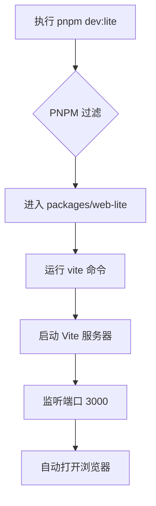

# 快速开始

<cite>
**本文档中引用的文件**  
- [README.md](file://README.md)
- [package.json](file://package.json)
- [packages/web-lite/package.json](file://packages/web-lite/package.json)
- [packages/web-full/package.json](file://packages/web-full/package.json)
- [packages/web-pro/package.json](file://packages/web-pro/package.json)
- [packages/web-lite/vite.config.ts](file://packages/web-lite/vite.config.ts)
- [packages/web-full/vite.config.ts](file://packages/web-full/vite.config.ts)
- [packages/web-pro/vite.config.ts](file://packages/web-pro/vite.config.ts)
- [packages/web-lite/src/main.ts](file://packages/web-lite/src/main.ts)
- [packages/web-full/src/main.ts](file://packages/web-full/src/main.ts)
</cite>

## 目录
1. [简介](#简介)
2. [前置条件](#前置条件)
3. [项目克隆与依赖安装](#项目克隆与依赖安装)
4. [启动不同版本的应用](#启动不同版本的应用)
5. [基础操作示例](#基础操作示例)
6. [版本入口与启动机制说明](#版本入口与启动机制说明)
7. [常见问题排查](#常见问题排查)
8. [总结](#总结)

## 简介
本指南旨在帮助新手开发者在10分钟内完成本地环境搭建，并成功运行在线接口调试工具的Lite、Full和Pro三个版本。通过本教程，您将学会如何配置开发环境、安装依赖、启动开发服务器，并发送第一个HTTP请求。

**Section sources**
- [README.md](file://README.md#L1-L3)

## 前置条件
在开始之前，请确保您的系统满足以下最低要求：

- **Node.js**: 版本 >= 16.0.0  
- **PNPM**: 版本 >= 8.0.0  
- **TypeScript**: 版本 >= 5.0.2（由项目依赖自动管理）  

您可以通过以下命令检查当前版本：
```bash
node --version
pnpm --version
```

若未安装，请访问 [Node.js官网](https://nodejs.org/) 下载并安装 LTS 版本，PNPM 将随项目依赖自动安装或可通过 `npm install -g pnpm` 手动安装。

**Section sources**
- [package.json](file://package.json#L25-L27)

## 项目克隆与依赖安装
按照以下步骤完成项目初始化：

1. 克隆项目仓库：
```bash
git clone https://github.com/your-username/onlineInterfaceDebugTool.git
cd onlineInterfaceDebugTool
```

2. 安装所有工作区依赖（使用PNPM）：
```bash
pnpm install
```
该项目采用PNPM工作区（workspace）结构，此命令将一次性安装 `packages/shared`、`web-lite`、`web-full` 和 `web-pro` 的所有依赖。

**Section sources**
- [package.json](file://package.json#L4-L6)
- [pnpm-workspace.yaml](file://pnpm-workspace.yaml)

## 启动不同版本的应用
项目提供三种版本：Lite（轻量版）、Full（完整版）、Pro（专业版），可通过以下命令分别启动：

- **启动 Lite 版本（默认端口 3000）**：
```bash
pnpm dev:lite
```

- **启动 Full 版本（默认端口 3001）**：
```bash
pnpm dev:full
```

- **启动 Pro 版本（默认端口 3002）**：
```bash
pnpm dev:pro
```

启动成功后，浏览器将自动打开对应页面。

**Section sources**
- [package.json](file://package.json#L8-L13)
- [packages/web-lite/vite.config.ts](file://packages/web-lite/vite.config.ts#L10-L13)
- [packages/web-full/vite.config.ts](file://packages/web-full/vite.config.ts#L10-L13)
- [packages/web-pro/vite.config.ts](file://packages/web-pro/vite.config.ts#L10-L13)

## 基础操作示例
以 Lite 版本为例，演示如何发送第一个HTTP请求：

1. 启动 Lite 版本后，页面自动打开 `http://localhost:3000`。
2. 在主界面的请求面板中：
   - 方法选择：`GET`
   - URL 输入：`https://httpbin.org/get`
3. 点击“发送”按钮。
4. 查看下方响应区域，您将看到来自 `httpbin.org` 的JSON格式响应数据，包含请求信息。

此操作验证了前端HTTP请求发送与响应解析功能正常。

**Section sources**
- [packages/web-lite/src/main.ts](file://packages/web-lite/src/main.ts#L1-L20)
- [packages/web-lite/src/components/RequestPanel.vue](file://packages/web-lite/src/components/RequestPanel.vue)

## 版本入口与启动机制说明
各版本的入口文件均为 `main.ts`，但配置略有差异：

- **Lite 版本**：最简配置，仅引入Vue、Pinia、Element Plus及图标，适合快速调试。
- **Full 版本**：集成Tailwind CSS、ECharts、Monaco编辑器等高级UI与可视化组件，功能全面。
- **Pro 版本**：额外支持WebSocket（`socket.io-client`），适用于团队协作与实时调试场景。

启动脚本通过 `vite --port X` 指定不同端口，避免冲突。项目根目录的 `package.json` 中定义了统一的 `dev:xxx` 脚本，利用PNPM的 `--filter` 功能精准定位子包。



**Diagram sources**
- [package.json](file://package.json#L8-L10)
- [packages/web-lite/vite.config.ts](file://packages/web-lite/vite.config.ts#L10-L13)

**Section sources**
- [packages/web-lite/main.ts](file://packages/web-lite/src/main.ts#L1-L20)
- [packages/web-full/main.ts](file://packages/web-full/src/main.ts#L1-L20)

## 常见问题排查
### 1. 端口被占用
如果提示 `Error: listen EADDRINUSE: address already in use`，说明端口已被占用。可：
- 更改对应 `vite.config.ts` 中的 `server.port` 值。
- 或终止占用进程：`npx kill-port 3000`（以3000为例）。

### 2. 依赖安装失败
确保使用 `pnpm install` 而非 `npm install`。若仍失败，尝试：
```bash
pnpm clean
pnpm install
```

### 3. 构建失败（Build Error）
检查TypeScript类型错误：
```bash
pnpm type-check
```
并根据提示修复 `*.ts` 或 `*.vue` 文件中的类型问题。

### 4. 页面空白或报错
确认 `main.ts` 中的依赖导入是否正确，特别是 `@shared` 路径别名是否在 `vite.config.ts` 中正确定义。

**Section sources**
- [packages/web-lite/vite.config.ts](file://packages/web-lite/vite.config.ts#L7-L13)
- [packages/web-full/vite.config.ts](file://packages/web-full/vite.config.ts#L7-L13)
- [packages/web-pro/vite.config.ts](file://packages/web-pro/vite.config.ts#L7-L13)
- [package.json](file://package.json#L16-L18)

## 总结
通过本指南，您已成功部署并运行了在线接口调试工具的三个版本。每个版本针对不同使用场景优化，从轻量调试到团队协作均可覆盖。建议新手从 Lite 版本入手，熟悉基础操作后逐步体验 Full 和 Pro 版本的高级功能。

[无来源，本节为总结性内容]