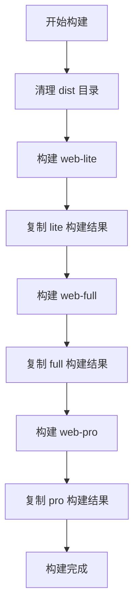
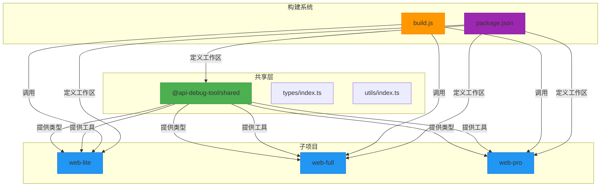

# Monorepo设计

<cite>
**本文档引用的文件**
- [package.json](file://package.json)
- [pnpm-workspace.yaml](file://pnpm-workspace.yaml)
- [scripts/build.js](file://scripts/build.js)
- [packages/shared/package.json](file://packages/shared/package.json)
- [packages/web-lite/package.json](file://packages/web-lite/package.json)
- [packages/web-full/package.json](file://packages/web-full/package.json)
- [packages/web-pro/package.json](file://packages/web-pro/package.json)
- [packages/shared/types/index.ts](file://packages/shared/types/index.ts)
- [packages/shared/utils/index.ts](file://packages/shared/utils/index.ts)
- [packages/shared/utils/http.ts](file://packages/shared/utils/http.ts)
</cite>

## 目录
1. [Monorepo架构概述](#monorepo架构概述)
2. [PNPM Workspaces配置与优势](#pnpm-workspaces配置与优势)
3. [shared共享包设计与职责边界](#shared共享包设计与职责边界)
4. [子项目依赖与引用方式](#子项目依赖与引用方式)
5. [依赖管理策略](#依赖管理策略)
6. [跨包构建流程分析](#跨包构建流程分析)
7. [共享类型与工具函数版本一致性保障](#共享类型与工具函数版本一致性保障)
8. [依赖关系图谱](#依赖关系图谱)

## Monorepo架构概述

本项目采用Monorepo架构，将多个功能相关的子项目统一管理于单一代码仓库中。通过这种架构，实现了代码共享、版本统一、构建协同等优势。项目包含三个主要前端子项目：`web-lite`（轻量版）、`web-full`（完整版）和`web-pro`（专业版），以及一个共享包`shared`，用于封装跨项目复用的类型定义、工具函数和组件。

该架构支持多版本并行开发与构建，通过统一的脚本接口实现各子项目的独立启动与打包，同时确保共享逻辑的一致性与可维护性。

**Section sources**
- [package.json](file://package.json#L1-L36)
- [pnpm-workspace.yaml](file://pnpm-workspace.yaml#L1-L2)

## PNPM Workspaces配置与优势

项目通过`pnpm-workspace.yaml`文件定义工作区范围，配置如下：

```yaml
packages:
  - 'packages/*'
```

该配置将`packages`目录下的所有子目录识别为独立的npm包，由PNPM统一管理依赖安装与链接。结合根目录`package.json`中的`workspaces`字段，PNPM能够：

- **高效依赖管理**：自动解析跨包依赖，使用符号链接实现本地包的即时引用，避免重复安装。
- **原子化安装**：所有包的依赖在根目录统一安装，提升安装速度并减少`node_modules`冗余。
- **版本一致性**：通过`workspace:*`协议（如`"@api-debug-tool/shared": "workspace:*"`）确保各子项目引用的是本地最新版本的共享包，避免版本错乱。
- **过滤构建**：支持`--filter`参数精确控制构建目标，例如`pnpm --filter web-lite dev`仅启动轻量版开发服务器。

**Section sources**
- [pnpm-workspace.yaml](file://pnpm-workspace.yaml#L1-L2)
- [package.json](file://package.json#L6-L8)

## shared共享包设计与职责边界

`shared`包位于`packages/shared`目录，是整个Monorepo的核心共享层，其职责边界明确划分为：

- **类型定义**：通过`types/index.ts`导出所有跨项目通用的接口与类型，如`RequestConfig`、`ResponseData`、`Environment`、`BatchTest`等，确保类型一致性。
- **工具函数**：封装可复用的逻辑工具，包括`http.ts`（HTTP客户端）、`storage.ts`（本地存储）、`validator.ts`（数据校验）、`formatter.ts`（格式化工具）。
- **组件抽象**：预留`components`导出路径，便于未来提取通用UI组件。

`shared`包自身依赖`vue`、`dayjs`、`lodash-es`等基础库，并通过`exports`字段精确控制对外暴露的模块路径，避免不必要的内部文件暴露。

**Section sources**
- [packages/shared/package.json](file://packages/shared/package.json#L1-L21)
- [packages/shared/types/index.ts](file://packages/shared/types/index.ts#L1-L799)
- [packages/shared/utils/index.ts](file://packages/shared/utils/index.ts#L1-L4)

## 子项目依赖与引用方式

三个子项目（`web-lite`、`web-full`、`web-pro`）均通过`package.json`中的`dependencies`字段引用`@api-debug-tool/shared`包，使用`workspace:*`协议建立本地依赖链接。

- **web-lite**：轻量版，仅包含基础调试功能，直接引用`shared`中的类型与工具。
- **web-full**：完整版，功能全面，除引用`shared`外，还引入`monaco-editor`、`echarts`等重型依赖。
- **web-pro**：专业版，侧重团队协作与自动化，引用`shared`并集成`socket.io-client`实现实时通信。

各子项目通过标准ES模块语法导入共享内容，例如：
```ts
import { RequestConfig } from '@api-debug-tool/shared/types';
import { httpClient } from '@api-debug-tool/shared/utils';
```

**Section sources**
- [packages/web-lite/package.json](file://packages/web-lite/package.json#L1-L25)
- [packages/web-full/package.json](file://packages/web-full/package.json#L1-L62)
- [packages/web-pro/package.json](file://packages/web-pro/package.json#L1-L37)

## 依赖管理策略

项目在`dependencies`与`devDependencies`的划分上遵循清晰策略：

- **根目录依赖**：
  - `dependencies`：仅包含全项目通用的运行时依赖（如`dayjs`）。
  - `devDependencies`：包含全局开发工具（如`typescript`、`vite`、`eslint`），避免在各子项目中重复声明。

- **子项目依赖**：
  - `dependencies`：声明自身运行所需的库，包括框架（`vue`）、路由（`vue-router`）、状态管理（`pinia`）及共享包（`@api-debug-tool/shared`）。
  - `devDependencies`：包含构建工具（`vite`、`vue-tsc`）、样式处理器（`sass`）及类型定义（`@types/*`）。

此策略确保了依赖的最小化与职责分离，同时利用PNPM的hoisting机制优化安装效率。

**Section sources**
- [package.json](file://package.json#L20-L36)
- [packages/web-lite/package.json](file://packages/web-lite/package.json#L1-L25)
- [packages/web-full/package.json](file://packages/web-full/package.json#L1-L62)
- [packages/web-pro/package.json](file://packages/web-pro/package.json#L1-L37)

## 跨包构建流程分析

项目通过自定义构建脚本`scripts/build.js`实现多版本统一构建。该脚本执行流程如下：

1. **清理输出目录**：删除`dist`目录，确保构建环境干净。
2. **逐个构建子项目**：遍历`['lite', 'full', 'pro']`，执行`pnpm --filter web-${version} build`命令，利用PNPM的过滤功能精准构建目标包。
3. **复制构建产物**：将各子项目`dist`目录内容复制至`dist/${version}`，形成版本化输出结构。

此脚本通过`execSync`调用PNPM命令，确保构建过程的可编程性与可控性，最终实现`pnpm build:all`一键生成所有版本的生产包。



**Diagram sources**
- [scripts/build.js](file://scripts/build.js#L1-L37)

**Section sources**
- [scripts/build.js](file://scripts/build.js#L1-L37)

## 共享类型与工具函数版本一致性保障

项目通过以下机制保障共享类型与工具函数的版本一致性：

- **本地工作区链接**：使用`workspace:*`协议，确保所有子项目引用的是`packages/shared`的实时代码，任何修改立即生效，无需发布版本。
- **集中式类型管理**：所有接口定义集中于`shared/types/index.ts`，子项目通过精确路径导入（如`@api-debug-tool/shared/types`），避免类型分散导致的不一致。
- **统一构建流程**：构建脚本按顺序执行，确保在构建子项目前，`shared`包的最新变更已被识别。
- **类型检查集成**：通过`vue-tsc --noEmit`在根目录执行类型检查，验证跨包类型引用的正确性。

这些机制共同确保了在多包协作场景下，类型安全与逻辑一致性得到充分保障。

**Section sources**
- [packages/shared/package.json](file://packages/shared/package.json#L1-L21)
- [packages/shared/types/index.ts](file://packages/shared/types/index.ts#L1-L799)
- [package.json](file://package.json#L34-L36)

## 依赖关系图谱

下图展示了各包之间的引用关系与构建顺序：



**Diagram sources**
- [package.json](file://package.json#L1-L36)
- [pnpm-workspace.yaml](file://pnpm-workspace.yaml#L1-L2)
- [scripts/build.js](file://scripts/build.js#L1-L37)
- [packages/shared/package.json](file://packages/shared/package.json#L1-L21)