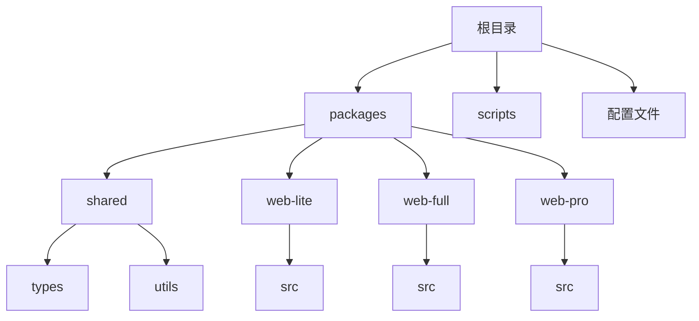
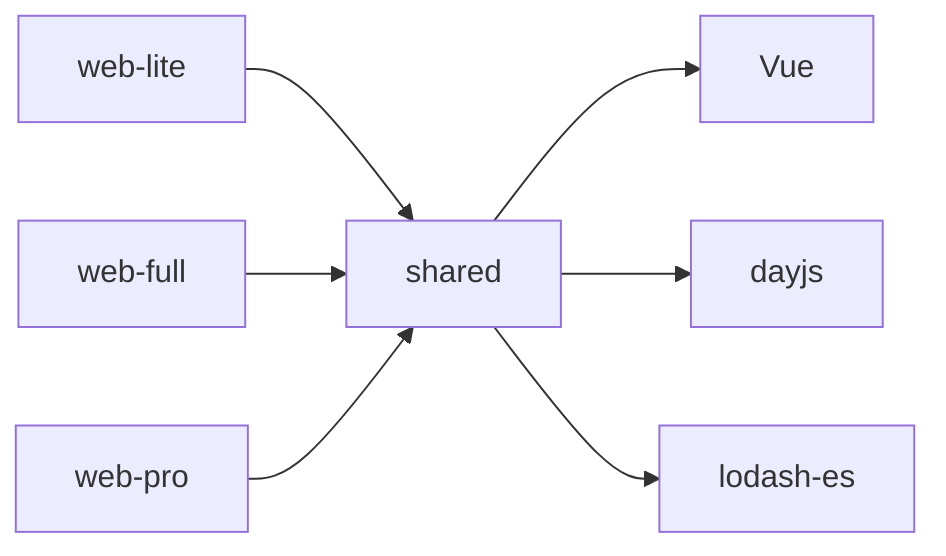
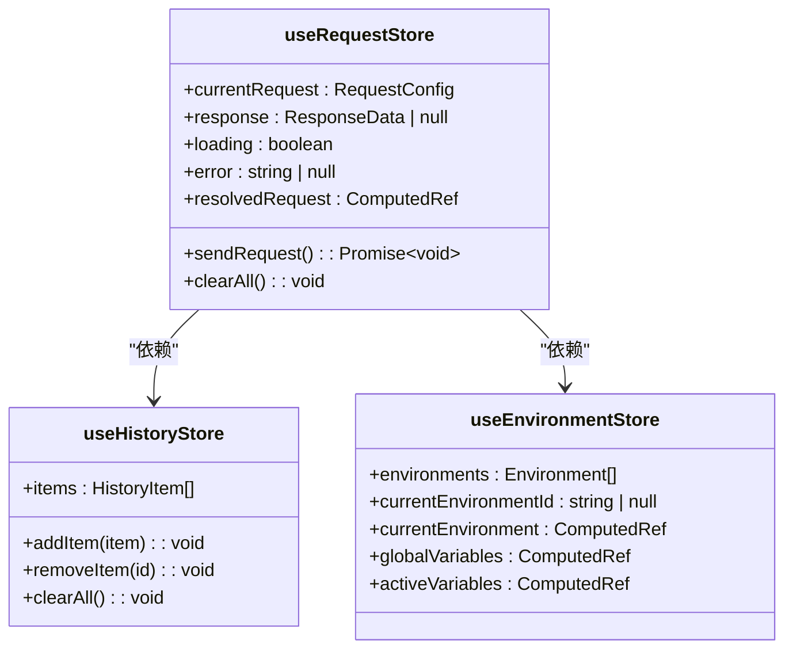
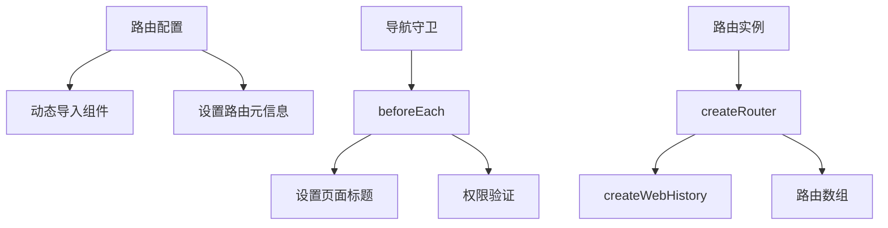
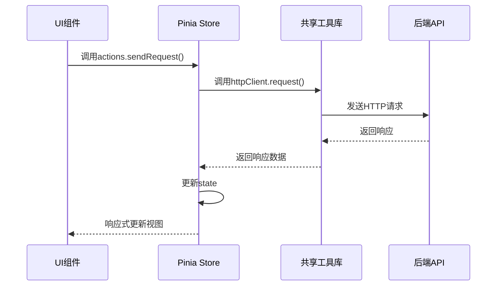
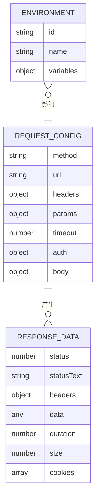

# 技术架构

<cite>
**本文档引用的文件**  
- [user.ts](file://packages/web-pro/src/stores/user.ts)
- [documentation.ts](file://packages/web-pro/src/stores/documentation.ts)
- [environment.ts](file://packages/web-lite/src/stores/environment.ts)
- [request.ts](file://packages/web-lite/src/stores/request.ts)
- [index.ts](file://packages/web-lite/src/router/index.ts)
- [main.ts](file://packages/web-pro/src/main.ts)
- [formatter.ts](file://packages/shared/utils/formatter.ts)
- [http.ts](file://packages/shared/utils/http.ts)
- [storage.ts](file://packages/shared/utils/storage.ts)
- [validator.ts](file://packages/shared/utils/validator.ts)
- [index.ts](file://packages/shared/utils/index.ts)
- [tsconfig.json](file://tsconfig.json)
- [shared/package.json](file://packages/shared/package.json)
- [web-pro/tsconfig.json](file://packages/web-pro/tsconfig.json)
- [shared/tsconfig.json](file://packages/shared/tsconfig.json)
- [web-lite/tsconfig.json](file://packages/web-lite/tsconfig.json)
</cite>

## 目录
1. [引言](#引言)
2. [项目结构](#项目结构)
3. [MVVM与Composition API实践](#mvvm与composition-api实践)
4. [Monorepo架构与子项目依赖](#monorepo架构与子项目依赖)
5. [Pinia状态管理机制](#pinia状态管理机制)
6. [Vue Router路由系统](#vue-router路由系统)
7. [共享工具库设计](#共享工具库设计)
8. [组件层级与数据流](#组件层级与数据流)
9. [TypeScript类型系统](#typescript类型系统)
10. [结论](#结论)

## 引言
本技术架构文档深入解析在线接口调试工具的前端架构设计。系统采用Monorepo模式组织多个子项目，基于Vue 3的MVVM架构与Composition API实现响应式数据绑定与逻辑复用。通过Pinia实现全局状态管理，Vue Router处理多页面导航，结合共享工具库实现跨项目功能复用。文档详细阐述各核心模块的设计原理与交互机制，为系统维护与扩展提供技术参考。

## 项目结构
项目采用Monorepo架构，通过pnpm workspace管理多个子包。根目录包含全局配置文件，`packages`目录下包含四个核心模块：`shared`为共享库，`web-lite`、`web-full`、`web-pro`为不同版本的前端应用。这种结构实现了代码复用与独立部署的平衡。



**Diagram sources**
- [tsconfig.json](file://tsconfig.json#L1-L35)
- [pnpm-workspace.yaml](file://pnpm-workspace.yaml#L1-L3)

**Section sources**
- [project_structure](file://project_structure#L1-L200)

## MVVM与Composition API实践
系统基于Vue 3的MVVM设计模式，通过数据绑定实现视图与模型的自动同步。采用Composition API组织组件逻辑，将相关功能聚合为可复用的组合函数。在`RequestPanel.vue`等复杂组件中，通过`setup()`函数集中管理响应式状态、计算属性和方法，提升了代码的可读性与可测试性。

Composition API的使用使得逻辑关注点得以分离，例如将请求处理逻辑封装在`useRequest`组合函数中，环境管理逻辑封装在`useEnvironment`中。这种模式支持更好的类型推断，与TypeScript深度集成，同时便于单元测试和逻辑复用。

**Section sources**
- [request.ts](file://packages/web-lite/src/stores/request.ts#L1-L305)
- [environment.ts](file://packages/web-lite/src/stores/environment.ts#L1-L40)

## Monorepo架构与子项目依赖
Monorepo架构通过`pnpm-workspace.yaml`统一管理`web-lite`、`web-full`、`web-pro`三个前端子项目和`shared`共享库。各子项目通过`package.json`中的依赖声明引用`@api-debug-tool/shared`包，实现工具函数、类型定义和组件的共享。

`tsconfig.json`中的`paths`配置实现了模块路径别名，`@shared/*`指向`packages/shared/*`，简化了跨包导入。`references`字段声明了项目引用关系，支持TypeScript的项目引用功能，实现跨包类型检查和增量编译。



**Diagram sources**
- [tsconfig.json](file://tsconfig.json#L1-L35)
- [shared/package.json](file://packages/shared/package.json#L1-L21)

**Section sources**
- [tsconfig.json](file://tsconfig.json#L1-L35)
- [shared/package.json](file://packages/shared/package.json#L1-L21)

## Pinia状态管理机制
系统采用Pinia作为状态管理方案，替代传统的Vuex。各子项目在`stores`目录下定义模块化store，如`request.ts`、`environment.ts`、`user.ts`等。每个store使用`defineStore`函数创建，包含state、getters和actions。

状态组织遵循模块化原则，按功能域划分store。例如`web-lite`包含`request`、`history`、`environment`等store，`web-pro`在此基础上扩展`automation`、`performance`等高级功能store。跨模块状态同步通过store间的相互引用实现，如`requestStore`引用`historyStore`以保存请求历史。



**Diagram sources**
- [request.ts](file://packages/web-lite/src/stores/request.ts#L1-L305)
- [environment.ts](file://packages/web-lite/src/stores/environment.ts#L1-L40)
- [user.ts](file://packages/web-pro/src/stores/user.ts#L1-L50)

**Section sources**
- [request.ts](file://packages/web-lite/src/stores/request.ts#L1-L305)
- [environment.ts](file://packages/web-lite/src/stores/environment.ts#L1-L40)
- [user.ts](file://packages/web-pro/src/stores/user.ts#L1-L50)

## Vue Router路由系统
Vue Router在多页面应用中实现声明式路由配置。`web-lite`的`router/index.ts`定义了`Home`、`History`、`Environments`、`Settings`等路由，采用动态导入实现代码分割。`web-pro`的路由配置更为复杂，包含`Dashboard`、`Performance`、`Team`、`Documentation`等专业功能页面。

导航守卫用于实现页面级功能，如`beforeEach`守卫设置页面标题。路由元信息`meta`字段存储页面标题等附加数据，支持SEO和用户体验优化。路由配置采用`createWebHistory`模式，生成美观的URL路径。



**Diagram sources**
- [index.ts](file://packages/web-lite/src/router/index.ts#L1-L62)
- [main.ts](file://packages/web-pro/src/main.ts#L1-L65)

**Section sources**
- [index.ts](file://packages/web-lite/src/router/index.ts#L1-L62)
- [main.ts](file://packages/web-pro/src/main.ts#L1-L65)

## 共享工具库设计
`shared`包中的`utils`模块提供了`formatter`、`http`、`storage`、`validator`四大核心工具类，通过`index.ts`统一导出，形成清晰的API边界。

`Formatter`类提供数据格式化功能，如文件大小、时间戳、JSON美化等。`HttpClient`封装了统一的HTTP请求处理，支持请求拦截、响应解析和错误处理。`StorageManager`提供带前缀的本地存储操作，避免命名冲突。`Validator`实现URL、邮箱、JSON等数据验证，确保输入合法性。

```mermaid
classDiagram
class Formatter {
+formatFileSize(bytes) : string
+formatDuration(ms) : string
+formatTimestamp(timestamp) : string
+formatJson(obj) : string
+formatHeaders(headers) : string
+formatCurl(config) : string
}
class HttpClient {
-baseURL : string
-defaultHeaders : Record~string, string~
+setBaseURL(url) : void
+setDefaultHeaders(headers) : void
+request(config) : Promise~ResponseData~
}
class StorageManager {
-prefix : string
+set(key, value) : void
+get(key, defaultValue) : T | undefined
+remove(key) : void
+clear() : void
+getAllKeys() : string[]
}
class Validator {
+isValidUrl(url) : boolean
+isValidJson(str) : boolean
+isValidEmail(email) : boolean
+isValidHttpMethod(method) : boolean
+validateRequestConfig(config) : {valid, errors}
}
Formatter <|-- 全局工具
HttpClient <|-- 全局工具
StorageManager <|-- 全局工具
Validator <|-- 全局工具
```

**Diagram sources**
- [formatter.ts](file://packages/shared/utils/formatter.ts#L1-L55)
- [http.ts](file://packages/shared/utils/http.ts#L1-L62)
- [storage.ts](file://packages/shared/utils/storage.ts#L1-L55)
- [validator.ts](file://packages/shared/utils/validator.ts#L1-L55)

**Section sources**
- [formatter.ts](file://packages/shared/utils/formatter.ts#L1-L55)
- [http.ts](file://packages/shared/utils/http.ts#L1-L62)
- [storage.ts](file://packages/shared/utils/storage.ts#L1-L55)
- [validator.ts](file://packages/shared/utils/validator.ts#L1-L55)

## 组件层级与数据流
系统采用清晰的组件层级结构：UI组件（如`RequestPanel`）通过Composition API组合函数与Pinia store交互，store通过共享工具库的`HttpClient`发起API调用，响应数据经由store更新后自动同步到视图。

数据流遵循单向数据流原则：用户操作触发组件方法，组件调用store的actions，actions执行异步操作并提交state变更，state变更自动更新视图。这种模式确保了数据流的可预测性和调试的便利性。



**Diagram sources**
- [request.ts](file://packages/web-lite/src/stores/request.ts#L1-L305)
- [http.ts](file://packages/shared/utils/http.ts#L1-L62)

**Section sources**
- [request.ts](file://packages/web-lite/src/stores/request.ts#L1-L305)
- [http.ts](file://packages/shared/utils/http.ts#L1-L62)

## TypeScript类型系统
TypeScript为系统提供了全面的类型安全保障。`shared/types/index.ts`集中定义了`RequestConfig`、`ResponseData`、`Environment`等核心类型，通过`@shared/*`路径别名被所有子项目引用。

类型系统贯穿整个开发流程：组件props、store state、API请求/响应、工具函数参数均使用精确类型定义。泛型在`StorageManager`等工具类中广泛应用，确保类型安全。严格模式配置（`strict: true`）启用所有严格类型检查，防止常见类型错误。



**Diagram sources**
- [tsconfig.json](file://tsconfig.json#L1-L35)
- [shared/tsconfig.json](file://packages/shared/tsconfig.json#L1-L28)
- [web-lite/tsconfig.json](file://packages/web-lite/tsconfig.json#L1-L32)

**Section sources**
- [tsconfig.json](file://tsconfig.json#L1-L35)
- [shared/tsconfig.json](file://packages/shared/tsconfig.json#L1-L28)
- [web-lite/tsconfig.json](file://packages/web-lite/tsconfig.json#L1-L32)

## 结论
本系统通过Monorepo架构实现了多版本前端应用的高效协同开发，基于Vue 3的MVVM模式与Composition API构建了响应式用户界面。Pinia状态管理、Vue Router路由系统与共享工具库共同构成了稳定的技术基石。TypeScript的深度集成确保了代码的可维护性与类型安全。整体架构清晰、模块化程度高，为系统的持续演进提供了良好的基础。