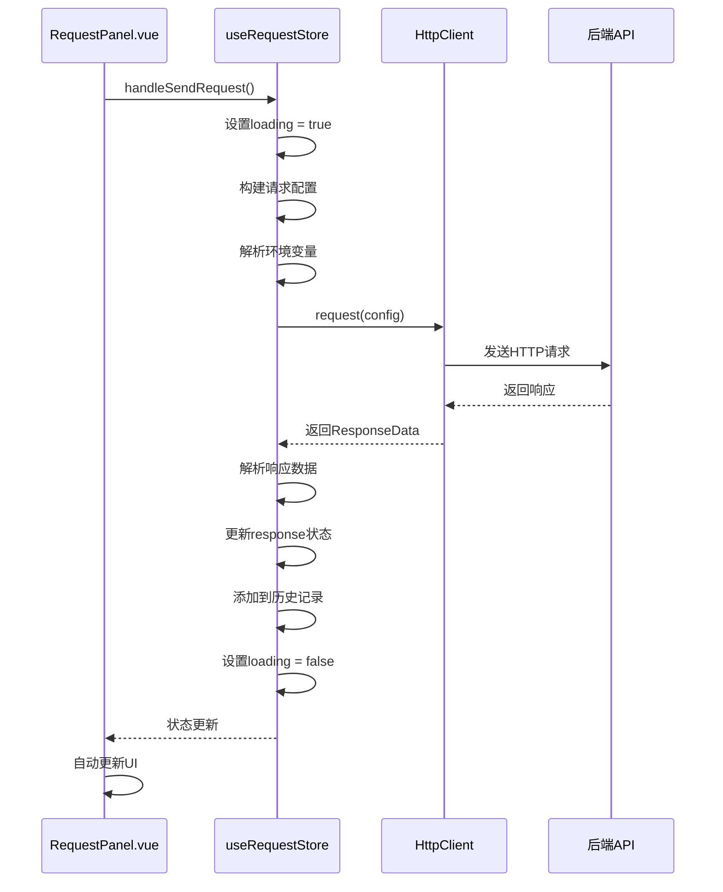

# 数据流

<cite>
**本文档中引用的文件**   
- [RequestPanel.vue](file://packages/web-lite/src/components/RequestPanel.vue)
- [request.ts](file://packages/web-lite/src/stores/request.ts)
- [http.ts](file://packages/shared/utils/http.ts)
- [index.ts](file://packages/shared/types/index.ts)
</cite>

## 目录
1. [简介](#简介)
2. [核心数据流概述](#核心数据流概述)
3. [UI组件与Pinia Store的交互](#ui组件与pinia-store的交互)
4. [Pinia Store中的请求处理逻辑](#pinia-store中的请求处理逻辑)
5. [HTTP通信与shared/utils/http.ts](#http通信与sharedutilshthttpts)
6. [响应处理与状态更新](#响应处理与状态更新)
7. [错误处理机制](#错误处理机制)
8. [响应式数据绑定与UI更新](#响应式数据绑定与ui更新)
9. [数据流序列图](#数据流序列图)

## 简介
本文档详细描述了在线接口调试工具中从用户操作到UI更新的完整数据流。重点分析了UI组件如何通过Pinia store发起API请求，store内部如何使用共享的HTTP工具进行通信，以及响应数据如何被处理并回写至状态。同时解释了错误处理机制在整个数据流中的位置与作用，并结合RequestPanel.vue等组件说明响应式数据的绑定与更新机制。

## 核心数据流概述
系统采用典型的MVVM架构模式，数据流遵循单向数据流原则。用户在UI组件中触发操作（如点击"发送"按钮），该操作调用Pinia store中的方法。store负责处理业务逻辑、发起HTTP请求，并将结果存储在响应式状态中。Vue组件通过响应式绑定自动更新UI，形成完整的数据闭环。

**Section sources**
- [RequestPanel.vue](file://packages/web-lite/src/components/RequestPanel.vue#L0-L627)
- [request.ts](file://packages/web-lite/src/stores/request.ts#L0-L304)

## UI组件与Pinia Store的交互
UI组件通过`useRequestStore()`钩子函数获取Pinia store实例，建立与全局状态的连接。在RequestPanel.vue组件中，模板部分直接绑定store中的`currentRequest`状态，实现双向数据绑定。当用户点击"发送"按钮时，触发`handleSendRequest`方法，该方法调用store的`sendRequest`动作。

```vue
<script setup lang="ts">
const requestStore = useRequestStore()

const handleSendRequest = async () => {
  if (!requestStore.currentRequest.url.trim()) {
    ElMessage.warning('请输入请求URL')
    return
  }
  
  try {
    await requestStore.sendRequest()
    ElMessage.success('请求发送成功')
  } catch (error) {
    ElMessage.error(`请求失败: ${error}`)
  }
}
</script>
```

这种设计模式实现了关注点分离：UI组件仅负责用户交互和展示，而业务逻辑和状态管理完全由store处理。

**Section sources**
- [RequestPanel.vue](file://packages/web-lite/src/components/RequestPanel.vue#L0-L627)

## Pinia Store中的请求处理逻辑
request.ts文件定义了useRequestStore，包含`currentRequest`、`response`、`loading`等响应式状态。`sendRequest`方法是核心逻辑入口，它首先设置加载状态，然后构建完整的请求配置。

store使用`resolvedRequest`计算属性来解析环境变量，确保请求中的占位符被实际值替换。请求配置包括URL、HTTP方法、头部、参数、认证信息和请求体等。store还负责处理认证逻辑，根据不同的认证类型（Bearer Token、Basic Auth、API Key）生成相应的头部或查询参数。

**Section sources**
- [request.ts](file://packages/web-lite/src/stores/request.ts#L0-L304)

## HTTP通信与shared/utils/http.ts
系统使用共享的HTTP客户端进行API通信。HttpClient类封装了fetch API，提供统一的请求接口。它支持设置基础URL、默认头部，并处理请求的序列化和响应的解析。

```typescript
export class HttpClient {
  async request(config: RequestConfig): Promise<ResponseData> {
    const url = this.baseURL + config.url;
    
    const requestInit: RequestInit = {
      method: config.method,
      headers: {
        ...this.defaultHeaders,
        ...config.headers
      }
    };

    if (config.data && ['POST', 'PUT', 'PATCH'].includes(config.method)) {
      requestInit.body = typeof config.data === 'string' 
        ? config.data 
        : JSON.stringify(config.data);
    }

    try {
      const response = await fetch(url, requestInit);
      // 处理响应...
    } catch (error) {
      throw new Error(`Request failed: ${error}`);
    }
  }
}
```

虽然当前实现直接使用fetch，但HttpClient提供了良好的抽象层，便于未来替换底层HTTP库或添加额外功能。

**Section sources**
- [http.ts](file://packages/shared/utils/http.ts#L0-L61)

## 响应处理与状态更新
请求完成后，store负责解析响应数据并更新状态。响应解析包括：读取状态码和状态文本、解析响应头、根据Content-Type决定如何解析响应体（JSON或文本）、提取Set-Cookie头中的cookie信息。

解析后的响应数据被封装为ResponseData对象，并赋值给store的`response`状态。同时，store会将请求-响应对添加到历史记录中，便于后续查看。最后，无论成功或失败，都会将`loading`状态设置为false，触发UI更新。

```typescript
const responseObj: ResponseData = {
  status: res.status,
  statusText: res.statusText,
  headers: Object.fromEntries(res.headers.entries()),
  data: responseData,
  duration,
  size: new Blob([JSON.stringify(responseData)]).size,
  cookies
}

response.value = responseObj
```

**Section sources**
- [request.ts](file://packages/web-lite/src/stores/request.ts#L0-L304)

## 错误处理机制
系统实现了多层次的错误处理机制。在HTTP客户端层面，使用try-catch捕获网络请求异常，并抛出格式化的错误信息。在store层面，捕获所有异常，设置`error`状态，并提供友好的错误信息给UI展示。

```typescript
catch (err: any) {
  console.error('Request failed:', err)
  error.value = err.message
  response.value = {
    status: 0,
    statusText: 'Network Error',
    headers: {},
    data: err.message,
    duration: 0,
    size: 0
  }
} finally {
  loading.value = false
}
```

UI组件通过ElMessage组件向用户展示成功或失败提示，确保用户始终了解操作结果。这种错误处理机制保证了应用的健壮性，即使请求失败也不会导致应用崩溃。

**Section sources**
- [request.ts](file://packages/web-lite/src/stores/request.ts#L0-L304)
- [RequestPanel.vue](file://packages/web-lite/src/components/RequestPanel.vue#L0-L627)

## 响应式数据绑定与UI更新
系统充分利用Vue的响应式系统实现自动UI更新。store中的状态使用ref和computed定义，确保它们是响应式的。UI组件通过直接引用store状态实现数据绑定。

当store中的`response`状态更新时，依赖该状态的UI组件会自动重新渲染。`loading`状态的变化会触发发送按钮的加载动画。`error`状态用于条件渲染错误信息。这种响应式设计消除了手动DOM操作的需要，使代码更加简洁和可维护。

```vue
<el-button
  type="primary"
  :loading="requestStore.loading"
  @click="handleSendRequest"
  class="send-btn"
>
  {{ requestStore.loading ? '发送中...' : '发送' }}
</el-button>
```

**Section sources**
- [RequestPanel.vue](file://packages/web-lite/src/components/RequestPanel.vue#L0-L627)

## 数据流序列图


**Diagram sources**
- [RequestPanel.vue](file://packages/web-lite/src/components/RequestPanel.vue#L0-L627)
- [request.ts](file://packages/web-lite/src/stores/request.ts#L0-L304)
- [http.ts](file://packages/shared/utils/http.ts#L0-L61)

**Section sources**
- [RequestPanel.vue](file://packages/web-lite/src/components/RequestPanel.vue#L0-L627)
- [request.ts](file://packages/web-lite/src/stores/request.ts#L0-L304)
- [http.ts](file://packages/shared/utils/http.ts#L0-L61)