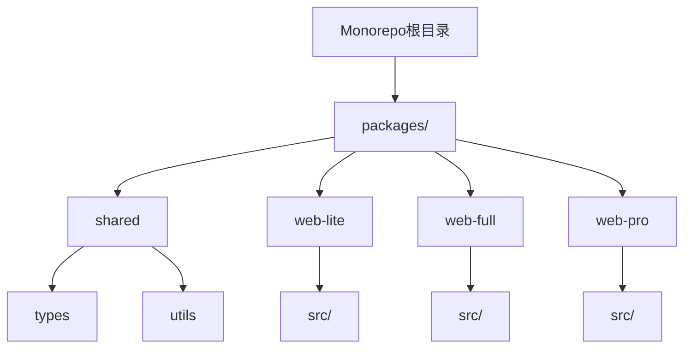
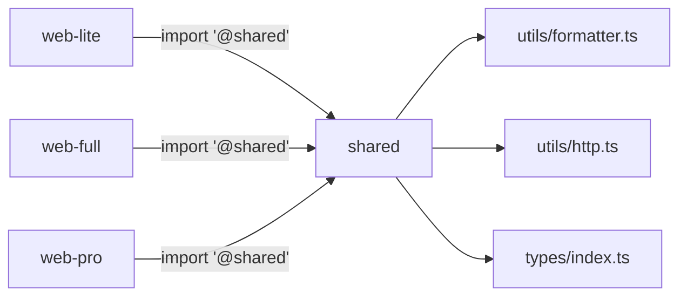
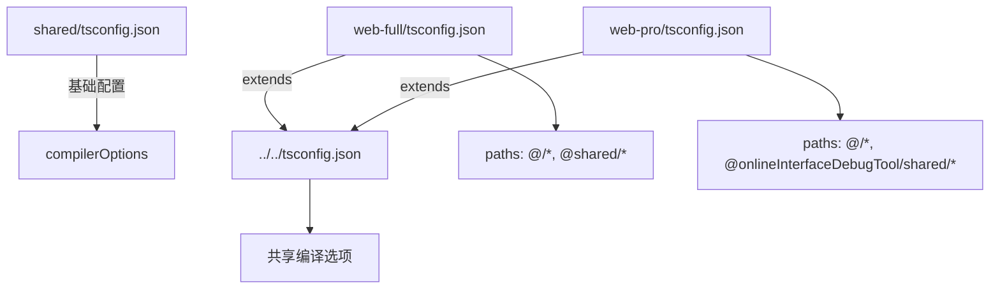
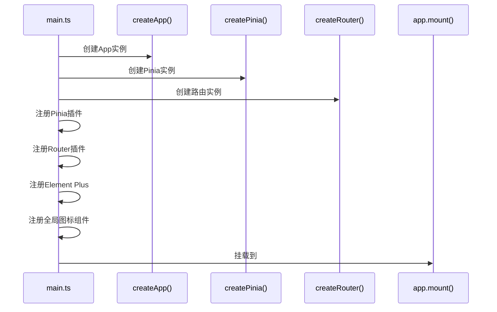
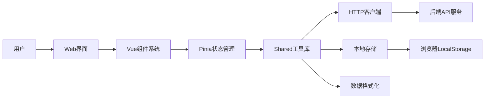
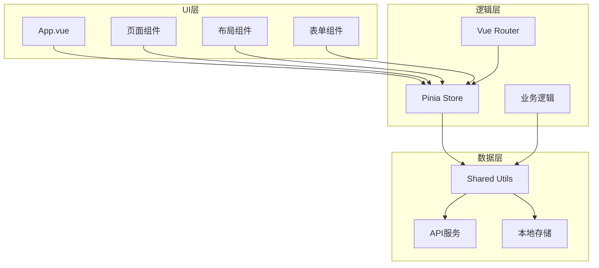

# 整体架构

<cite>
**本文档引用文件**  
- [vite.config.ts](file://packages/web-lite/vite.config.ts)
- [vite.config.ts](file://packages/web-full/vite.config.ts)
- [vite.config.ts](file://packages/web-pro/vite.config.ts)
- [tsconfig.json](file://packages/shared/tsconfig.json)
- [tsconfig.json](file://packages/web-lite/tsconfig.json)
- [tsconfig.json](file://packages/web-full/tsconfig.json)
- [tsconfig.json](file://packages/web-pro/tsconfig.json)
- [main.ts](file://packages/web-lite/src/main.ts)
- [main.ts](file://packages/web-full/src/main.ts)
- [main.ts](file://packages/web-pro/src/main.ts)
- [package.json](file://packages/shared/package.json)
- [package.json](file://packages/web-lite/package.json)
- [package.json](file://packages/web-full/package.json)
- [package.json](file://packages/web-pro/package.json)
</cite>

## 目录
1. [项目结构](#项目结构)
2. [MVVM架构设计](#mvvm架构设计)
3. [Monorepo依赖与构建隔离机制](#monorepo依赖与构建隔离机制)
4. [功能边界划分与用户场景](#功能边界划分与用户场景)
5. [Vite多项目构建配置](#vite多项目构建配置)
6. [TypeScript配置继承策略](#typescript配置继承策略)
7. [应用初始化流程](#应用初始化流程)
8. [系统上下文图](#系统上下文图)
9. [组件分层架构图](#组件分层架构图)

## 项目结构

本项目采用Monorepo架构，通过`pnpm-workspace.yaml`统一管理多个子包。核心结构包含三个前端应用（web-lite、web-full、web-pro）和一个共享库（shared），各具独立构建能力与技术栈配置。



**Diagram sources**
- [pnpm-workspace.yaml](file://pnpm-workspace.yaml#L1-L3)
- [project_structure](file://project_structure)

## MVVM架构设计

系统基于Vue 3的响应式系统实现MVVM模式，通过Pinia进行状态管理，Vite提供开发构建支持。视图层（View）由Vue组件构成，视图模型（ViewModel）由Pinia Store和组件逻辑共同承担，模型层（Model）由共享工具库与API服务组成。

**Section sources**
- [main.ts](file://packages/web-lite/src/main.ts#L1-L20)
- [main.ts](file://packages/web-full/src/main.ts#L1-L20)
- [main.ts](file://packages/web-pro/src/main.ts#L1-L64)

## Monorepo依赖与构建隔离机制

三个前端应用通过pnpm workspace共享依赖，同时保持构建独立性。`shared`包作为通用能力中心，提供类型定义与工具函数，各应用通过路径别名导入。



**Diagram sources**
- [vite.config.ts](file://packages/web-lite/vite.config.ts#L6-L10)
- [vite.config.ts](file://packages/web-full/vite.config.ts#L6-L10)
- [vite.config.ts](file://packages/web-pro/vite.config.ts#L6-L10)
- [package.json](file://packages/shared/package.json#L1-L10)

**Section sources**
- [vite.config.ts](file://packages/web-lite/vite.config.ts#L6-L10)
- [vite.config.ts](file://packages/web-full/vite.config.ts#L6-L10)
- [vite.config.ts](file://packages/web-pro/vite.config.ts#L6-L10)

## 功能边界划分与用户场景

| 应用版本 | 核心功能 | 目标用户 | 使用场景 |
|--------|--------|--------|--------|
| web-lite | 基础接口调试、历史记录、环境管理 | 个人开发者 | 快速测试单个API，轻量级使用 |
| web-full | 集合管理、批量测试、团队协作 | 中小型团队 | 项目级接口维护与协作测试 |
| web-pro | 自动化测试、性能分析、文档生成、高级权限控制 | 企业级团队 | 复杂系统集成测试与持续交付 |

**Section sources**
- [package.json](file://packages/web-lite/package.json#L1-L10)
- [package.json](file://packages/web-full/package.json#L1-L10)
- [package.json](file://packages/web-pro/package.json#L1-L10)

## Vite多项目构建配置

各应用独立配置`vite.config.ts`，统一使用Vue插件，通过`resolve.alias`建立模块别名，实现对`@`（本项目src）和`@shared`（共享库）的引用。不同应用监听不同端口以支持并行开发。

```mermaid
flowchart TD
A[Vite配置] --> B[插件注册]
A --> C[路径别名]
A --> D[开发服务器]
A --> E[构建输出]
B --> F[vue()]
C --> G[@ → src/]
C --> H[@shared → ../shared]
D --> I[web-lite:3000]
D --> J[web-full:3001]
D --> K[web-pro:3002]
E --> L[outDir: dist]
```

**Diagram sources**
- [vite.config.ts](file://packages/web-lite/vite.config.ts#L1-L20)
- [vite.config.ts](file://packages/web-full/vite.config.ts#L1-L20)
- [vite.config.ts](file://packages/web-pro/vite.config.ts#L1-L20)

## TypeScript配置继承策略

`shared`包定义基础`tsconfig.json`，包含严格类型检查与模块配置。`web-full`和`web-pro`继承根目录`tsconfig.json`，并通过`paths`配置模块解析路径，实现类型系统统一与路径别名支持。



**Diagram sources**
- [tsconfig.json](file://packages/shared/tsconfig.json#L1-L28)
- [tsconfig.json](file://packages/web-full/tsconfig.json#L1-L19)
- [tsconfig.json](file://packages/web-pro/tsconfig.json#L1-L19)

**Section sources**
- [tsconfig.json](file://packages/shared/tsconfig.json#L1-L28)
- [tsconfig.json](file://packages/web-full/tsconfig.json#L1-L19)
- [tsconfig.json](file://packages/web-pro/tsconfig.json#L1-L19)

## 应用初始化流程

所有应用均在`main.ts`中完成初始化，流程包括：创建Vue应用实例、创建Pinia状态管理、配置路由、注册全局组件（如Element Plus图标）、挂载应用。



**Diagram sources**
- [main.ts](file://packages/web-lite/src/main.ts#L1-L20)
- [main.ts](file://packages/web-full/src/main.ts#L1-L20)
- [main.ts](file://packages/web-pro/src/main.ts#L1-L64)

**Section sources**
- [main.ts](file://packages/web-lite/src/main.ts#L1-L20)
- [main.ts](file://packages/web-full/src/main.ts#L1-L20)
- [main.ts](file://packages/web-pro/src/main.ts#L1-L64)

## 系统上下文图



**Diagram sources**
- [utils/http.ts](file://packages/shared/utils/http.ts#L1-L10)
- [utils/storage.ts](file://packages/shared/utils/storage.ts#L1-L10)
- [utils/formatter.ts](file://packages/shared/utils/formatter.ts#L1-L10)

## 组件分层架构图



**Diagram sources**
- [stores/](file://packages/web-lite/src/stores/)
- [router/index.ts](file://packages/web-lite/src/router/index.ts#L1-L10)
- [utils/](file://packages/shared/utils/)
- [components/](file://packages/web-lite/src/components/)