# 状态管理

<cite>
**本文档引用文件**  
- [collection.ts](file://packages/web-full/src/stores/collection.ts)
- [environment.ts](file://packages/web-full/src/stores/environment.ts)
- [workspace.ts](file://packages/web-full/src/stores/workspace.ts)
- [team.ts](file://packages/web-full/src/stores/team.ts)
- [automation.ts](file://packages/web-pro/src/stores/automation.ts)
- [storage.ts](file://packages/shared/utils/storage.ts)
</cite>

## 目录
1. [项目结构](#项目结构)
2. [核心状态模块设计](#核心状态模块设计)
3. [模块化拆分原则与业务对应关系](#模块化拆分原则与业务对应关系)
4. [异步操作处理模式](#异步操作处理模式)
5. [数据派生与getters使用](#数据派生与getters使用)
6. [状态持久化机制](#状态持久化机制)
7. [状态调用链路示例](#状态调用链路示例)
8. [依赖关系图](#依赖关系图)

## 项目结构

项目采用模块化架构，状态管理集中于各子包的 `stores` 目录中。`web-full` 包含完整的状态模块，`web-pro` 包扩展了高级功能模块，`web-lite` 包提供基础状态支持。

**Section sources**
- [collection.ts](file://packages/web-full/src/stores/collection.ts)
- [environment.ts](file://packages/web-full/src/stores/environment.ts)
- [workspace.ts](file://packages/web-full/src/stores/workspace.ts)
- [team.ts](file://packages/web-full/src/stores/team.ts)
- [automation.ts](file://packages/web-pro/src/stores/automation.ts)

## 核心状态模块设计

### 集合状态模块 (collection)
该模块管理API集合、请求、历史记录和批量测试结果，支持导入导出多种格式。

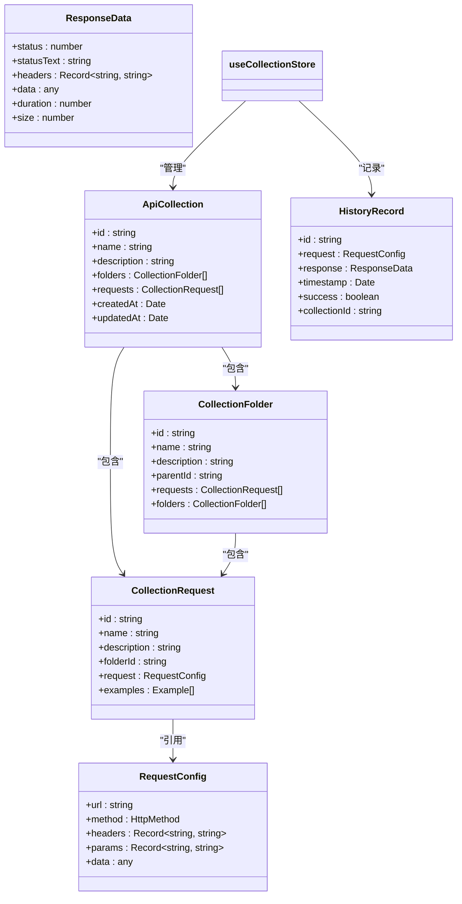

**Diagram sources**
- [collection.ts](file://packages/web-full/src/stores/collection.ts#L15-L80)

### 环境状态模块 (environment)
该模块管理环境变量、环境组、模板和全局变量，支持环境切换和变量冲突检测。

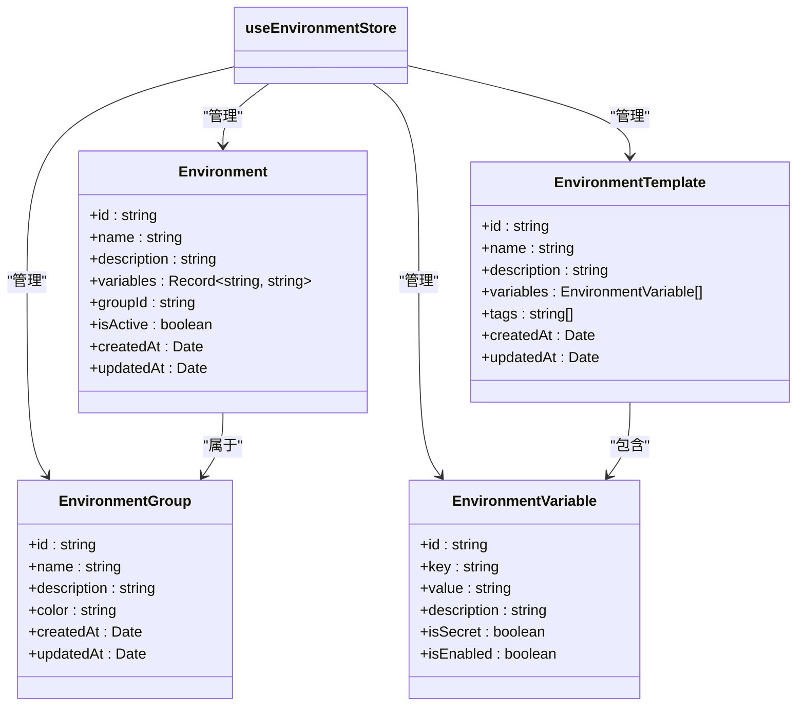

**Diagram sources**
- [environment.ts](file://packages/web-full/src/stores/environment.ts#L15-L80)

### 工作空间状态模块 (workspace)
该模块管理工作空间、团队、权限和活动日志，是企业级功能的核心。

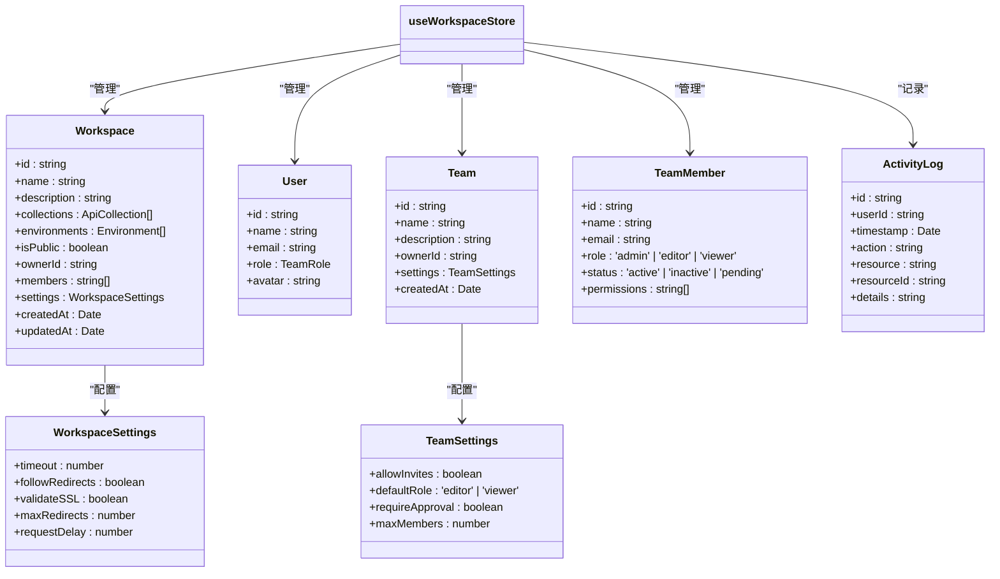

**Diagram sources**
- [workspace.ts](file://packages/web-full/src/stores/workspace.ts#L15-L80)

### 团队状态模块 (team)
该模块管理团队成员、邀请和权限，支持团队协作和权限控制。

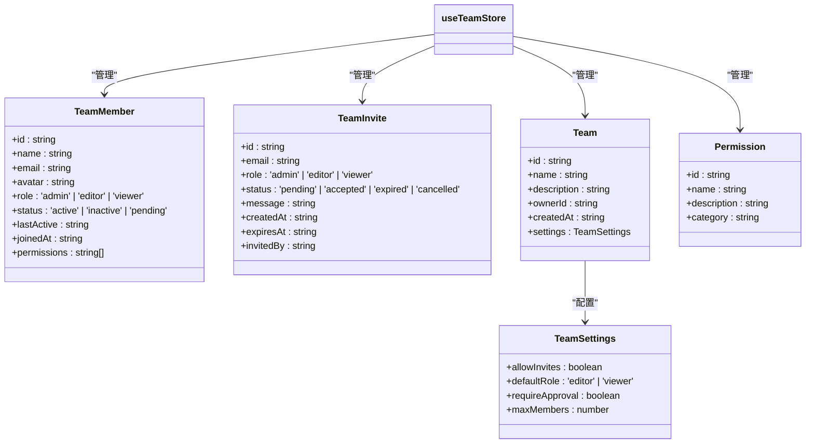

**Diagram sources**
- [team.ts](file://packages/web-full/src/stores/team.ts#L15-L80)

### 自动化状态模块 (automation)
该模块管理测试套件、计划和执行结果，支持自动化测试和性能监控。

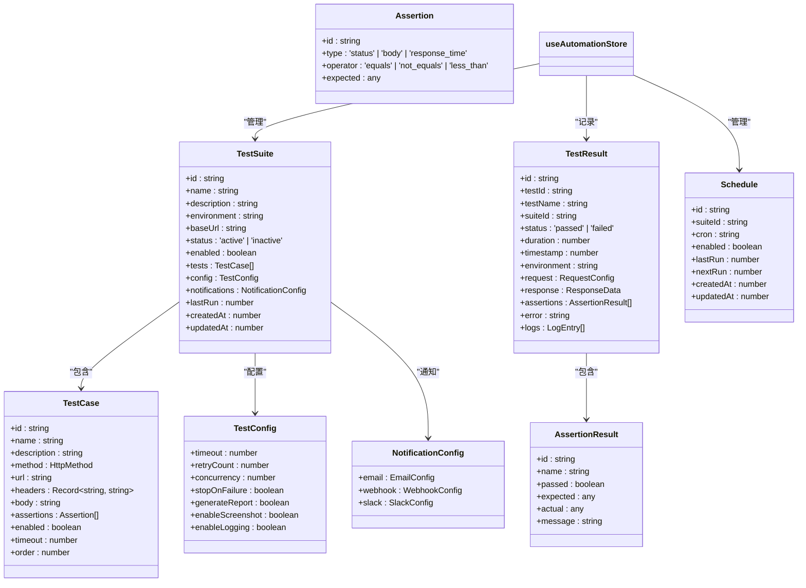

**Diagram sources**
- [automation.ts](file://packages/web-pro/src/stores/automation.ts#L15-L80)

## 模块化拆分原则与业务对应关系

状态模块的拆分遵循单一职责原则，每个模块对应特定的业务功能域：

- **collection模块**：对应API集合管理功能，负责API请求的组织、执行和历史记录
- **environment模块**：对应环境管理功能，负责环境变量、分组和模板的管理
- **workspace模块**：对应工作空间管理功能，是全局状态的协调中心
- **team模块**：对应团队协作功能，管理成员、权限和邀请
- **automation模块**：对应自动化测试功能，管理测试套件、计划和执行

这种模块化设计实现了关注点分离，降低了模块间的耦合度，提高了代码的可维护性和可测试性。

**Section sources**
- [collection.ts](file://packages/web-full/src/stores/collection.ts)
- [environment.ts](file://packages/web-full/src/stores/environment.ts)
- [workspace.ts](file://packages/web-full/src/stores/workspace.ts)
- [team.ts](file://packages/web-full/src/stores/team.ts)
- [automation.ts](file://packages/web-pro/src/stores/automation.ts)

## 异步操作处理模式

### API调用处理
所有异步操作都封装在actions中，采用统一的错误处理和用户反馈机制：

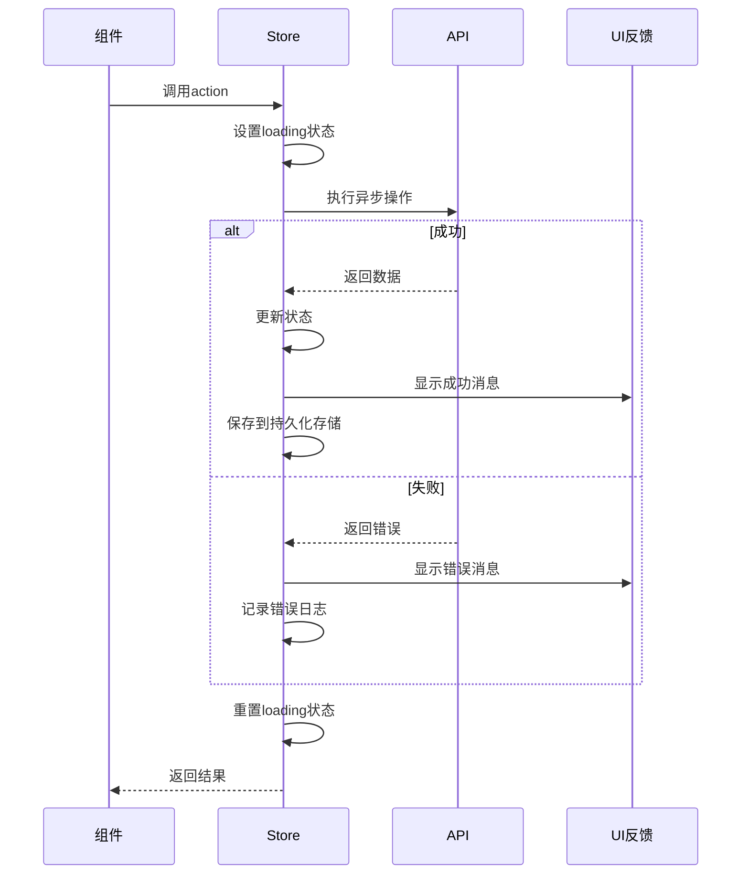

**Diagram sources**
- [collection.ts](file://packages/web-full/src/stores/collection.ts#L200-L300)
- [environment.ts](file://packages/web-full/src/stores/environment.ts#L200-L300)
- [workspace.ts](file://packages/web-full/src/stores/workspace.ts#L200-L300)

### 错误处理策略
- 使用try-catch捕获异步操作异常
- 统一使用ElMessage显示用户反馈
- 记录详细错误日志用于调试
- 提供有意义的错误信息

## 数据派生与getters使用

### 过滤与搜索
getters用于实现数据的动态过滤和搜索功能：

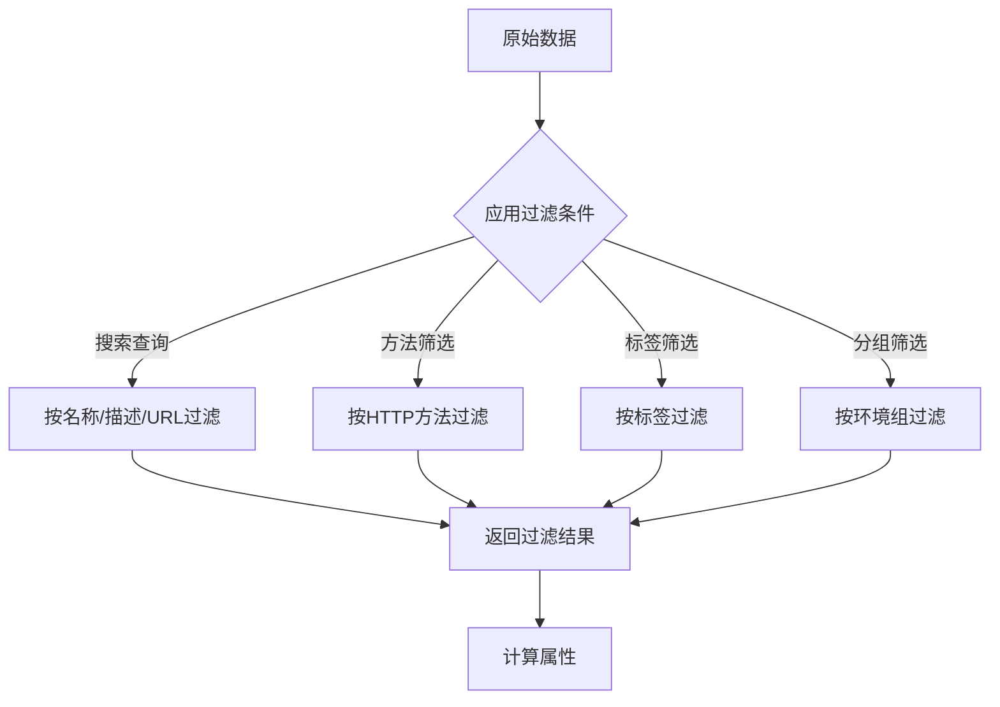

**Diagram sources**
- [collection.ts](file://packages/web-full/src/stores/collection.ts#L100-L150)
- [environment.ts](file://packages/web-full/src/stores/environment.ts#L100-L150)

### 统计与摘要
getters用于生成数据统计和摘要信息：

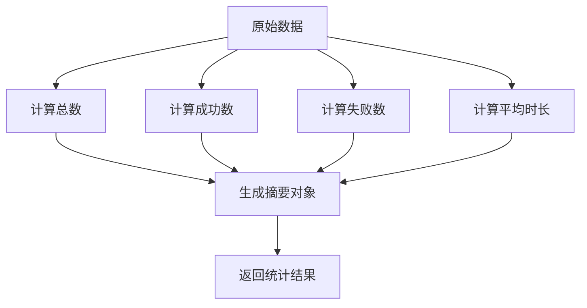

**Diagram sources**
- [automation.ts](file://packages/web-pro/src/stores/automation.ts#L50-L100)

## 状态持久化机制

### 存储工具实现
使用统一的存储管理器实现状态持久化：

```mermaid
classDiagram
class StorageManager {
-prefix : string
+set~T~(key : string, value : T) : void
+get~T~(key : string, defaultValue? : T) : T | undefined
+remove(key : string) : void
+clear() : void
+getAllKeys() : string[]
}
StorageManager --> "localStorage" : "使用"
useCollectionStore --> StorageManager : "依赖"
useEnvironmentStore --> StorageManager : "依赖"
useWorkspaceStore --> StorageManager : "依赖"
```

**Diagram sources**
- [storage.ts](file://packages/shared/utils/storage.ts#L1-L55)

### 持久化策略
- 使用带前缀的键名避免命名冲突
- 自动序列化和反序列化JSON数据
- 提供默认值支持
- 支持批量清除相关数据

### 自动保存机制
通过watch监听状态变化，实现自动保存：

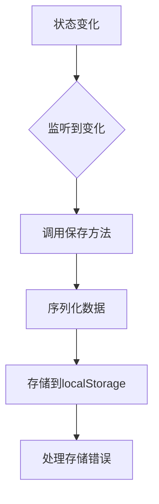

**Section sources**
- [collection.ts](file://packages/web-full/src/stores/collection.ts#L700-L750)
- [environment.ts](file://packages/web-full/src/stores/environment.ts#L700-L750)
- [workspace.ts](file://packages/web-full/src/stores/workspace.ts#L700-L750)

## 状态调用链路示例

### 创建集合调用链路
展示从组件调用到状态更新的完整流程：

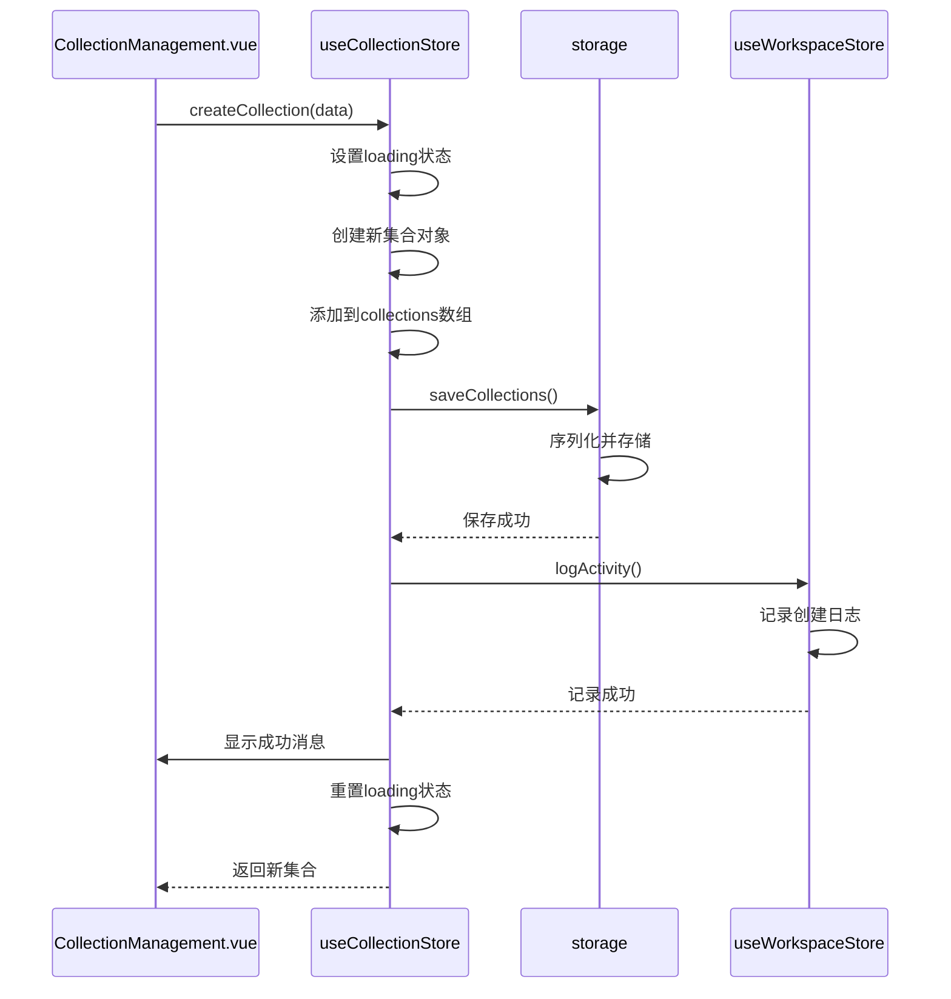

**Diagram sources**
- [collection.ts](file://packages/web-full/src/stores/collection.ts#L300-L350)

### 执行请求调用链路
展示API请求执行的完整流程：

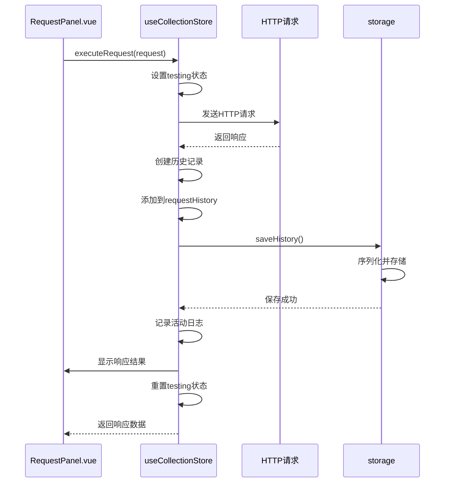

**Diagram sources**
- [collection.ts](file://packages/web-full/src/stores/collection.ts#L500-L550)

## 依赖关系图

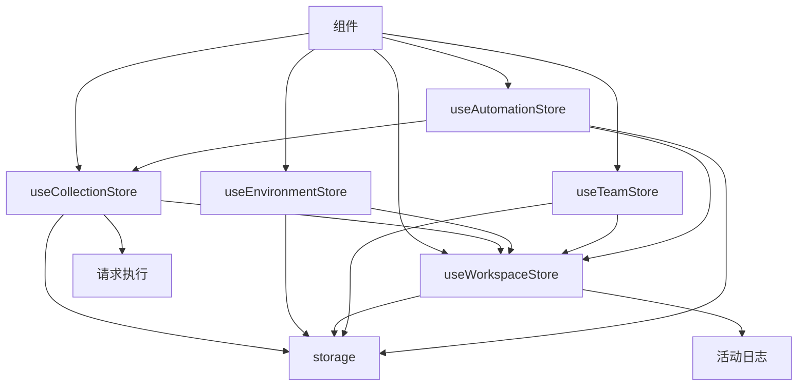

**Diagram sources**
- [collection.ts](file://packages/web-full/src/stores/collection.ts)
- [environment.ts](file://packages/web-full/src/stores/environment.ts)
- [workspace.ts](file://packages/web-full/src/stores/workspace.ts)
- [team.ts](file://packages/web-full/src/stores/team.ts)
- [automation.ts](file://packages/web-pro/src/stores/automation.ts)
- [storage.ts](file://packages/shared/utils/storage.ts)