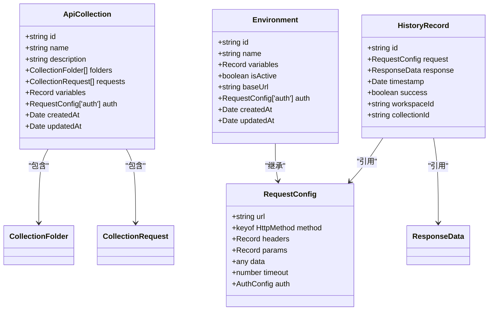
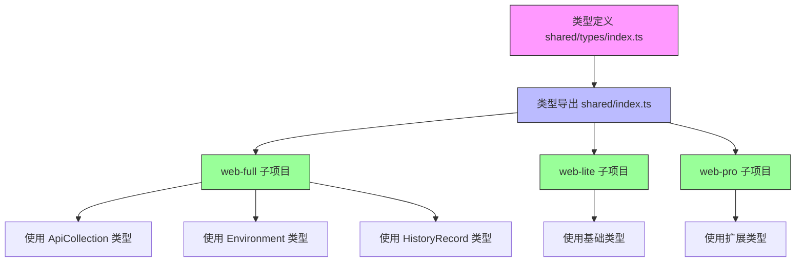
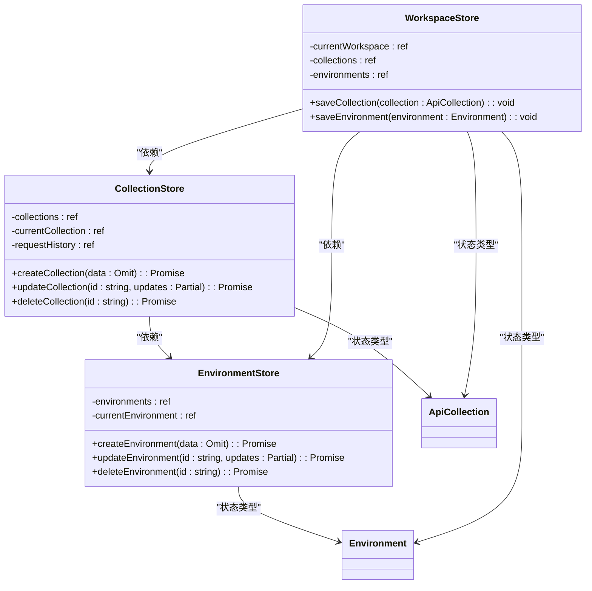
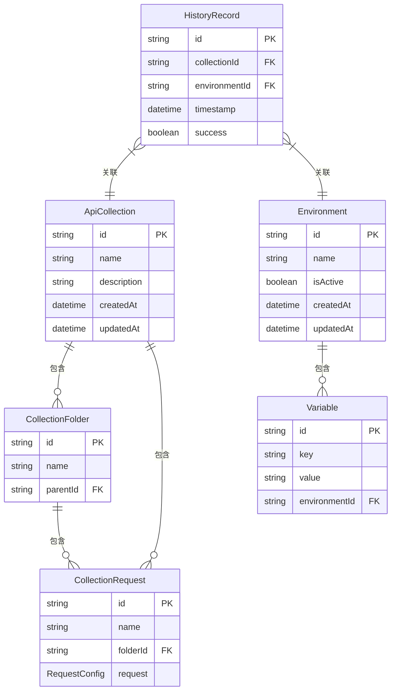
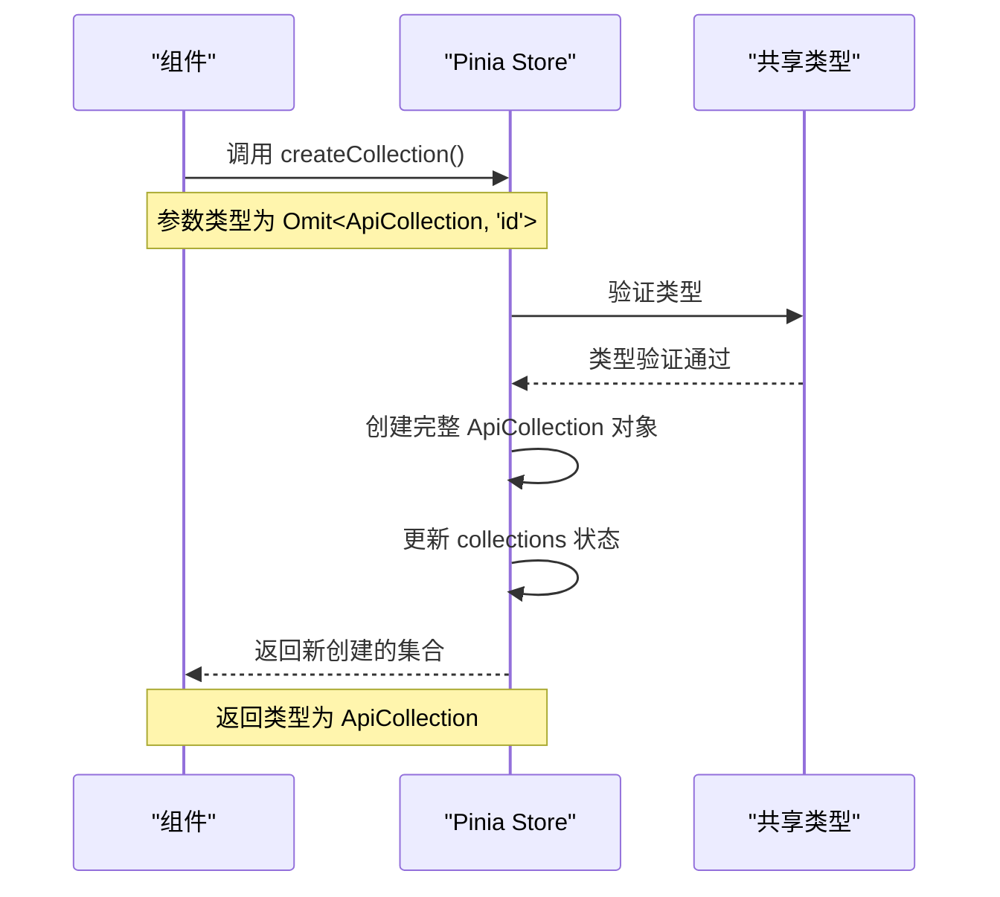

# 类型系统

<cite>
**本文档中引用的文件**   
- [index.ts](file://packages/shared/types/index.ts)
- [collection.ts](file://packages/web-full/src/stores/collection.ts)
- [environment.ts](file://packages/web-full/src/stores/environment.ts)
- [workspace.ts](file://packages/web-full/src/stores/workspace.ts)
</cite>

## 目录
1. [项目结构与类型共享机制](#项目结构与类型共享机制)
2. [核心类型定义分析](#核心类型定义分析)
3. [类型复用与导入策略](#类型复用与导入策略)
4. [类型与Pinia Store状态映射](#类型与pinia-store状态映射)
5. [复杂类型设计考量](#复杂类型设计考量)
6. [类型使用示例](#类型使用示例)

## 项目结构与类型共享机制

本项目采用Monorepo架构，通过`packages/shared`包集中管理跨子项目共享的类型定义。`web-full`、`web-lite`和`web-pro`等子项目通过`@shared/types`别名导入共享类型，实现类型复用和一致性维护。

**Section sources**
- [index.ts](file://packages/shared/types/index.ts)

## 核心类型定义分析

`shared/types/index.ts`文件定义了项目中的核心类型，包括`ApiCollection`、`Environment`、`HistoryRecord`等。这些类型采用TypeScript接口形式，具有良好的可扩展性和类型安全特性。

**Diagram sources **
- [index.ts](file://packages/shared/types/index.ts#L150-L250)

**Section sources**
- [index.ts](file://packages/shared/types/index.ts#L150-L250)

## 类型复用与导入策略

项目通过`@shared/types`别名实现类型导入路径的规范化。在`tsconfig.json`中配置了路径映射，使IDE能够正确解析这些别名。各子项目通过`import type { ApiCollection, Environment } from '@shared/types'`方式导入所需类型。

**Diagram sources **
- [index.ts](file://packages/shared/types/index.ts)
- [shared/index.ts](file://packages/shared/index.ts)

**Section sources**
- [index.ts](file://packages/shared/types/index.ts)
- [shared/index.ts](file://packages/shared/index.ts)

## 类型与Pinia Store状态映射

在`web-full`子项目中，`ApiCollection`、`Environment`等共享类型被直接用作Pinia Store的状态类型，确保了状态数据的类型安全。Store中的状态变量通过`ref<T>`形式声明，其中T为对应的共享类型。

**Diagram sources **
- [collection.ts](file://packages/web-full/src/stores/collection.ts#L54-L91)
- [environment.ts](file://packages/web-full/src/stores/environment.ts#L30-L50)
- [workspace.ts](file://packages/web-full/src/stores/workspace.ts#L20-L40)

**Section sources**
- [collection.ts](file://packages/web-full/src/stores/collection.ts#L54-L91)
- [environment.ts](file://packages/web-full/src/stores/environment.ts#L30-L50)
- [workspace.ts](file://packages/web-full/src/stores/workspace.ts#L20-L40)

## 复杂类型设计考量

项目中的复杂类型设计充分考虑了可维护性和扩展性。`ApiCollection`类型采用嵌套对象结构，包含`CollectionFolder`和`CollectionRequest`等子类型，形成树状结构。联合类型用于表示不同的HTTP方法和认证类型，提高了类型的表达能力。

**Diagram sources **
- [index.ts](file://packages/shared/types/index.ts#L150-L250)

**Section sources**
- [index.ts](file://packages/shared/types/index.ts#L150-L250)

## 类型使用示例

共享类型在组件props和store state中得到广泛应用。例如，在`CollectionStore`中，`collections`状态直接使用`ApiCollection[]`类型，`createCollection`方法的参数使用`Omit<ApiCollection, 'id'>`类型，确保了类型安全和代码一致性。

**Diagram sources **
- [collection.ts](file://packages/web-full/src/stores/collection.ts#L172-L217)

**Section sources**
- [collection.ts](file://packages/web-full/src/stores/collection.ts#L172-L217)