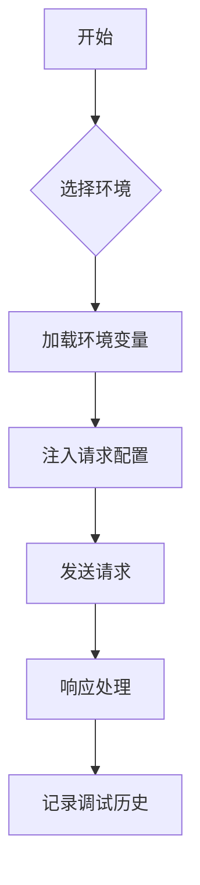
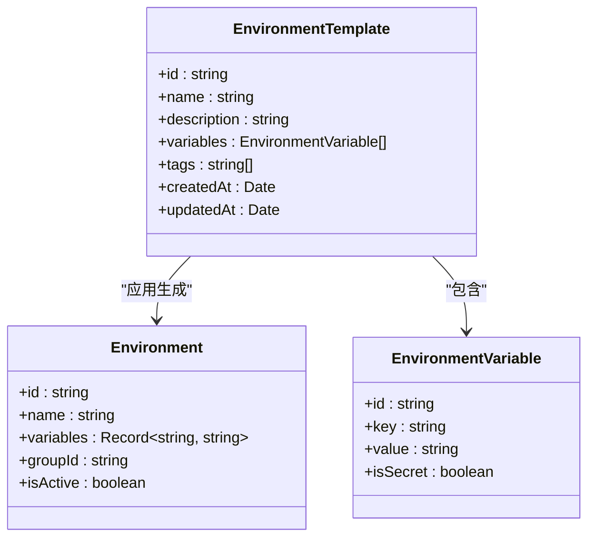
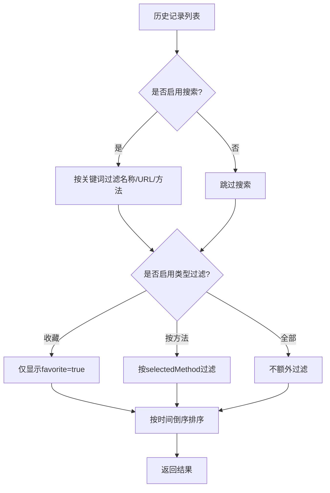
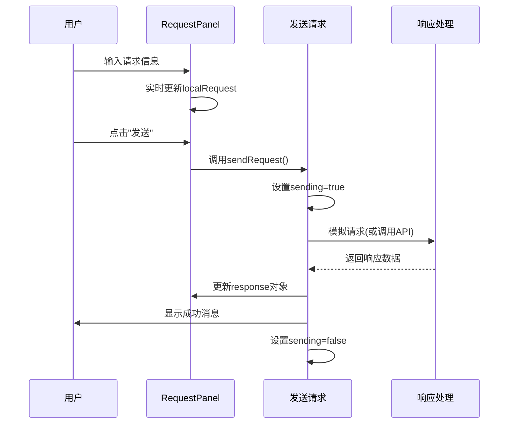
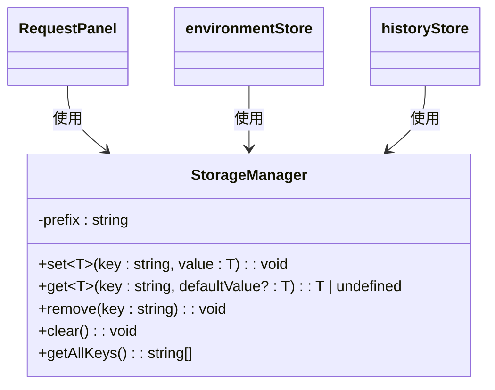

# API调试技巧

<cite>
**本文档引用文件**  
- [RequestPanel.vue](file://packages/web-full/src/components/RequestPanel.vue)
- [storage.ts](file://packages/shared/utils/storage.ts)
- [formatter.ts](file://packages/shared/utils/formatter.ts)
- [environment.ts](file://packages/web-full/src/stores/environment.ts)
- [history.ts](file://packages/web-lite/src/stores/history.ts)
</cite>

## 目录
1. [引言](#引言)
2. [环境变量的高效组织](#环境变量的高效组织)
3. [请求模板的创建与复用](#请求模板的创建与复用)
4. [历史记录的智能筛选](#历史记录的智能筛选)
5. [RequestPanel组件中的最佳实践](#requestpanel组件中的最佳实践)
6. [提升调试效率的具体技巧](#提升调试效率的具体技巧)
7. [高频配置的持久化存储](#高频配置的持久化存储)
8. [常见调试问题的解决方案](#常见调试问题的解决方案)
9. [总结](#总结)

## 引言
在现代API开发与调试过程中，提升调试效率是开发人员关注的核心问题。本指南结合`onlineInterfaceDebugTool`项目中的实际实现，系统性地总结了API调试过程中的高效使用技巧。通过合理组织环境变量、复用请求模板、智能筛选历史记录、动态参数注入等手段，帮助开发者显著减少重复操作，提升调试速度与准确性。

## 环境变量的高效组织

为提升多环境切换效率，系统通过`environment.ts`中的`useEnvironmentStore`实现环境管理。环境变量以键值对形式存储于`Environment`对象的`variables`字段中，并支持分组（`groupId`）与激活状态（`isActive`）控制。

环境切换通过`switchEnvironment`方法实现，调用后自动更新`currentEnvironment`并持久化至本地存储。支持按名称、描述、变量内容进行全文搜索，并可通过`selectedGroups`过滤特定分组的环境。



**图示来源**  
- [environment.ts](file://packages/web-full/src/stores/environment.ts#L150-L180)

**本节来源**  
- [environment.ts](file://packages/web-full/src/stores/environment.ts#L1-L100)

## 请求模板的创建与复用

系统支持通过`createTemplate`和`applyTemplate`方法创建和应用环境模板。模板（`EnvironmentTemplate`）包含预设变量列表、描述和标签，便于团队共享标准化配置。

创建模板时，系统会记录`variables`数组及元信息（`name`, `description`, `tags`），并生成唯一ID。应用模板时，可指定新环境名称，系统将基于模板变量创建新环境实例。



**图示来源**  
- [environment.ts](file://packages/web-full/src/stores/environment.ts#L550-L600)

**本节来源**  
- [environment.ts](file://packages/web-full/src/stores/environment.ts#L500-L650)

## 历史记录的智能筛选

历史记录管理由`history.ts`中的`useHistoryStore`实现。支持通过关键词、请求方法、收藏状态和标签进行多维度筛选。

`filteredItems`计算属性集成多重过滤逻辑：
- `searchText`：匹配请求名称、URL或方法
- `filterType`：支持“全部”、“收藏”、“按方法”筛选
- `selectedMethod`：限定特定HTTP方法
- 标签过滤：通过`addTag`/`removeTag`管理标签



**图示来源**  
- [history.ts](file://packages/web-lite/src/stores/history.ts#L15-L45)

**本节来源**  
- [history.ts](file://packages/web-lite/src/stores/history.ts#L1-L100)

## RequestPanel组件中的最佳实践

`RequestPanel.vue`是核心调试界面组件，其实现体现了多项最佳实践。

### 动态参数注入
通过`v-model`双向绑定`localRequest`对象，实时同步URL、方法、参数、请求头和请求体。参数与请求头支持动态增删，通过`updateParamKey`和`updateHeaderKey`确保键名变更时正确更新。

### 响应格式化显示
响应体通过`formatResponseBody`方法格式化为美化JSON，使用`JSON.stringify(data, null, 2)`增强可读性。响应大小通过`formatSize`转换为KB/MB单位，状态码通过`getStatusType`映射为Element Plus标签类型。

### 错误定位
发送请求时启用`sending`加载状态，捕获异常后通过`ElMessage.error`提示失败信息。响应头以表格形式展示，便于快速定位关键字段如`Content-Type`、`Authorization`等。



**图示来源**  
- [RequestPanel.vue](file://packages/web-full/src/components/RequestPanel.vue#L300-L350)

**本节来源**  
- [RequestPanel.vue](file://packages/web-full/src/components/RequestPanel.vue#L1-L523)

## 提升调试效率的具体技巧

### 预设常用请求头
可在环境变量中预设`Authorization`、`Content-Type`等常用头字段，切换环境时自动注入。例如：
```typescript
// 环境变量示例
{
  "API_BASE_URL": "https://api.example.com",
  "AUTH_TOKEN": "Bearer xxxxxx",
  "CONTENT_TYPE": "application/json"
}
```

### 快捷键支持
虽然当前代码未实现，但建议为“发送请求”按钮绑定快捷键（如Ctrl+Enter），减少鼠标操作。

### 请求体类型切换
`RequestPanel`支持四种请求体类型：无、JSON、表单、原始内容。通过`bodyType`单选按钮组切换，对应显示不同输入界面，满足多样化调试需求。

**本节来源**  
- [RequestPanel.vue](file://packages/web-full/src/components/RequestPanel.vue#L150-L200)

## 高频配置的持久化存储

系统通过`storage.ts`中的`StorageManager`类实现配置持久化。该类封装`localStorage`操作，提供类型安全的`set`/`get`方法，并自动添加前缀`api-debug-tool:`避免命名冲突。

全局单例`storage`实例用于存储环境、历史记录等高频配置。`getAllKeys`方法可获取所有相关键，便于调试和清理。



**图示来源**  
- [storage.ts](file://packages/shared/utils/storage.ts#L1-L30)

**本节来源**  
- [storage.ts](file://packages/shared/utils/storage.ts#L1-L55)

## 常见调试问题的解决方案

### 认证失效问题
- **方案**：将`AUTH_TOKEN`等敏感信息存入环境变量，结合`isSecret`标记（虽未在当前代码实现）隐藏值显示。
- **实践**：在`EnvironmentVariable`中设置`isSecret: true`，UI层用`***`代替实际值。

### 超时设置不合理
- **方案**：在请求配置中增加超时字段（当前模拟代码未实现），或通过拦截器设置默认超时。
- **建议**：扩展`RequestConfig`接口，添加`timeout?: number`字段，并在`sendRequest`中使用`AbortController`实现。

### 请求重复发送
- **方案**：使用`sending`状态禁用发送按钮，防止重复提交。
- **实现**：`sendRequest`方法中设置`sending.value = true`，完成后在`finally`块中重置。

**本节来源**  
- [RequestPanel.vue](file://packages/web-full/src/components/RequestPanel.vue#L300-L350)
- [environment.ts](file://packages/web-full/src/stores/environment.ts#L1-L50)

## 总结
通过合理组织环境变量、创建可复用的请求模板、利用标签和关键词智能筛选历史记录，结合`RequestPanel`组件的动态参数注入与响应格式化功能，开发者可显著提升API调试效率。利用`StorageManager`持久化高频配置，避免重复输入。针对认证失效、超时等问题，建议在现有基础上扩展安全与健壮性机制。这些实践共同构成了高效、可靠的API调试工作流。