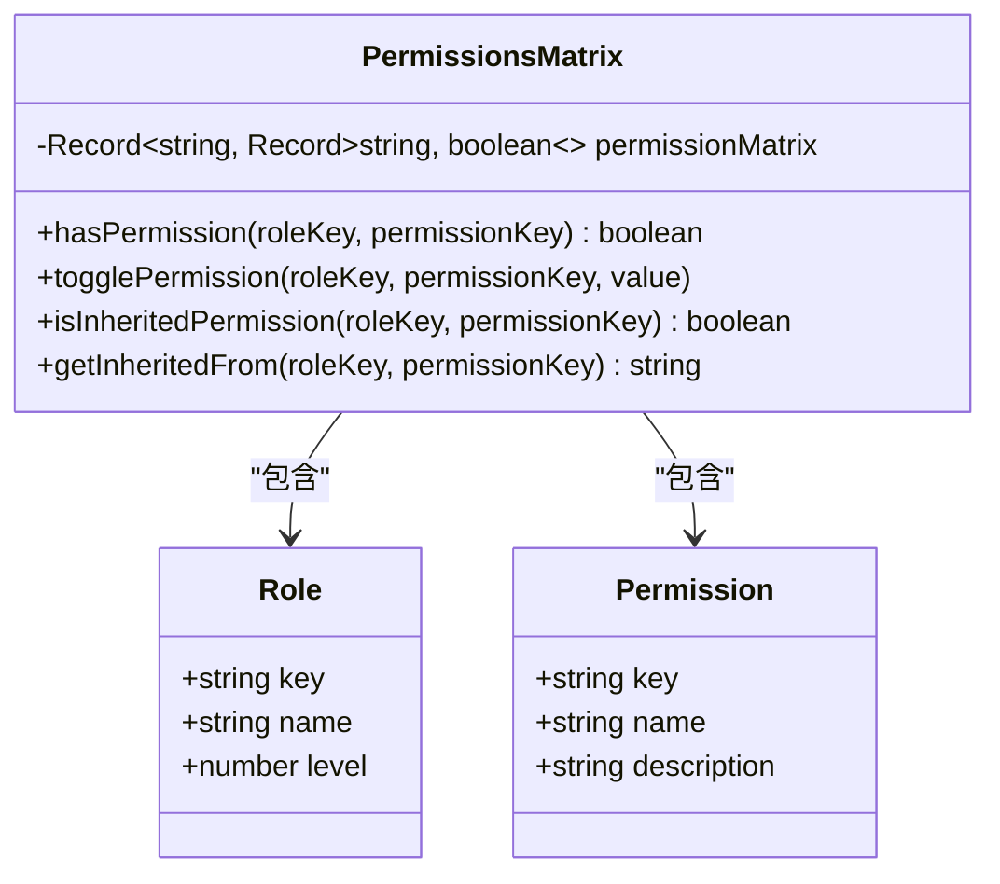
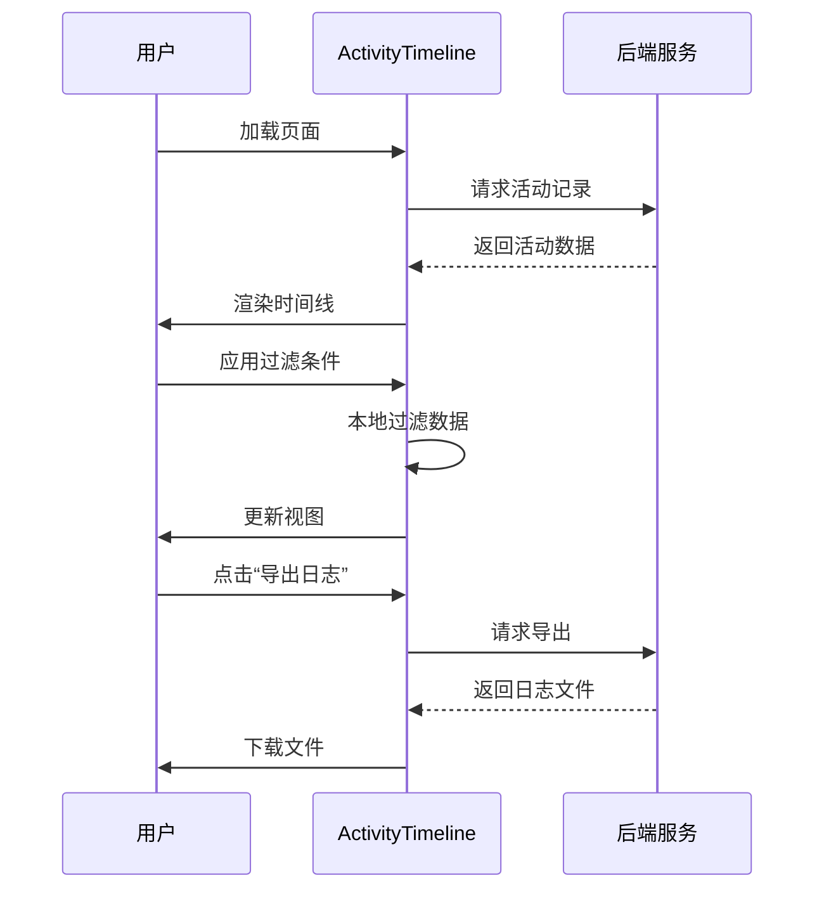
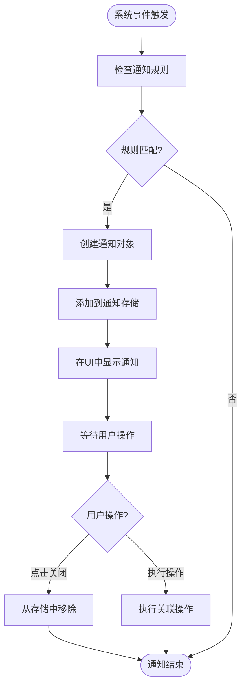

# 团队协作规范

<cite>
**本文档中引用的文件**
- [ActivityTimeline.vue](file://packages/web-pro/src/components/team/ActivityTimeline.vue)
- [NotificationCenter.vue](file://packages/web-pro/src/components/common/NotificationCenter.vue)
- [PermissionsMatrix.vue](file://packages/web-pro/src/components/team/PermissionsMatrix.vue)
- [InviteMemberDialog.vue](file://packages/web-pro/src/components/team/InviteMemberDialog.vue)
- [EditMemberDialog.vue](file://packages/web-pro/src/components/team/EditMemberDialog.vue)
</cite>

## 目录
1. [引言](#引言)
2. [成员角色划分原则](#成员角色划分原则)
3. [权限矩阵配置策略](#权限矩阵配置策略)
4. [工作流设计指南](#工作流设计指南)
5. [活动日志与通知系统](#活动日志与通知系统)
6. [成员管理操作示例](#成员管理操作示例)
7. [数据安全与合规性注意事项](#数据安全与合规性注意事项)
8. [结论](#结论)

## 引言
本文档旨在为团队协作场景下的接口调试工具平台提供全面的使用规范与权限管理建议。通过分析系统中的核心组件，包括成员管理、权限控制、活动追踪和通知机制，制定出符合最小权限原则的安全协作策略。文档将详细说明角色划分、权限配置、工作流程设计，并结合ActivityTimeline和NotificationCenter组件，指导团队如何高效协作并确保操作可追溯。

## 成员角色划分原则

在团队协作环境中，合理的角色划分是保障系统安全与协作效率的基础。本系统定义了四个核心角色层级，遵循从高到低的权限继承原则：

- **所有者（Owner）**：拥有团队的完全控制权，可进行所有操作，包括账单管理、团队解散等敏感操作。
- **管理员（Admin）**：可管理团队设置、成员邀请与权限分配，但无权处理账单。
- **编辑者（Editor）**：具备创建和编辑项目的核心权限，适合开发与测试人员。
- **查看者（Viewer）**：仅拥有读取权限，适用于需要了解项目进展但不参与修改的成员。

角色设计遵循最小权限原则，确保每个成员仅拥有完成其职责所必需的权限。角色变更需通过审批流程，防止权限滥用。

**Section sources**
- [PermissionsMatrix.vue](file://packages/web-pro/src/components/team/PermissionsMatrix.vue#L45-L75)
- [EditMemberDialog.vue](file://packages/web-pro/src/components/team/EditMemberDialog.vue#L235-L270)

## 权限矩阵配置策略

权限矩阵是实现精细化权限管理的核心工具。系统通过`PermissionsMatrix`组件提供可视化配置界面，支持按角色分配具体权限。

### 权限配置原则
1. **最小权限原则**：新成员默认分配最低必要权限，根据实际需求逐步提升。
2. **权限继承机制**：高级别角色自动继承低级别角色的权限，确保权限层级的合理性。
3. **权限互斥控制**：关键权限（如删除、账单管理）需单独授权，不随基础角色自动赋予。

### 配置操作流程
1. 进入团队设置页面，打开权限矩阵对话框。
2. 在矩阵中选择目标角色与权限项，通过复选框启用或禁用。
3. 系统实时显示权限继承关系（通过链接图标标识）。
4. 配置完成后点击“保存更改”，系统将验证权限逻辑并持久化配置。

权限矩阵支持重置为默认配置，便于在配置混乱时快速恢复。所有权限变更操作均记录在活动日志中，确保操作可审计。

**Diagram sources**
- [PermissionsMatrix.vue](file://packages/web-pro/src/components/team/PermissionsMatrix.vue#L1-L338)

**Section sources**
- [PermissionsMatrix.vue](file://packages/web-pro/src/components/team/PermissionsMatrix.vue#L1-L338)

## 工作流设计指南

高效的工作流设计是团队协作成功的关键。建议团队建立标准化的操作流程。

### 接口评审流程
1. 开发者创建接口后，标记为“待评审”状态。
2. 系统自动通知相关编辑者和管理员进行评审。
3. 评审人员在规定时间内提出修改意见或批准。
4. 接口状态更新为“已批准”或“需修改”，并通知创建者。

### 集合共享机制
- **共享范围控制**：集合可设置为私有、团队内共享或公开。
- **版本管理**：共享集合支持版本快照，防止协作过程中的意外覆盖。
- **变更通知**：集合内容变更时，订阅成员将收到应用内通知和邮件提醒。

### 变更通知规则
- **关键操作通知**：成员加入/退出、权限变更、项目删除等操作必须通知所有管理员。
- **可选通知**：接口更新、集合修改等操作允许成员自行订阅。
- **通知渠道**：支持应用内通知中心、邮件推送和移动端消息。

## 活动日志与通知系统

### 活动日志追踪（ActivityTimeline）
`ActivityTimeline`组件提供全面的操作审计功能，支持：

- **多维度过滤**：按活动类型（成员、权限、项目、设置）、时间范围和关键词搜索。
- **详细记录**：每条记录包含操作标题、描述、执行者、时间戳和详细数据。
- **数据导出**：支持将活动日志导出为文件，便于合规审计。

系统自动记录所有关键操作，包括成员邀请、权限变更、项目创建/删除等，确保所有操作可追溯。

**Diagram sources**
- [ActivityTimeline.vue](file://packages/web-pro/src/components/team/ActivityTimeline.vue#L1-L503)

**Section sources**
- [ActivityTimeline.vue](file://packages/web-pro/src/components/team/ActivityTimeline.vue#L1-L503)

### 通知中心（NotificationCenter）
`NotificationCenter`组件提供实时通知服务：

- **通知类型**：支持成功、警告、错误三种类型，通过不同颜色边框区分。
- **交互操作**：通知可包含操作按钮（如“查看详情”、“立即处理”），提升响应效率。
- **自动清除**：已读通知可手动或自动清除，保持通知中心整洁。

通知系统与活动日志联动，关键操作既记录日志又推送通知，确保信息不遗漏。

**Diagram sources**
- [NotificationCenter.vue](file://packages/web-pro/src/components/common/NotificationCenter.vue#L1-L125)

**Section sources**
- [NotificationCenter.vue](file://packages/web-pro/src/components/common/NotificationCenter.vue#L1-L125)

## 成员管理操作示例

### 邀请成员
通过`InviteMemberDialog`组件，支持三种邀请方式：

1. **邮箱邀请**：批量输入邮箱地址，指定默认角色，可附加个性化消息。
2. **邀请链接**：生成带有有效期和使用次数限制的安全链接，便于大规模邀请。
3. **批量导入**：通过CSV或Excel文件导入成员信息，支持模板下载。

邀请过程支持审批机制，确保团队成员的可控性。

**Section sources**
- [InviteMemberDialog.vue](file://packages/web-pro/src/components/team/InviteMemberDialog.vue#L1-L567)

### 分配项目权限
1. 在团队成员列表中选择目标成员。
2. 打开`EditMemberDialog`，在“角色权限”部分调整其团队角色。
3. 可通过“配置详细权限”按钮进行更精细的权限设置。
4. 保存更改，系统自动更新权限并记录操作日志。

### 处理权限冲突
当出现权限冲突时（如成员被赋予矛盾权限）：
1. 系统优先遵循最高角色的权限设置。
2. 管理员可通过权限矩阵查看继承关系，手动调整。
3. 建议定期审计权限配置，使用“重置为默认”功能恢复标准配置。

**Section sources**
- [EditMemberDialog.vue](file://packages/web-pro/src/components/team/EditMemberDialog.vue#L1-L590)

## 数据安全与合规性注意事项

1. **数据最小化**：仅收集完成协作所必需的成员信息。
2. **权限审计**：定期审查成员权限，及时移除离职或转岗成员的访问权限。
3. **日志保留**：活动日志至少保留180天，满足合规审计要求。
4. **安全传输**：所有成员邀请链接均使用HTTPS加密传输。
5. **隐私保护**：成员内部备注信息仅对管理员可见，确保隐私安全。

## 结论
通过实施本文档建议的团队协作规范，团队可以建立安全、高效、可审计的协作环境。关键在于严格执行角色划分、落实最小权限原则、利用活动日志实现操作可追溯，并通过通知系统保持信息同步。建议团队定期回顾和更新协作规范，以适应不断变化的业务需求。