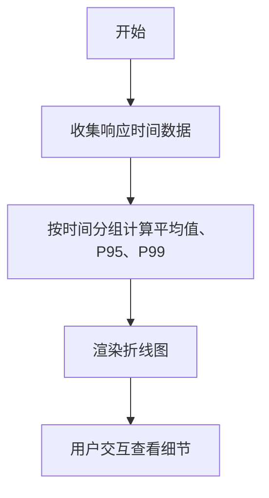
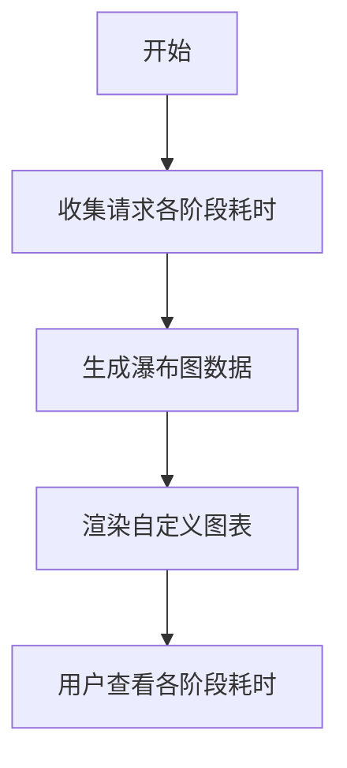
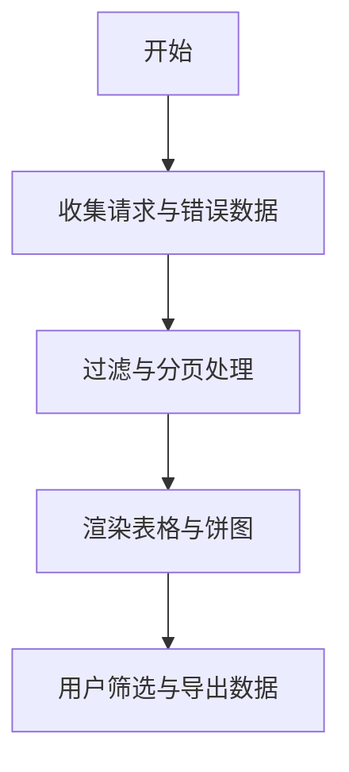

# 性能测试方案设计

<cite>
**本文档引用文件**  
- [ResponseTimeChart.vue](file://packages/web-pro/src/components/performance/ResponseTimeChart.vue)
- [WaterfallChart.vue](file://packages/web-pro/src/components/performance/WaterfallChart.vue)
- [PerformanceTable.vue](file://packages/web-pro/src/components/performance/PerformanceTable.vue)
- [ErrorAnalysisChart.vue](file://packages/web-pro/src/components/performance/ErrorAnalysisChart.vue)
- [performance.ts](file://packages/web-pro/src/stores/performance.ts)
- [index.ts](file://packages/web-pro/src/types/index.ts)
</cite>

## 目录
1. [引言](#引言)
2. [压测方案设计原则](#压测方案设计原则)
3. [并发数与请求分布模式设定](#并发数与请求分布模式设定)
4. [监控指标配置与可视化分析](#监控指标配置与可视化分析)
5. [性能瓶颈与错误根源定位](#性能瓶颈与错误根源定位)
6. [压测环境准备与数据隔离策略](#压测环境准备与数据隔离策略)
7. [压测报告归档规范](#压测报告归档规范)
8. [结论](#结论)

## 引言
本文档旨在为在线接口调试工具的性能测试提供系统性指导，涵盖压测方案的设计原则、结果分析方法、监控指标配置、可视化组件使用、性能瓶颈定位、环境准备及报告归档等关键环节。通过合理设定并发数、持续时间和请求分布模式，结合多种图表组件进行数据可视化，确保测试结果具备可复现性和可追溯性。

## 压测方案设计原则
性能测试方案应基于真实业务场景构建，确保测试数据和请求模式贴近实际用户行为。测试目标需明确，包括响应时间、错误率、吞吐量等关键性能指标（KPI）。测试过程中应遵循渐进式加压原则，避免一次性施加过高负载导致系统崩溃，从而影响测试结果的有效性。

**Section sources**
- [index.ts](file://packages/web-pro/src/types/index.ts#L462-L517)
- [performance.ts](file://packages/web-pro/src/stores/performance.ts#L88-L126)

## 并发数与请求分布模式设定
并发数的设定应参考系统预期的最大用户访问量，并结合历史流量数据进行估算。持续时间应足够长以观察系统的稳定性和资源消耗趋势。请求分布模式可采用恒定速率、阶梯式增长或突发流量等方式，模拟不同业务场景下的用户行为。

**Section sources**
- [index.ts](file://packages/web-pro/src/types/index.ts#L462-L517)
- [performance.ts](file://packages/web-pro/src/stores/performance.ts#L88-L126)

## 监控指标配置与可视化分析
### 响应时间监控
通过 `ResponseTimeChart` 组件展示平均响应时间、P95 和 P99 响应时间的变化趋势。该组件支持时间轴缩放和详细数据提示，便于分析响应时间的波动情况。

**Diagram sources**
- [ResponseTimeChart.vue](file://packages/web-pro/src/components/performance/ResponseTimeChart.vue)
- [performance.ts](file://packages/web-pro/src/stores/performance.ts#L88-L126)

### 请求瀑布图分析
`WaterfallChart` 组件用于展示单个请求在 DNS 解析、连接建立、请求发送、响应接收和数据处理各阶段的时间消耗，帮助识别请求延迟的具体环节。

**Diagram sources**
- [WaterfallChart.vue](file://packages/web-pro/src/components/performance/WaterfallChart.vue)
- [performance.ts](file://packages/web-pro/src/stores/performance.ts#L88-L126)

### 请求量与错误率监控
`PerformanceTable` 组件提供详细的请求记录，支持按 URL、方法、状态码等条件筛选，并可导出数据用于进一步分析。同时，`ErrorAnalysisChart` 以饼图形式展示各类错误的占比，便于快速定位主要错误类型。

**Diagram sources**
- [PerformanceTable.vue](file://packages/web-pro/src/components/performance/PerformanceTable.vue)
- [ErrorAnalysisChart.vue](file://packages/web-pro/src/components/performance/ErrorAnalysisChart.vue)
- [performance.ts](file://packages/web-pro/src/stores/performance.ts#L88-L126)

## 性能瓶颈与错误根源定位
结合 `PerformanceTable` 和 `ErrorAnalysisChart`，可通过以下步骤定位性能瓶颈：
1. 使用 `PerformanceTable` 筛选出响应时间较长或状态码异常的请求。
2. 查看 `ErrorAnalysisChart` 中错误类型的分布，识别高频错误。
3. 利用 `WaterfallChart` 分析具体请求的各阶段耗时，判断是网络延迟、服务器处理慢还是客户端问题。
4. 根据分析结果调整系统配置或优化代码逻辑。

**Section sources**
- [PerformanceTable.vue](file://packages/web-pro/src/components/performance/PerformanceTable.vue#L0-L339)
- [ErrorAnalysisChart.vue](file://packages/web-pro/src/components/performance/ErrorAnalysisChart.vue#L0-L156)
- [WaterfallChart.vue](file://packages/web-pro/src/components/performance/WaterfallChart.vue#L0-L182)

## 压测环境准备与数据隔离策略
压测前应确保测试环境与生产环境尽可能一致，包括硬件配置、网络带宽、数据库版本等。为避免测试数据污染生产数据，应采用独立的测试数据库，并在测试前后执行数据清理脚本。此外，建议使用专门的测试账号和 API 密钥，防止权限冲突。

**Section sources**
- [index.ts](file://packages/web-pro/src/types/index.ts#L462-L517)
- [performance.ts](file://packages/web-pro/src/stores/performance.ts#L88-L126)

## 压测报告归档规范
每次压测完成后，应生成包含测试配置、监控图表、关键指标和分析结论的完整报告，并按时间戳命名归档。报告应包括以下内容：
- 测试目标与场景描述
- 并发数、持续时间、请求分布模式
- 关键性能指标（响应时间、错误率、吞吐量）
- 图表截图（响应时间图、瀑布图、错误分析图）
- 发现的问题与改进建议
- 数据导出文件（JSON 格式）

**Section sources**
- [performance.ts](file://packages/web-pro/src/stores/performance.ts#L88-L126)
- [PerformanceTable.vue](file://packages/web-pro/src/components/performance/PerformanceTable.vue#L0-L339)

## 结论
通过科学设计压测方案、合理配置监控指标并利用可视化工具进行深入分析，可以有效评估系统的性能表现，及时发现潜在瓶颈。遵循本文档提供的原则和方法，能够确保性能测试的准确性和可重复性，为系统优化提供有力支持。