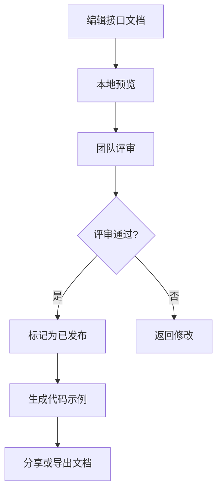

# 接口集合与文档维护

<cite>
**本文档引用文件**  
- [ApiEditor.vue](file://packages/web-pro/src/components/documentation/ApiEditor.vue)
- [DocPreview.vue](file://packages/web-pro/src/components/documentation/DocPreview.vue)
- [types/index.ts](file://packages/shared/types/index.ts)
</cite>

## 目录
1. [引言](#引言)
2. [接口集合分类管理策略](#接口集合分类管理策略)
3. [API文档实时性维护规范](#api文档实时性维护规范)
4. [文档评审与发布流程](#文档评审与发布流程)
5. [命名规范与版本控制](#命名规范与版本控制)
6. [结论](#结论)

## 引言
本文档旨在为在线接口调试工具项目建立系统化的接口集合管理与API文档维护规范。通过分析`ApiEditor`和`DocPreview`等核心组件的实现机制，提出一套可落地的分类管理、文档维护和团队协作流程，确保接口资产的长期可维护性和团队协作效率。

## 接口集合分类管理策略

为提升接口集合的可读性和管理效率，建议采用多维度分组策略：

1. **按业务模块分组**：将接口按照用户管理、订单处理、支付系统等业务领域进行划分
2. **按微服务架构分组**：在微服务架构下，每个服务对应独立的接口分组
3. **按版本号分组**：对不同版本的API进行隔离管理，支持版本共存与迁移

通过`ApiDocTree`组件实现的树形结构，支持拖拽排序和嵌套文件夹，可灵活构建多层级的接口组织结构。利用`ApiEditor`中的标签（tags）功能，可为接口添加多个分类维度，实现交叉引用和多视角浏览。

**Section sources**
- [ApiEditor.vue](file://packages/web-pro/src/components/documentation/ApiEditor.vue#L100-L120)
- [ApiDocTree.vue](file://packages/web-pro/src/components/documentation/ApiDocTree.vue)

## API文档实时性维护规范

为确保API文档与实际接口保持同步，需建立以下维护机制：

### 参数更新同步
通过`ApiEditor`组件的参数表格（ParameterTable）实现请求参数的结构化管理。每次接口变更时，必须同步更新：
- 路径参数、查询参数和请求头的定义
- 参数类型、是否必填、默认值和描述信息
- 请求体（requestBody）的schema定义和示例数据

### 响应示例维护
在`ApiEditor`的"响应"标签页中，需为每个状态码维护：
- 响应结构（schema）的JSON Schema定义
- 典型响应示例（example）
- 自定义响应头信息

### 废弃接口标记
利用`ApiEditor`中的"是否废弃"开关，对不再推荐使用的接口进行明确标记。废弃接口在`DocPreview`中会以特殊样式呈现，提醒开发者避免使用。

**Section sources**
- [ApiEditor.vue](file://packages/web-pro/src/components/documentation/ApiEditor.vue#L200-L400)
- [DocPreview.vue](file://packages/web-pro/src/components/documentation/DocPreview.vue#L150-L300)

## 文档评审与发布流程

结合`ApiEditor`和`DocPreview`组件，建立完整的文档评审与发布工作流：

**Diagram sources**
- [ApiEditor.vue](file://packages/web-pro/src/components/documentation/ApiEditor.vue)
- [DocPreview.vue](file://packages/web-pro/src/components/documentation/DocPreview.vue)

### 编辑阶段
使用`ApiEditor`进行接口信息的完整定义，包括基本信息、参数、请求体、响应和代码示例。

### 预览与评审
通过`DocPreview`组件生成美观的文档预览，支持：
- 深色/浅色主题切换
- Markdown格式描述渲染
- 多语言代码示例展示

### 发布与分享
文档发布后，可通过`DocPreview`的分享功能生成访问链接，设置访问权限和有效期，支持团队内外的安全共享。

**Section sources**
- [ApiEditor.vue](file://packages/web-pro/src/components/documentation/ApiEditor.vue#L500-L600)
- [DocPreview.vue](file://packages/web-pro/src/components/documentation/DocPreview.vue#L400-L700)

## 命名规范与版本控制

### 统一命名规范
建立团队统一的命名标准：
- 接口路径采用小写+连字符（kebab-case）格式
- 参数名采用小写下划线（snake_case）格式
- 状态码描述使用标准化文本（如"200 - 成功"）

### 注释标准
所有接口必须包含：
- 清晰的接口描述（支持Markdown格式）
- 每个参数的详细说明
- 响应结果的业务含义解释

### 版本控制策略
利用`DocPreview`中的版本显示功能，实施语义化版本控制（SemVer）：
- 主版本号变更表示不兼容的API修改
- 次版本号变更表示向后兼容的功能新增
- 修订号变更表示向后兼容的问题修正

通过`documentation.version`字段管理版本信息，确保文档与代码版本的一致性。

**Section sources**
- [DocPreview.vue](file://packages/web-pro/src/components/documentation/DocPreview.vue#L50-L100)
- [types/index.ts](file://packages/shared/types/index.ts)

## 结论
通过实施上述分类管理策略和文档维护规范，结合`ApiEditor`和`DocPreview`等工具组件，可有效提升接口文档的质量和维护效率。建议团队建立定期的文档审查机制，将文档质量纳入代码评审流程，确保接口资产的长期可维护性和团队协作效率。