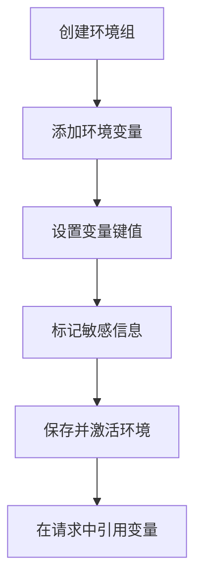
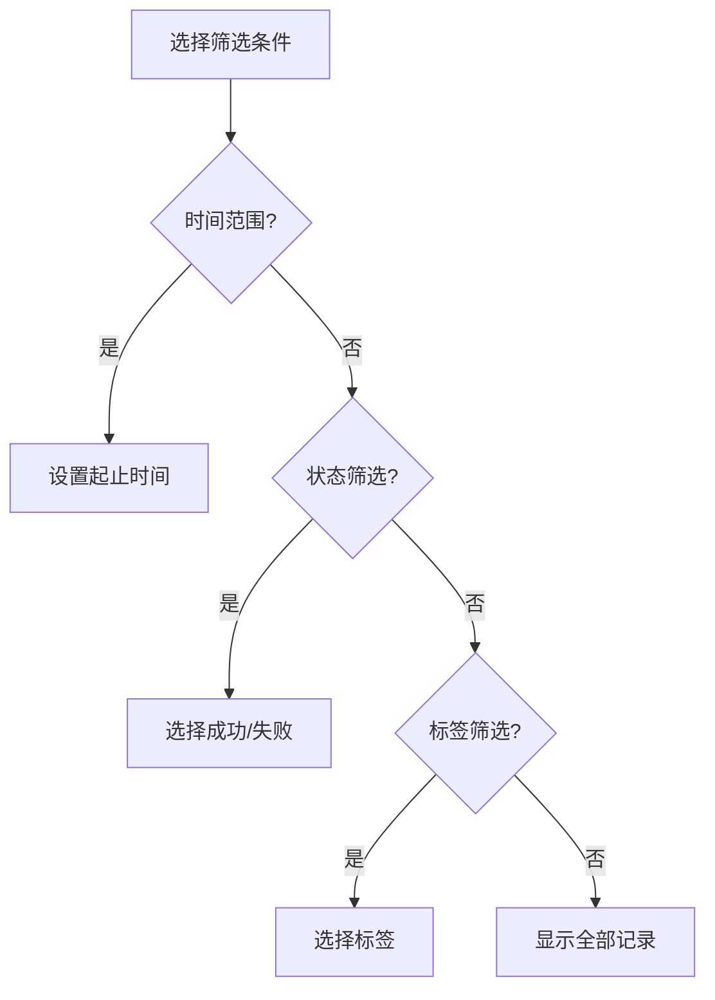
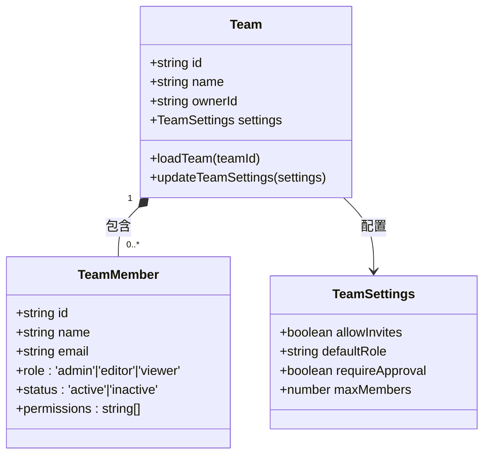
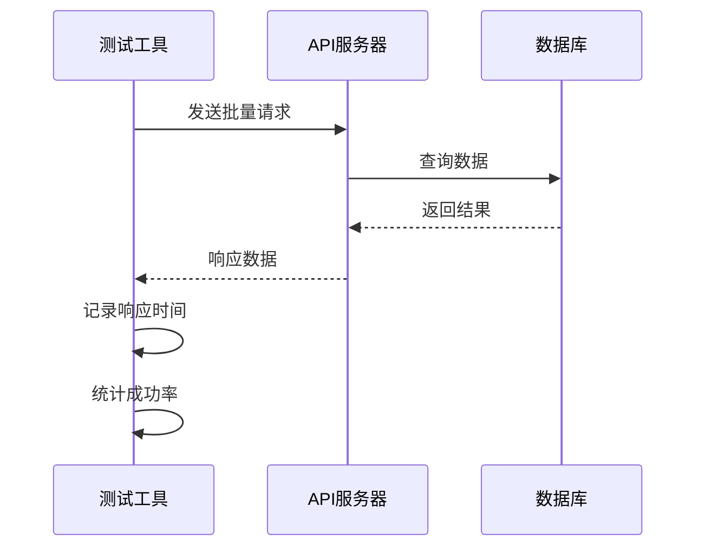
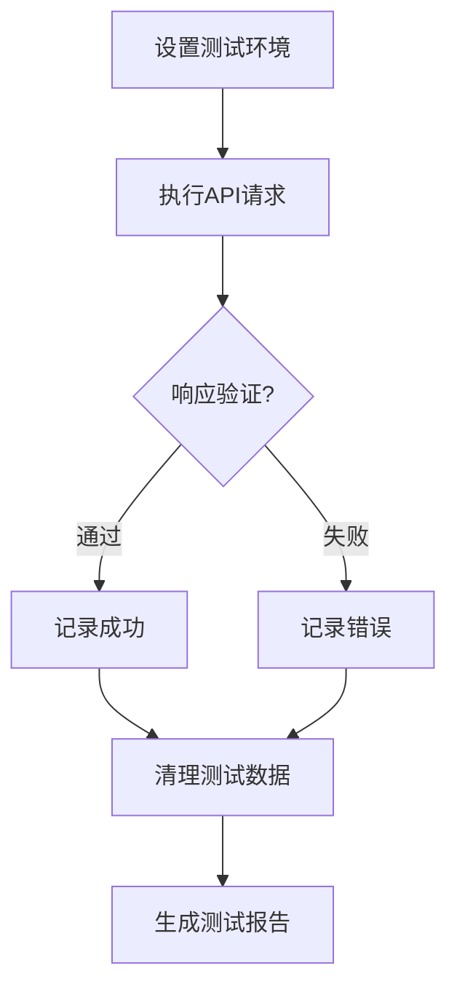
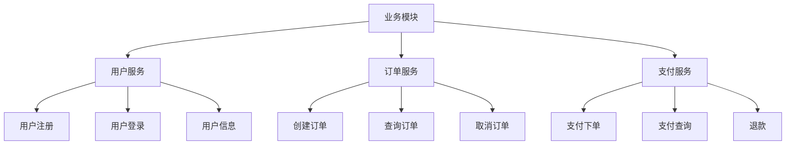

# 最佳实践

<cite>
**本文档中引用的文件**  
- [collection.ts](file://packages/web-full/src/stores/collection.ts)
- [environment.ts](file://packages/web-full/src/stores/environment.ts)
- [workspace.ts](file://packages/web-full/src/stores/workspace.ts)
- [team.ts](file://packages/web-full/src/stores/team.ts)
- [README.md](file://README.md)
- [docs/README.md](file://docs/README.md)
</cite>

## 目录
1. [简介](#简介)
2. [API调试高效技巧](#api调试高效技巧)
3. [团队协作与权限管理](#团队协作与权限管理)
4. [性能测试方案设计](#性能测试方案设计)
5. [自动化测试与定时任务](#自动化测试与定时任务)
6. [接口集合管理与文档维护](#接口集合管理与文档维护)
7. [典型使用场景案例分析](#典型使用场景案例分析)
8. [常见误区与解决方案](#常见误区与解决方案)

## 简介

在线接口调试工具是一款功能强大的API调试平台，支持Lite、Full和Pro三个版本，满足不同规模团队的开发需求。本最佳实践指南旨在帮助用户高效利用各项功能，提升工作效率，避免常见使用误区。

**Section sources**
- [README.md](file://README.md)
- [docs/README.md](file://docs/README.md)

## API调试高效技巧

### 环境变量的合理组织

环境变量是API调试中的关键配置，合理组织环境变量可以显著提升调试效率。建议按照以下原则进行组织：

1. **分组管理**：将环境变量按功能或服务进行分组，如"开发环境"、"测试环境"、"生产环境"等。
2. **命名规范**：采用统一的命名规范，如`API_BASE_URL`、`AUTH_TOKEN`等，便于识别和管理。
3. **变量复用**：对于跨环境共享的变量（如通用API密钥），可设置为全局变量，减少重复配置。

**Diagram sources**
- [environment.ts](file://packages/web-full/src/stores/environment.ts#L10-L50)

### 请求模板的复用

通过创建可复用的请求模板，可以大幅减少重复工作。建议：

1. **模板分类**：按业务模块或API类型创建模板，如"用户管理"、"订单服务"等。
2. **参数化设计**：在模板中使用变量占位符，如`{{user_id}}`，便于快速替换。
3. **批量操作**：支持从Postman、OpenAPI等格式导入导出，实现跨平台复用。

**Section sources**
- [collection.ts](file://packages/web-full/src/stores/collection.ts#L150-L200)

### 历史记录的筛选策略

有效管理请求历史记录有助于快速定位问题。建议采用以下筛选策略：

1. **时间范围筛选**：按最近1小时、24小时或自定义时间段筛选。
2. **状态筛选**：区分成功、失败的请求，重点关注错误响应。
3. **标签筛选**：为重要请求添加标签，便于快速检索。

**Diagram sources**
- [collection.ts](file://packages/web-full/src/stores/collection.ts#L80-L100)

## 团队协作与权限管理

### 权限管理规范

团队协作中，合理的权限管理是保障数据安全的关键。系统提供多层次的权限控制：

1. **角色定义**：
   - 管理员：拥有全部权限
   - 编辑者：可读写但不可管理成员
   - 查看者：仅可查看

2. **权限粒度**：
   - 工作空间管理
   - 集合读写
   - 环境管理
   - 团队成员管理

**Diagram sources**
- [team.ts](file://packages/web-full/src/stores/team.ts#L50-L80)

### 工作流设计建议

建议采用以下团队协作工作流：

1. **需求分析**：明确API接口需求和测试目标
2. **环境准备**：创建对应环境变量和请求模板
3. **开发调试**：使用Full版进行接口调试
4. **团队评审**：通过Pro版分享链接进行代码评审
5. **性能测试**：执行批量测试和性能分析
6. **文档更新**：同步更新API文档

**Section sources**
- [workspace.ts](file://packages/web-full/src/stores/workspace.ts#L300-L350)

## 性能测试方案设计

### 压测方案设计原则

设计性能测试方案时应遵循以下原则：

1. **目标明确**：确定测试目标（如并发用户数、响应时间）
2. **场景真实**：模拟真实用户行为和请求模式
3. **渐进加压**：从低负载开始，逐步增加压力
4. **监控全面**：同时监控API响应和系统资源

**Diagram sources**
- [collection.ts](file://packages/web-full/src/stores/collection.ts#L500-L550)

### 结果分析方法

性能测试结果分析应关注以下指标：

1. **响应时间**：P95、P99分位值
2. **吞吐量**：每秒处理请求数
3. **错误率**：失败请求占比
4. **资源消耗**：CPU、内存使用情况

建议使用图表可视化分析结果，便于识别性能瓶颈。

**Section sources**
- [collection.ts](file://packages/web-full/src/stores/collection.ts#L550-L600)

## 自动化测试与定时任务

### 测试用例编写模式

建议采用结构化模式编写自动化测试用例：

1. **前置条件**：设置环境变量和初始状态
2. **测试步骤**：按顺序执行API请求
3. **断言验证**：检查响应状态码和数据
4. **后置处理**：清理测试数据

**Diagram sources**
- [collection.ts](file://packages/web-full/src/stores/collection.ts#L400-L450)

### 定时任务配置经验

配置定时任务时应注意：

1. **执行频率**：根据业务需求设置合理频率
2. **失败重试**：配置适当的重试机制
3. **通知机制**：设置邮件或消息通知
4. **日志记录**：完整记录执行过程

**Section sources**
- [collection.ts](file://packages/web-full/src/stores/collection.ts#L450-L500)

## 接口集合管理与文档维护

### 分类管理策略

建议采用多级分类管理接口集合：

1. **一级分类**：按业务模块划分（如用户、订单、支付）
2. **二级分类**：按功能细分（如用户注册、用户登录）
3. **标签系统**：为接口添加功能标签，便于检索

**Diagram sources**
- [collection.ts](file://packages/web-full/src/stores/collection.ts#L200-L250)

### 文档维护规范

API文档维护应遵循以下规范：

1. **及时更新**：接口变更后立即更新文档
2. **版本管理**：保留历史版本，便于追溯
3. **示例完整**：提供完整的请求示例和响应示例
4. **权限说明**：明确接口的访问权限要求

**Section sources**
- [collection.ts](file://packages/web-full/src/stores/collection.ts#L250-L300)

## 典型使用场景案例分析

### 场景一：新项目启动

当启动新项目时，建议按以下流程操作：

1. 创建新的工作空间
2. 导入OpenAPI文档生成初始接口集合
3. 配置开发、测试、生产环境变量
4. 编写基础API测试用例
5. 设置团队成员权限

### 场景二：接口联调

在接口联调阶段，建议：

1. 使用环境变量管理不同环境的API地址
2. 创建共享的请求模板
3. 记录详细的调试历史
4. 通过分享链接进行问题定位

### 场景三：上线前验证

上线前的验证流程：

1. 执行完整的自动化测试套件
2. 进行性能压测
3. 验证所有边界条件
4. 生成测试报告并归档

**Section sources**
- [workspace.ts](file://packages/web-full/src/stores/workspace.ts#L100-L150)

## 常见误区与解决方案

### 误区一：环境变量混乱

**问题**：环境变量命名不规范，导致混淆。

**解决方案**：
- 制定统一的命名规范
- 使用环境组进行分类管理
- 定期清理无用变量

### 误区二：请求模板重复

**问题**：相同功能的请求模板重复创建。

**解决方案**：
- 建立模板库，统一管理
- 定期审查和合并重复模板
- 使用导入导出功能共享模板

### 误区三：权限过度开放

**问题**：团队成员权限设置过于宽松。

**解决方案**：
- 遵循最小权限原则
- 定期审查权限设置
- 使用角色模板统一管理

**Section sources**
- [team.ts](file://packages/web-full/src/stores/team.ts#L200-L250)