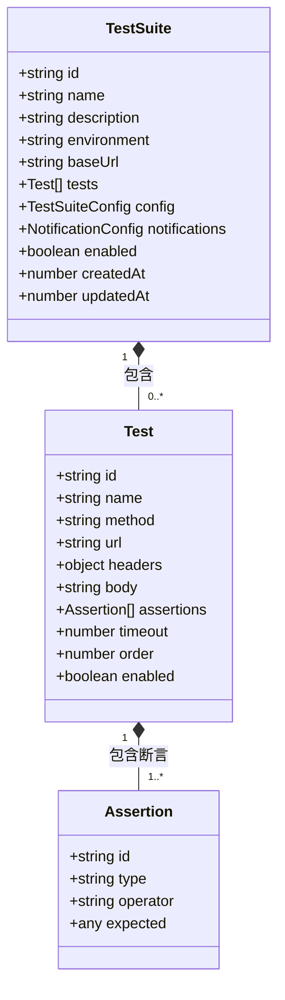
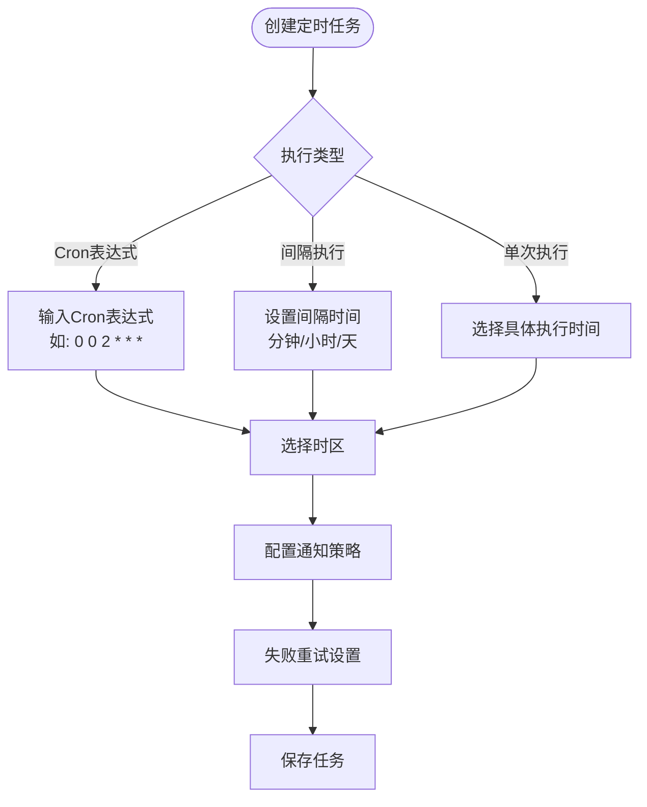
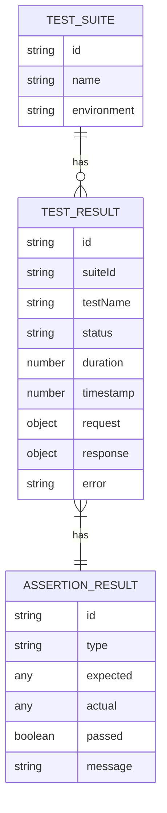

# 自动化测试用例编写

<cite>
**本文档引用文件**  
- [ScheduleDialog.vue](file://packages/web-pro/src/components/automation/ScheduleDialog.vue)
- [CreateSuiteDialog.vue](file://packages/web-pro/src/components/automation/CreateSuiteDialog.vue)
- [EditSuiteDialog.vue](file://packages/web-pro/src/components/automation/EditSuiteDialog.vue)
- [automation.ts](file://packages/web-pro/src/stores/automation.ts)
- [index.ts](file://packages/shared/types/index.ts)
- [Automation.vue](file://packages/web-pro/src/views/Automation.vue)
</cite>

## 目录
1. [引言](#引言)
2. [测试套件与用例的结构化组织](#测试套件与用例的结构化组织)
3. [可复用且高稳定性的测试脚本编写](#可复用且高稳定性的测试脚本编写)
4. [定时任务的创建与调度策略](#定时任务的创建与调度策略)
5. [测试结果报告解读](#测试结果报告解读)
6. [定期回归测试建议](#定期回归测试建议)
7. [结论](#结论)

## 引言

本文档旨在分享在 `onlineInterfaceDebugTool` 项目中关于自动化测试用例的结构化编写模式与定时任务配置的最佳实践。通过分析项目中的核心组件，包括测试套件管理、定时任务调度和状态管理，提供一套完整的指导方案，帮助用户构建可维护、可复用且高稳定性的自动化测试体系。

**Section sources**
- [Automation.vue](file://packages/web-pro/src/views/Automation.vue#L1-L525)

## 测试套件与用例的结构化组织

测试套件（Test Suite）是组织测试用例的核心单元，用于将相关联的测试逻辑进行分组管理，提升可维护性与执行效率。

### 测试套件层级关系

测试套件采用扁平化设计，每个套件包含多个测试用例，并支持独立配置运行参数。其结构如下：

**Diagram sources**
- [index.ts](file://packages/shared/types/index.ts#L300-L350)
- [automation.ts](file://packages/web-pro/src/stores/automation.ts#L10-L20)

### 套件创建与编辑流程

通过 `CreateSuiteDialog` 和 `EditSuiteDialog` 组件实现测试套件的创建与修改，支持以下关键配置项：

- **基础信息**：名称、描述、标签
- **环境配置**：指定运行环境（开发/测试/预发布/生产）
- **请求配置**：基础URL、超时时间、重试次数、并发数
- **行为控制**：失败时停止、生成报告、启用截图/日志
- **通知机制**：邮件、Webhook、Slack通知及接收方配置

该设计确保了测试套件具备良好的可配置性与扩展性。

**Section sources**
- [CreateSuiteDialog.vue](file://packages/web-pro/src/components/automation/CreateSuiteDialog.vue#L1-L327)
- [EditSuiteDialog.vue](file://packages/web-pro/src/components/automation/EditSuiteDialog.vue#L1-L420)

## 可复用且高稳定性的测试脚本编写

为提升测试脚本的可复用性与稳定性，需从前置条件、断言逻辑与异常处理三方面进行规范设计。

### 前置条件设置

每个测试套件可配置统一的前置参数，如：
- `baseUrl`：避免硬编码，便于跨环境迁移
- `timeout`：防止因网络延迟导致误判
- `headers`：自动注入认证信息（如 `Authorization: Bearer {{token}}`）
- `environment variables`：通过变量替换实现动态数据注入

这些配置通过 `TestSuite.config` 统一管理，确保一致性。

**Section sources**
- [CreateSuiteDialog.vue](file://packages/web-pro/src/components/automation/CreateSuiteDialog.vue#L1-L327)
- [index.ts](file://packages/shared/types/index.ts#L300-L350)

### 断言逻辑设计

断言是验证接口行为正确性的核心。系统支持多种断言类型：

| 断言类型 | 操作符 | 示例 |
|--------|--------|------|
| 状态码 | equals, not_equals | `status === 200` |
| 响应体 | contains, not_contains, regex | `body.message includes "success"` |
| 响应时间 | less_than, greater_than | `response_time < 1000` |
| 自定义脚本 | custom | 执行JS脚本验证复杂逻辑 |

所有断言均以数组形式挂载于 `Test.assertions`，支持链式校验。

**Section sources**
- [index.ts](file://packages/shared/types/index.ts#L320-L330)
- [automation.ts](file://packages/web-pro/src/stores/automation.ts#L150-L180)

### 异常处理机制

系统内置多层次异常处理策略：
- **请求层**：超时自动重试（可配置 `retryCount`）
- **断言层**：逐条执行并记录失败详情
- **套件层**：可通过 `stopOnFailure` 控制是否中断后续测试
- **全局层**：运行时捕获错误并生成日志与截图（若启用）

此外，`TestResult` 中包含完整的请求/响应快照，便于问题追溯。

**Section sources**
- [automation.ts](file://packages/web-pro/src/stores/automation.ts#L180-L220)
- [index.ts](file://packages/shared/types/index.ts#L340-L350)

## 定时任务的创建与调度策略

定时任务通过 `ScheduleDialog` 组件进行配置，支持灵活的调度方式，避免资源冲突。

### 调度类型与配置

**Diagram sources**
- [ScheduleDialog.vue](file://packages/web-pro/src/components/automation/ScheduleDialog.vue#L1-L444)

### 避免资源冲突策略

通过以下机制避免高并发执行导致的资源争用：
- **串行化执行**：同一套件的定时任务排队执行，避免并行冲突
- **并发控制**：全局设置最大并发数（`maxConcurrentTests`）
- **时区感知**：支持多时区部署，避免跨区域误触发
- **禁用开关**：可临时禁用任务而不删除配置

此外，提供“下次执行时间”预览功能，增强可预测性。

**Section sources**
- [ScheduleDialog.vue](file://packages/web-pro/src/components/automation/ScheduleDialog.vue#L1-L444)
- [automation.ts](file://packages/web-pro/src/stores/automation.ts#L380-L410)

## 测试结果报告解读

测试结果以结构化方式存储，便于分析与追溯。

### 结果数据结构

**Diagram sources**
- [index.ts](file://packages/shared/types/index.ts#L340-L350)
- [automation.ts](file://packages/web-pro/src/stores/automation.ts#L20-L30)

### 报告解读要点

- **成功率**：基于 `successRate` 计算，反映整体稳定性
- **失败详情**：查看 `error` 字段与断言失败信息定位问题
- **性能趋势**：结合 `RunHistoryChart` 分析响应时间变化
- **导出支持**：支持 JSON、CSV、HTML 格式导出，便于归档与分享

**Section sources**
- [automation.ts](file://packages/web-pro/src/stores/automation.ts#L300-L350)
- [Automation.vue](file://packages/web-pro/src/views/Automation.vue#L1-L525)

## 定期回归测试建议

为保障系统质量，建议实施以下回归测试策略：

### 执行频率建议

| 环境 | 建议频率 | 说明 |
|------|----------|------|
| 开发环境 | 每日多次 | 提交后自动触发 |
| 测试环境 | 每日一次 | CI/CD流水线集成 |
| 预发布环境 | 每周一次 | 发布前验证 |
| 生产环境 | 按需执行 | 重大变更后运行 |

### 优化路径

1. **分层测试**：按功能模块拆分套件，降低维护成本
2. **数据驱动**：使用参数化测试减少重复脚本
3. **依赖隔离**：确保测试用例无状态依赖，可独立运行
4. **监控集成**：将测试结果接入仪表盘，实现实时监控
5. **自动化治理**：定期清理无效用例，保持测试集健康度

**Section sources**
- [automation.ts](file://packages/web-pro/src/stores/automation.ts#L350-L410)
- [Automation.vue](file://packages/web-pro/src/views/Automation.vue#L1-L525)

## 结论

本文档系统性地介绍了 `onlineInterfaceDebugTool` 中自动化测试的结构化编写模式与定时任务配置经验。通过合理的测试套件组织、可复用的脚本设计、健壮的异常处理机制以及智能化的调度策略，能够有效提升测试效率与系统稳定性。建议团队遵循本指南进行测试体系建设，并持续优化回归测试流程，以保障软件交付质量。