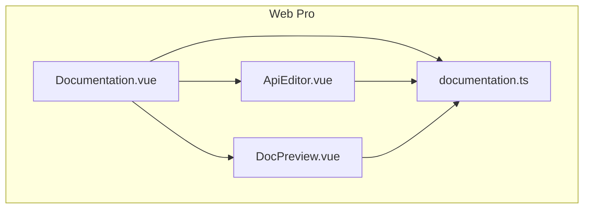
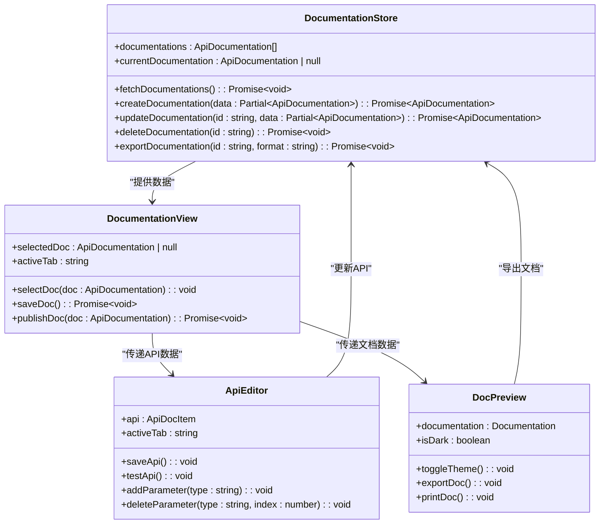
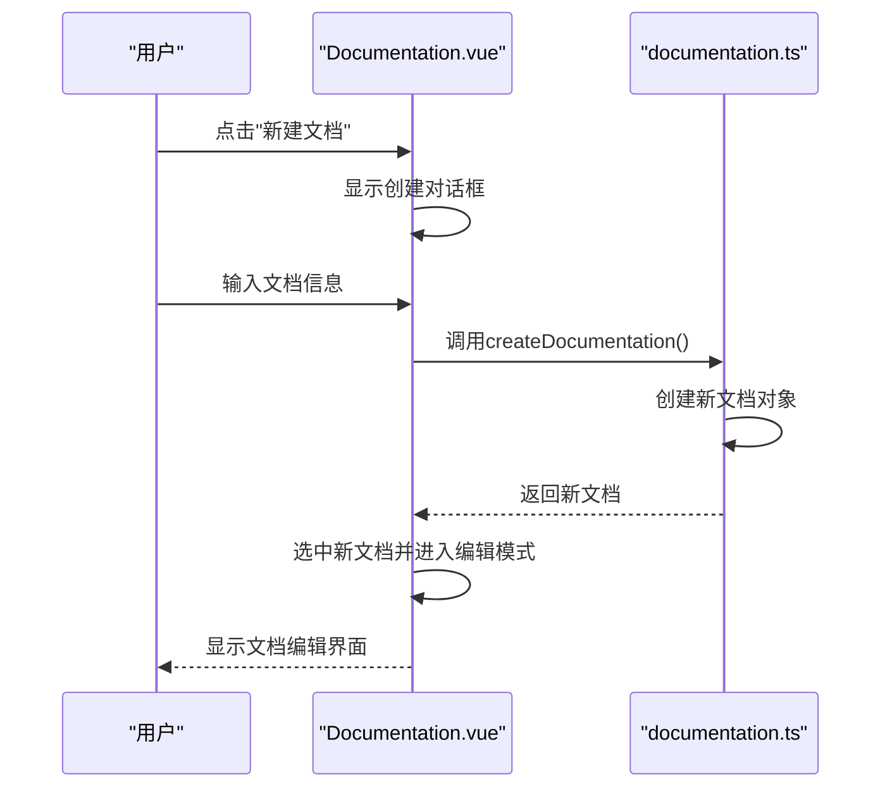
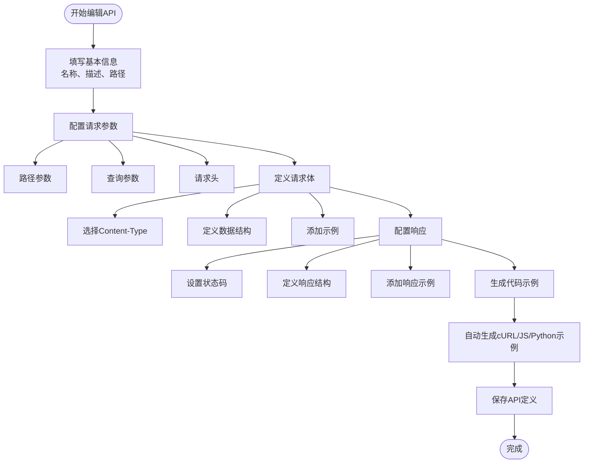
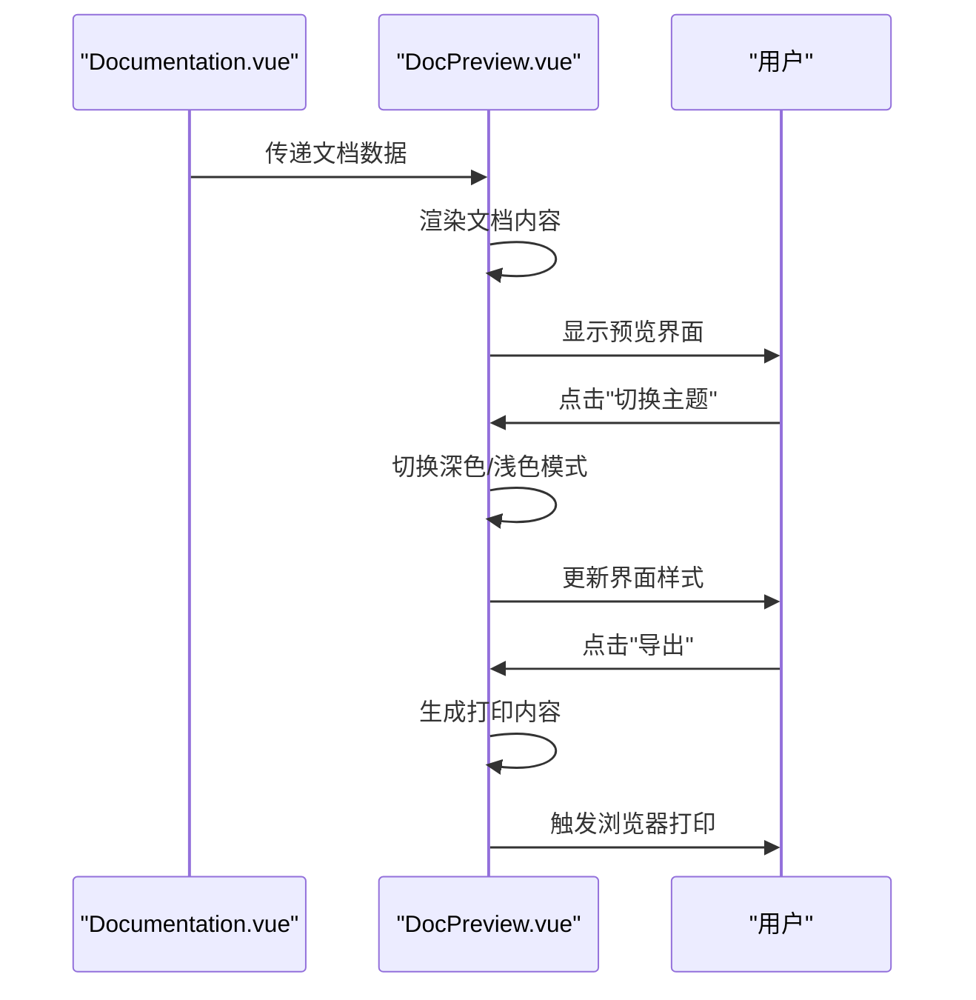
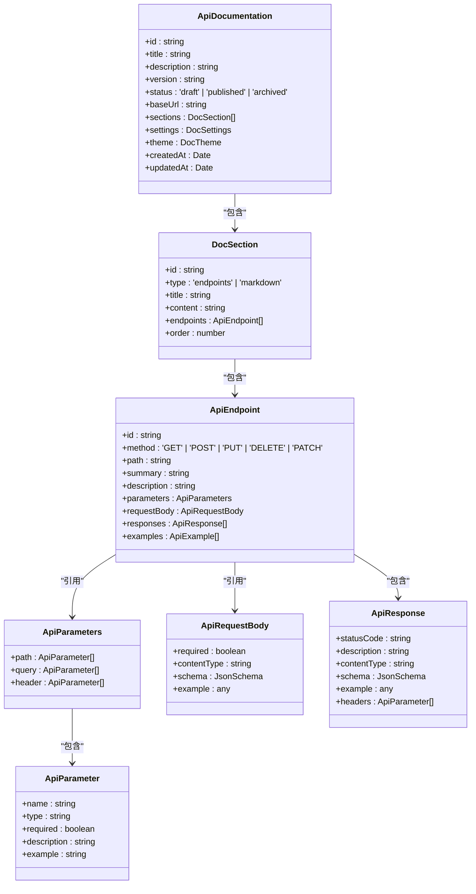
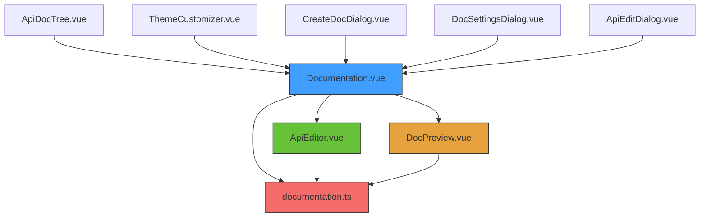

# API文档生成

<cite>
**本文档引用的文件**   
- [Documentation.vue](file://packages/web-pro/src/views/Documentation.vue)
- [ApiEditor.vue](file://packages/web-pro/src/components/documentation/ApiEditor.vue)
- [DocPreview.vue](file://packages/web-pro/src/components/documentation/DocPreview.vue)
- [documentation.ts](file://packages/web-pro/src/stores/documentation.ts)
</cite>

## 目录
1. [简介](#简介)
2. [项目结构](#项目结构)
3. [核心组件](#核心组件)
4. [架构概览](#架构概览)
5. [详细组件分析](#详细组件分析)
6. [依赖分析](#依赖分析)
7. [性能考虑](#性能考虑)
8. [故障排除指南](#故障排除指南)
9. [结论](#结论)

## 简介
本系统提供完整的API文档生成解决方案，支持从接口集合自动生成OpenAPI/Swagger规范文档，并允许手动补充描述信息。系统包含文档编辑、参数管理、实时预览和多格式导出功能，为开发者提供全面的文档化体验。

## 项目结构
系统采用模块化设计，核心功能集中在`web-pro`包中，包含视图层、组件库和状态管理模块。文档生成功能主要由`Documentation.vue`视图驱动，通过`ApiEditor`、`DocPreview`等组件实现具体功能，状态由`documentation.ts`统一管理。

**图示来源**
- [Documentation.vue](file://packages/web-pro/src/views/Documentation.vue)
- [ApiEditor.vue](file://packages/web-pro/src/components/documentation/ApiEditor.vue)
- [DocPreview.vue](file://packages/web-pro/src/components/documentation/DocPreview.vue)
- [documentation.ts](file://packages/web-pro/src/stores/documentation.ts)

## 核心组件
系统核心由文档视图、API编辑器、文档预览和状态管理四个主要组件构成。`Documentation.vue`作为主视图协调各组件工作，`ApiEditor.vue`提供详细的API参数编辑功能，`DocPreview.vue`实现文档的实时渲染，`documentation.ts`则负责全局状态管理和数据持久化。

**组件来源**
- [Documentation.vue](file://packages/web-pro/src/views/Documentation.vue)
- [ApiEditor.vue](file://packages/web-pro/src/components/documentation/ApiEditor.vue)
- [DocPreview.vue](file://packages/web-pro/src/components/documentation/DocPreview.vue)
- [documentation.ts](file://packages/web-pro/src/stores/documentation.ts)

## 架构概览
系统采用MVVM架构模式，视图层与状态管理层分离。用户操作通过视图组件触发，状态变更在`documentation.ts`中处理，视图自动响应状态变化。文档数据模型支持版本管理，可追溯文档变更历史。

**图示来源**
- [documentation.ts](file://packages/web-pro/src/stores/documentation.ts)
- [Documentation.vue](file://packages/web-pro/src/views/Documentation.vue)
- [ApiEditor.vue](file://packages/web-pro/src/components/documentation/ApiEditor.vue)
- [DocPreview.vue](file://packages/web-pro/src/components/documentation/DocPreview.vue)

## 详细组件分析

### 文档视图分析
`Documentation.vue`是API文档功能的主视图组件，提供文档列表展示、选择和编辑界面。用户可以通过该视图创建新文档、从集合导入API、设置文档属性并进行版本管理。

**图示来源**
- [Documentation.vue](file://packages/web-pro/src/views/Documentation.vue)
- [documentation.ts](file://packages/web-pro/src/stores/documentation.ts)

### API编辑器分析
`ApiEditor.vue`组件提供详细的API接口编辑功能，支持请求参数、请求体、响应定义和代码示例的完整配置。编辑器采用标签页形式组织不同类型的配置信息，确保用户能够系统地定义API规范。

**图示来源**
- [ApiEditor.vue](file://packages/web-pro/src/components/documentation/ApiEditor.vue)

### 文档预览分析
`DocPreview.vue`组件实现API文档的实时预览功能，支持主题切换、内容导出和打印。预览界面按照API分组展示所有接口，包含详细的参数说明、响应示例和代码片段，提供接近最终发布效果的可视化体验。

**图示来源**
- [DocPreview.vue](file://packages/web-pro/src/components/documentation/DocPreview.vue)
- [Documentation.vue](file://packages/web-pro/src/views/Documentation.vue)

### 状态管理分析
`documentation.ts`是文档功能的核心状态管理模块，采用Pinia存储模式管理所有文档相关的数据和业务逻辑。模块定义了完整的API文档数据模型，包括文档元数据、API定义、参数列表和响应示例，并提供版本管理机制。

**图示来源**
- [documentation.ts](file://packages/web-pro/src/stores/documentation.ts)

## 依赖分析
系统各组件之间存在明确的依赖关系。视图组件依赖状态管理模块获取和更新数据，编辑和预览组件依赖视图组件传递上下文信息。所有功能最终都依赖`documentation.ts`中的状态和业务逻辑。

**图示来源**
- [Documentation.vue](file://packages/web-pro/src/views/Documentation.vue)
- [ApiEditor.vue](file://packages/web-pro/src/components/documentation/ApiEditor.vue)
- [DocPreview.vue](file://packages/web-pro/src/components/documentation/DocPreview.vue)
- [documentation.ts](file://packages/web-pro/src/stores/documentation.ts)

## 性能考虑
系统在设计时考虑了性能优化，采用虚拟滚动和懒加载技术处理大量文档和API接口。状态管理模块通过计算属性实现数据过滤和搜索功能，避免重复计算。文档预览采用iframe隔离渲染，防止大规模文档渲染影响主应用性能。

## 故障排除指南
当遇到文档生成或预览问题时，可检查以下常见情况：确保API定义完整且符合规范，验证参数类型和必填状态设置正确，检查网络请求是否成功获取文档数据，确认浏览器兼容性问题。对于导出功能，需确保浏览器允许弹出窗口和文件下载。

**组件来源**
- [documentation.ts](file://packages/web-pro/src/stores/documentation.ts)
- [DocPreview.vue](file://packages/web-pro/src/components/documentation/DocPreview.vue)

## 结论
本API文档生成功能提供了完整的文档生命周期管理，从创建、编辑到发布和导出。系统采用现代化的前端架构，组件职责清晰，状态管理规范，为开发者提供了高效、直观的文档编写体验。通过与Mock服务的联动，还可实现文档与实际接口的一致性验证。