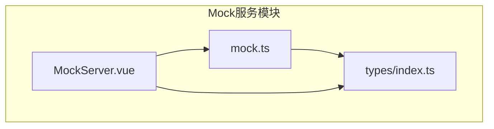
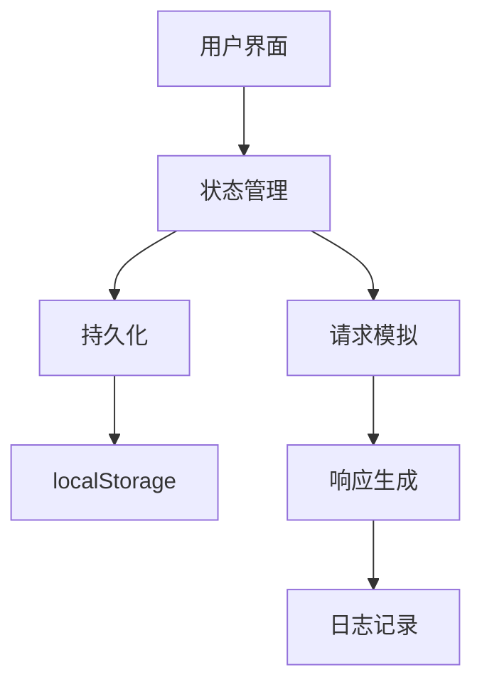
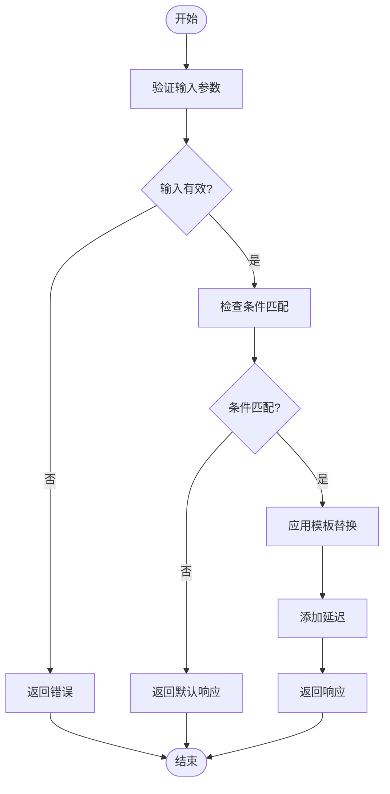
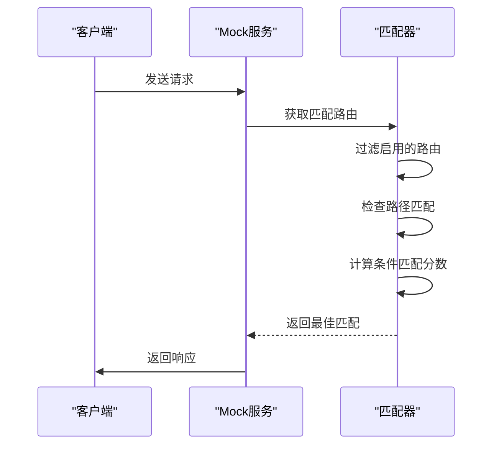
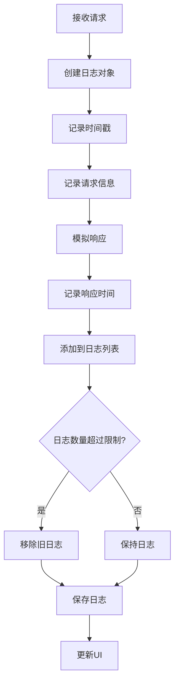
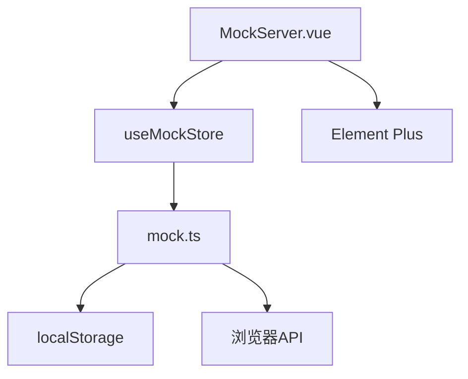

# Mock服务

<cite>
**本文档引用的文件**  
- [MockServer.vue](file://packages/web-pro/src/views/MockServer.vue)
- [mock.ts](file://packages/web-pro/src/stores/mock.ts)
- [index.ts](file://packages/web-pro/src/types/index.ts)
</cite>

## 目录
1. [简介](#简介)
2. [项目结构](#项目结构)
3. [核心组件](#核心组件)
4. [架构概览](#架构概览)
5. [详细组件分析](#详细组件分析)
6. [依赖分析](#依赖分析)
7. [性能考虑](#性能考虑)
8. [故障排除指南](#故障排除指南)
9. [结论](#结论)

## 简介
本文档详细描述了在线接口调试工具中的Mock服务功能。该功能允许开发者配置Mock路由、定义响应规则、设置条件匹配逻辑，并监控请求行为。通过`MockServer.vue`视图实现服务管理界面，结合`mock.ts`状态管理模块解析Mock规则的匹配算法与优先级机制。支持基于API文档自动生成Mock响应，涵盖静态值、动态模板和脚本化逻辑。同时提供条件匹配配置、请求拦截与日志记录能力，便于调试验证。文档还说明了HTTP代理实现、规则索引优化及与文档模块的双向同步机制。

## 项目结构
Mock服务功能主要位于`packages/web-pro`包中，包含视图、状态管理和类型定义三个核心部分。视图层由`MockServer.vue`实现用户界面，状态管理通过`mock.ts`中的Pinia store处理业务逻辑，类型定义在`types/index.ts`中统一维护。



**Diagram sources**  
- [MockServer.vue](file://packages/web-pro/src/views/MockServer.vue#L1-L840)
- [mock.ts](file://packages/web-pro/src/stores/mock.ts#L1-L354)
- [index.ts](file://packages/web-pro/src/types/index.ts#L317-L332)

**Section sources**
- [MockServer.vue](file://packages/web-pro/src/views/MockServer.vue#L1-L840)
- [mock.ts](file://packages/web-pro/src/stores/mock.ts#L1-L354)

## 核心组件
Mock服务的核心组件包括路由管理、响应配置、条件匹配和请求监控。`MockServer.vue`提供完整的UI交互，`mock.ts`实现底层逻辑处理，两者通过Pinia状态管理进行数据同步。

**Section sources**
- [MockServer.vue](file://packages/web-pro/src/views/MockServer.vue#L1-L840)
- [mock.ts](file://packages/web-pro/src/stores/mock.ts#L1-L354)

## 架构概览
Mock服务采用分层架构设计，分为视图层、状态管理层和持久化层。视图层负责用户交互，状态管理层处理业务逻辑和数据流，持久化层通过localStorage实现数据存储。



**Diagram sources**  
- [mock.ts](file://packages/web-pro/src/stores/mock.ts#L1-L354)
- [MockServer.vue](file://packages/web-pro/src/views/MockServer.vue#L1-L840)

## 详细组件分析

### 路由配置分析
路由配置功能允许用户定义Mock服务的端点路径、请求方法和响应内容。通过表单界面添加或编辑路由，支持多种HTTP方法和路径参数。

#### 路由数据结构
```mermaid
classDiagram
class MockRoute {
+string id
+string method
+string path
+string description
+boolean enabled
+MockResponse response
+number delay
+MockCondition[] conditions
+number hitCount
+number lastHit
}
class MockResponse {
+number statusCode
+{key : string, value : string}[] headers
+any body
+string bodyType
}
class MockCondition {
+string type
+string field
+string operator
+string value
}
MockRoute --> MockResponse : 包含
MockRoute --> MockCondition : 包含多个
```

**Diagram sources**  
- [index.ts](file://packages/web-pro/src/types/index.ts#L317-L332)

**Section sources**
- [MockServer.vue](file://packages/web-pro/src/views/MockServer.vue#L1-L840)
- [mock.ts](file://packages/web-pro/src/stores/mock.ts#L1-L354)

### 响应规则定义
响应规则支持静态值、动态模板和脚本化逻辑。用户可配置状态码、响应头和响应体，支持从文件导入响应内容。

#### 响应生成流程


**Diagram sources**  
- [mock.ts](file://packages/web-pro/src/stores/mock.ts#L280-L300)

**Section sources**
- [mock.ts](file://packages/web-pro/src/stores/mock.ts#L280-L300)

### 条件匹配逻辑
条件匹配功能允许根据请求参数返回不同响应。支持Query参数、Header和Body三种匹配类型，提供等于、包含和正则三种操作符。

#### 条件匹配算法


**Diagram sources**  
- [mock.ts](file://packages/web-pro/src/stores/mock.ts#L240-L279)

**Section sources**
- [mock.ts](file://packages/web-pro/src/stores/mock.ts#L240-L279)

### 请求监控能力
请求监控功能记录所有到达Mock服务的请求，包括时间、方法、路径、状态码、响应时间和IP地址等信息。

#### 日志记录流程


**Diagram sources**  
- [mock.ts](file://packages/web-pro/src/stores/mock.ts#L140-L180)

**Section sources**
- [mock.ts](file://packages/web-pro/src/stores/mock.ts#L140-L180)

## 依赖分析
Mock服务依赖于Pinia进行状态管理，Element Plus提供UI组件，localStorage实现数据持久化。各组件之间通过清晰的接口进行通信，确保低耦合高内聚。



**Diagram sources**  
- [MockServer.vue](file://packages/web-pro/src/views/MockServer.vue#L1-L840)
- [mock.ts](file://packages/web-pro/src/stores/mock.ts#L1-L354)

**Section sources**
- [MockServer.vue](file://packages/web-pro/src/views/MockServer.vue#L1-L840)
- [mock.ts](file://packages/web-pro/src/stores/mock.ts#L1-L354)

## 性能考虑
Mock服务在性能方面进行了多项优化，包括日志数量限制、路由匹配算法优化和响应延迟模拟。通过索引优化确保路由匹配的高效性，避免线性搜索带来的性能瓶颈。

**Section sources**
- [mock.ts](file://packages/web-pro/src/stores/mock.ts#L240-L279)

## 故障排除指南
常见问题包括服务器无法启动、路由不匹配和响应延迟异常。建议检查端口占用情况、路由配置正确性和条件匹配逻辑。日志功能可用于调试验证请求处理流程。

**Section sources**
- [mock.ts](file://packages/web-pro/src/stores/mock.ts#L140-L180)
- [MockServer.vue](file://packages/web-pro/src/views/MockServer.vue#L1-L840)

## 结论
Mock服务为开发者提供了完整的接口模拟解决方案，支持灵活的路由配置、丰富的响应规则、精确的条件匹配和全面的请求监控。通过与API文档模块的集成，实现了Mock规则的自动生成和双向同步，显著提升了开发效率。该功能的设计充分考虑了易用性、灵活性和性能要求，是接口调试工具的核心组件之一。