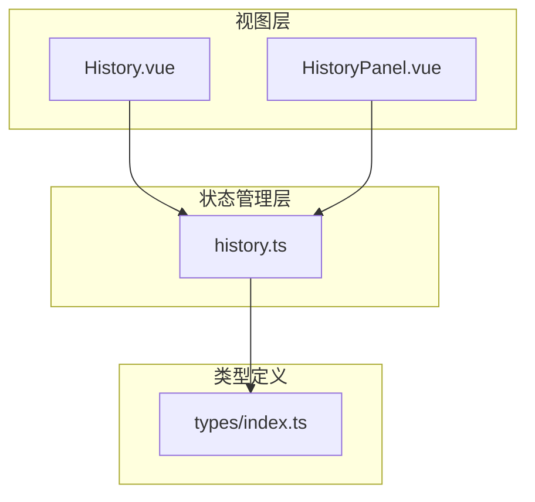
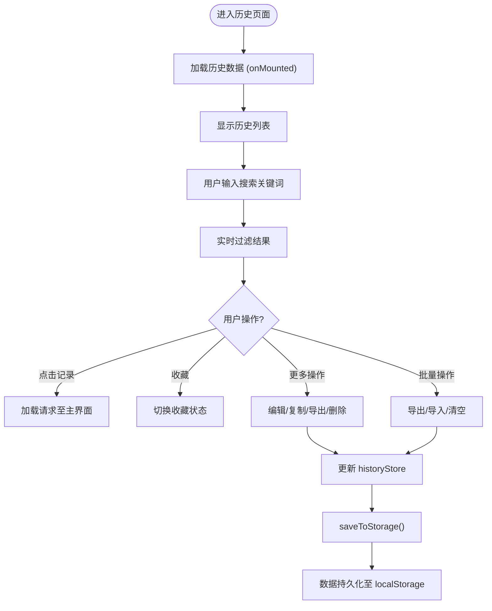
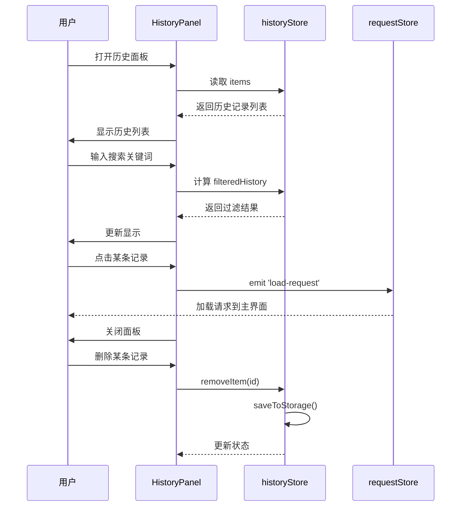
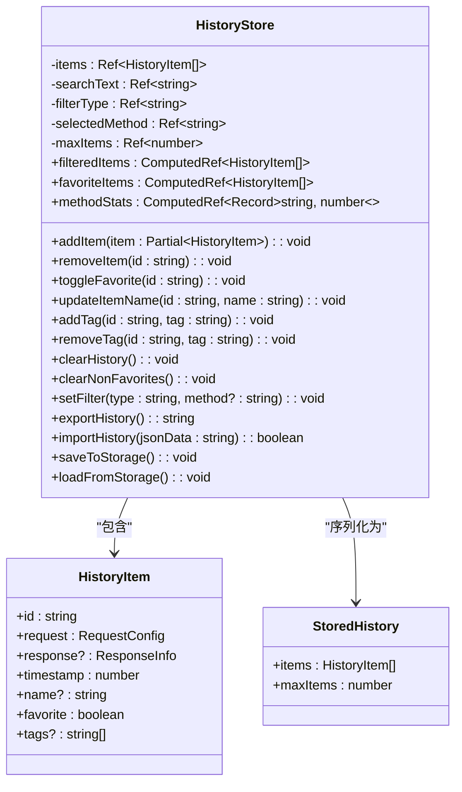

# 历史记录管理

<cite>
**本文档引用文件**  
- [History.vue](file://packages/web-lite/src/views/History.vue)
- [HistoryPanel.vue](file://packages/web-lite/src/components/HistoryPanel.vue)
- [history.ts](file://packages/web-lite/src/stores/history.ts)
</cite>

## 目录
1. [简介](#简介)
2. [项目结构](#项目结构)
3. [核心组件](#核心组件)
4. [架构概览](#架构概览)
5. [详细组件分析](#详细组件分析)
6. [依赖分析](#依赖分析)
7. [性能考虑](#性能考虑)
8. [故障排除指南](#故障排除指南)
9. [结论](#结论)

## 简介
本技术文档详细描述了在线接口调试工具中的历史记录管理模块。该模块支持请求历史的自动保存、搜索、过滤和导出功能，旨在提升用户调试效率。文档涵盖用户界面布局、交互行为、数据模型、状态管理机制、本地存储策略及与其他模块的集成逻辑。

## 项目结构
历史记录管理功能主要由三个核心文件构成，分别负责视图展示、组件封装和状态管理：



**Diagram sources**  
- [History.vue](file://packages/web-lite/src/views/History.vue)
- [HistoryPanel.vue](file://packages/web-lite/src/components/HistoryPanel.vue)
- [history.ts](file://packages/web-lite/src/stores/history.ts)

**Section sources**  
- [History.vue](file://packages/web-lite/src/views/History.vue)
- [HistoryPanel.vue](file://packages/web-lite/src/components/HistoryPanel.vue)
- [history.ts](file://packages/web-lite/src/stores/history.ts)

## 核心组件
历史记录模块由三大核心组件构成：`History.vue` 为完整的历史记录管理页面，提供全面的管理功能；`HistoryPanel.vue` 是轻量级抽屉式历史面板，集成于调试主界面；`history.ts` 是基于 Pinia 的状态管理模块，负责数据持久化与业务逻辑处理。

**Section sources**  
- [History.vue](file://packages/web-lite/src/views/History.vue#L1-L699)
- [HistoryPanel.vue](file://packages/web-lite/src/components/HistoryPanel.vue#L1-L250)
- [history.ts](file://packages/web-lite/src/stores/history.ts#L1-L249)

## 架构概览
系统采用典型的 MVVM 架构模式，通过 Vue 3 的组合式 API 实现响应式数据绑定，Pinia 管理全局状态，Element Plus 提供 UI 组件。

```mermaid
graph TD
A[用户操作] --> B[History.vue / HistoryPanel.vue]
B --> C[useHistoryStore()]
C --> D[history.ts]
D --> E[localStorage]
D --> F[响应式更新]
F --> B
B --> G[UI 渲染]
```

**Diagram sources**  
- [History.vue](file://packages/web-lite/src/views/History.vue)
- [HistoryPanel.vue](file://packages/web-lite/src/components/HistoryPanel.vue)
- [history.ts](file://packages/web-lite/src/stores/history.ts)

## 详细组件分析

### History.vue 分析
`History.vue` 是历史记录的完整管理页面，提供搜索、过滤、统计、导出、导入和清空等完整功能。

#### 功能交互流程


**Diagram sources**  
- [History.vue](file://packages/web-lite/src/views/History.vue#L1-L699)

**Section sources**  
- [History.vue](file://packages/web-lite/src/views/History.vue#L1-L699)

### HistoryPanel.vue 分析
`HistoryPanel.vue` 是一个轻量级的历史记录抽屉组件，集成在主调试界面中，提供快速访问最近请求的功能。

#### 组件交互逻辑


**Diagram sources**  
- [HistoryPanel.vue](file://packages/web-lite/src/components/HistoryPanel.vue#L1-L250)
- [history.ts](file://packages/web-lite/src/stores/history.ts#L1-L249)

**Section sources**  
- [HistoryPanel.vue](file://packages/web-lite/src/components/HistoryPanel.vue#L1-L250)

### history.ts 状态管理分析
`history.ts` 是历史记录模块的核心状态管理文件，使用 Pinia 实现响应式状态管理。

#### 数据模型与方法关系


**Diagram sources**  
- [history.ts](file://packages/web-lite/src/stores/history.ts#L1-L249)

**Section sources**  
- [history.ts](file://packages/web-lite/src/stores/history.ts#L1-L249)

## 依赖分析
历史记录模块与其他核心模块存在紧密关联，形成完整的调试工作流。

```mermaid
graph TD
HistoryStore[history.ts] --> RequestStore[request.ts]
HistoryStore --> LocalStorage[localStorage]
HistoryStore --> Types[types/index.ts]
HistoryView[History.vue] --> HistoryStore
HistoryView --> RequestStore
HistoryView --> ElementPlus[Element Plus]
HistoryPanel[HistoryPanel.vue] --> HistoryStore
HistoryPanel --> RequestStore
HistoryPanel --> ElementPlus
RequestStore --> HistoryStore : "loadFromHistory()"
```

**Diagram sources**  
- [history.ts](file://packages/web-lite/src/stores/history.ts)
- [History.vue](file://packages/web-lite/src/views/History.vue)
- [HistoryPanel.vue](file://packages/web-lite/src/components/HistoryPanel.vue)

**Section sources**  
- [history.ts](file://packages/web-lite/src/stores/history.ts)
- [request.ts](file://packages/web-lite/src/stores/request.ts)

## 性能考虑
历史记录模块在设计时充分考虑了性能优化，确保在大量历史数据下的流畅体验。

### 数据量控制策略
- **最大条目限制**：默认限制为 100 条，通过 `maxItems` 配置
- **自动清理机制**：超出限制时自动移除最旧的记录
- **重复请求合并**：相同 URL、方法和请求体的请求会被更新而非新增
- **响应式计算属性**：使用 `computed` 实现高效过滤，避免重复计算

### 存储优化
- **本地存储**：使用 `localStorage` 持久化数据，避免页面刷新丢失
- **批量写入**：每次数据变更后立即保存，确保数据安全
- **JSON 序列化**：完整保存请求/响应数据，支持复杂结构

### 用户体验优化
- **实时搜索**：输入时即时过滤，无需手动提交
- **分页替代方案**：采用滚动加载而非分页，简化 UI
- **视觉反馈**：悬停高亮、颜色编码状态码，提升可读性

**Section sources**  
- [history.ts](file://packages/web-lite/src/stores/history.ts#L76-L80)
- [history.ts](file://packages/web-lite/src/stores/history.ts#L150-L155)

## 故障排除指南
### 常见问题及解决方案

| 问题现象 | 可能原因 | 解决方案 |
|---------|--------|--------|
| 历史记录未保存 | 浏览器禁用 localStorage | 检查浏览器设置，确保本地存储启用 |
| 搜索无结果 | 搜索关键词不匹配 | 确认搜索是否区分大小写，检查 URL/方法/名称字段 |
| 导出文件无法导入 | JSON 格式错误 | 使用标准 JSON 格式，确保结构正确 |
| 页面加载缓慢 | 历史记录过多 | 清理历史记录或调整 `maxItems` 限制 |
| 收藏状态未保存 | 存储写入失败 | 检查浏览器控制台是否有存储错误 |

### 数据模型说明
历史记录条目包含以下关键信息：
- **时间戳** (`timestamp`)：记录创建时间，用于排序和过期判断
- **请求信息** (`request`)：包含方法、URL、头信息、请求体等完整请求数据
- **响应信息** (`response`)：包含状态码、响应时间、响应体等
- **元数据**：名称、收藏状态、标签等用户自定义信息

### 高级搜索语法
支持以下搜索方式：
- **关键词匹配**：在名称、URL 或方法中搜索文本
- **按方法过滤**：通过下拉菜单选择 GET、POST 等特定方法
- **收藏筛选**：仅显示收藏的请求记录
- **组合过滤**：搜索关键词 + 方法过滤 + 收藏筛选可同时生效

### 历史记录重放与转化
用户可通过以下方式复用历史记录：
- **重放请求**：点击历史记录，自动加载到主请求界面并可重新发送
- **复制请求**：通过右键菜单复制请求，用于创建新请求
- **转化为接口集合**：虽当前版本未直接支持，但可通过导出/导入机制实现批量迁移

**Section sources**  
- [history.ts](file://packages/web-lite/src/stores/history.ts#L45-L65)
- [History.vue](file://packages/web-lite/src/views/History.vue#L128-L163)
- [HistoryPanel.vue](file://packages/web-lite/src/components/HistoryPanel.vue#L45-L60)

## 结论
历史记录管理模块通过 `History.vue`、`HistoryPanel.vue` 和 `history.ts` 三个核心文件，实现了完整的请求历史生命周期管理。系统采用响应式架构，支持自动保存、多维度搜索过滤、数据导出导入、本地持久化等关键功能。通过合理的数据模型设计和性能优化策略，确保了在高负载下的稳定运行。该模块与请求管理模块紧密集成，为用户提供高效、便捷的调试体验，是接口调试工具的核心功能之一。