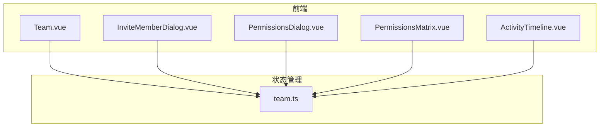
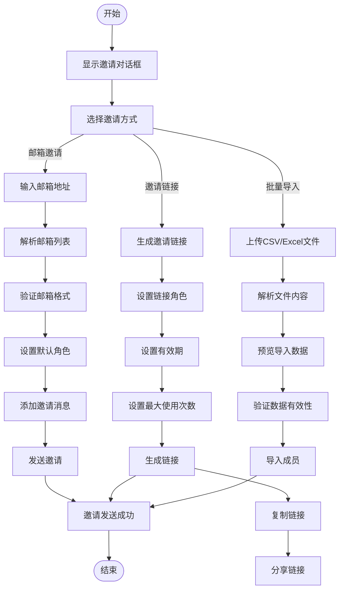
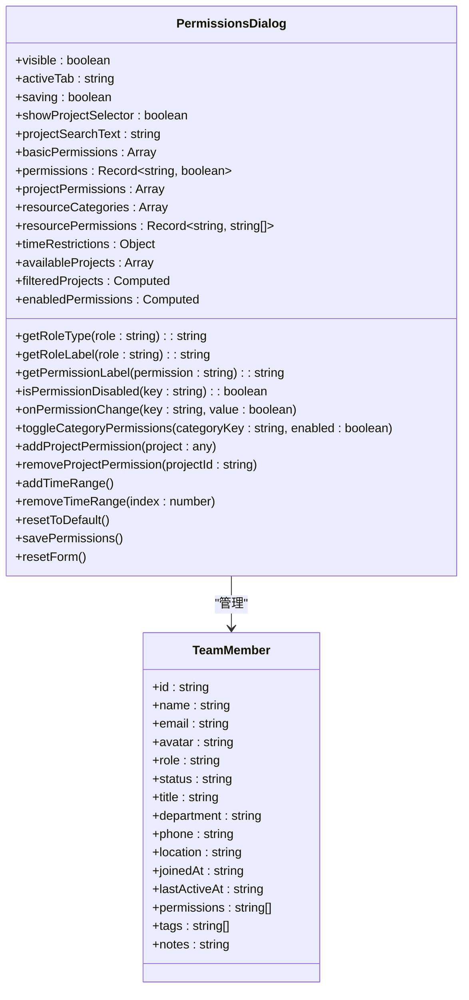

# 团队协作

<cite>
**本文档引用的文件**   
- [Team.vue](file://packages/web-pro/src/pages/Team.vue)
- [team.ts](file://packages/web-pro/src/stores/team.ts)
- [InviteMemberDialog.vue](file://packages/web-pro/src/components/team/InviteMemberDialog.vue)
- [PermissionsDialog.vue](file://packages/web-pro/src/components/team/PermissionsDialog.vue)
- [PermissionsMatrix.vue](file://packages/web-pro/src/components/team/PermissionsMatrix.vue)
- [ActivityTimeline.vue](file://packages/web-pro/src/components/team/ActivityTimeline.vue)
</cite>

## 目录
1. [简介](#简介)
2. [项目结构](#项目结构)
3. [核心组件](#核心组件)
4. [架构概览](#架构概览)
5. [详细组件分析](#详细组件分析)
6. [依赖分析](#依赖分析)
7. [性能考虑](#性能考虑)
8. [故障排除指南](#故障排除指南)
9. [结论](#结论)

## 简介
本文档详细说明了团队协作功能的设计与实现，涵盖成员邀请、角色权限管理、权限矩阵展示和团队活动日志。基于 `Team.vue` 主视图和相关对话框组件（如 `InviteMemberDialog`、`PermissionsDialog`）描述用户操作流程。结合 `team.ts` 状态管理模块解析团队数据模型（Team、Member、Role、Permission）及其同步机制。解释 RBAC 权限模型的具体应用，支持细粒度资源控制（如集合读写权限）。提供团队工作流示例，如新成员接入、权限审计等。针对开发者文档化团队数据的加密传输、变更通知机制及与其他模块（如集合、工作区）的访问控制集成。

## 项目结构
团队协作功能主要由以下几个部分组成：
- **主视图**：`Team.vue` 作为团队管理页面的入口，负责展示团队概览、成员列表、权限矩阵和活动日志。
- **状态管理**：`team.ts` 使用 Pinia 存储团队数据，包括当前团队信息、成员列表、权限矩阵和活动日志。
- **对话框组件**：
  - `InviteMemberDialog.vue`：用于邀请新成员，支持邮箱邀请、邀请链接和批量导入。
  - `PermissionsDialog.vue`：用于管理成员权限，支持基础权限、项目权限、资源权限和时间限制。
  - `PermissionsMatrix.vue`：展示权限矩阵，允许管理员查看和修改不同角色的权限配置。
  - `ActivityTimeline.vue`：展示团队最近的活动日志，帮助用户了解团队动态。

**Section sources**
- [Team.vue](file://packages/web-pro/src/pages/Team.vue#L1-L768)
- [team.ts](file://packages/web-pro/src/stores/team.ts#L1-L574)

## 核心组件

### 团队数据模型
团队协作功能的核心是团队数据模型，包含以下主要实体：
- **Team**：表示团队的基本信息，如名称、描述、创建时间、设置等。
- **TeamMember**：表示团队成员，包含姓名、邮箱、角色、状态、权限等属性。
- **Role**：定义了团队中的角色，如所有者、管理员、编辑者、查看者。
- **Permission**：定义了具体的权限项，如 `team.read`、`team.invite`、`project.create` 等。

这些数据模型通过 `team.ts` 中的 Pinia store 进行管理和同步，确保在多个组件之间共享一致的数据。

### 用户操作流程
用户可以通过 `Team.vue` 页面执行以下操作：
- **邀请成员**：点击“邀请成员”按钮，弹出 `InviteMemberDialog` 对话框，支持多种邀请方式（邮箱、链接、批量导入）。
- **管理权限**：在成员列表中选择某个成员，点击“管理权限”，弹出 `PermissionsDialog` 对话框，可以为该成员分配或修改权限。
- **查看活动日志**：在侧边栏的“最近活动”卡片中，查看团队的最新活动记录，如成员加入、权限变更等。

**Section sources**
- [Team.vue](file://packages/web-pro/src/pages/Team.vue#L1-L768)
- [team.ts](file://packages/web-pro/src/stores/team.ts#L1-L574)
- [InviteMemberDialog.vue](file://packages/web-pro/src/components/team/InviteMemberDialog.vue#L1-L567)
- [PermissionsDialog.vue](file://packages/web-pro/src/components/team/PermissionsDialog.vue#L1-L828)

## 架构概览



**Diagram sources**
- [Team.vue](file://packages/web-pro/src/pages/Team.vue#L1-L768)
- [team.ts](file://packages/web-pro/src/stores/team.ts#L1-L574)

## 详细组件分析

### 成员邀请功能分析

#### 邀请成员对话框


**Diagram sources**
- [InviteMemberDialog.vue](file://packages/web-pro/src/components/team/InviteMemberDialog.vue#L1-L567)

### 权限管理功能分析

#### 权限管理对话框


**Diagram sources**
- [PermissionsDialog.vue](file://packages/web-pro/src/components/team/PermissionsDialog.vue#L1-L828)

## 依赖分析

```mermaid
dependency-graph
Team.vue --> team.ts
InviteMemberDialog.vue --> team.ts
PermissionsDialog.vue --> team.ts
PermissionsMatrix.vue --> team.ts
ActivityTimeline.vue --> team.ts
team.ts --> http.ts
```

**Diagram sources**
- [Team.vue](file://packages/web-pro/src/pages/Team.vue#L1-L768)
- [team.ts](file://packages/web-pro/src/stores/team.ts#L1-L574)

## 性能考虑
团队协作功能在设计时考虑了以下性能优化措施：
- **数据懒加载**：在 `Team.vue` 中，成员列表和活动日志采用分页加载，避免一次性加载大量数据。
- **状态管理**：使用 Pinia 进行状态管理，确保数据在多个组件之间高效共享，减少重复请求。
- **异步操作**：所有涉及网络请求的操作（如邀请成员、更新权限）都使用异步处理，避免阻塞 UI 线程。
- **缓存机制**：团队数据在首次加载后会被缓存，后续访问时直接从缓存读取，提升响应速度。

## 故障排除指南

### 常见问题
- **邀请成员失败**：检查邮箱地址是否正确，确保网络连接正常。如果使用邀请链接，确认链接未过期且未达到最大使用次数。
- **权限无法保存**：确认当前用户具有足够的权限来修改目标成员的权限。某些权限（如删除项目）可能需要管理员或所有者角色。
- **活动日志不更新**：刷新页面或重新加载团队数据，确保活动日志已从服务器获取最新记录。

### 调试建议
- **查看控制台日志**：打开浏览器开发者工具，查看是否有错误信息或警告。
- **检查网络请求**：使用 Network 面板监控 API 请求，确保请求成功并返回预期数据。
- **验证数据模型**：确认 `team.ts` 中的数据模型与后端 API 返回的数据结构一致。

**Section sources**
- [team.ts](file://packages/web-pro/src/stores/team.ts#L1-L574)
- [Team.vue](file://packages/web-pro/src/pages/Team.vue#L1-L768)

## 结论
本文档详细介绍了团队协作功能的设计与实现，涵盖了成员邀请、角色权限管理、权限矩阵展示和团队活动日志。通过 `Team.vue` 主视图和相关对话框组件，用户可以方便地管理团队成员和权限。`team.ts` 状态管理模块确保了数据的一致性和同步性。RBAC 权限模型的应用支持细粒度资源控制，满足了复杂团队协作的需求。未来可以进一步优化性能，增加更多自动化功能，提升用户体验。