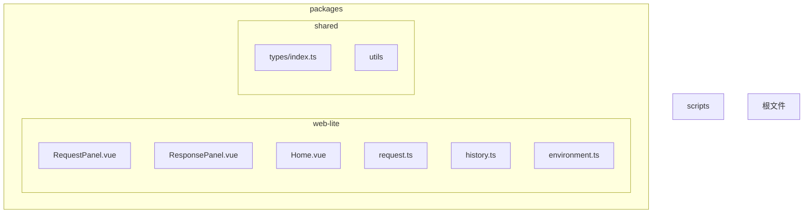
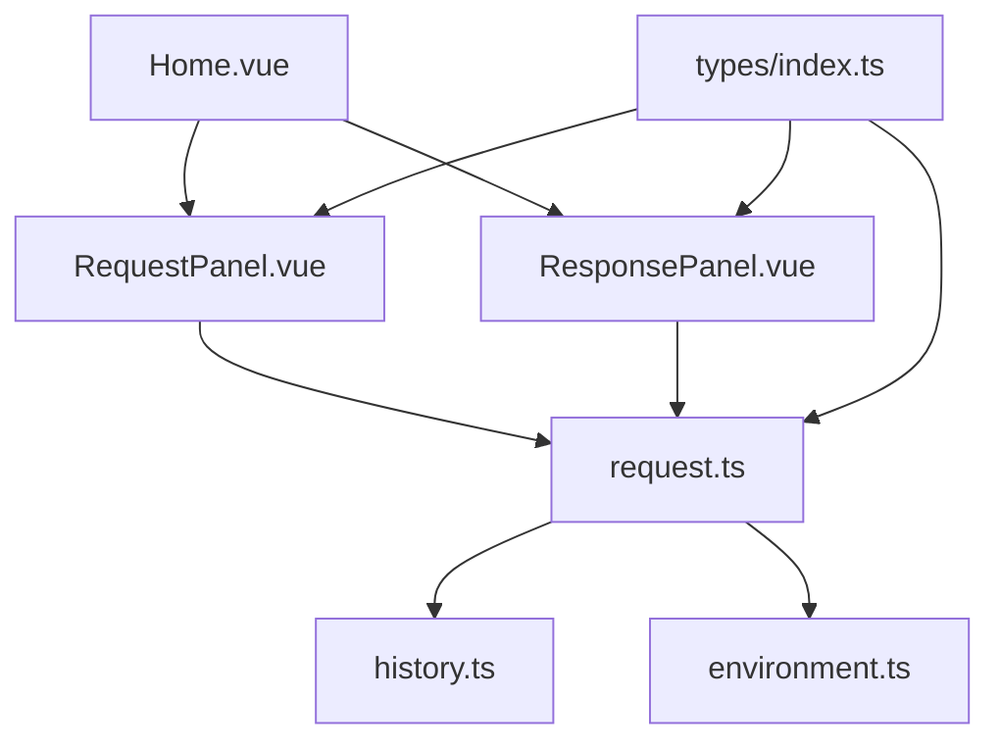
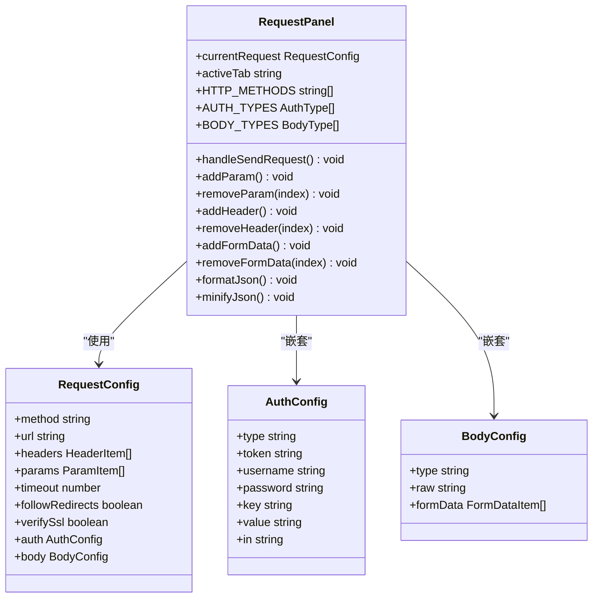
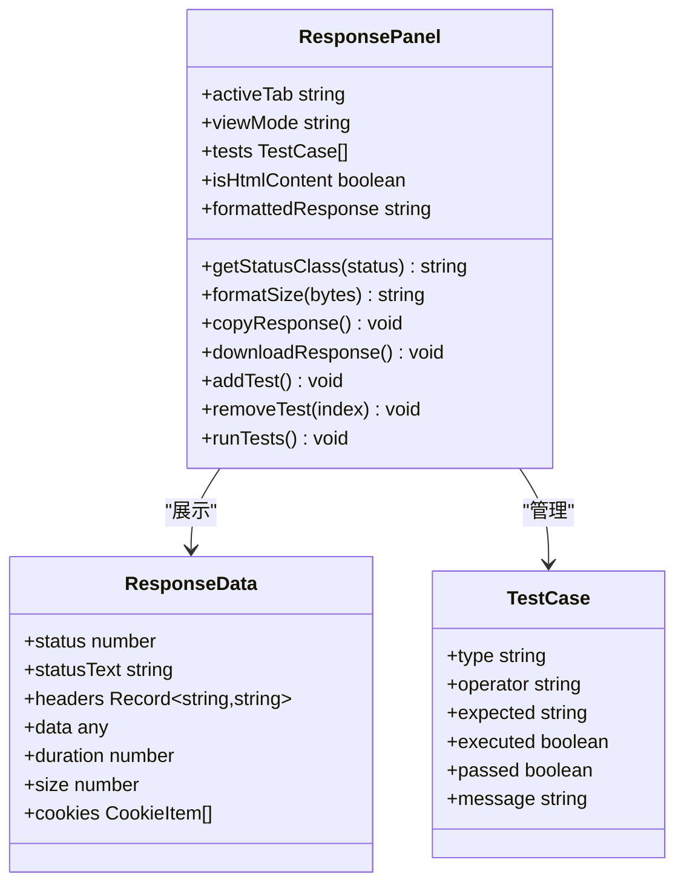
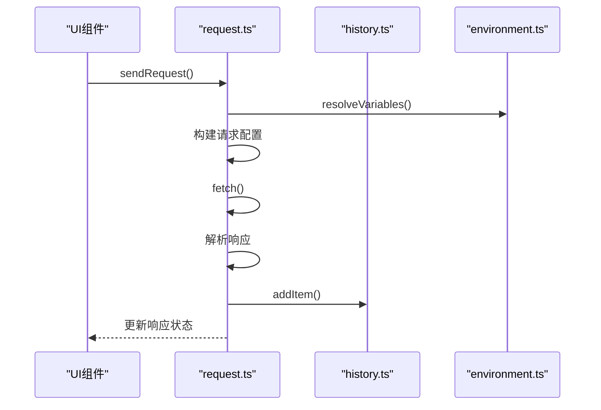
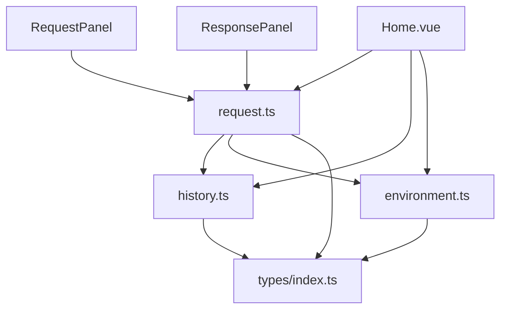

# 基础API调试

<cite>
**本文档引用文件**  
- [RequestPanel.vue](file://packages/web-lite/src/components/RequestPanel.vue)
- [ResponsePanel.vue](file://packages/web-lite/src/components/ResponsePanel.vue)
- [request.ts](file://packages/web-lite/src/stores/request.ts)
- [history.ts](file://packages/web-lite/src/stores/history.ts)
- [Home.vue](file://packages/web-lite/src/views/Home.vue)
- [environment.ts](file://packages/web-lite/src/stores/environment.ts)
- [types/index.ts](file://packages/shared/types/index.ts)
</cite>

## 目录
1. [简介](#简介)
2. [项目结构](#项目结构)
3. [核心组件](#核心组件)
4. [架构概览](#架构概览)
5. [详细组件分析](#详细组件分析)
6. [依赖分析](#依赖分析)
7. [性能考虑](#性能考虑)
8. [故障排除指南](#故障排除指南)
9. [结论](#结论)

## 简介
本文档详细介绍了在线接口调试工具的基础API调试功能，重点涵盖请求面板、响应展示和历史记录查看三大核心功能。文档面向初学者提供操作指引，同时为开发者说明组件通信机制和扩展点。通过分析`RequestPanel.vue`、`ResponsePanel.vue`和`request.ts`等关键文件，阐述了用户如何配置HTTP请求、发送请求并查看格式化后的响应结果，以及与历史记录模块的集成方式。

## 项目结构
本项目采用模块化设计，主要分为`packages`、`scripts`和根目录配置文件。`packages`目录下包含多个子包，其中`web-lite`是轻量级Web应用的核心，`shared`包含跨包共享的类型定义和工具函数。

**图示来源**
- [Home.vue](file://packages/web-lite/src/views/Home.vue)
- [RequestPanel.vue](file://packages/web-lite/src/components/RequestPanel.vue)
- [ResponsePanel.vue](file://packages/web-lite/src/components/ResponsePanel.vue)

## 核心组件
核心组件包括请求面板、响应面板和状态管理模块。请求面板提供HTTP请求的完整配置界面，响应面板展示格式化的响应结果，状态管理模块处理数据流和业务逻辑。

**本节来源**
- [RequestPanel.vue](file://packages/web-lite/src/components/RequestPanel.vue#L1-L627)
- [ResponsePanel.vue](file://packages/web-lite/src/components/ResponsePanel.vue#L1-L823)
- [request.ts](file://packages/web-lite/src/stores/request.ts#L1-L305)

## 架构概览
系统采用Vue 3 + Pinia的组合式API架构，通过组件化设计实现功能分离。UI组件负责用户交互，Pinia store管理应用状态，共享类型定义确保类型安全。

**图示来源**
- [Home.vue](file://packages/web-lite/src/views/Home.vue#L1-L343)
- [request.ts](file://packages/web-lite/src/stores/request.ts#L1-L305)

## 详细组件分析

### 请求面板分析
请求面板组件提供完整的HTTP请求配置功能，包括方法选择、URL输入、参数配置、请求头管理、认证设置、请求体配置和高级设置。

**图示来源**
- [RequestPanel.vue](file://packages/web-lite/src/components/RequestPanel.vue#L1-L627)
- [types/index.ts](file://packages/shared/types/index.ts#L1-L991)

### 响应面板分析
响应面板组件负责展示API请求的响应结果，包括状态信息、响应体、响应头、Cookies和测试结果。

**图示来源**
- [ResponsePanel.vue](file://packages/web-lite/src/components/ResponsePanel.vue#L1-L823)
- [types/index.ts](file://packages/shared/types/index.ts#L1-L991)

### 状态管理分析
状态管理模块使用Pinia实现，包含请求、历史记录和环境三个主要store，负责应用状态的集中管理和业务逻辑处理。

**图示来源**
- [request.ts](file://packages/web-lite/src/stores/request.ts#L1-L305)
- [history.ts](file://packages/web-lite/src/stores/history.ts#L1-L249)
- [environment.ts](file://packages/web-lite/src/stores/environment.ts#L1-L378)

## 依赖分析
系统各组件之间存在明确的依赖关系，通过Pinia store实现状态共享和通信。

**图示来源**
- [Home.vue](file://packages/web-lite/src/views/Home.vue#L1-L343)
- [request.ts](file://packages/web-lite/src/stores/request.ts#L1-L305)
- [history.ts](file://packages/web-lite/src/stores/history.ts#L1-L249)

## 性能考虑
系统在性能方面做了多项优化，包括请求超时设置、响应大小计算、历史记录数量限制和本地存储优化。

**本节来源**
- [request.ts](file://packages/web-lite/src/stores/request.ts#L1-L305)
- [history.ts](file://packages/web-lite/src/stores/history.ts#L1-L249)
- [settings.ts](file://packages/web-lite/src/stores/settings.ts#L1-L272)

## 故障排除指南
常见问题包括请求超时、响应解析失败、环境变量未解析等，以下是排查建议。

**本节来源**
- [request.ts](file://packages/web-lite/src/stores/request.ts#L1-L305)
- [ResponsePanel.vue](file://packages/web-lite/src/components/ResponsePanel.vue#L1-L823)
- [environment.ts](file://packages/web-lite/src/stores/environment.ts#L1-L378)

### 请求超时
当请求超时发生时，检查以下几点：
1. 网络连接是否正常
2. 目标服务器是否可达
3. 请求超时设置是否合理
4. 是否需要关闭SSL验证

### 响应解析失败
当响应解析失败时，检查以下几点：
1. 响应内容是否为有效的JSON格式
2. Content-Type头是否正确
3. 响应数据是否为空

### 环境变量未解析
当环境变量未正确解析时，检查以下几点：
1. 是否已选择正确的环境
2. 环境变量名称是否正确
3. 变量引用格式是否为{{variable}}或${variable}

## 结论
本文档详细介绍了在线接口调试工具的基础API调试功能，涵盖了请求配置、响应展示和历史记录等核心功能。通过组件化设计和Pinia状态管理，实现了功能分离和状态集中管理。系统提供了友好的用户界面和强大的调试功能，支持多种认证方式和请求体类型，满足日常API调试需求。