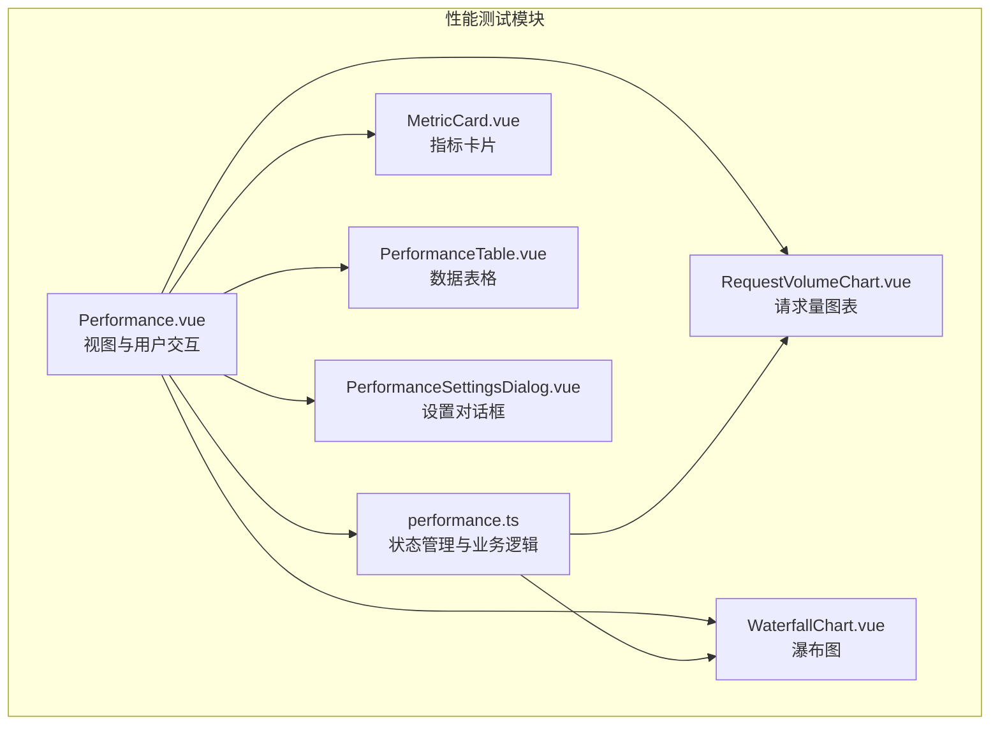
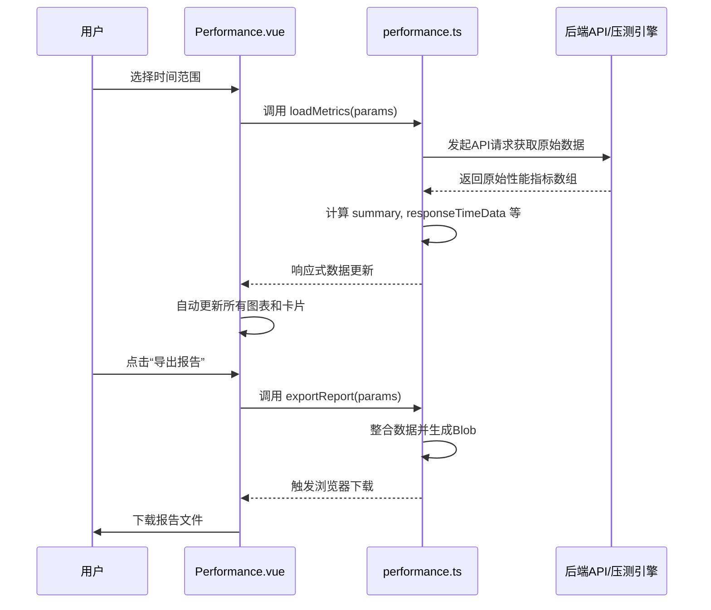
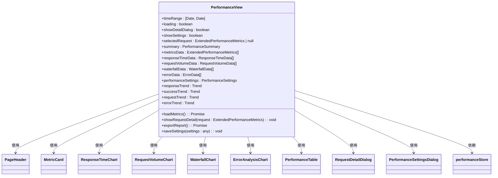
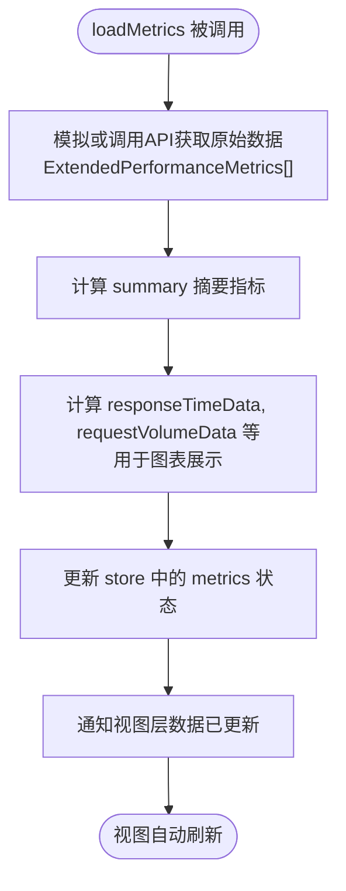

# 性能测试

<cite>
**本文档引用的文件**
- [Performance.vue](file://packages/web-pro/src/views/Performance.vue)
- [performance.ts](file://packages/web-pro/src/stores/performance.ts)
- [RequestVolumeChart.vue](file://packages/web-pro/src/components/performance/RequestVolumeChart.vue)
- [WaterfallChart.vue](file://packages/web-pro/src/components/performance/WaterfallChart.vue)
- [index.ts](file://packages/web-pro/src/types/index.ts)
</cite>

## 目录
1. [简介](#简介)
2. [项目结构](#项目结构)
3. [核心组件](#核心组件)
4. [架构概览](#架构概览)
5. [详细组件分析](#详细组件分析)
6. [依赖分析](#依赖分析)
7. [性能考量](#性能考量)
8. [故障排除指南](#故障排除指南)
9. [结论](#结论)

## 简介
本文档详细介绍了在线接口调试工具中的性能测试功能，重点涵盖压力测试配置、关键性能指标监控、可视化分析和报告生成机制。通过分析 `Performance.vue` 视图组件、`performance.ts` 状态管理模块以及各类图表组件（如 `RequestVolumeChart`、`WaterfallChart`），全面解析了性能数据的采集、处理、展示和控制逻辑。文档还深入探讨了并发用户模拟、请求速率控制、错误注入等压测引擎核心机制，以及TPS、响应时间P95、错误率等关键指标的计算方法。为开发者提供了压测代理通信协议、大数据量处理优化和资源消耗监控的实现细节。

## 项目结构
性能测试功能主要位于 `web-pro` 包中，采用模块化设计，将视图、状态管理和组件分离。核心功能由 `Performance.vue` 视图驱动，通过 `performance.ts` Pinia store 进行状态管理，并利用多个专用图表组件实现数据可视化。



**图表来源**
- [Performance.vue](file://packages/web-pro/src/views/Performance.vue#L1-L247)
- [performance.ts](file://packages/web-pro/src/stores/performance.ts#L1-L304)

**章节来源**
- [Performance.vue](file://packages/web-pro/src/views/Performance.vue#L1-L247)
- [performance.ts](file://packages/web-pro/src/stores/performance.ts#L1-L304)

## 核心组件
性能测试功能的核心由 `Performance.vue` 视图和 `performance.ts` 状态管理器构成。`Performance.vue` 负责构建用户界面，整合多个图表组件，并处理用户操作（如时间范围选择、报告导出）。`performance.ts` 则封装了所有与性能数据相关的业务逻辑，包括数据加载、指标计算、设置管理等。两者通过 Pinia store 的响应式 API 紧密协作，确保视图与状态的实时同步。

**章节来源**
- [Performance.vue](file://packages/web-pro/src/views/Performance.vue#L1-L247)
- [performance.ts](file://packages/web-pro/src/stores/performance.ts#L1-L304)

## 架构概览
系统采用典型的 MVVM（Model-View-ViewModel）架构。`Performance.vue` 作为 View 层，负责 UI 呈现和用户输入。`performance.ts` 作为 ViewModel 层，是核心逻辑的中枢，它从后端（在代码中以模拟方式体现）获取原始性能数据（Model），经过复杂的计算和转换，生成适合视图展示的聚合数据和图表数据。视图通过计算属性（computed）订阅 ViewModel 中的状态，实现自动更新。



**图表来源**
- [Performance.vue](file://packages/web-pro/src/views/Performance.vue#L1-L247)
- [performance.ts](file://packages/web-pro/src/stores/performance.ts#L1-L304)

## 详细组件分析
本节深入分析性能测试功能的关键组件，揭示其内部实现机制。

### 性能视图 (Performance.vue) 分析
`Performance.vue` 是性能监控页面的入口，它组织了所有UI元素并协调用户交互。



**图表来源**
- [Performance.vue](file://packages/web-pro/src/views/Performance.vue#L1-L247)

**章节来源**
- [Performance.vue](file://packages/web-pro/src/views/Performance.vue#L1-L247)

### 状态管理 (performance.ts) 分析
`performance.ts` 是整个性能测试功能的“大脑”，它定义了状态、计算属性和方法。

#### 关键状态与计算属性
该模块定义了多个核心计算属性，用于从原始数据中提炼出有价值的洞察：
- **`summary`**: 计算总请求数、成功率、平均响应时间、P95/P99响应时间、吞吐量等核心摘要指标。
- **`responseTimeData`**: 将原始数据按小时分组，计算每小时的平均响应时间、P95和P99时间，用于绘制响应时间趋势图。
- **`requestVolumeData`**: 按小时分组，统计成功和失败的请求数量，用于请求量分布图。
- **`errorData`**: 统计各类错误（如400、500）的发生次数和占比，用于错误分析图。



**图表来源**
- [performance.ts](file://packages/web-pro/src/stores/performance.ts#L1-L304)

**章节来源**
- [performance.ts](file://packages/web-pro/src/stores/performance.ts#L1-L304)

### 图表组件分析
#### 请求量图表 (RequestVolumeChart.vue)
该组件使用 ECharts 绘制一个堆叠柱状图，清晰地展示成功和失败请求随时间的变化趋势。它通过 `data` prop 接收 `performance.ts` 计算好的 `requestVolumeData`，并在 `chartOption` 中配置了详细的 tooltip、legend、xAxis 和 series。tooltip 显示了每个时间点的详细统计信息和总计。

**章节来源**
- [RequestVolumeChart.vue](file://packages/web-pro/src/components/performance/RequestVolumeChart.vue#L1-L181)

#### 瀑布图 (WaterfallChart.vue)
该组件使用 ECharts 的自定义图表类型（custom chart）来绘制性能瀑布图。它将每个请求的生命周期分解为 DNS 解析、连接建立、请求发送、响应接收和数据处理五个阶段，并用不同颜色的矩形条表示。y轴显示请求名称，x轴显示时间，直观地展示了请求的耗时构成和各阶段的延迟。

**章节来源**
- [WaterfallChart.vue](file://packages/web-pro/src/components/performance/WaterfallChart.vue#L1-L182)

## 依赖分析
性能测试模块的依赖关系清晰，遵循了低耦合、高内聚的设计原则。

```mermaid
graph LR
A[Performance.vue] --> B[performance.ts]
A --> C[RequestVolumeChart.vue]
A --> D[WaterfallChart.vue]
A --> E[MetricCard.vue]
A --> F[PerformanceTable.vue]
B --> G[index.ts]
C --> G
D --> G
E --> G
F --> G
G[types/index.ts] --> H[@api-debug-tool/shared/types]
style A fill:#f9f,stroke:#333
style B fill:#f9f,stroke:#333
style C fill:#bbf,stroke:#333
style D fill:#bbf,stroke:#333
style E fill:#bbf,stroke:#333
style F fill:#bbf,stroke:#333
style G fill:#9f9,stroke:#333
style H fill:#9f9,stroke:#333
```

**图表来源**
- [Performance.vue](file://packages/web-pro/src/views/Performance.vue#L1-L247)
- [performance.ts](file://packages/web-pro/src/stores/performance.ts#L1-L304)
- [RequestVolumeChart.vue](file://packages/web-pro/src/components/performance/RequestVolumeChart.vue#L1-L181)
- [WaterfallChart.vue](file://packages/web-pro/src/components/performance/WaterfallChart.vue#L1-L182)
- [index.ts](file://packages/web-pro/src/types/index.ts#L1-L806)

**章节来源**
- [Performance.vue](file://packages/web-pro/src/views/Performance.vue#L1-L247)
- [performance.ts](file://packages/web-pro/src/stores/performance.ts#L1-L304)

## 性能考量
- **数据聚合**: `performance.ts` 中的计算属性（如按小时分组）在数据量大时可能成为性能瓶颈。建议在服务端完成聚合，前端只接收聚合后的数据。
- **图表渲染**: ECharts 在处理大量数据点时渲染性能会下降。`RequestVolumeChart` 中的 `dataZoom` 组件提供了缩放功能，有助于管理大数据集的展示。
- **状态更新**: `loadMetrics` 方法会一次性更新整个 `metrics` 数组，触发所有依赖此状态的计算属性重新计算。对于实时监控，应考虑使用增量更新或更细粒度的状态管理。
- **内存消耗**: 保留大量原始性能数据可能会导致内存占用过高。`PerformanceSettings` 中的 `retentionDays` 设置可用于控制数据保留周期。

## 故障排除指南
- **图表不显示数据**: 检查 `performanceStore.loadMetrics()` 是否成功执行，确认返回的原始数据格式是否符合 `ExtendedPerformanceMetrics` 类型。
- **指标计算错误**: 验证 `summary` 计算属性中的逻辑，特别是 P95/P99 百分位数的计算和吞吐量的公式。
- **报告导出失败**: 确保浏览器支持 Blob 和 URL.createObjectURL API，并检查 `exportReport` 方法中生成的数据结构。
- **UI 响应迟缓**: 当数据量巨大时，检查 `responseTimeData` 和 `requestVolumeData` 的分组逻辑，考虑优化或在服务端处理。

## 结论
本文档全面解析了在线接口调试工具的性能测试功能。该功能通过 `Performance.vue` 和 `performance.ts` 的协同工作，实现了从数据采集、计算、可视化到报告生成的完整闭环。其模块化的设计和清晰的职责划分使得功能易于维护和扩展。未来优化方向可包括将复杂的聚合计算移至服务端、实现更智能的实时监控和告警机制，以及增强压测场景的配置能力。